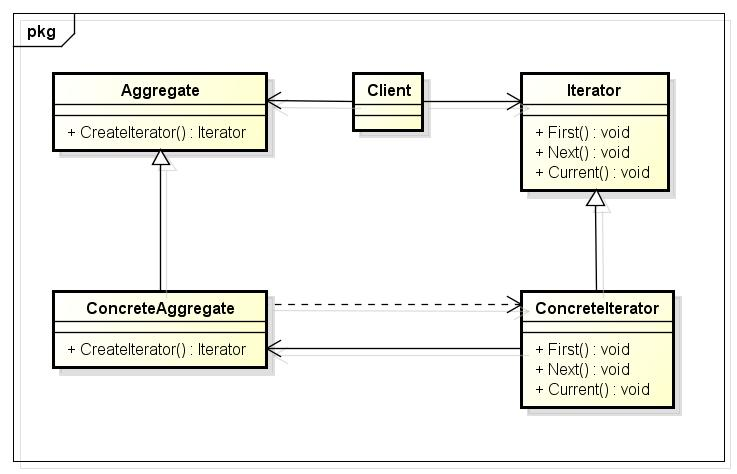

### 3. 迭代器Iterator

#### 3.1 迭代器模式与STL迭代器

众所周知，迭代器iterator在C++中被认为是一种泛型指针，大多数情况下这些类类型都是对容器中元素指针的封装，最特殊的一种情况就是它本身就是指针（针对原始类型容器而言）。一般而言迭代器必然涉及到容器本身的特性，所以容器设计者对迭代器的实现负有责任。



为了能够深入了解一点STL对迭代器的实现，我们就不得不提大名鼎鼎四人帮《Design Pattern》一书中对于迭代器模式的描述。按照这种迭代器模式的设想，迭代器的具体实现大致有两部分组成：①抽象基类（接口类）Iterator和②具体迭代器ConcreteIterator。其中所有的容器（上面的Aggregate）都应该向外提供了生成迭代器的成员函数，它的函数声明会使用抽象基类Iterator，而函数具体实现并返回的却是ConcreteIterator，并借由C++的多态机制来实现到基类Iterator的转换，从而达到隐藏迭代器内部实现细节的目的。

但我们需要注意的是C++的多态必须借由指针或者引用才能实现，这意味着我们容器中生成迭代器的接口就必须返回的是迭代器Iterator类的指针或者引用，这显然与我们日常使用的STL容器、迭代器的情况相违背！在这种情况下Vector容器中`begin()`成员函数实现可能就是这个样子了：

```c++
template<typename T>
Iterator<T>* Vector<T>::begin() {
	return new VectorIterator(this->_data_start);
}
//或者以下面方式来实现：
template<typename T>
Iterator<T>& Vector<T>::begin() {
	return *(new VectorIterator(this->_data_start));
}
```

因此我们可以确定**STL的迭代器绝对不是按照设计模式中迭代器模式的描述来实现的**（设计模式中迭代器模式所认为的迭代器我觉得更适合于像Java这样的语言来实现）。实际的情况是，任何容器的迭代器ContainerIterator确实都继承了一个名叫iterator的基类，但这个基类中并没有定义任何纯虚函数/接口。且更重要的是，具体容器中常常使用的`begin()`等成员函数返回的并不适用这个iterator基类的引用或者指针，相反它返回的就是具体容器迭代器ContainerIterator！只不过容器在内部通过typedef为具体迭代器取了一个iterator的别名罢了！

也就是说STL中的迭代器使用了继承这个语言特性，但并没有使用什么多态机制！因此我们可以想象容器Vector和其迭代器的实现可能是以如下的样貌呈现：

```cpp
template<typename T>
class Iterator {
	/*  ...  */
};

template<typename T>
class VectorIterator;

//容器的实现
template<typename T>
class Vector {
public:
	/*  ...  */
	typedef VectorIterator<T> Iterator;
	Iterator begin();
	Iterator end();
private:
	T *_data_start;
	T *_data_end;
	T *_storage_end;
};

//容器相关迭代器的实现
template<typename T>
class VectorIterator : public Iterator<T> {
public:
	explicit VectorIterator(T *p) :
		_data_pointer(p) {}
	/*  ...  */
	T *operator->() { return _data_pointer; }
	T &operator*() { return *_data_pointer; }
	T &operator++() {
		++_data_pointer;
		return *this;
	}
	const T operator++(int) {
		VectorIterator tmp(*this);
		++*this;
		return tmp;
	}
	/*  ...  */

private:
	T *_data_pointer;
};

//容器迭代器生成函数的实现
template<typename T>
typename Vector<T>::Iterator Vector<T>::begin() {
	return VectorIterator<T>(this->_data_start);
}

template<typename T>
typename Vector<T>::Iterator Vector<T>::end() {
	return VectorIterator<T>(this->_data_end);
}
```

文件[test.cpp](test.cpp)大致按照上面的结论实现了一个简单的Vector及其迭代器VectorIterator。


#### ==3.2 迭代器特性类iterator_traits==


##### 3.2.1 迭代器的5大相应类型


##### 3.2.2 迭代器分类iterator_category

```c++
struct input_iterator_tag {};
struct output_iterator_tag {};
struct forward_iterator_tag : public input_iterator_tag {};
struct bidirectional_iterator_tag : public forward_iterator_tag {};
struct random_access_iterator_tag : public bidirectional_iterator_tag {};

template <class _Category, class _Tp, class _Distance = ptrdiff_t,
          class _Pointer = _Tp*, class _Reference = _Tp&>
struct iterator {
  typedef _Category  iterator_category;
  typedef _Tp        value_type;
  typedef _Distance  difference_type;
  typedef _Pointer   pointer;
  typedef _Reference reference;
};


template <class _Iterator>
struct iterator_traits {
  typedef typename _Iterator::iterator_category iterator_category;
  typedef typename _Iterator::value_type        value_type;
  typedef typename _Iterator::difference_type   difference_type;
  typedef typename _Iterator::pointer           pointer;
  typedef typename _Iterator::reference         reference;
};

template <class _Tp>
struct iterator_traits<_Tp*> {
  typedef random_access_iterator_tag iterator_category;
  typedef _Tp                         value_type;
  typedef ptrdiff_t                   difference_type;
  typedef _Tp*                        pointer;
  typedef _Tp&                        reference;
};

template <class _Tp>
struct iterator_traits<const _Tp*> {
  typedef random_access_iterator_tag iterator_category;
  typedef _Tp                         value_type;
  typedef ptrdiff_t                   difference_type;
  typedef const _Tp*                  pointer;
  typedef const _Tp&                  reference;
};


template <class _Iter>
inline typename iterator_traits<_Iter>::iterator_category
__iterator_category(const _Iter&)
{
  typedef typename iterator_traits<_Iter>::iterator_category _Category;
  return _Category();
}


template <class _Iter>
inline typename iterator_traits<_Iter>::difference_type*
__distance_type(const _Iter&)
{
  return static_cast<typename iterator_traits<_Iter>::difference_type*>(0);
}

template <class _Iter>
inline typename iterator_traits<_Iter>::value_type*
__value_type(const _Iter&)
{
  return static_cast<typename iterator_traits<_Iter>::value_type*>(0);
}

template <class _Iter>
inline typename iterator_traits<_Iter>::iterator_category
iterator_category(const _Iter& __i) { return __iterator_category(__i); }


template <class _Iter>
inline typename iterator_traits<_Iter>::difference_type*
distance_type(const _Iter& __i) { return __distance_type(__i); }
```


#### 3.3 类型特性类__type_traits

