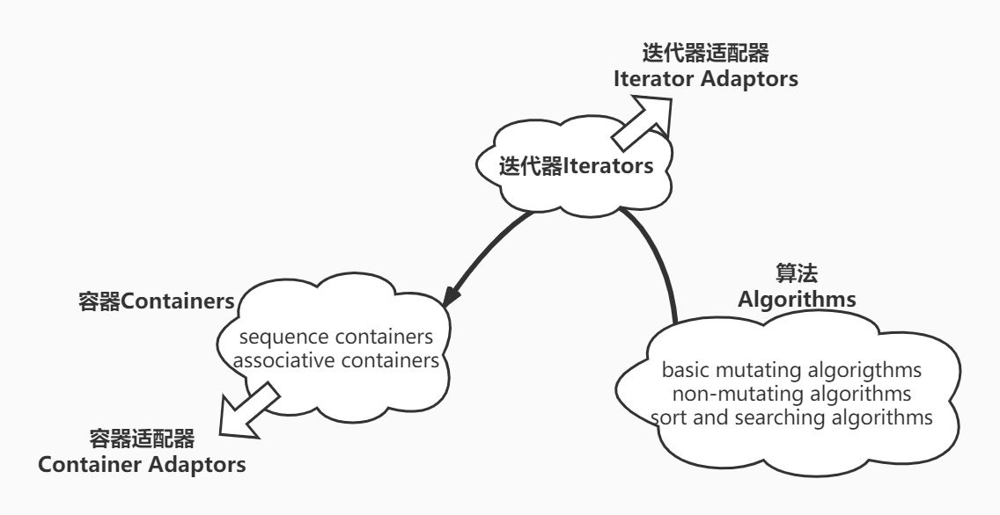
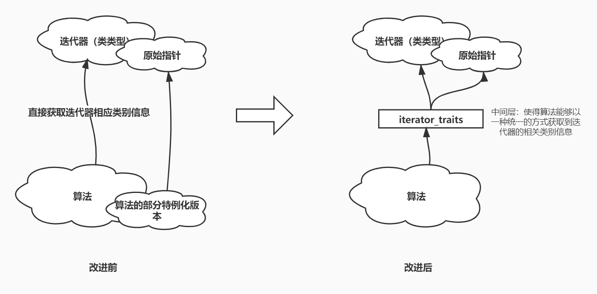

## 3. 迭代器Iterator

### 3.1 迭代器模式与STL迭代器

众所周知，迭代器iterator在C++中被认为是一种泛型指针，大多数情况下这些类类型都是对容器中元素指针的封装，最特殊的一种情况就是它本身就是指针（针对原始类型容器而言）。一般而言迭代器必然涉及到容器本身的特性，所以容器设计者对迭代器的实现负有责任。


为了能够深入了解一点STL对迭代器的实现，我们就不得不提大名鼎鼎四人帮《*Design Pattern*》一书中对于迭代器模式的描述。按照这种迭代器模式的设想，迭代器的具体实现大致有两部分组成：①抽象基类（接口类）Iterator和②具体迭代器ConcreteIterator。其中所有的容器（上面的Aggregate）都应该向外提供了生成迭代器的成员函数，它的函数声明会使用抽象基类Iterator，而函数具体实现并返回的却是ConcreteIterator，并借由C++的多态机制来实现到基类Iterator的转换，从而达到隐藏迭代器内部实现细节的目的。

但我们需要注意的是C++的多态必须借由指针或者引用才能实现，这意味着我们容器中生成迭代器的接口就必须返回的是迭代器Iterator类的指针或者引用，这显然与我们日常使用的STL容器、迭代器的情况相违背！在这种情况下Vector容器中`begin()`成员函数实现可能就是这个样子了：

```c++
template<typename T>
Iterator<T>* Vector<T>::begin() {
	return new VectorIterator(this->_data_start);
}
//或者以下面方式来实现：
template<typename T>
Iterator<T>& Vector<T>::begin() {
	return *(new VectorIterator(this->_data_start));
}
```

因此我们可以确定**STL的迭代器绝对不是按照设计模式中迭代器模式的描述来实现的**（设计模式中迭代器模式所认为的迭代器我觉得更适合于像Java这样的语言来实现）。实际的情况是，任何容器的迭代器ContainerIterator确实都继承了一个名叫iterator的基类，但这个基类中并没有定义任何纯虚函数/接口。且更重要的是，具体容器中常常使用的`begin()`等成员函数返回的并不是这个iterator基类的引用或者指针，相反它返回的就是具体容器迭代器ContainerIterator！只不过容器在内部通过typedef为具体迭代器取了一个iterator的别名罢了！

也就是说STL中的迭代器使用了继承这个语言特性，但并没有使用什么多态机制！因此我们可以想象容器Vector和其迭代器的实现可能是以如下的样貌呈现：

```cpp
template<typename T>
class Iterator {
	/*  ...  */
};

template<typename T>
class VectorIterator;

//容器的实现
template<typename T>
class Vector {
public:
	/*  ...  */
	typedef VectorIterator<T> Iterator;
	Iterator begin();
	Iterator end();
private:
	T *_data_start;
	T *_data_end;
	T *_storage_end;
};

//容器相关迭代器的实现
template<typename T>
class VectorIterator : public Iterator<T> {
public:
	explicit VectorIterator(T *p) :
		_data_pointer(p) {}
	/*  ...  */
	T *operator->() { return _data_pointer; }
	T &operator*() { return *_data_pointer; }
	T &operator++() {
		++_data_pointer;
		return *this;
	}
	/*  ...  */

private:
	T *_data_pointer;
};

//容器迭代器生成函数的实现
template<typename T>
typename Vector<T>::Iterator Vector<T>::begin() {
	return VectorIterator<T>(this->_data_start);
}

template<typename T>
typename Vector<T>::Iterator Vector<T>::end() {
	return VectorIterator<T>(this->_data_end);
}
```

文件[iterator_test.cpp](iterator_test.cpp)大致按照上面的想法实现了一个简单的Vector及其迭代器VectorIterator。


下面的表格展示了一些与迭代器有关的源文件及其作用：

|                    源文件                     |                             作用                             |
| :-------------------------------------------: | :----------------------------------------------------------: |
|       [stl_iterator.h](stl_iterator.h)        |                    主要实现了迭代器适配器                    |
|  [stl_iterator_base.h](stl_iterator_base.h)   | 主要实现了迭代器特性类iterator_traits、迭代器类型标签类以及两个迭代器算法 |
|        [type_traits.h](type_traits.h)         |                     主要实现了类型特性类                     |
| [iterator](iterator)/[iterator.h](iterator.h) |                对上述的头文件进行include包装                 |


### ==3.2 迭代器特性类iterator_traits==

#### 3.2.1 引入迭代器特性类的背景



在书本的最开始我们就指出过，迭代器是连接容器和算法的桥梁，算法通过迭代器来实现对容器的操作，这种操作可以是易变性的，也可以仅仅是对容器中元素的游历。所有算法的正常执行都必须基于相应的容器支持这种操作的前提之下才能得到保证，而且算法也必须有能力知道有关容器的相关信息，例如最常见的就是容器中元素的类型信息，如果一个累加算法不知道容器中元素的类型，那么显然这个算法无法正常执行。

但是由于算法只能接触到迭代器，而不能直接接触到容器，这就使得算法无法直接获知到有关容器的任何信息，因此**在STL中迭代器这个沟通容器和算法的中间桥梁必须能够向算法提供一些信息的能力。一般这种信息都是借由迭代器本身的属性信息来提供，我们将这些属性信息称为迭代器的关联类型信息（associated types，书中称为相应类别）**。例如算法需要知道容器元素的类型信息，那它就是在询问迭代器所指向的元素类型是什么。

因此为了使得迭代器提供这些相应类别的信息，每一个容器的迭代器都会提供如下5个类型成员：

```c++
template<typename T>
class VectorIterator : public Iterator<T> {
public:
	typedef T                           value_type;
	typedef T *                         pointer;
	typedef T &                         reference;
	typedef ptrdiff_t                   difference_type;
	typedef random_access_iterator_tag  iterator_category;
    /*  ...  */
};
```

这样借助迭代器提供的关联信息，算法就可以很容易的知道迭代器所指向的元素类型等信息。例如我们可以很容易地实现出上述的累加算法：

```c++
template<typename T>
typename VectorIterator<T>::value_type
accumulate(VectorIterator<T> beg, VectorIterator<T> end) {
	typename VectorIterator<T>::value_type res(0);
	for (; beg != end; ++beg)
		res += *beg;
	return res;
}
```

但我们必须要注意到：若传递给算法的实参是容器的迭代器（类类型就像上述的VectorIterator），那么这个算法显然能够正常运行；但是若提供的原始指针，那该怎么办？一种显而易见的方法就是将这个算法进行部分特例化，提供一个能够兼容原始指针的版本，如下：

```c++
template<typename T>
T accumulate(T *beg, T *end) {
	T res(0);
	for (; beg != end; ++beg)
		res += *beg;
	return res;
}
```

但这种方法必然会带来另外一个虽然简单解决但又显得比较烦人的问题：我们必须为每一个算法提供一个部分特例化的版本以支持原始指针（包括上面没有讲到的const T*）🙃！因此我们必须提出一种新的解决方法，来提取出迭代器中的相应类别信息，则便是迭代器类型特性类iterator_traits。


#### 3.2.2 迭代器特性类概念

迭代器特性类iterator_traits的作用就是从迭代器（不仅包括类类型的迭代器，也包括原始指针）中提取出迭代器的相关类型信息。其本质就是在迭代器相应类别信息与算法之间加入一个间接层，以统一的方式（同时支持了特殊迭代器——原始指针）取出相应类别信息。而我们原先的方法就是让算法直接从迭代器中取出这些信息，但必须让每一个算法为原始指针编写一个部分特例化的版本！下图展示了这个改进的前后对比：



至于迭代器特性类iterator_traits的实现更是简单，如我们所见，在改进前提取迭代器相关类别信息的工作（直接从类类型迭代器提取和对原始指针进行部分特例化）是交由算法自己来完成；而在改进后这些工作都是完全由iterator_traits来负责，相应的直接提取和部分特例化工作都变成了iterator_traits的责任。

这部分的代码实现在源文件[stl_iterator_base.h](stl_iterator_base.h)的第108行：

```c++
template <class _Iterator>
struct iterator_traits {
  typedef typename _Iterator::iterator_category iterator_category;
  typedef typename _Iterator::value_type        value_type;
  typedef typename _Iterator::difference_type   difference_type;
  typedef typename _Iterator::pointer           pointer;
  typedef typename _Iterator::reference         reference;
};

template <class _Tp>
struct iterator_traits<_Tp*> {
  typedef random_access_iterator_tag iterator_category;
  typedef _Tp                         value_type;
  typedef ptrdiff_t                   difference_type;
  typedef _Tp*                        pointer;
  typedef _Tp&                        reference;
};

template <class _Tp>
struct iterator_traits<const _Tp*> {
  typedef random_access_iterator_tag iterator_category;
  typedef _Tp                         value_type;
  typedef ptrdiff_t                   difference_type;
  typedef const _Tp*                  pointer;
  typedef const _Tp&                  reference;
};
```

我们可以从上面的源代码看到iterator_traits类中内部正好记录着迭代器需要给算法提供的5个相应类别成员：`value_type`、`pointer`、`reference`、`difference_type`、`iterator_category`，而这些类型成员都是从迭代器（包括原始指针）中“榨取”出来的！因此这个类也有着一个响当当的外号：特性榨取机！


这样我们上面累加算法就可以通过如下的形式来得到实现了：

```c++
template<typename Iterator>
typename Iterator_traits<Iterator>::value_type
accumulate(Iterator beg, Iterator end) {
	typename Iterator_traits<Iterator>::value_type res(0);
	for (; beg != end; ++beg)
		res += *beg;
	return res;
}
```


### 3.3 ==迭代器分类iterator_category==

#### 3.3.1 迭代器的分类

正如我们在上面的所述，为了能够让迭代器特性类iterator_traits从传入的迭代器中提取出迭代器相应类别的信息，每一个容器相关的迭代器都应该在内部定义出上述的5个成员类型：value_type、difference_type、pointer、reference和iterator_category。它们代表的意义非常容易理解，其内部的实现仅仅就是在迭代器内部用一个typedef或者using定义出一个类型成员即可：

```c++
template<typename T>
class VectorIterator : public Iterator<T> {
public:
	typedef T value_type;

    /*  ....  */
};
```

其中迭代器分类iterator_category是迭代器相关类别信息中最为重要的成员类型。对于迭代器而言，它有如下5种分类：

1. **输入迭代器Input Iterator**：该迭代器所指向的容器元素只读
2. **输出迭代器Output Iterator**：该迭代器所指向的容器元素只写
3. **前向迭代器Forward Iterator**：该迭代器仅支持向前步进，且每次步进步伐仅能一步。即只支持iter++或者++iter操作，不支持--iter、iter--甚至iter+=n、iter-=n操作
4. **双向迭代器Bidirectional Iterator**：迭代器可以向前向后步进，但每次步进步伐仍然只能一步
5. **随机访问迭代器Random Access Iterator**：该迭代器步进支持向前向后步进，还支持任意步的步进

它们从上到下存在这一种扩展强化能力的关系，如下图（虽然书中指出这并不是一种继承关系但从代码的角度它们确实利用了继承）：


迭代器之所以要将迭代器分的如此细致并定义出一个itertor_category成员，其中一个很大的原因正是由迭代器它本身是连接容器和算法的桥梁造成。**由于容器的一些特性导致迭代器只能支持某些操作，却不能支持更多的操作**（例如链表迭代器不支持iter+=n）**，因此直接接触迭代器的算法必须要知道这些信息，对不同的迭代器采取不同的实现，从而达到算法原本的目的**。迭代器步进算法`advance()`就是一个很好的例子，对于随机访问迭代器它可以用`iter+=n`来实现，但对输入、前向、双向迭代器就仅能通过`iter++`来完成。任何一个迭代器都应该让算法执行符合于自己的操作，这样才能达到最高效的性能，这样我们就更应该让算法知道传入迭代器的类型。


#### 3.3.2 迭代器类别标签类

为了能够让算法分辨出出入迭代器的属性进而采用不同的实现，一种最简单的方法就是在算法内部使用`if-elese`的方法在执行期动态裁决。但是这种方法依赖于执行期裁决，非常影响程序效率，因此STL采用了静态多态——重载函数解析机制来让算法在编译的时候就能针对不同的迭代器调用不同的具体实现函数。

为了实现这一目的，①SGI STL会在[stl_iterator_base.h](stl_iterator_base.h)文件中定义如下5个迭代器类别标签类：

```c++
struct input_iterator_tag {};
struct output_iterator_tag {};
struct forward_iterator_tag : public input_iterator_tag {};
struct bidirectional_iterator_tag : public forward_iterator_tag {};
struct random_access_iterator_tag : public bidirectional_iterator_tag {};
```

②然后每一个迭代器都必须根据所关联容器的特性，选择上述的一个标签类使用typedef或者using定义成员类型iterator_category。

```c++
template<typename T>
class VectorIterator : public Iterator<T> {
public:
	/*  ...  */
	typedef random_access_iterator_tag  iterator_category;
	/*  ...  */
};
```

③这样算法就可以利用迭代器特性类iterator_traits提取出迭代器的分类标签类信息，并以这个获知的分类标签类创建出临时对象传入到算法具体的实现函数之中，这样编译器就可以根据这个表示迭代器不同类别的辅助参数通过重载函数解析机制解析出最佳匹配函数，从而避免了执行期动态解析的过程。

```c++
//针对输入、前向、双向迭代器的advance算法具体实现
template<typename InputIterator, typename Dist>
void advance(InputIterator &iter, Dist n, input_iterator_tag) {
	while (n--) iter++;
}

//针对随机访问迭代器的advance算法具体实现
template<typename RandomAccessIterator, typename Dist>
void advance(RandomAccessIterator &iter, Dist n, random_access_iterator_tag) {
	iter += n;
}

template<typename Iterator, typename Dist>
void advance(Iterator &iter, Dist n) {
	using iter_category = typename Iterator_traits<Iterator>::iterator_category;
    /* 创建临时标签类对象，然后依赖函数解析机制判断出应该调用哪一算法实现函数 */
	advance(iter, n, iter_category());
}
```


#### 3.3.3 迭代器相关类型临时对象产生函数

> ~~在上面中，我们生成迭代器标签临时类对象的目的是为了帮助算法内部的实现函数能够获知其所作用迭代器的类型，方便重载函数解析，以对不同的迭代器采取不同的执行策略。而在另一方面，算法的内部实现函数还可能需要传入除iterator_category之外相关类型的临时对象，以帮助算法实现函数模板在实例化时嫩能够成功完成模板参数的推断。~~

由此可知，**STL中借由迭代器实现的算法，不仅需要iterator_traits这样的工具获知迭代器的相关类型，而且还可能随时要求向算法内部的函数传入一个或多个迭代器相关（真实）类型的临时对象**。这样做主要是出于如下两个目的：①**算法需要临时对象借以重载函数解析机制以针对不同的迭代器采取不同的实现措施**；②**帮助模板类型参数的推断**（这一点可以参考后面`push_heap()`的实现了解。为什么要用模板参数？因为用模板类型参数定义变量比使用iterator_traits+using/typedef定义变量方便）。

因此在STL算法的实际实现中，我们不可能像上面advance的实现那样为每一个迭代器、每一个算法使用using或者typedef生成迭代器相关类型临时对象。所以在SGI STL中定义了如下几个辅助函数将重复的动作剥离出来，以生成迭代器相关类型临时对象：

- **`iterator_category()`**：可以从迭代器中提取出迭代器标签类信息，并生成一个临时迭代器iterator_category对象，以帮助被传递的（算法内部调用的具体实现）函数获知它所作用的迭代器类型；
- **`value_type()`**：可以从迭代器中提取出所指向元素的数据类型，**并生成一个临时迭代器value_type*的空指针，以帮助被传递的函数获知迭代器所指向元素的数据类型**；
- **`distance_type()`**：会从迭代器中提取其difference_type类型信息，**并生成一个临时迭代器difference_type*的空指针**，以帮助被传递函数获知迭代器的距离数据类型
- ...

借助这种思想，我们就可以以如下的形式重新实现上面我们自己的Vector和VectorIterator：

```c++
template<typename Iterator>
typename Iterator_traits<Iterator>::iterator_category
iterator_category(const Iterator &iter) {
	using cate = typename Iterator_traits<Iterator>::iterator_category;
	return cate();
}

template<typename Iterator, typename Dist>
void advance(Iterator &iter, Dist n) {
	advance(iter, n, iterator_category(iter));
}
```

至于真正的这些函数实现源代码大致在源文件的141行：

```c++
template <class _Iter>
inline typename iterator_traits<_Iter>::iterator_category
__iterator_category(const _Iter&)
{
  typedef typename iterator_traits<_Iter>::iterator_category _Category;
  return _Category();
}

template <class _Iter>
inline typename iterator_traits<_Iter>::difference_type*
__distance_type(const _Iter&)
{
  return static_cast<typename iterator_traits<_Iter>::difference_type*>(0);
}

template <class _Iter>
inline typename iterator_traits<_Iter>::value_type*
__value_type(const _Iter&)
{
  return static_cast<typename iterator_traits<_Iter>::value_type*>(0);
}

template <class _Iter>
inline typename iterator_traits<_Iter>::iterator_category
iterator_category(const _Iter& __i) { return __iterator_category(__i); }


template <class _Iter>
inline typename iterator_traits<_Iter>::difference_type*
distance_type(const _Iter& __i) { return __distance_type(__i); }

template <class _Iter>
inline typename iterator_traits<_Iter>::value_type*
value_type(const _Iter& __i) { return __value_type(__i); }
```

在这个文件文件中还附带实现了我们上述所述的`advance()`步进算法和`distance()`迭代器距离算法。


### 3.4 ~~迭代器基类iterator~~

为了抽取出所有迭代器中的一些共有重复成员类型，SGI STL定义了一个名为iterator的基类。注意该迭代器基类的作用并不是像《*Design Pattern*》那样做多态来使用，它唯一的作用仅仅就只有继承，方便抽离出所有迭代器共有的属性罢了。该类模板的定义大致在源代码文件[stl_iterator_base.h](stl_iterator_base.h)的94行

```c++
template <class _Category, class _Tp, class _Distance = ptrdiff_t,
          class _Pointer = _Tp*, class _Reference = _Tp&>
struct iterator {
  typedef _Category  iterator_category;
  typedef _Tp        value_type;
  typedef _Distance  difference_type;
  typedef _Pointer   pointer;
  typedef _Reference reference;
};
```

每一个容器相关的迭代器实现都会继承这个迭代器基类，方便继承所有迭代器共有的属性，或者用来避免定义重复的成员类型，类似于如下。但如果这个容器的迭代器就是原始指针，那并不会这样。

```c++
//实际中vector的迭代器采用的是原始指针，而不是封装
template<typename T>
class VectorIterator : public Iterator<random_access_iterator_tag, T> {
public:
    /*  ...  */
}
```

不过通过观察SGI STLv3.3版本你会发现，现有容器的迭代器实现似乎放弃了这种选择，即其中的成员类型都是每一个具体container_iterator自己实现。当然这并没有什么太大的影响。


下面的图重新整理了上述迭代器实现过程中类与类之间的关系：


### 3.5 类型特性类__type_traits

如同iterator_traits迭代器特性类可以提取出迭代器相关的类别信息那样，SGI STL中也存在着一个可以用来提取出任何数据类型相关信息的类型特性类，它的实现技术与iterator_traits相同。算法可以根据这个__type_traits类型特性类提取出待操作元素的类型有哪些特性：它是否具有non-trivial（有意义，反之就是无意义可有可无）的构造函数？是否具有non-trivial的拷贝构造函数？等等。

它的好处在于算法可以根据__type_traits判断出待操作元素的类型特性信息，对作用元素执行最高效的操作。例如`copy()`算法一旦知道自己待操作的某指定范围的元素具有trivial（没屌用的）拷贝构造函数，那么它就可以通过`memcpy()`来实现内存元素的直接拷贝，而不需要对指定范围中的每一个元素调用拷贝构造函数，因为这样效率太低，且这个拷贝构造函数执行了和不执行没有任何区别！

为了表示类型中某一个特性的存在与否，SGI STL会首先定义出两个用来表示真和假的空类型，然后默认为所有的类类型定义一个__type_traits类模板，假设它们的构造、拷贝构造、拷贝赋值、析构函数都是有意义的，并再假设它们都是非POD类型（Plain Old Data，标量类型，即传统的C语言中存在的类型，它们的构造、拷贝构造、析构、拷贝复制都是trivial没屌用的，事实上也并不存在）。

```c++
struct __true_type { };

struct __false_type { };

template <class _Tp>
struct __type_traits { 
   typedef __true_type     this_dummy_member_must_be_first;
 
   typedef __false_type    has_trivial_default_constructor;
   typedef __false_type    has_trivial_copy_constructor;
   typedef __false_type    has_trivial_assignment_operator;
   typedef __false_type    has_trivial_destructor;
   typedef __false_type    is_POD_type;
};
```

并且还会对每一个POD类型进行特例化：

```c++
#ifndef __STL_NO_BOOL

__STL_TEMPLATE_NULL struct __type_traits<bool> {
   typedef __true_type    has_trivial_default_constructor;
   typedef __true_type    has_trivial_copy_constructor;
   typedef __true_type    has_trivial_assignment_operator;
   typedef __true_type    has_trivial_destructor;
   typedef __true_type    is_POD_type;
};

/* ... */

__STL_TEMPLATE_NULL struct __type_traits<const unsigned char*> {
   typedef __true_type    has_trivial_default_constructor;
   typedef __true_type    has_trivial_copy_constructor;
   typedef __true_type    has_trivial_assignment_operator;
   typedef __true_type    has_trivial_destructor;
   typedef __true_type    is_POD_type;
};
```

这样一些STL算法就可以借助__type_traits类型特性类很容易地提取出待操作元素的特性信息，然后与iterator_traits类型产生一个临时对象传入到具体的辅助函数中，编译器依据重载函数解析机制选择最佳匹配函数，而这个最佳匹配的辅助实现函数必定以最高效的方式实现对应的操作。例如下面的`unintialized_copy()`算法的实现：

```c++
//具有trivial-copy构造函数调用这个函数，而内部的copy又间接调用memcpy()
template <class _InputIter, class _ForwardIter>
inline _ForwardIter 
__uninitialized_copy_aux(_InputIter __first, _InputIter __last,
                         _ForwardIter __result,
                         __true_type)
{
  return copy(__first, __last, __result);
}

//具有non-trivial拷贝构造函数则对范围内的元素逐个调用拷贝构造函数
template <class _InputIter, class _ForwardIter>
_ForwardIter 
__uninitialized_copy_aux(_InputIter __first, _InputIter __last,
                         _ForwardIter __result,
                         __false_type)
{
  _ForwardIter __cur = __result;
  __STL_TRY {
    for ( ; __first != __last; ++__first, ++__cur)
      _Construct(&*__cur, *__first);
    return __cur;
  }
  __STL_UNWIND(_Destroy(__result, __cur));
}


template <class _InputIter, class _ForwardIter, class _Tp>
inline _ForwardIter
__uninitialized_copy(_InputIter __first, _InputIter __last,
                     _ForwardIter __result, _Tp*)
{
  //利用__type_traits提取出元素类型的POD特性，看是否是__true_type还是__false_type
  typedef typename __type_traits<_Tp>::is_POD_type _Is_POD;
  return __uninitialized_copy_aux(__first, __last, __result, _Is_POD());
}
```

