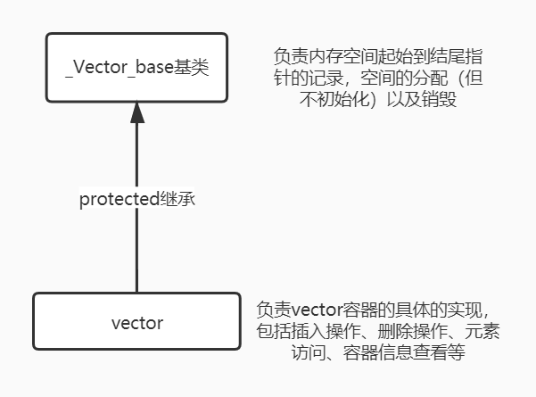

## 4. 顺序容器

### 4.1 vector

vector的实现位于源文件[stl_vector.h](stl_vector.h)，其中比较需要关注的成员函数实现如下所示：

1. **构造函数（尤其是范围构造）**
2. **插入`insert()`操作，观察如何实现元素的移动和空间的动态增长**
3. **删除`erase()`、`pop_back()`等操作**，值得注意的是vector并没有空间动态减少的机制
4. 其他操作，看看就好

> 至于vector到底支持哪些操作，可以访问cppreference网站了解：https://zh.cppreference.com/w/cpp/container/vector。


#### 4.1.1 vector的数据结构



若图所示，在vector的源文件中我们可以看到：SGI STL V3.3版本的实现中vector并不是一个独立的类，而是具有一个两级结构。它有一个名叫_Vector_base的基类，在基类中定义了空间起始、末尾空间指针（\_M_start、\_M_finish、\_M_end_of_storage），并且还定义了一簇内存空间分配（但不初始化）的成员函数、以及vector内存空间销毁函数等。\_Vector_base的实现大致在源代码的第122行：

```c++
template <class _Tp, class _Alloc> 
class _Vector_base {
public:
  typedef _Alloc allocator_type;
  allocator_type get_allocator() const { return allocator_type(); }

  _Vector_base(const _Alloc&)
    : _M_start(0), _M_finish(0), _M_end_of_storage(0) {}
  /* 仅仅分配内存空间，并填充也不初始化 */
  _Vector_base(size_t __n, const _Alloc&)
    : _M_start(0), _M_finish(0), _M_end_of_storage(0) 
  {
    _M_start = _M_allocate(__n);
    _M_finish = _M_start;
    _M_end_of_storage = _M_start + __n;
  }

  ~_Vector_base() { _M_deallocate(_M_start, _M_end_of_storage - _M_start); }

protected:
  _Tp* _M_start;
  _Tp* _M_finish;
  _Tp* _M_end_of_storage;

  typedef simple_alloc<_Tp, _Alloc> _M_data_allocator;
  _Tp* _M_allocate(size_t __n)
    { return _M_data_allocator::allocate(__n); }
  void _M_deallocate(_Tp* __p, size_t __n) 
    { _M_data_allocator::deallocate(__p, __n); }
};
```

然后我们真正使用的vector会继承这个_Vector_base基类。通过观察现如今版本的g++实现，你可以发现目前的vector实现仍然保持着这种继承结构，且\_Vector_base这个基类负责的工作更加多。

在源代码中你还会发现在SGI STL V3.3版本中，vector的迭代器实际上就是指向容器元素的原始指针，SGI STL并没有对其进行类封装。但如果观察当前g++对vector迭代器的实现就进行了类封装，只不过这个具体迭代器不仅仅只能服务于vector，其名为：`__gnu_cxx::__normal_iterator<pointer, vector>`。

```c++
//__STL_DEFAULT_ALLOCATOR(_Tp)就是alloc<_Tp>
template <class _Tp, class _Alloc = __STL_DEFAULT_ALLOCATOR(_Tp) >
class vector : protected _Vector_base<_Tp, _Alloc> 
{
  // requirements:

  __STL_CLASS_REQUIRES(_Tp, _Assignable);

private:
  typedef _Vector_base<_Tp, _Alloc> _Base;
public:
  typedef _Tp value_type;
  typedef value_type* pointer;
  typedef const value_type* const_pointer;
  typedef value_type* iterator;
  typedef const value_type* const_iterator;
  typedef value_type& reference;
  typedef const value_type& const_reference;
  typedef size_t size_type;
  typedef ptrdiff_t difference_type;

  typedef typename _Base::allocator_type allocator_type;
  allocator_type get_allocator() const { return _Base::get_allocator(); }
    
    /*  ...  */
    
};
```

当vector创建之后其所使用的内存空间就是一个简单的连续线性空间，在其已分配的空间中主要分成两个部分：①已使用空间，这部分空间已经存储了我们添加的元素，内存范围为[\_M_start,\ _M_finish)；②备用空间，为下一次添加元素提供空间以避免每一次都需要分配空间的尴尬，内存范围为[\_M_finish, _M_end_of_storage)。大致结构如下图所示：


#### 4.1.2 vector的构造/析构过程

vector的构造函数在《STL源码剖析》所使用的源码和我所阅读的V3.3版本中的构造函数有许多不同之处，但可以说两者实质上的构造过程并没有什么太多的不同，它们都会经历如下3个步骤：①allocate--->②fill--->③initialize。

其中allocate指的是构造函数先会分配指定大小空间的过程，fill指定的是构造函数在分配完空间之后会对其中的元素进行填充默认值或者指定值的过程，initialize指的是构造函数对\_M_start、\_M_finish、\_M_end_of_storage等类对象中仅定义的数据成员修正赋值的过程。其中在V3.3的版本中，vector的allocate内存分配是由基类\_Vector_base完成，fill、copy的工作由派生类vector完成，而initialize初始化数据成员的过程是由基类\_Vector_base完成。

```c++
//基类部分：
template <class _Tp, class _Alloc> 
class _Vector_base {
public:
  typedef _Alloc allocator_type;
  allocator_type get_allocator() const { return allocator_type(); }

  _Vector_base(const _Alloc&)
    : _M_start(0), _M_finish(0), _M_end_of_storage(0) {}
  /* 仅仅分配内存空间，并填充也不初始化 */
  _Vector_base(size_t __n, const _Alloc&)
    : _M_start(0), _M_finish(0), _M_end_of_storage(0) 
  {
    //1、分配空间、初始化数据成员（相关指针）
    _M_start = _M_allocate(__n);
    _M_finish = _M_start;
    _M_end_of_storage = _M_start + __n;
  }

  ~_Vector_base() { _M_deallocate(_M_start, _M_end_of_storage - _M_start); }

protected:
  _Tp* _M_start;
  _Tp* _M_finish;
  _Tp* _M_end_of_storage;

  typedef simple_alloc<_Tp, _Alloc> _M_data_allocator;
  _Tp* _M_allocate(size_t __n)
    { return _M_data_allocator::allocate(__n); }
  void _M_deallocate(_Tp* __p, size_t __n) 
    { _M_data_allocator::deallocate(__p, __n); }
};

//派生类vector部分：
template <class _Tp, class _Alloc = __STL_DEFAULT_ALLOCATOR(_Tp) >
class vector : protected _Vector_base<_Tp, _Alloc> 
{
 	/* ... */
  explicit vector(const allocator_type& __a = allocator_type())
    : _Base(__a) {}

  vector(size_type __n, const _Tp& __value,
         const allocator_type& __a = allocator_type()) 
    : _Base(__n, __a)
    //2、fill填充
    { _M_finish = uninitialized_fill_n(_M_start, __n, __value); }

  explicit vector(size_type __n)
    : _Base(__n, allocator_type())
    { _M_finish = uninitialized_fill_n(_M_start, __n, _Tp()); }

  vector(const vector<_Tp, _Alloc>& __x) 
    : _Base(__x.size(), __x.get_allocator())
    { _M_finish = uninitialized_copy(__x.begin(), __x.end(), _M_start); }
```

而析构的过程正好与上面的过程相反。


#### 4.1.3 ==元素插入与空间动态增长==

##### 4.1.3.1 单元素插入

对于单元素插入操作`insert()`和`push_back()`实际上在SGI STL V3.3版本中都是通过一个名为`_M_insert_aux()`的辅助函数来间接实现。例如在`push_back()`的实现中，若备用空间足够，则会直接在尾后指针_M_finish上执行元素拷贝构造；若备用空间不够了，则会调用`_M_insert_aux()`辅助函数实现空间的动态增长，然后再插入。

内存空间大致由如下4个过程：①分配新空间；②拷贝原空间数据到新空间（中间可能涉及到插入的过程，所以有拷贝+插入构造+再拷贝的过程）；③析构、销毁原动态内存空间；④更新数据成员（指向内存空间的指针）。这段代码大致在源文件的674行：

```c++
protected:
  void _M_insert_aux(iterator __position, const _Tp& __x);
  void _M_insert_aux(iterator __position);

/*  ...  */

template <class _Tp, class _Alloc>
void 
vector<_Tp, _Alloc>::_M_insert_aux(iterator __position, const _Tp& __x)
{
  /* 若备用空间足够，则在finish位置上创建一个新元素，然后将position到原来
      finish之间范围的元素向右移动一位，最后将数据__x插入到position位置 */
  if (_M_finish != _M_end_of_storage) {
    construct(_M_finish, *(_M_finish - 1));
    ++_M_finish;
    _Tp __x_copy = __x;
    copy_backward(__position, _M_finish - 2, _M_finish - 1);
    *__position = __x_copy;
  }
  else {
    const size_type __old_size = size();
    const size_type __len = __old_size != 0 ? 2 * __old_size : 1;
    //1、分配新的空间
    iterator __new_start = _M_allocate(__len);
    iterator __new_finish = __new_start;
    //2、拷贝原空间数据到新空间
    __STL_TRY {
      __new_finish = uninitialized_copy(_M_start, __position, __new_start);
      construct(__new_finish, __x);
      ++__new_finish;
      __new_finish = uninitialized_copy(__position, _M_finish, __new_finish);
    }
    __STL_UNWIND((destroy(__new_start,__new_finish), 
                  _M_deallocate(__new_start,__len)));
    //3、析构+销毁原空间
    destroy(begin(), end());
    _M_deallocate(_M_start, _M_end_of_storage - _M_start);
    //4、更新指针数据
    _M_start = __new_start;
    _M_finish = __new_finish;
    _M_end_of_storage = __new_start + __len;
  }
}
```

根据上述的辅助成员函数可以很容易的实现`push_back()`这样的操作：

```c++
  void push_back(const _Tp& __x) {
    if (_M_finish != _M_end_of_storage) {
      construct(_M_finish, __x);
      ++_M_finish;
    }
    else
      _M_insert_aux(end(), __x);
  }
```


##### 4.1.3.2 范围元素插入

vector的范围元素插入在V3.3版本中，会根据是范围元素填充还是范围元素插入两种情况实现两个函数。若是范围元素填充，则定义了一个名为`_M_fill_insert()`的辅助函数；若是范围元素（其中的元素各不相同）插入，则直接重载了`insert()`这个函数。但两者的实现原理、过程基本相同。

```c++
template <class _Tp, class _Alloc>
void vector<_Tp, _Alloc>::_M_fill_insert(iterator __position, size_type __n, 
                                         const _Tp& __x)
{
  if (__n != 0) {
    /* 备用空间足够 */
    if (size_type(_M_end_of_storage - _M_finish) >= __n) {
      _Tp __x_copy = __x;
      const size_type __elems_after = _M_finish - __position;
      iterator __old_finish = _M_finish;
      /* 由于uninitialized_copy()算法是基于元素的拷贝构造函数而实现的，则
        算法调用时被拷贝的元素必然是未被初始化的；而copy()等算法是基于拷贝
        赋值运算符而实现的，因此它必然要求被拷贝的元素在算法执行前已经被初始
        化了。因而造成了如下的if-else */
      if (__elems_after > __n) {
        uninitialized_copy(_M_finish - __n, _M_finish, _M_finish);
        _M_finish += __n;
        copy_backward(__position, __old_finish - __n, __old_finish);
        fill(__position, __position + __n, __x_copy);
      }
      else {
        uninitialized_fill_n(_M_finish, __n - __elems_after, __x_copy);
        _M_finish += __n - __elems_after;
        uninitialized_copy(__position, __old_finish, _M_finish);
        _M_finish += __elems_after;
        fill(__position, __old_finish, __x_copy);
      }
    }
    /* 备用空间不够 */
    else {
      const size_type __old_size = size();        
      const size_type __len = __old_size + max(__old_size, __n);
      iterator __new_start = _M_allocate(__len);
      iterator __new_finish = __new_start;
      __STL_TRY {
        __new_finish = uninitialized_copy(_M_start, __position, __new_start);
        __new_finish = uninitialized_fill_n(__new_finish, __n, __x);
        __new_finish
          = uninitialized_copy(__position, _M_finish, __new_finish);
      }
      __STL_UNWIND((destroy(__new_start,__new_finish), 
                    _M_deallocate(__new_start,__len)));
      destroy(_M_start, _M_finish);
      _M_deallocate(_M_start, _M_end_of_storage - _M_start);
      _M_start = __new_start;
      _M_finish = __new_finish;
      _M_end_of_storage = __new_start + __len;
    }
  }
  //若__n==0则什么也不干
}
```

其中上面需要注意一个细节，那么就是备用空间不足的情况下如何实现插入点后的元素向后搬移的过程。若一个元素需要搬移到一个未初始化内存的区域，那么就需要调用`unitialized_copy()`算法；但若需要将一个元素搬移到一个已初始化的内存区域上，那么就需要调用像`copy()`这样的算法。这一点的不同也就造成了上面的第三个if-else分支。其过程大致可以用下图（备用空间足够时）来表示：


而备用空间不足时情况就简单了很多：


#### 4.1.4 元素删除操作

元素删除操作中比较值得学习的就是`erase()`操作，它主要就3个步骤：元素的移动、末尾已无效元素的析构和指针数据的更新。而其他元素删除操作看看就好。下面就是`erase()`的实现，这段代码大约在源文件的第415行。

````c++
iterator erase(iterator __position) {
    if (__position + 1 != end())
        copy(__position + 1, _M_finish, __position);
    --_M_finish;
    destroy(_M_finish);
    return __position;
}
iterator erase(iterator __first, iterator __last) {
    iterator __i = copy(__last, _M_finish, __first);
    destroy(__i, _M_finish);
    _M_finish = _M_finish - (__last - __first);
    return __first;
}
````


### 4.2 list

list的实现位于源文件[stl_list.h](stl_list.h)，其中比较需要关注的几个部分如下所示：

1. **list的数据结构，结点、迭代器**；
2. **构造、析构过程**；
3. **插入`insert()`和删除`erase()`操作**；
4. **链表迁移`transfer()`操作及其衍生操作**，包括`splice()`、`merge()`和`sort()`等操作；
5. 其他操作，看看就好。

> 至于list到底支持哪些操作，可以通过访问https://zh.cppreference.com/w/cpp/container/list来查看。

文件[list_test.cpp](list_test.cpp)大致实现了list的一些功能，该文件仅仅做展示作用。需要注意的是在这种模板+继承的C++编程中需要特别注意模板派生类使用模板基类名字的一个问题：**若模板派生类需要使用模板基类的名字时，则编译器会因为默认情况下不进入基类的作用域查找该名字而使得派生类无法直接使用模板基类的名字**（包括成员类型、成员函数）。这一点在《effective C++》中的第43条有着详细的说明。


#### 4.2.1 list结点和迭代器

在SGI STL V3.3版本的实现中，无论是list的结点实现还是迭代器的实现，甚至list的实现都是采用一个二级的继承体系。也就是说我们本来想象中可以用一个类完成的结构，在这份源码中都是采用一个基类+派生类的方式完成，甚至在当前的g++中的STL实现中仍然保持了这种风格。

对于list的结点而言，它有一个名为`_List_node_base`的基类，它封装了指向前后基类结点的指针，然后真正完整的结点类`_List_node`继承自它，并附加了一个模板形式的数据成员。同样的，对于list的迭代器，它有一个名为`_List_iterator_base`的基类，它封装了一个指向结点基类的指针，且大多数关乎于这个指针的操作都是在基类中完成，然后真正完整的迭代器类`_List_iterator`继承自它。


这些代码大致位于源代码的第43行：

```c++
//结点的实现
struct _List_node_base {
  _List_node_base* _M_next;
  _List_node_base* _M_prev;
};

template <class _Tp>
struct _List_node : public _List_node_base {
  _Tp _M_data;
};

//迭代器实现
template <class _Tp>
struct _List_node : public _List_node_base {
  _Tp _M_data;
};

struct _List_iterator_base {
  typedef size_t                     size_type;
  typedef ptrdiff_t                  difference_type;
  typedef bidirectional_iterator_tag iterator_category;

  //这个_M_node是直接公开的，即使是现如今g++也是怎么做的
  _List_node_base* _M_node;

  _List_iterator_base(_List_node_base* __x) : _M_node(__x) {}
  _List_iterator_base() {}

  void _M_incr() { _M_node = _M_node->_M_next; }
  void _M_decr() { _M_node = _M_node->_M_prev; }

  bool operator==(const _List_iterator_base& __x) const {
    return _M_node == __x._M_node;
  }
  bool operator!=(const _List_iterator_base& __x) const {
    return _M_node != __x._M_node;
  }
};  

template<class _Tp, class _Ref, class _Ptr>
struct _List_iterator : public _List_iterator_base {
  typedef _List_iterator<_Tp,_Tp&,_Tp*>             iterator;
  typedef _List_iterator<_Tp,const _Tp&,const _Tp*> const_iterator;
  typedef _List_iterator<_Tp,_Ref,_Ptr>             _Self;

  typedef _Tp value_type;
  typedef _Ptr pointer;
  typedef _Ref reference;
  typedef _List_node<_Tp> _Node;

  _List_iterator(_Node* __x) : _List_iterator_base(__x) {}
  _List_iterator() {}
  _List_iterator(const iterator& __x) : _List_iterator_base(__x._M_node) {}
  /* ... */
};
```


#### 4.2.2 list的数据结构

正如我们上面所讲的那样，SGI STL对list的实现也区分成一个基类和派生类。其中基类`_List_base`的主要工作就是封装了链表list中指向哨兵结点的指针，并且负责生成或者销毁一个结点以及对链表的初始化、析构等工作，而剩下的工作全部交给派生类list来完成。

通过从派生类到基类观察list的构造过程可以发现：**list的组织形式是一个环状双向链表，并且链表中总会有一个哨兵结点**（即_M_node指向的那个）**，它既是起始结点的前驱结点又是尾后结点，它并不存储任何有效的数据**。这种技巧在leetcode算法题中经常使用，其最大的好处在于它仅仅需要付出一个结点空间的代价就可以很方便的完成结点插入、删除的工作，而不需要对头结点或尾结点做特殊处理。具体如下图所示：


list基类_List_base的实现：

```c++
template <class _Tp, class _Alloc>
class _List_base 
{
public:
  typedef _Alloc allocator_type;
  allocator_type get_allocator() const { return allocator_type(); }

  /* 在链表构造之初，只有一个哨兵结点，且其前后指针都指向自己 */
  _List_base(const allocator_type&) {
    _M_node = _M_get_node();
    _M_node->_M_next = _M_node;
    _M_node->_M_prev = _M_node;
  }
  ~_List_base() {
    clear();
    _M_put_node(_M_node);
  }

  void clear();

protected:
  typedef simple_alloc<_List_node<_Tp>, _Alloc> _Alloc_type;
  _List_node<_Tp>* _M_get_node() { return _Alloc_type::allocate(1); }
  void _M_put_node(_List_node<_Tp>* __p) { _Alloc_type::deallocate(__p, 1); } 

protected:
  _List_node<_Tp>* _M_node;
};
```

list派生类实现：

```c++
template <class _Tp, class _Alloc = __STL_DEFAULT_ALLOCATOR(_Tp) >
class list : protected _List_base<_Tp, _Alloc> {
  // requirements:

  __STL_CLASS_REQUIRES(_Tp, _Assignable);

  typedef _List_base<_Tp, _Alloc> _Base;
protected:
  typedef void* _Void_pointer;

public:      
  typedef _Tp value_type;
  typedef value_type* pointer;
  typedef const value_type* const_pointer;
  typedef value_type& reference;
  typedef const value_type& const_reference;
  typedef _List_node<_Tp> _Node;
  typedef size_t size_type;
  typedef ptrdiff_t difference_type;create_node

  typedef typename _Base::allocator_type allocator_type;
  allocator_type get_allocator() const { return _Base::get_allocator(); }

public:
  typedef _List_iterator<_Tp,_Tp&,_Tp*>             iterator;
  typedef _List_iterator<_Tp,const _Tp&,const _Tp*> const_iterator;

  /* ... */
};
```


#### 4.2.3 list的构造/析构过程

任何一个链表无论它怎么构造都需要建立在一个空链表的构造完成的前提下才能继续。至于一个空链表的构造基本上在基类`_List_base`中就得到了完成，而基类做的就是仅仅分配出一个哨兵结点（有些人会将之称为哑结点，因为它不存储任何数据），然后将其前驱和后继都设置为自己，如下图所示：


```c++
template <class _Tp, class _Alloc>
class _List_base 
{
public:
  typedef _Alloc allocator_type;
  allocator_type get_allocator() const { return allocator_type(); }

  _List_base(const allocator_type&) {
    _M_node = _M_get_node();
    _M_node->_M_next = _M_node;
    _M_node->_M_prev = _M_node;
  }
  ~_List_base() {
    clear();
    _M_put_node(_M_node);
  }

  void clear();

protected:
  typedef simple_alloc<_List_node<_Tp>, _Alloc> _Alloc_type;
  _List_node<_Tp>* _M_get_node() { return _Alloc_type::allocate(1); }
  void _M_put_node(_List_node<_Tp>* __p) { _Alloc_type::deallocate(__p, 1); } 

protected:
  _List_node<_Tp>* _M_node;
};

template <class _Tp, class _Alloc>
void 
_List_base<_Tp,_Alloc>::clear() 
{
  _List_node<_Tp>* __cur = (_List_node<_Tp>*) _M_node->_M_next;
  while (__cur != _M_node) {
    _List_node<_Tp>* __tmp = __cur;
    __cur = (_List_node<_Tp>*) __cur->_M_next;
    _Destroy(&__tmp->_M_data);
    _M_put_node(__tmp);
  }
  _M_node->_M_next = _M_node;
  _M_node->_M_prev = _M_node;
}
```

而链表的析构也非常简单，它首先会执行`clear()`操作将链表进行清空，然后调用protected成员函数`_M_put_node()`将哨兵结点进行销毁。


#### 4.2.4 元素的插入与删除

在正式介绍list元素结点的插入和删除操作实现之前，我们首先需要看一下list的结点是如何实现分配、构造初始化、析构和销毁的。其中结点空间的分配和销毁是在基类\_List_base中得到实现的，而结点的构造初始化是在派生类list中实现的，且是在基类中空间分配函数的基础上完成的。而结点的析构在SGI STL V3.3版本中并没有对应的操作，因为它实际上完全可以用STL算法`destroy()`和基类`_M_put_node()`间接完成，这并不是什么大问题。

```c++
//_List_base基类中：
protected:
  typedef simple_alloc<_List_node<_Tp>, _Alloc> _Alloc_type;
  //使用空间分配器分配出一个链表结点的空间
  _List_node<_Tp>* _M_get_node() { return _Alloc_type::allocate(1); }
  //使用空间分配器销毁指定结点的空间
  void _M_put_node(_List_node<_Tp>* __p) { _Alloc_type::deallocate(__p, 1); } 

//list类中：
protected:
  _Node* _M_create_node(const _Tp& __x)
  {
    _Node* __p = _M_get_node();
    __STL_TRY {
      _Construct(&__p->_M_data, __x);
    }
    __STL_UNWIND(_M_put_node(__p));
    return __p;
  }

  _Node* _M_create_node()
  {
    _Node* __p = _M_get_node();
    __STL_TRY {
      _Construct(&__p->_M_data);
    }
    __STL_UNWIND(_M_put_node(__p));
    return __p;
  }
```


##### 4.2.4.1 元素插入操作

所有链表list上添加元素的操作，无论是`push_back()`、`push_front()`都是借由`insert()`单元素任意插入操作实现的，甚至范围元素插入操作也都是由这个单元素操作通过逐一插入实现而来的。

```c++
iterator insert(iterator __position, const _Tp& __x) {
    _Node* __tmp = _M_create_node(__x);
    __tmp->_M_next = __position._M_node;
    __tmp->_M_prev = __position._M_node->_M_prev;
    __position._M_node->_M_prev->_M_next = __tmp;
    __position._M_node->_M_prev = __tmp;
    return __tmp;
}

//范围元素插入
template <class _Tp, class _Alloc>
void 
list<_Tp, _Alloc>::insert(iterator __position, 
                          const _Tp* __first, const _Tp* __last)
{
    for ( ; __first != __last; ++__first)
        insert(__position, *__first);
}

//push_back的实现
void push_back(const _Tp& __x) { insert(end(), __x); }
```


##### 4.2.4.2 元素删除操作

而与上面的情况相同，所有链表list上的删除元素操作，无论是`pop_back()`、`pop_front()`、`remove()`都是借由`erase()`任意单元素删除操作实现而来的，甚至范围元素删除的操作也是由这个单元素删除操作逐次调用而来的。

```c++
iterator erase(iterator __position) {
    _List_node_base* __next_node = __position._M_node->_M_next;
    _List_node_base* __prev_node = __position._M_node->_M_prev;
    _Node* __n = (_Node*) __position._M_node;
    __prev_node->_M_next = __next_node;
    __next_node->_M_prev = __prev_node;
    _Destroy(&__n->_M_data);
    _M_put_node(__n);
    return iterator((_Node*) __next_node);
}
```


#### 4.2.5 ==元素迁移与衍生操作==

##### 4.2.5.1 元素迁移操作

元素迁移操作可以认为是一种比较特殊的插入操作，因为它插入的不是新的链表结点元素，而是从链表一个位置上截下一段然后插入到当前链表或者另一个链表上的指定位置上。因此它最直观的就有两个步骤：①将指定的链表结点（串链）从原始的链表中截取下来，②然后将其插入到指定链表的某个位置上。但实际实现时，它一般是一边截取一边插入（调整相关的指针），如下图所示：


```c++
protected:
  void transfer(iterator __position, iterator __first, iterator __last) {
    if (__position != __last) {
      // Remove [first, last) from its old position.
      __last._M_node->_M_prev->_M_next     = __position._M_node;
      __first._M_node->_M_prev->_M_next    = __last._M_node;
      __position._M_node->_M_prev->_M_next = __first._M_node; 

      // Splice [first, last) into its new position.
      _List_node_base* __tmp      = __position._M_node->_M_prev;
      __position._M_node->_M_prev = __last._M_node->_M_prev;
      __last._M_node->_M_prev     = __first._M_node->_M_prev; 
      __first._M_node->_M_prev    = __tmp;
    }
  }
```


##### 4.2.5.2 元素迁移的衍生操作

链表list中的元素迁移操作是list中很多操作实现的重要前提，因为向双链表中的结点提供了一个非常灵活的移动能力。通过`transfer()`操作我们可以很好的实现链表拼接操作`splice()`、链表的有序归并操作`merge()`，以及基于有序归并实现的双链表归并算法`sort()`。

```c++
//双链表拼接splice实现：
public:
  void splice(iterator __position, list& __x) {
    if (!__x.empty()) 
      this->transfer(__position, __x.begin(), __x.end());
  }
  void splice(iterator __position, list&, iterator __i) {
    iterator __j = __i;
    ++__j;
    if (__position == __i || __position == __j) return;
    this->transfer(__position, __i, __j);
  }
  void splice(iterator __position, list&, iterator __first, iterator __last) {
    if (__first != __last) 
      this->transfer(__position, __first, __last);
  }

//两个有序链表的归并merge实现：
template <class _Tp, class _Alloc>
void list<_Tp, _Alloc>::merge(list<_Tp, _Alloc>& __x)
{
  iterator __first1 = begin();
  iterator __last1 = end();
  iterator __first2 = __x.begin();
  iterator __last2 = __x.end();
  /* 若两个链表的first迭代器都没有到达末尾，则从两个链表中选择一个
    当前较大元素迁移到相应的位置 */
  while (__first1 != __last1 && __first2 != __last2)
    if (*__first2 < *__first1) {
      iterator __next = __first2;
      transfer(__first1, __first2, ++__next);
      __first2 = __next;
    }
    else
      ++__first1;
  //若链表__x经上面的遍历后还有剩余，则将剩余的结点串链插入到当前链表的末尾
  if (__first2 != __last2) transfer(__last1, __first2, __last2);
}

/* 在SGI STL V3.3中reverse操作的实现并不是借助迁移操作来实现的，
	这里需要注意下 */
inline void __List_base_reverse(_List_node_base* __p)
{
  _List_node_base* __tmp = __p;
  do {
    __STD::swap(__tmp->_M_next, __tmp->_M_prev);
    __tmp = __tmp->_M_prev;     // Old next node is now prev.
  } while (__tmp != __p);
}

template <class _Tp, class _Alloc>
inline void list<_Tp, _Alloc>::reverse() 
{
  __List_base_reverse(this->_M_node);
}    
```


双链表list的排序实现其实就是一种典型的自底向上归并排序（《STL源码剖析》生成其采用了快速排序，这是错误的）。

在排序前，它会生成一个用作临时存放元素的链表\_\_carry（为什么概念上将其归为临时呢？因为它并不会记录上一轮存放进入的结点元素，而后面64个好歹会），以及64个辅助存放链表（这意味着它最高允许将归并的层数达到64层）。

当排序开始后，它每一次迭代都会从源链表中剪下一个结点，若\_\__counter[0]有元素存在，则它和当前读入结点元素进行有序归并；归并后若发现下一层的\_\_counter[1]也存在元素，则\_\_counter[1]会继续和它进行归并；此次贵宾后若仍然发现下一层的\_\_counter[2]也存在元素，则继续归并。。。。直到归并到有一层的下一层不再存在元素。当最外面的while循环结束后，辅助存放链表\_\_counter[]中会有部分链表仍然存放一些链表有序片段，还有些则没有，所以我们需要从0到63逐次归并到\_\_counter[63]，然后交换会当前链表中，这样我们就完成了整个排序过程。说了这么多，不如来一个图示清楚：


```c++
template <class _Tp, class _Alloc>
void list<_Tp, _Alloc>::sort()
{
  // Do nothing if the list has length 0 or 1.
  if (_M_node->_M_next != _M_node && _M_node->_M_next->_M_next != _M_node) {
    list<_Tp, _Alloc> __carry;
    list<_Tp, _Alloc> __counter[64];
    int __fill = 0;
      
    while (!empty()) {
      __carry.splice(__carry.begin(), *this, begin());
      int __i = 0;
      while(__i < __fill && !__counter[__i].empty()) {
        __counter[__i].merge(__carry);
        __carry.swap(__counter[__i++]);
      }
      __carry.swap(__counter[__i]);         
      if (__i == __fill) ++__fill;
    } 

    for (int __i = 1; __i < __fill; ++__i)
      __counter[__i].merge(__counter[__i-1]);
    swap(__counter[__fill-1]);
  }
}
```

在上面的代码中有一个细节你会发现，那就是fill的值好像没有上限，若只要出现\_\_i==\_\_fill一直出现，是否意味着__fill有可能超过64进而导致越界访问，最终发生段错误？其实通过计算上面得出的序列：第1层最多容纳元素1个、第2层最多容纳元素2个、第3层最多容纳元素3个、第4层最多容纳元素6个、第5层最多容纳元素12个......就可以发现第$i$层所能容纳的元素符合下式：
$$
第i层所能容纳的元素个数=\left\{
\begin{array}{rcl}
i	&	&	1\leq{i}<3\\
3\times{2}^{i-3}	&	&	3\leq{i}<64
\end{array}
\right.
$$
那么可以预估得到从第63层刚刚归并到64层的时候，64层就正好有$3\times2^{61}$个元素结点，很难想象有什么常规的排序会对这么多元素进行排序。所以正常的情况下\_\_fill几乎不可能超过64这个数。一般情况下的时间复杂度为$NlogN$。


### 4.3 deque

#### 4.3.1 deque的数据结构


#### 4.3.2 deque迭代器


#### 4.3.3 ==deque的构造/析构过程==


#### 4.3.4 deque的插入操作

##### 4.3.4.1 后向插入


##### 4.3.4.2 前向插入


##### 4.3.4.3 任意插入


#### 4.3.5 deque的删除操作

##### 4.3.5.1 后向删除


##### 4.3.5.2 前向删除


##### 4.3.5.3 任意删除