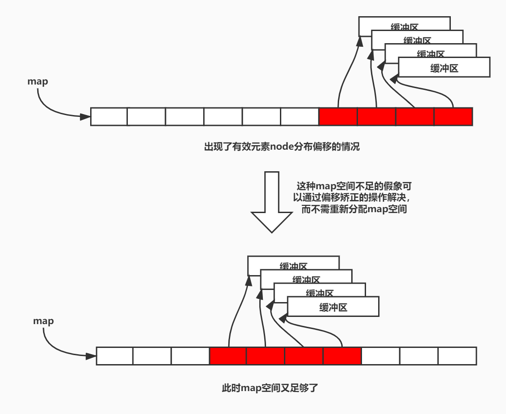

### 4.3 deque

deque，可以认为是vector的增强版，支持后向和前向双端开口元素增删操作。其实现位于源文件[stl_deque.h](stl_deque.h)，对于它我们比较需要关注如下几个点：

1. **数据结构和内存样貌**
2. **迭代器的实现**，观察它如何实现在两个不连续的内存缓冲区之间执行步进操作
3. **deque的构造和析构过程**
4. **前向/后向插入`push_back/front()`和任意插入`insert()`的实现**，观察内存缓冲区是如何实现动态增长的
5. 前向/后向删除`pop_back/front()`和任意删除`erase()`的实现，大致操作与插入的方式正好相反
6. 其他操作，看看就好

> 至于deque支持哪些操作，可以访问https://zh.cppreference.com/w/cpp/container/deque了解


#### 4.3.1 deque的数据结构

在SGI STL V3.3中，deque的实现和前面vector、list类似，都是通过继承以两级的形式实现而来。其中基类`_Deque_base`定义了最为重要的数据成员、构造函数、析构函数以及关于缓冲区创建/销毁的辅助函数。这段代码大致在源代码的328行：

```c++
template <class _Tp, class _Alloc>
class _Deque_base {
public:
  typedef _Deque_iterator<_Tp,_Tp&,_Tp*>             iterator;
  typedef _Deque_iterator<_Tp,const _Tp&,const _Tp*> const_iterator;

  /* ... */

protected:
  _Tp** _M_map;       //指向缓冲区图（一个指针数组）
  size_t _M_map_size; //当前已分配缓冲区的数量
  iterator _M_start;  //指向deque中的第一个有效元素
  iterator _M_finish; //指向deque中的最后一个有效元素

  typedef simple_alloc<_Tp, _Alloc>  _Node_alloc_type;
  typedef simple_alloc<_Tp*, _Alloc> _Map_alloc_type;
    
  /* ... */
};
```

用户真正使用的deque双向队列通过继承上面的基类，并在其中实现绝大多数的双向队列操作：

```c++
//可以看到现在的deque并不能像早先的deque那样设置bufsize
template <class _Tp, class _Alloc = __STL_DEFAULT_ALLOCATOR(_Tp) >
class deque : protected _Deque_base<_Tp, _Alloc> {
  /* ... */
};
```

我们可以从上面的代码看到，deque之所以能够很好的支持前后端原书添加和删除操作，是因为**deque它不像vector那样只维护一个连续的内存缓冲区，而是通过一个缓冲区指针数组**（因为代码中记为map，所以我称之为缓冲区图或者缓冲区指针图）**来维护多个连续的内存缓冲区**。当前向插入时发现缓冲区不足时，就会分配新的缓冲区并将其地址赋给map中有效指针元素前面元素，以此达到扩展内存缓冲区的目的。向后添加元素时发现缓冲区不足也是同样的道理。实现deque最大的难点就在于缓冲区之间是不连续的。


其中基类\_Deque_base中的`_M_map`成员是一个指向指针数组的指针，这个数组正是图中显示的map，数组中的每一个指针元素可以指向一个内存缓冲区。在使用时，有效的指向缓冲区指针会尽可能位于map的中心位置（如上面红色表示区域），以方便后续前向或后向加入元素时方便生成缓冲区。`_M_map_size`成员以记录当前共分配了多少个内存缓冲区。而迭代器成员`_M_start`和`_M_finish`分别用来指向当前deque中记录的第一个元素和最后一个元素，一是可以记录deque的起始元素位置，二是这两个迭代器还可以帮助判断deque前面或者后面有没有足够缓冲区的情况，以使得deque做出预分配缓冲区的操作。


#### 4.3.2 deque迭代器

由于deque的各个有效存储元素可能存放在不同的缓冲区中，所以**deque的迭代器不仅需要记录当前元素指针cur、当前指向元素所在的缓冲区起始first、尾后指针last，还需要记录缓冲区（指针）图map上指向当前缓冲区指针的指针**（即一个二级指针，这句话虽然说起来有点绕。在代码中命名为node，我暂时称之为map node指针），这个二级指针可以帮助我们更改当前指向元素所处的缓冲区。如下图所示：


该迭代器的定义大致在源文件的84行：

```c++
template <class _Tp, class _Ref, class _Ptr>
struct _Deque_iterator {
  typedef _Deque_iterator<_Tp, _Tp&, _Tp*>             iterator;
  typedef _Deque_iterator<_Tp, const _Tp&, const _Tp*> const_iterator;
  static size_t _S_buffer_size() { return __deque_buf_size(sizeof(_Tp)); }

  typedef random_access_iterator_tag iterator_category;
  typedef _Tp value_type;
  typedef _Ptr pointer;
  typedef _Ref reference;
  typedef size_t size_type;
  typedef ptrdiff_t difference_type;
  typedef _Tp** _Map_pointer;

  typedef _Deque_iterator _Self;

  _Tp* _M_cur;          //指向当前元素
  _Tp* _M_first;        //当前缓冲区起始
  _Tp* _M_last;         //当前缓冲区尾后
  _Map_pointer _M_node; //指向缓冲区图map中指向当前缓冲区指针的指针
    
  _Deque_iterator(_Tp* __x, _Map_pointer __y) 
    : _M_cur(__x), _M_first(*__y),
      _M_last(*__y + _S_buffer_size()), _M_node(__y) {}
  _Deque_iterator() : _M_cur(0), _M_first(0), _M_last(0), _M_node(0) {}
  _Deque_iterator(const iterator& __x)
    : _M_cur(__x._M_cur), _M_first(__x._M_first), 
      _M_last(__x._M_last), _M_node(__x._M_node) {}

  /* ... */
};
```

deque迭代器最重要的工作就是将各种各样与指针操作相关的运算符进行重载，其中最为关键的几个运算符应该是`++`、`--`、`+=`这些。重载这些运算符都会借助到一个名为`_M_set_node()`的辅助成员函数，它的职责就是不仅map node指针，然后依此更新first、last成员。

```c++
  void _M_set_node(_Map_pointer __new_node) {
    _M_node = __new_node;
    _M_first = *__new_node;
    _M_last = _M_first + difference_type(_S_buffer_size());
  }
```

这些迭代器向前或者向后步进操作起始很简单，若预料到步进后不会造成cur指针越界，那么直接更新cur当前指针即可；若预料到步进会造成越界，那么需要执行如下2步：①步进map node指针，然后用新的map node指针更新first和last成员；②更新cur当前指针（这两步在不同的操作中可能顺序不一样）。

```c++
  _Self& operator++() {
    ++_M_cur;
    if (_M_cur == _M_last) {
      _M_set_node(_M_node + 1);
      _M_cur = _M_first;
    }
    return *this; 
  }

  _Self& operator+=(difference_type __n)
  {
    difference_type __offset = __n + (_M_cur - _M_first);
    if (__offset >= 0 && __offset < difference_type(_S_buffer_size()))
      _M_cur += __n;
    else {
      difference_type __node_offset =
        __offset > 0 ? __offset / difference_type(_S_buffer_size())
                   : -difference_type((-__offset - 1) / _S_buffer_size()) - 1;
      _M_set_node(_M_node + __node_offset);
      _M_cur = _M_first + 
        (__offset - __node_offset * difference_type(_S_buffer_size()));
    }
    return *this;
  }
```


#### 4.3.3 ==deque的构造/析构过程==

deque的构造过程还是比较复杂的，我们只要了解默认构造过程和范围元素填充构造过程就足够了。无论是deque默认的构造（开始时容器为空）还是范围元素填充构造（开始时容器不为空），其有一大部分工作都是由同一个基类构造函数完成，而基类构造函数中的大部分工作又是通过一个名为`_M_initialize_map()`的辅助函数来完成。

它的工作主要是根据初始时需要的元素数量，分配出map数组，然后分配出足量的缓冲区并将它们的地址存到map数组中，最后更新first、last这两个迭代器中的数据。完成这些后，其deque内部的元素都还没有被构造，仅仅分配了空间，而元素的构造是deque那个需要范围元素填充数据的派生类构造函数的责任，默认构造函数没有这种负担。

基类的构造函数在源文件的337行：

```c++
template <class _Tp, class _Alloc>
class _Deque_base {
public:
  /* ... */
  _Deque_base(const allocator_type&, size_t __num_elements)
    : _M_map(0), _M_map_size(0),  _M_start(), _M_finish() {
    _M_initialize_map(__num_elements);
    //完成基类构造函数后，deque基本成型，但里面的元素还没有被构造
  }
  /* ... */
};

template <class _Tp, class _Alloc>
void
_Deque_base<_Tp,_Alloc>::_M_initialize_map(size_t __num_elements)
{
  //1、计算deque需要用到几个缓冲区，其中一定有一个多余的备用缓冲区
  size_t __num_nodes = 
    __num_elements / __deque_buf_size(sizeof(_Tp)) + 1;

  //2、默认最少也会分配出大小为8的缓冲区指针数组
  _M_map_size = max((size_t) _S_initial_map_size, __num_nodes + 2);
  _M_map = _M_allocate_map(_M_map_size);

  //3、使nstart和nfinish指向map（位图）中的最中央的位置
  _Tp** __nstart = _M_map + (_M_map_size - __num_nodes) / 2;
  _Tp** __nfinish = __nstart + __num_nodes;

  /* 上面1-3是为了做分配map的工作，而下面是做分配缓冲区工作，并将各缓冲区
    起始地址设置到上面的map相应元素上 */  

  __STL_TRY {
    /* 4、分配指定个数缓冲区，但至少会分出一个缓冲区，
      并将相应的指针赋给map数组中相应的元素node */
    _M_create_nodes(__nstart, __nfinish);
  }
  __STL_UNWIND((_M_deallocate_map(_M_map, _M_map_size), 
                _M_map = 0, _M_map_size = 0));
  //5、更新start、finish迭代器的first、last、node成员
  _M_start._M_set_node(__nstart);
  _M_finish._M_set_node(__nfinish - 1);
  //6、更新start、finish迭代器的当前指向元素指针cur
  _M_start._M_cur = _M_start._M_first;
  _M_finish._M_cur = _M_finish._M_first +
               __num_elements % __deque_buf_size(sizeof(_Tp));
}
```

派生类deque的构造函数在源文件的546行：

```c++
template <class _Tp, class _Alloc = __STL_DEFAULT_ALLOCATOR(_Tp) >
class deque : protected _Deque_base<_Tp, _Alloc> {
    /* ... */
public:                         // Constructor, destructor.
  //默认构造
  explicit deque(const allocator_type& __a = allocator_type()) 
    : _Base(__a, 0) {}
  //范围元素填充构造
  deque(size_type __n, const value_type& __value,
        const allocator_type& __a = allocator_type()) : _Base(__a, __n)
    { _M_fill_initialize(__value); }
   /* ... */
};

template <class _Tp, class _Alloc>
void deque<_Tp,_Alloc>::_M_fill_initialize(const value_type& __value) {
  _Map_pointer __cur;
  __STL_TRY {
    //逐个缓冲区进行填充
    for (__cur = _M_start._M_node; __cur < _M_finish._M_node; ++__cur)
      uninitialized_fill(*__cur, *__cur + _S_buffer_size(), __value);
    //因为最后一个缓冲区可能并不是所有的元素都有效，所以只需要对部分进行填充
    uninitialized_fill(_M_finish._M_first, _M_finish._M_cur, __value);
  }
  __STL_UNWIND(destroy(_M_start, iterator(*__cur, __cur)));
}
```

而析构函数的实现就很简单了，它首先会对deque容器中的所有元素进行析构，然后释放掉缓冲区，最后释放掉map数组所占的空间。


#### 4.3.4 ==deque的插入操作==

##### 4.3.4.1 缓冲区图的重新分配

deque能够在前端或者后端插入新的元素的前提是缓冲区足够或者能够新增，而缓冲区能够新增的前提是位图空间充足，所以我们有必要在理解添加元素操作之前看一下缓冲区图map的重新分配实现原理。

而缓冲区图map的重新分配又需要针对是前端插入新元素还是后端插入新元素两种情况做不同的处理，为什么要如此区分？因为缓冲区图map的空间有可能是假象，实际上map空间是足够的，只不过map上有效元素指针（代码中称为node）可能出现分布偏移的现象，如下图所示。针对这种情况我们不用重新分配map空间，只需要做一个偏移矫正的操作就可以了。



造成这种现象的主要原因就是用户几乎只在做`push_back()`的操作而没有`push_front()`，还夹杂着一些`pop_front()`的操作，导致缓冲区空间一直在向后增长；或者相反的情况。

```c++
template <class _Tp, class _Alloc = __STL_DEFAULT_ALLOCATOR(_Tp) >
class deque : protected _Deque_base<_Tp, _Alloc> {
  /* ... */
protected:                      // Allocation of _M_map and nodes
  void _M_reserve_map_at_back (size_type __nodes_to_add = 1) {
    //若map（缓冲区图在_M_finish之后没有剩余空间，则需要重新分配缓冲区图）
    if (__nodes_to_add + 1 > _M_map_size - (_M_finish._M_node - _M_map))
      _M_reallocate_map(__nodes_to_add, false);
  }

  void _M_reserve_map_at_front (size_type __nodes_to_add = 1) {
    if (__nodes_to_add > size_type(_M_start._M_node - _M_map))
      _M_reallocate_map(__nodes_to_add, true);
  }
  /* ... */
};

template <class _Tp, class _Alloc>
void deque<_Tp,_Alloc>::_M_reallocate_map(size_type __nodes_to_add,
                                          bool __add_at_front)
{
  size_type __old_num_nodes = _M_finish._M_node - _M_start._M_node + 1;
  size_type __new_num_nodes = __old_num_nodes + __nodes_to_add;

  _Map_pointer __new_nstart;
  if (_M_map_size > 2 * __new_num_nodes) {
    /* 若map空间不足是假象，是由于上面的有效元素指针（即代码中称呼的node）
    	分布发生偏移造成的，那么仅仅只要做个偏移矫正操作即可 */
    __new_nstart = _M_map + (_M_map_size - __new_num_nodes) / 2 
                     + (__add_at_front ? __nodes_to_add : 0);
    if (__new_nstart < _M_start._M_node)
      copy(_M_start._M_node, _M_finish._M_node + 1, __new_nstart);
    else
      copy_backward(_M_start._M_node, _M_finish._M_node + 1, 
                    __new_nstart + __old_num_nodes);
  }
  else {
      //否则重新分配map图
    size_type __new_map_size = 
      _M_map_size + max(_M_map_size, __nodes_to_add) + 2;

    _Map_pointer __new_map = _M_allocate_map(__new_map_size);
    __new_nstart = __new_map + (__new_map_size - __new_num_nodes) / 2
                         + (__add_at_front ? __nodes_to_add : 0);
    copy(_M_start._M_node, _M_finish._M_node + 1, __new_nstart);
    _M_deallocate_map(_M_map, _M_map_size);

    _M_map = __new_map;
    _M_map_size = __new_map_size;
  }

  _M_start._M_set_node(__new_nstart);
  _M_finish._M_set_node(__new_nstart + __old_num_nodes - 1);
}
```


##### 4.3.4.2 前/后插入

前后插入基本上都有类似的实现过程：

1. 检测当前缓冲区是否足够，若足够执行在这个缓冲区构造即可；
2. 否则先检测map图的空间是否足够，若map图空间不足，则重新分配map（若map的空间不足是由于有效元素node分布偏倚造成的，那么进行做偏移矫正操作，不用重新分配map图）；
3. 然后在指定的位置上生成新的边缘缓冲区，然后进行元素构造和first或者last迭代器的更新

```c++
template <class _Tp, class _Alloc = __STL_DEFAULT_ALLOCATOR(_Tp) >
class deque : protected _Deque_base<_Tp, _Alloc> {
  /* ... */
public:                         // push_* and pop_*
  
  void push_back(const value_type& __t) {
    if (_M_finish._M_cur != _M_finish._M_last - 1) {
      construct(_M_finish._M_cur, __t);
      ++_M_finish._M_cur;
    }
    else
      _M_push_back_aux(__t);
  }

  void push_front(const value_type& __t) {
    if (_M_start._M_cur != _M_start._M_first) {
      construct(_M_start._M_cur - 1, __t);
      --_M_start._M_cur;
    }
    else
      _M_push_front_aux(__t);
  }
    /* ... */
};

template <class _Tp, class _Alloc>
void deque<_Tp,_Alloc>::_M_push_back_aux()
{
  _M_reserve_map_at_back();//若达到了某种条件则需要更新map（缓冲区图）
  *(_M_finish._M_node + 1) = _M_allocate_node();
  __STL_TRY {
    construct(_M_finish._M_cur);
    _M_finish._M_set_node(_M_finish._M_node + 1);
    _M_finish._M_cur = _M_finish._M_first;
  }
  __STL_UNWIND(_M_deallocate_node(*(_M_finish._M_node + 1)));
}

// Called only if _M_start._M_cur == _M_start._M_first.
template <class _Tp, class _Alloc>
void  deque<_Tp,_Alloc>::_M_push_front_aux(const value_type& __t)
{
  value_type __t_copy = __t;
  _M_reserve_map_at_front();
  *(_M_start._M_node - 1) = _M_allocate_node();
  __STL_TRY {
    _M_start._M_set_node(_M_start._M_node - 1);
    _M_start._M_cur = _M_start._M_last - 1;
    construct(_M_start._M_cur, __t_copy);
  }
  __STL_UNWIND((++_M_start, _M_deallocate_node(*(_M_start._M_node - 1))));
} 
```


##### 4.3.4.3 任意插入

###### 4.3.4.3.1 任意单元素插入

```c++
  iterator insert(iterator position, const value_type& __x) {
    if (position._M_cur == _M_start._M_cur) {
      push_front(__x);
      return _M_start;
    }
    else if (position._M_cur == _M_finish._M_cur) {
      push_back(__x);
      iterator __tmp = _M_finish;
      --__tmp;
      return __tmp;
    }
    else {
      return _M_insert_aux(position, __x);
    }
  }
```

```c++
template <class _Tp, class _Alloc>
typename deque<_Tp,_Alloc>::iterator 
deque<_Tp,_Alloc>::_M_insert_aux(iterator __pos)
{
  difference_type __index = __pos - _M_start;
  /* 若插入点前面的元素数量较少，则现在front()前的位置上新键一个元素，然后以
    拷贝的方式让插入点前面的元素向前移动一步，然后在多出来的空位置上插入值 */
  if (__index < size() / 2) {
    push_front(front());
    iterator __front1 = _M_start;
    ++__front1;
    iterator __front2 = __front1;
    ++__front2;
    __pos = _M_start + __index;
    iterator __pos1 = __pos;
    ++__pos1;
    copy(__front2, __pos1, __front1);
  }
  //若插入点后面的元素数量较多
  else {
    push_back(back());
    iterator __back1 = _M_finish;
    --__back1;
    iterator __back2 = __back1;
    --__back2;
    __pos = _M_start + __index;
    copy_backward(__pos, __back2, __back1);
  }
  *__pos = value_type();
  return __pos;
}
```

###### 4.3.4.3.2 任意多元素插入

```c++
  void insert(iterator __pos, size_type __n, const value_type& __x)
    { _M_fill_insert(__pos, __n, __x); }
```

```c++
template <class _Tp, class _Alloc>
void deque<_Tp, _Alloc>::_M_fill_insert(iterator __pos,
                                        size_type __n, const value_type& __x)
{
  //若是在最前面插入
  if (__pos._M_cur == _M_start._M_cur) {
    iterator __new_start = _M_reserve_elements_at_front(__n);
    __STL_TRY {
      uninitialized_fill(__new_start, _M_start, __x);
      _M_start = __new_start;
    }
    __STL_UNWIND(_M_destroy_nodes(__new_start._M_node, _M_start._M_node));
  }
  //若是在最后面插入
  else if (__pos._M_cur == _M_finish._M_cur) {
    iterator __new_finish = _M_reserve_elements_at_back(__n);
    __STL_TRY {
      uninitialized_fill(_M_finish, __new_finish, __x);
      _M_finish = __new_finish;
    }
    __STL_UNWIND(_M_destroy_nodes(_M_finish._M_node + 1, 
                                  __new_finish._M_node + 1));    
  }
  //在中间位置插入
  else 
    _M_insert_aux(__pos, __n, __x);
}
```


```cpp
template <class _Tp, class _Alloc>
void deque<_Tp,_Alloc>::_M_insert_aux(iterator __pos,
                                      size_type __n,
                                      const value_type& __x)
{
  const difference_type __elems_before = __pos - _M_start;
  size_type __length = this->size();
  value_type __x_copy = __x;

  if (__elems_before < difference_type(__length / 2)) {
    iterator __new_start = _M_reserve_elements_at_front(__n);
    iterator __old_start = _M_start;
    __pos = _M_start + __elems_before;
    __STL_TRY {
      /* 若插入位置前面的元素比欲插入元素的数量还要多，那么这就需要涉及到
      1、未初始化拷贝；2、普通拷贝；3、填充 这三个过程 */
      if (__elems_before >= difference_type(__n)) {
        iterator __start_n = _M_start + difference_type(__n);
        uninitialized_copy(_M_start, __start_n, __new_start);
        _M_start = __new_start;
        copy(__start_n, __pos, __old_start);
        fill(__pos - difference_type(__n), __pos, __x_copy);
      }
      else {
      /* 若插入位置前面的元素比欲插入元素的数量少，那么就需要涉及到一个
        1、未初始化拷贝；2、未初始化填充；3、普通填充 这三个过程 */
        __uninitialized_copy_fill(_M_start, __pos, __new_start, 
                                  _M_start, __x_copy);
        _M_start = __new_start;
        fill(__old_start, __pos, __x_copy);
      }
    }
    __STL_UNWIND(_M_destroy_nodes(__new_start._M_node, _M_start._M_node));
  }
  else {
    iterator __new_finish = _M_reserve_elements_at_back(__n);
    iterator __old_finish = _M_finish;
    const difference_type __elems_after = 
      difference_type(__length) - __elems_before;
    __pos = _M_finish - __elems_after;
    __STL_TRY {
      if (__elems_after > difference_type(__n)) {
        iterator __finish_n = _M_finish - difference_type(__n);
        uninitialized_copy(__finish_n, _M_finish, _M_finish);
        _M_finish = __new_finish;
        copy_backward(__pos, __finish_n, __old_finish);
        fill(__pos, __pos + difference_type(__n), __x_copy);
      }
      else {
        __uninitialized_fill_copy(_M_finish, __pos + difference_type(__n),
                                  __x_copy, __pos, _M_finish);
        _M_finish = __new_finish;
        fill(__pos, __old_finish, __x_copy);
      }
    }
    __STL_UNWIND(_M_destroy_nodes(_M_finish._M_node + 1, 
                                  __new_finish._M_node + 1));
  }
}
```


#### 4.3.5 deque的删除操作

##### 4.3.5.1 前/后删除

```c++
template <class _Tp, class _Alloc = __STL_DEFAULT_ALLOCATOR(_Tp) >
class deque : protected _Deque_base<_Tp, _Alloc> {
  /* ... */
  void pop_back() {
    if (_M_finish._M_cur != _M_finish._M_first) {
      --_M_finish._M_cur;
      destroy(_M_finish._M_cur);
    }
    else
      _M_pop_back_aux();
  }

  void pop_front() {
    if (_M_start._M_cur != _M_start._M_last - 1) {
      destroy(_M_start._M_cur);
      ++_M_start._M_cur;
    }
    else 
      _M_pop_front_aux();
  }
  /* ... */
};

template <class _Tp, class _Alloc>
void deque<_Tp,_Alloc>::_M_pop_back_aux()
{
  _M_deallocate_node(_M_finish._M_first);
  _M_finish._M_set_node(_M_finish._M_node - 1);
  _M_finish._M_cur = _M_finish._M_last - 1;
  destroy(_M_finish._M_cur);
}

template <class _Tp, class _Alloc>
void deque<_Tp,_Alloc>::_M_pop_front_aux()
{
  destroy(_M_start._M_cur);
  _M_deallocate_node(_M_start._M_first);
  _M_start._M_set_node(_M_start._M_node + 1);
  _M_start._M_cur = _M_start._M_first;
} 
```


##### 4.3.5.3 任意删除


```c++
template <class _Tp, class _Alloc> 
void deque<_Tp,_Alloc>::clear()
{
  //将首node和尾node之间的node指向的缓冲区进行销毁
  for (_Map_pointer __node = _M_start._M_node + 1;
       __node < _M_finish._M_node;
       ++__node) {
    destroy(*__node, *__node + _S_buffer_size());
    _M_deallocate_node(*__node);
  }

  if (_M_start._M_node != _M_finish._M_node) {
    destroy(_M_start._M_cur, _M_start._M_last);
    destroy(_M_finish._M_first, _M_finish._M_cur);
    _M_deallocate_node(_M_finish._M_first);
  }
  else
    destroy(_M_start._M_cur, _M_finish._M_cur);

  _M_finish = _M_start;
}
```

`erase()`操作的实现

```c++
public:                         // Erase
  iterator erase(iterator __pos) {
    iterator __next = __pos;
    ++__next;
    difference_type __index = __pos - _M_start;
    if (size_type(__index) < (this->size() >> 1)) {
      copy_backward(_M_start, __pos, __next);
      pop_front();
    }
    else {
      copy(__next, _M_finish, __pos);
      pop_back();
    }
    return _M_start + __index;
  }
```

```c++
template <class _Tp, class _Alloc>
typename deque<_Tp,_Alloc>::iterator 
deque<_Tp,_Alloc>::erase(iterator __first, iterator __last)
{
  if (__first == _M_start && __last == _M_finish) {
    clear();
    return _M_finish;
  }
  else {
    difference_type __n = __last - __first;
    difference_type __elems_before = __first - _M_start;
    /* 若清除区间前面的元素数量较少，则将前面的元素进行向后拷贝，
      然后再清除前面多余出来的元素 */
    if (__elems_before < difference_type((this->size() - __n) / 2)) {
      copy_backward(_M_start, __first, __last);
      iterator __new_start = _M_start + __n;
      destroy(_M_start, __new_start);
      _M_destroy_nodes(__new_start._M_node, _M_start._M_node);
      _M_start = __new_start;
    }
    //若清除区间后面的元素数量较少
    else {
      copy(__last, _M_finish, __first);
      iterator __new_finish = _M_finish - __n;
      destroy(__new_finish, _M_finish);
      _M_destroy_nodes(__new_finish._M_node + 1, _M_finish._M_node + 1);
      _M_finish = __new_finish;
    }
    return _M_start + __elems_before;
  }
}
```


