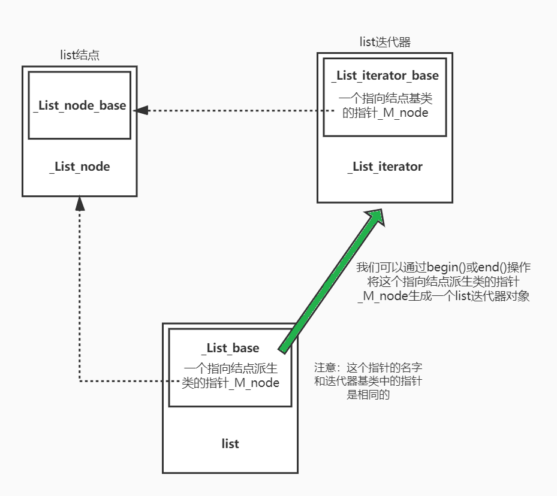
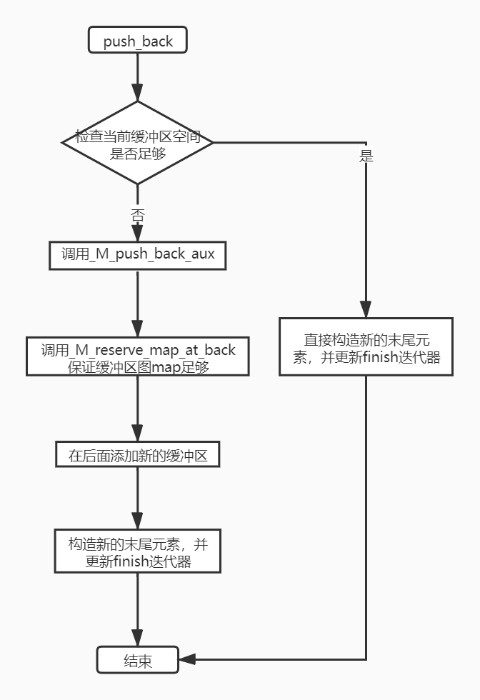

## 4. 顺序容器

### 4.1 vector

vector的实现位于源文件[stl_vector.h](stl_vector.h)，其中比较需要关注的成员函数实现如下所示：

1. **构造函数（尤其是范围构造）**
2. **插入`insert()`操作，观察如何实现元素的移动和空间的动态增长**
3. **删除`erase()`、`pop_back()`等操作**，值得注意的是vector并没有空间动态减少的机制
4. 其他操作，看看就好

> 至于vector到底支持哪些操作，可以访问cppreference网站了解：https://zh.cppreference.com/w/cpp/container/vector。


#### 4.1.1 vector的数据结构


若图所示，在vector的源文件中我们可以看到：SGI STL V3.3版本的实现中vector并不是一个独立的类，而是具有一个两级结构。它有一个名叫_Vector_base的基类，在基类中定义了空间起始、末尾空间指针（\_M_start、\_M_finish、\_M_end_of_storage），并且还定义了一簇内存空间分配（但不初始化）的成员函数、以及vector内存空间销毁函数等。\_Vector_base的实现大致在源代码的第122行：

```c++
template <class _Tp, class _Alloc> 
class _Vector_base {
public:
  typedef _Alloc allocator_type;
  allocator_type get_allocator() const { return allocator_type(); }

  _Vector_base(const _Alloc&)
    : _M_start(0), _M_finish(0), _M_end_of_storage(0) {}
  /* 仅仅分配内存空间，并填充也不初始化 */
  _Vector_base(size_t __n, const _Alloc&)
    : _M_start(0), _M_finish(0), _M_end_of_storage(0) 
  {
    _M_start = _M_allocate(__n);
    _M_finish = _M_start;
    _M_end_of_storage = _M_start + __n;
  }

  ~_Vector_base() { _M_deallocate(_M_start, _M_end_of_storage - _M_start); }

protected:
  _Tp* _M_start;
  _Tp* _M_finish;
  _Tp* _M_end_of_storage;

  typedef simple_alloc<_Tp, _Alloc> _M_data_allocator;
  _Tp* _M_allocate(size_t __n)
    { return _M_data_allocator::allocate(__n); }
  void _M_deallocate(_Tp* __p, size_t __n) 
    { _M_data_allocator::deallocate(__p, __n); }
};
```

然后我们真正使用的vector会继承这个_Vector_base基类。通过观察现如今版本的g++实现，你可以发现目前的vector实现仍然保持着这种继承结构，且\_Vector_base这个基类负责的工作更加多。

在源代码中你还会发现在SGI STL V3.3版本中，vector的迭代器实际上就是指向容器元素的原始指针，SGI STL并没有对其进行类封装。但如果观察当前g++对vector迭代器的实现就进行了类封装，只不过这个具体迭代器不仅仅只能服务于vector，其名为：`__gnu_cxx::__normal_iterator<pointer, vector>`，但实际看好下去好像还是原始指针！

```c++
//__STL_DEFAULT_ALLOCATOR(_Tp)就是alloc<_Tp>
template <class _Tp, class _Alloc = __STL_DEFAULT_ALLOCATOR(_Tp) >
class vector : protected _Vector_base<_Tp, _Alloc> 
{
  // requirements:

  __STL_CLASS_REQUIRES(_Tp, _Assignable);

private:
  typedef _Vector_base<_Tp, _Alloc> _Base;
public:
  typedef _Tp value_type;
  typedef value_type* pointer;
  typedef const value_type* const_pointer;
  typedef value_type* iterator;
  typedef const value_type* const_iterator;
  typedef value_type& reference;
  typedef const value_type& const_reference;
  typedef size_t size_type;
  typedef ptrdiff_t difference_type;

  typedef typename _Base::allocator_type allocator_type;
  allocator_type get_allocator() const { return _Base::get_allocator(); }
    
    /*  ...  */
    
};
```

当vector创建之后其所使用的内存空间就是一个简单的连续线性空间，在其已分配的空间中主要分成两个部分：①已使用空间，这部分空间已经存储了我们添加的元素，内存范围为[\_M_start,\_M_finish)；②备用空间，为下一次添加元素提供空间以避免每一次都需要分配空间的尴尬，内存范围为[\_M_finish, _M_end_of_storage)。大致结构如下图所示：


#### 4.1.2 vector的构造/析构过程

vector的构造函数在《STL源码剖析》所使用的源码和我所阅读的V3.3版本中的构造函数有许多不同之处，但可以说两者实质上的构造过程并没有什么太多的不同，它们都会经历如下3个步骤：**①allocate--->②fill--->③initialize**。

其中allocate指的是构造函数先会分配指定大小空间的过程，fill指定的是构造函数在分配完空间之后会对其中的元素进行填充默认值或者指定值的过程，initialize指的是构造函数对\_M_start、\_M_finish、\_M_end_of_storage等类对象中仅定义的数据成员修正赋值的过程。其中在V3.3的版本中，vector的allocate内存分配是由基类\_Vector_base完成，fill、copy的工作由派生类vector完成，而initialize初始化数据成员的过程是由基类\_Vector_base完成。

```c++
//基类部分：
template <class _Tp, class _Alloc> 
class _Vector_base {
public:
  typedef _Alloc allocator_type;
  allocator_type get_allocator() const { return allocator_type(); }

  _Vector_base(const _Alloc&)
    : _M_start(0), _M_finish(0), _M_end_of_storage(0) {}
  /* 仅仅分配内存空间，不填充也不初始化 */
  _Vector_base(size_t __n, const _Alloc&)
    : _M_start(0), _M_finish(0), _M_end_of_storage(0) 
  {
    // 1、分配空间、初始化数据成员（相关指针）
    _M_start = _M_allocate(__n);
    _M_finish = _M_start;
    _M_end_of_storage = _M_start + __n;
  }

  ~_Vector_base() { _M_deallocate(_M_start, _M_end_of_storage - _M_start); }

protected:
  _Tp* _M_start;
  _Tp* _M_finish;
  _Tp* _M_end_of_storage;

  typedef simple_alloc<_Tp, _Alloc> _M_data_allocator;
  _Tp* _M_allocate(size_t __n)
    { return _M_data_allocator::allocate(__n); }
  void _M_deallocate(_Tp* __p, size_t __n) 
    { _M_data_allocator::deallocate(__p, __n); }
};

// 派生类vector部分：
template <class _Tp, class _Alloc = __STL_DEFAULT_ALLOCATOR(_Tp) >
class vector : protected _Vector_base<_Tp, _Alloc> 
{
 	/* ... */
  explicit vector(const allocator_type& __a = allocator_type())
    : _Base(__a) {}

  vector(size_type __n, const _Tp& __value,
         const allocator_type& __a = allocator_type()) 
    : _Base(__n, __a)
    // 2、fill填充
    { _M_finish = uninitialized_fill_n(_M_start, __n, __value); }

  explicit vector(size_type __n)
    : _Base(__n, allocator_type())
    { _M_finish = uninitialized_fill_n(_M_start, __n, _Tp()); }

  vector(const vector<_Tp, _Alloc>& __x) 
    : _Base(__x.size(), __x.get_allocator())
    // 拷贝
    { _M_finish = uninitialized_copy(__x.begin(), __x.end(), _M_start); }
```

而析构的过程正好与上面的过程相反。


#### 4.1.3 ==元素插入与空间动态增长==

##### 4.1.3.1 单元素插入

对于单元素插入操作`insert()`和`push_back()`实际上在SGI STL V3.3版本中都是通过一个名为`_M_insert_aux()`的辅助函数来间接实现。例如在`push_back()`的实现中，若备用空间足够，则会直接在尾后指针_M_finish上执行元素拷贝构造；若备用空间不够了，则会调用`_M_insert_aux()`辅助函数实现空间的动态增长，然后再插入。

内存空间大致由如下4个过程：①分配新空间；②拷贝原空间数据到新空间（中间可能涉及到插入的过程，所以有拷贝+插入构造+再拷贝的过程）；③析构、销毁原动态内存空间；④更新数据成员（指向内存空间的指针）。这段代码大致在源文件的674行：

```c++
protected:
  void _M_insert_aux(iterator __position, const _Tp& __x);
  void _M_insert_aux(iterator __position);

/*  ...  */

template <class _Tp, class _Alloc>
void 
vector<_Tp, _Alloc>::_M_insert_aux(iterator __position, const _Tp& __x)
{
  /* 若备用空间足够，则在finish位置上创建一个新元素，然后将position到原来
      finish之间范围的元素向右移动一位，最后将数据__x插入到position位置 */
  if (_M_finish != _M_end_of_storage) {
    construct(_M_finish, *(_M_finish - 1));
    ++_M_finish;
    _Tp __x_copy = __x;
    copy_backward(__position, _M_finish - 2, _M_finish - 1);
    *__position = __x_copy;
  }
  else {
    const size_type __old_size = size();
    const size_type __len = __old_size != 0 ? 2 * __old_size : 1;
    // 1、分配新的空间
    iterator __new_start = _M_allocate(__len);
    iterator __new_finish = __new_start;
    // 2、拷贝原空间数据到新空间
    __STL_TRY {
      __new_finish = uninitialized_copy(_M_start, __position, __new_start);
      construct(__new_finish, __x);
      ++__new_finish;
      __new_finish = uninitialized_copy(__position, _M_finish, __new_finish);
    }
    __STL_UNWIND((destroy(__new_start,__new_finish), 
                  _M_deallocate(__new_start,__len)));
    // 3、析构+销毁原空间
    destroy(begin(), end());
    _M_deallocate(_M_start, _M_end_of_storage - _M_start);
    // 4、更新指针数据
    _M_start = __new_start;
    _M_finish = __new_finish;
    _M_end_of_storage = __new_start + __len;
  }
}
```

根据上述的辅助成员函数可以很容易的实现`push_back()`这样的操作：

```c++
  void push_back(const _Tp& __x) {
    if (_M_finish != _M_end_of_storage) {
      construct(_M_finish, __x);
      ++_M_finish;
    }
    else
      _M_insert_aux(end(), __x);
  }
```


##### 4.1.3.2 范围元素插入

vector的范围元素插入在V3.3版本中，会根据是范围元素填充还是范围元素插入两种情况实现两个函数。若是范围元素填充，则定义了一个名为`_M_fill_insert()`的辅助函数；若是范围元素（其中的元素各不相同）插入，则直接重载了`insert()`这个函数。但两者的实现原理、过程基本相同。

```c++
template <class _Tp, class _Alloc>
void vector<_Tp, _Alloc>::_M_fill_insert(iterator __position, size_type __n, 
                                         const _Tp& __x)
{
  if (__n != 0) {
    /* 备用空间足够 */
    if (size_type(_M_end_of_storage - _M_finish) >= __n) {
      _Tp __x_copy = __x;
      const size_type __elems_after = _M_finish - __position;
      iterator __old_finish = _M_finish;
      /* 由于uninitialized_copy()算法是基于元素的拷贝构造函数而实现的，则
        算法调用时被拷贝的元素必然是未被初始化的；而copy()等算法是基于拷贝
        赋值运算符而实现的，因此它必然要求被拷贝的元素在算法执行前已经被初始
        化了。因而造成了如下的if-else */
      if (__elems_after > __n) {
        // 1、拷贝后面的元素到未初始化的内存上
        uninitialized_copy(_M_finish - __n, _M_finish, _M_finish);
        _M_finish += __n;
        // 2、拷贝较后面的元素到已初始化的内存上
        copy_backward(__position, __old_finish - __n, __old_finish);
        fill(__position, __position + __n, __x_copy);
      }
      else {
        uninitialized_fill_n(_M_finish, __n - __elems_after, __x_copy);
        _M_finish += __n - __elems_after;
        uninitialized_copy(__position, __old_finish, _M_finish);
        _M_finish += __elems_after;
        fill(__position, __old_finish, __x_copy);
      }
    }
    /* 备用空间不够，这种情况下的处理方式较简单 */
    else {
      const size_type __old_size = size();        
      const size_type __len = __old_size + max(__old_size, __n);
      iterator __new_start = _M_allocate(__len);
      iterator __new_finish = __new_start;
      __STL_TRY {
        __new_finish = uninitialized_copy(_M_start, __position, __new_start);
        __new_finish = uninitialized_fill_n(__new_finish, __n, __x);
        __new_finish
          = uninitialized_copy(__position, _M_finish, __new_finish);
      }
      __STL_UNWIND((destroy(__new_start,__new_finish), 
                    _M_deallocate(__new_start,__len)));
      destroy(_M_start, _M_finish);
      _M_deallocate(_M_start, _M_end_of_storage - _M_start);
      _M_start = __new_start;
      _M_finish = __new_finish;
      _M_end_of_storage = __new_start + __len;
    }
  }
}
```

其中上面需要注意一个细节，那么就是备用空间不足的情况下如何实现插入点后的元素向后搬移的过程。若一个元素需要搬移到一个未初始化内存的区域，那么就需要调用`unitialized_copy()`算法；但若需要将一个元素搬移到一个已初始化的内存区域上，那么就需要调用像`copy()`这样的算法。这一点的不同也就造成了上面的第三个if-else分支。其过程大致可以用下图（备用空间足够时）来表示：


而备用空间不足时情况就简单了很多：


#### 4.1.4 元素删除操作

元素删除操作中比较值得学习的就是`erase()`操作，它主要就3个步骤：元素的移动、末尾已无效元素的析构和指针数据的更新。而其他元素删除操作看看就好。下面就是`erase()`的实现，这段代码大约在源文件的第415行。

````c++
iterator erase(iterator __position) {
    if (__position + 1 != end())
        copy(__position + 1, _M_finish, __position);
    --_M_finish;
    destroy(_M_finish);
    return __position;
}
iterator erase(iterator __first, iterator __last) {
    iterator __i = copy(__last, _M_finish, __first);
    destroy(__i, _M_finish);
    _M_finish = _M_finish - (__last - __first);
    return __first;
}
````


### 4.2 list

list的实现位于源文件[stl_list.h](stl_list.h)，其中比较需要关注的几个部分如下所示：

1. **list的数据结构，结点、迭代器**；
2. **构造、析构过程**；
3. **插入`insert()`和删除`erase()`操作**；
4. **链表迁移`transfer()`操作及其衍生操作**，包括`splice()`、`merge()`和`sort()`等操作；
5. 其他操作，看看就好。

> 至于list到底支持哪些操作，可以通过访问https://zh.cppreference.com/w/cpp/container/list来查看。

文件[list_test.cpp](list_test.cpp)大致实现了list的一些功能，该文件仅仅做展示作用。需要注意的是在这种模板+继承的C++编程中需要特别注意模板派生类使用模板基类名字的一个问题：**若模板派生类需要使用模板基类的名字时，则编译器会因为默认情况下不进入基类的作用域查找该名字而使得派生类无法直接使用模板基类的名字**（包括成员类型、成员函数）。这一点在《*effective C++*》中的第43条有着详细的说明。


#### 4.2.1 list结点和迭代器

在SGI STL V3.3版本的实现中，无论是list的结点实现还是迭代器的实现，甚至list的实现都是采用一个二级的继承体系。也就是说我们本来想象中可以用一个类完成的结构，在这份源码中都是采用一个基类+派生类的方式完成，甚至在当前的g++中的STL实现中仍然保持了这种风格。

对于list的结点而言，它有一个名为`_List_node_base`的基类，它封装了指向前后基类结点的指针，然后真正完整的结点类`_List_node`继承自它，并附加了一个模板形式的数据成员。同样的，对于list的迭代器，它有一个名为`_List_iterator_base`的基类，它封装了一个指向结点基类的指针，且大多数关乎于这个指针的操作都是在基类中完成，然后真正完整的迭代器类`_List_iterator`继承自它。



这些代码大致位于源代码的第43行：

```c++
// 结点的实现
struct _List_node_base {
  _List_node_base* _M_next;
  _List_node_base* _M_prev;
};

template <class _Tp>
struct _List_node : public _List_node_base {
  _Tp _M_data;
};

template <class _Tp>
struct _List_node : public _List_node_base {
  _Tp _M_data;
};

// 迭代器实现
struct _List_iterator_base {
  typedef size_t                     size_type;
  typedef ptrdiff_t                  difference_type;
  typedef bidirectional_iterator_tag iterator_category;

  // 这个_M_node是直接公开的，即使是现如今g++也是怎么做的
  _List_node_base* _M_node;

  _List_iterator_base(_List_node_base* __x) : _M_node(__x) {}
  _List_iterator_base() {}

  void _M_incr() { _M_node = _M_node->_M_next; }
  void _M_decr() { _M_node = _M_node->_M_prev; }

  bool operator==(const _List_iterator_base& __x) const {
    return _M_node == __x._M_node;
  }
  bool operator!=(const _List_iterator_base& __x) const {
    return _M_node != __x._M_node;
  }
};  

template<class _Tp, class _Ref, class _Ptr>
struct _List_iterator : public _List_iterator_base {
  typedef _List_iterator<_Tp,_Tp&,_Tp*>             iterator;
  typedef _List_iterator<_Tp,const _Tp&,const _Tp*> const_iterator;
  typedef _List_iterator<_Tp,_Ref,_Ptr>             _Self;

  typedef _Tp value_type;
  typedef _Ptr pointer;
  typedef _Ref reference;
  typedef _List_node<_Tp> _Node;

  _List_iterator(_Node* __x) : _List_iterator_base(__x) {}
  _List_iterator() {}
  _List_iterator(const iterator& __x) : _List_iterator_base(__x._M_node) {}
  /* ... */
};
```


#### 4.2.2 list的数据结构

正如我们上面所讲的那样，SGI STL对list的实现也区分成一个基类和派生类。其中基类`_List_base`的主要工作就是封装了链表list中指向哨兵结点的指针，并且负责生成或者销毁一个结点以及对链表的初始化、析构等工作，而剩下的工作全部交给派生类list来完成。

通过从派生类到基类观察list的构造过程可以发现：**list的组织形式是一个环状双向链表，并且链表中总会有一个哨兵结点**（即_M_node指向的那个）**，它既是起始结点的前驱结点又是尾后结点，它并不存储任何有效的数据**。这种技巧在leetcode算法题中经常使用，其最大的好处在于它仅仅需要付出一个结点空间的代价就可以很方便的完成结点插入、删除的工作，而不需要对头结点或尾结点做特殊处理。具体如下图所示：


list基类_List_base的实现：

```c++
template <class _Tp, class _Alloc>
class _List_base 
{
public:
  typedef _Alloc allocator_type;
  allocator_type get_allocator() const { return allocator_type(); }

  /* 在链表构造之初，只有一个哨兵结点，且其前后指针都指向自己 */
  _List_base(const allocator_type&) {
    _M_node = _M_get_node();
    _M_node->_M_next = _M_node;
    _M_node->_M_prev = _M_node;
  }
  ~_List_base() {
    clear();
    _M_put_node(_M_node);
  }

  void clear();

protected:
  typedef simple_alloc<_List_node<_Tp>, _Alloc> _Alloc_type;
  _List_node<_Tp>* _M_get_node() { return _Alloc_type::allocate(1); }
  void _M_put_node(_List_node<_Tp>* __p) { _Alloc_type::deallocate(__p, 1); } 

protected:
  _List_node<_Tp>* _M_node;
};
```

list派生类实现：

```c++
template <class _Tp, class _Alloc = __STL_DEFAULT_ALLOCATOR(_Tp) >
class list : protected _List_base<_Tp, _Alloc> {
  // requirements:

  __STL_CLASS_REQUIRES(_Tp, _Assignable);

  typedef _List_base<_Tp, _Alloc> _Base;
protected:
  typedef void* _Void_pointer;

public:      
  typedef _Tp value_type;
  typedef value_type* pointer;
  typedef const value_type* const_pointer;
  typedef value_type& reference;
  typedef const value_type& const_reference;
  typedef _List_node<_Tp> _Node;
  typedef size_t size_type;
  typedef ptrdiff_t difference_type;create_node

  typedef typename _Base::allocator_type allocator_type;
  allocator_type get_allocator() const { return _Base::get_allocator(); }

public:
  typedef _List_iterator<_Tp,_Tp&,_Tp*>             iterator;
  typedef _List_iterator<_Tp,const _Tp&,const _Tp*> const_iterator;

  /* ... */
};
```


#### 4.2.3 list的构造/析构过程

任何一个链表无论它怎么构造都需要建立在一个空链表的构造完成的前提下才能继续。至于一个空链表的构造基本上在基类`_List_base`中就得到了完成，而基类做的就是仅仅分配出一个哨兵结点（有些人会将之称为哑结点，因为它不存储任何数据），然后将其前驱和后继都设置为自己，如下图所示：


```c++
template <class _Tp, class _Alloc>
class _List_base 
{
public:
  typedef _Alloc allocator_type;
  allocator_type get_allocator() const { return allocator_type(); }

  _List_base(const allocator_type&) {
    _M_node = _M_get_node();
    _M_node->_M_next = _M_node;
    _M_node->_M_prev = _M_node;
  }
  ~_List_base() {
    clear();
    _M_put_node(_M_node);
  }

  void clear();

protected:
  typedef simple_alloc<_List_node<_Tp>, _Alloc> _Alloc_type;
  _List_node<_Tp>* _M_get_node() { return _Alloc_type::allocate(1); }
  void _M_put_node(_List_node<_Tp>* __p) { _Alloc_type::deallocate(__p, 1); } 

protected:
  _List_node<_Tp>* _M_node;
};

template <class _Tp, class _Alloc>
void 
_List_base<_Tp,_Alloc>::clear() 
{
  _List_node<_Tp>* __cur = (_List_node<_Tp>*) _M_node->_M_next;
  while (__cur != _M_node) {
    _List_node<_Tp>* __tmp = __cur;
    __cur = (_List_node<_Tp>*) __cur->_M_next;
    _Destroy(&__tmp->_M_data);
    _M_put_node(__tmp);
  }
  _M_node->_M_next = _M_node;
  _M_node->_M_prev = _M_node;
}
```

而链表的析构也非常简单，它首先会执行`clear()`操作将链表进行清空，然后调用protected成员函数`_M_put_node()`将哨兵结点进行销毁。


#### 4.2.4 元素的插入与删除

在正式介绍list元素结点的插入和删除操作实现之前，我们首先需要看一下list的结点是如何实现分配、构造初始化、析构和销毁的。其中结点空间的分配和销毁是在基类\_List_base中得到实现的，而结点的构造初始化是在派生类list中实现的，且是在基类中空间分配函数的基础上完成的。而结点的析构在SGI STL V3.3版本中并没有对应的操作，因为它实际上完全可以用STL算法`destroy()`和基类`_M_put_node()`间接完成，这并不是什么大问题。

```c++
// _List_base基类中：
protected:
  typedef simple_alloc<_List_node<_Tp>, _Alloc> _Alloc_type;
  // 使用空间分配器分配出一个链表结点的空间
  _List_node<_Tp>* _M_get_node() { return _Alloc_type::allocate(1); }
  // 使用空间分配器销毁指定结点的空间
  void _M_put_node(_List_node<_Tp>* __p) { _Alloc_type::deallocate(__p, 1); } 

// list类中：
protected:
  // 构造一个list结点
  _Node* _M_create_node(const _Tp& __x)
  {
    _Node* __p = _M_get_node();
    __STL_TRY {
      _Construct(&__p->_M_data, __x);
    }
    __STL_UNWIND(_M_put_node(__p));
    return __p;
  }

  _Node* _M_create_node()
  {
    _Node* __p = _M_get_node();
    __STL_TRY {
      _Construct(&__p->_M_data);
    }
    __STL_UNWIND(_M_put_node(__p));
    return __p;
  }
```


##### 4.2.4.1 元素插入操作

所有链表list上添加元素的操作，无论是`push_back()`、`push_front()`都是借由`insert()`单元素任意插入操作实现的，甚至范围元素插入操作也都是由这个单元素操作通过逐一插入实现而来的。

```c++
iterator insert(iterator __position, const _Tp& __x) {
    _Node* __tmp = _M_create_node(__x);
    __tmp->_M_next = __position._M_node;
    __tmp->_M_prev = __position._M_node->_M_prev;
    __position._M_node->_M_prev->_M_next = __tmp;
    __position._M_node->_M_prev = __tmp;
    return __tmp;
}

// 范围元素插入
template <class _Tp, class _Alloc>
void 
list<_Tp, _Alloc>::insert(iterator __position, 
                          const _Tp* __first, const _Tp* __last)
{
    for ( ; __first != __last; ++__first)
        insert(__position, *__first);
}

// push_back的实现
void push_back(const _Tp& __x) { insert(end(), __x); }
```


##### 4.2.4.2 元素删除操作

而与上面的情况相同，所有链表list上的删除元素操作，无论是`pop_back()`、`pop_front()`、`remove()`都是借由`erase()`任意单元素删除操作实现而来的，甚至范围元素删除的操作也是由这个单元素删除操作逐次调用而来的。

```c++
iterator erase(iterator __position) {
    _List_node_base* __next_node = __position._M_node->_M_next;
    _List_node_base* __prev_node = __position._M_node->_M_prev;
    _Node* __n = (_Node*) __position._M_node;
    __prev_node->_M_next = __next_node;
    __next_node->_M_prev = __prev_node;
    _Destroy(&__n->_M_data);
    _M_put_node(__n);
    return iterator((_Node*) __next_node);
}
```


#### 4.2.5 ==元素迁移与衍生操作==

##### 4.2.5.1 元素迁移操作

元素迁移操作可以认为是一种比较特殊的插入操作，因为它插入的不是新的链表结点元素，而是从链表一个位置上截下一段然后插入到当前链表或者另一个链表上的指定位置上。因此它最直观的就有两个步骤：①将指定的链表结点（串链）从原始的链表中截取下来，②然后将其插入到指定链表的某个位置上。但实际实现时，它一般是一边截取一边插入（调整相关的指针）所以看起源码来有点😵。如下图所示：


```c++
protected:
  void transfer(iterator __position, iterator __first, iterator __last) {
    if (__position != __last) {
      // Remove [first, last) from its old position.
      __last._M_node->_M_prev->_M_next     = __position._M_node;
      __first._M_node->_M_prev->_M_next    = __last._M_node;
      __position._M_node->_M_prev->_M_next = __first._M_node; 

      // Splice [first, last) into its new position.
      _List_node_base* __tmp      = __position._M_node->_M_prev;
      __position._M_node->_M_prev = __last._M_node->_M_prev;
      __last._M_node->_M_prev     = __first._M_node->_M_prev; 
      __first._M_node->_M_prev    = __tmp;
    }
  }
```


##### 4.2.5.2 元素迁移的衍生操作

链表list中的元素迁移操作是list中很多操作实现的重要前提，因为向双链表中的结点提供了一个非常灵活的移动能力。通过`transfer()`操作我们可以很好的实现链表拼接操作`splice()`、链表的有序归并操作`merge()`，以及基于有序归并实现的双链表归并算法`sort()`。

```c++
// 双链表拼接splice实现：
public:
  void splice(iterator __position, list& __x) {
    if (!__x.empty()) 
      this->transfer(__position, __x.begin(), __x.end());
  }
  void splice(iterator __position, list&, iterator __i) {
    iterator __j = __i;
    ++__j;
    // 若i后面的结点就是position，则说明没必要移动
    if (__position == __i || __position == __j) return;
    this->transfer(__position, __i, __j);
  }
  void splice(iterator __position, list&, iterator __first, iterator __last) {
    if (__first != __last) 
      this->transfer(__position, __first, __last);
  }

// 两个有序链表的归并merge实现：
template <class _Tp, class _Alloc>
void list<_Tp, _Alloc>::merge(list<_Tp, _Alloc>& __x)
{
  iterator __first1 = begin();
  iterator __last1 = end();
  iterator __first2 = __x.begin();
  iterator __last2 = __x.end();
  /* 若两个链表的first迭代器都没有到达末尾，则从两个链表中选择一个
    当前较大元素迁移到相应的位置 */
  while (__first1 != __last1 && __first2 != __last2)
    if (*__first2 < *__first1) {
      iterator __next = __first2;
      transfer(__first1, __first2, ++__next);
      __first2 = __next;
    }
    else
      ++__first1;
  // 若链表__x经上面的遍历后还有剩余，则将剩余的结点串链插入到当前链表的末尾
  if (__first2 != __last2) transfer(__last1, __first2, __last2);
}

/* 在SGI STL V3.3中reverse操作的实现并不是借助迁移操作来实现的，
	这里需要注意下 */
inline void __List_base_reverse(_List_node_base* __p)
{
  _List_node_base* __tmp = __p;
  do {
    __STD::swap(__tmp->_M_next, __tmp->_M_prev);
    __tmp = __tmp->_M_prev;     // Old next node is now prev.
  } while (__tmp != __p);
}

template <class _Tp, class _Alloc>
inline void list<_Tp, _Alloc>::reverse() 
{
  __List_base_reverse(this->_M_node);
}    
```


双链表list的排序实现其实就是一种典型的自底向上归并排序（《STL源码剖析》声称其采用了快速排序，我觉得是错误的❌！）。

在排序前，它会生成一个用作临时存放元素的链表\_\_carry（为什么概念上将其归为临时呢？因为它并不会记录上一轮存放进入的结点元素，而后面64个好歹会），以及64个辅助存放链表（这意味着它最高允许将归并的层数达到64层）。

当排序开始后，它每一次迭代都会从源链表中剪下一个结点，若\_\__counter[0]有元素存在，则它和当前读入结点元素进行有序归并；归并后若发现下一层的\_\_counter[1]也存在元素，则\_\_counter[1]会继续和它进行归并；此次归并后若仍然发现下一层的\_\_counter[2]也存在元素，则继续归并。。。。直到归并到有一层的下一层不再存在元素。当最外面的while循环结束后，辅助存放链表\_\_counter[]中会有部分链表仍然存放一些链表有序片段，还有些则没有，所以我们需要从0到\_\_fill逐次归并到\_\_counter[\_\_fill]，然后交换回当前链表中，这样我们就完成了整个排序过程。说了这么多，不如来一个图示清楚：


```c++
template <class _Tp, class _Alloc>
void list<_Tp, _Alloc>::sort()
{
  // Do nothing if the list has length 0 or 1.
  if (_M_node->_M_next != _M_node && _M_node->_M_next->_M_next != _M_node) {
    list<_Tp, _Alloc> __carry;
    list<_Tp, _Alloc> __counter[64];
    int __fill = 0;
      
    while (!empty()) {
      // 先迁移到临时链表__carry中
      __carry.splice(__carry.begin(), *this, begin());
        
      int __i = 0;
      while(__i < __fill && !__counter[__i].empty()) {
        // 若__counter[__i]链表中有元素，则将carry与之归并
        __counter[__i].merge(__carry);
        // 然后又交换到carry中
        __carry.swap(__counter[__i++]);
      }
      // 最后归并到一个空的counter[__i]链表中
      __carry.swap(__counter[__i]);         
      if (__i == __fill) ++__fill;
    } 

    for (int __i = 1; __i < __fill; ++__i)
      __counter[__i].merge(__counter[__i-1]);
    swap(__counter[__fill-1]);
  }
}
```

在上面的代码中有一个细节你会发现，那就是fill的值好像没有上限，若只要出现\_\_i==\_\_fill一直出现，是否意味着__fill有可能超过64进而导致越界访问，最终发生段错误？其实通过计算上面得出的序列：第1层最多容纳元素1个、第2层最多容纳元素2个、第3层最多容纳元素3个、第4层最多容纳元素6个、第5层最多容纳元素12个......就可以发现第$i$层所能容纳的元素符合下式：
$$
第i层所能容纳的元素个数=
\left\{
\begin{array}{rcl}
{i}                 &	&	{1\leq{i}<3}\\
{3\times{2}^{i-3}}	&	&	{3\leq{i}<64}\\
\end{array}
\right.
$$
那么可以预估得到从第63层刚刚归并到64层的时候，64层就正好有$3\times2^{61}$个元素结点，很难想象有什么常规的排序会对这么多元素进行排序。所以正常的情况下\_\_fill几乎不可能超过64这个数。一般情况下的时间复杂度为$O(NlogN)$，由于排序的过程中虽然有几个辅助链表的存在，但是它们中的结点并不是新建的，都是从this链表中迁移过来的，所以空间复杂度$O(1)$。


### 4.3 deque

deque，可以认为是vector的增强版，支持前后双端开口元素的增删操作。其实现位于源文件[stl_deque.h](stl_deque.h)，对于它我们比较需要关注如下几个点：

1. **数据结构和内存样貌**
2. **迭代器的实现**，观察它如何实现在两个不连续的内存缓冲区之间执行步进操作
3. **deque的构造和析构过程**
4. **前向/后向插入`push_back/front()`和任意插入`insert()`的实现**，观察内存缓冲区是如何实现动态增长的
5. 前向/后向删除`pop_back/front()`和任意删除`erase()`的实现，大致操作与插入的方式正好相反
6. 其他操作，看看就好

> 至于deque支持哪些操作，可以访问https://zh.cppreference.com/w/cpp/container/deque了解


#### 4.3.1 deque的数据结构

在SGI STL V3.3中，deque的实现和前面vector、list类似，都是通过继承以两级的形式实现而来。其中基类`_Deque_base`定义了最为重要的数据成员、构造函数、析构函数以及关于缓冲区创建/销毁的辅助函数。这段代码大致在源代码的328行：

```c++
template <class _Tp, class _Alloc>
class _Deque_base {
public:
  typedef _Deque_iterator<_Tp,_Tp&,_Tp*>             iterator;
  typedef _Deque_iterator<_Tp,const _Tp&,const _Tp*> const_iterator;

  /* ... */

protected:
  _Tp** _M_map;       // 指向缓冲区图（一个指针数组）
  size_t _M_map_size; // 当前已分配缓冲区的数量
  iterator _M_start;  // 指向deque中的第一个有效元素
  iterator _M_finish; // 指向deque中的最后一个有效元素

  typedef simple_alloc<_Tp, _Alloc>  _Node_alloc_type;
  typedef simple_alloc<_Tp*, _Alloc> _Map_alloc_type;
    
  /* ... */
};
```

用户真正使用的deque双向队列通过继承上面的基类，并在其中实现绝大多数的双向队列操作：

```c++
// 可以看到现在的deque并不能像早先的deque那样设置bufsize
template <class _Tp, class _Alloc = __STL_DEFAULT_ALLOCATOR(_Tp) >
class deque : protected _Deque_base<_Tp, _Alloc> {
  /* ... */
};
```

我们可以从上面的代码看到，deque之所以能够很好的支持前后端元素添加和删除操作，是因为**deque它不像vector那样只维护一个连续的内存缓冲区，而是通过一个缓冲区指针数组**（因为代码中记为map，所以我称之为缓冲区图或者缓冲区指针图）**来维护多个连续的内存缓冲区**。当前向插入时发现缓冲区不足时，就会分配新的缓冲区并将其地址赋给map中有效指针元素前面元素，以此达到扩展内存缓冲区的目的。向后添加元素时发现缓冲区不足也是同样的道理。因此实现deque最大的难点就在于处理不连续的缓冲区。


其中基类\_Deque_base中的`_M_map`成员是一个指向指针数组的指针，这个数组正是图中显示的map，数组中的每一个指针元素可以指向一个内存缓冲区。在使用时，有效的指向缓冲区指针会尽可能位于map的中心位置（如上面红色表示区域），以方便后续前向或后向加入元素时方便生成缓冲区。`_M_map_size`成员以记录当前共分配了多少个内存缓冲区。而迭代器成员`_M_start`和`_M_finish`分别用来指向当前deque中记录的第一个元素和最后一个元素，一是可以记录deque的起始元素位置，二是这两个迭代器还可以帮助判断deque前面或者后面有没有足够缓冲区的情况，以使得deque做出预分配缓冲区的操作。


#### 4.3.2 deque迭代器

由于deque的各个有效存储元素可能存放在不同的缓冲区中，所以**deque的迭代器不仅需要记录当前元素指针cur、当前指向元素所在的缓冲区起始first、尾后指针last，还需要记录缓冲区（指针）图map上指向当前缓冲区指针的指针**（即一个二级指针，这句话虽然说起来有点绕。在代码中命名为node，我暂时称之为map node指针），这个二级指针可以帮助我们更改迭代器当前指向元素所处的缓冲区。如下图所示：


该迭代器的定义大致在源文件的84行：

```c++
template <class _Tp, class _Ref, class _Ptr>
struct _Deque_iterator {
  typedef _Deque_iterator<_Tp, _Tp&, _Tp*>             iterator;
  typedef _Deque_iterator<_Tp, const _Tp&, const _Tp*> const_iterator;
  // deque的缓冲区大小是固定的，具体点应该是缓冲区中可容纳的结点数量是固定的
  static size_t _S_buffer_size() { return __deque_buf_size(sizeof(_Tp)); }

  typedef random_access_iterator_tag iterator_category;
  typedef _Tp value_type;
  typedef _Ptr pointer;
  typedef _Ref reference;
  typedef size_t size_type;
  typedef ptrdiff_t difference_type;
  typedef _Tp** _Map_pointer;

  typedef _Deque_iterator _Self;

  _Tp* _M_cur;          // 指向当前元素
  _Tp* _M_first;        // 当前缓冲区起始
  _Tp* _M_last;         // 当前缓冲区尾后
  _Map_pointer _M_node; // 指向缓冲区图map中指向当前缓冲区指针的指针
    
  _Deque_iterator(_Tp* __x, _Map_pointer __y) 
    : _M_cur(__x), _M_first(*__y),
      _M_last(*__y + _S_buffer_size()), _M_node(__y) {}
  _Deque_iterator() : _M_cur(0), _M_first(0), _M_last(0), _M_node(0) {}
  _Deque_iterator(const iterator& __x)
    : _M_cur(__x._M_cur), _M_first(__x._M_first), 
      _M_last(__x._M_last), _M_node(__x._M_node) {}

  /* ... */
};
```

deque迭代器最重要的工作就是将各种各样与指针操作相关的运算符进行重载，其中最为关键的几个运算符应该是`++`、`--`、`+=`这些。重载这些运算符都会借助到一个名为`_M_set_node()`的辅助成员函数，它的职责就是不仅更新map node指针，然后依此更新first、last成员。

```c++
  void _M_set_node(_Map_pointer __new_node) {
    _M_node = __new_node;
    _M_first = *__new_node;
    _M_last = _M_first + difference_type(_S_buffer_size());
  }
```

这些迭代器向前或者向后步进操作起始很简单，若预料到步进后不会造成cur指针越界，那么直接更新cur当前指针即可；若预料到步进会造成越界，那么需要执行如下2步：①步进map node指针，然后用新的map node指针更新first和last成员；②更新cur当前指针（这两步在不同的操作中可能顺序不一样）。

```c++
  _Self& operator++() {
    ++_M_cur;
    if (_M_cur == _M_last) {
      _M_set_node(_M_node + 1);
      _M_cur = _M_first;
    }
    return *this; 
  }

  _Self& operator+=(difference_type __n)
  {
    difference_type __offset = __n + (_M_cur - _M_first);
    if (__offset >= 0 && __offset < difference_type(_S_buffer_size()))
      _M_cur += __n;
    else {
      difference_type __node_offset =
        __offset > 0 ? __offset / difference_type(_S_buffer_size())
                   : -difference_type((-__offset - 1) / _S_buffer_size()) - 1;
      _M_set_node(_M_node + __node_offset);
      _M_cur = _M_first + 
        (__offset - __node_offset * difference_type(_S_buffer_size()));
    }
    return *this;
  }
```


#### 4.3.3 ==deque的构造/析构过程==

deque的构造过程还是比较复杂的，我们只要了解默认构造过程和范围元素填充构造过程就足够了。无论是deque默认的构造（开始时容器为空）还是范围元素填充构造（开始时容器不为空），有一大部分工作都是由同一个基类构造函数完成，而基类构造函数中的大部分工作又是通过一个名为`_M_initialize_map()`的辅助函数来完成。

它的工作主要是根据初始时需要的元素数量，分配出map数组，然后分配出足量的缓冲区并将它们的地址存到map数组中，最后更新first、last这两个迭代器中的数据。完成这些后，其deque内部的元素都还没有被构造，仅仅分配了空间，而元素的构造是deque那个需要范围元素填充数据的派生类构造函数的责任，默认构造函数没有这种负担。

基类的构造函数在源文件的337行：

```c++
template <class _Tp, class _Alloc>
class _Deque_base {
public:
  /* ... */
  _Deque_base(const allocator_type&, size_t __num_elements)
    : _M_map(0), _M_map_size(0),  _M_start(), _M_finish() {
    _M_initialize_map(__num_elements);
    // 完成基类构造函数后，deque基本成型，但里面的元素还没有被构造
  }
  /* ... */
};

template <class _Tp, class _Alloc>
void
_Deque_base<_Tp,_Alloc>::_M_initialize_map(size_t __num_elements)
{
  // 1、计算deque需要用到几个缓冲区，其中一定有一个多余的备用缓冲区
  size_t __num_nodes = 
    __num_elements / __deque_buf_size(sizeof(_Tp)) + 1;

  // 2、默认最少也会分配出大小为8的缓冲区指针数组
  _M_map_size = max((size_t) _S_initial_map_size, __num_nodes + 2);
  _M_map = _M_allocate_map(_M_map_size);

  // 3、使nstart和nfinish指向map（位图）中的最中央的位置
  _Tp** __nstart = _M_map + (_M_map_size - __num_nodes) / 2;
  _Tp** __nfinish = __nstart + __num_nodes;

  /* 上面1-3是为了做分配map的工作，而下面是做分配缓冲区工作，并将各缓冲区
    起始地址设置到上面的map相应元素上 */  

  __STL_TRY {
    /* 4、分配指定个数缓冲区，但至少会分出一个缓冲区，
      并将相应的指针赋给map数组中相应的元素node */
    _M_create_nodes(__nstart, __nfinish);
  }
  __STL_UNWIND((_M_deallocate_map(_M_map, _M_map_size), 
                _M_map = 0, _M_map_size = 0));
  // 5、更新start、finish迭代器的first、last、node成员
  _M_start._M_set_node(__nstart);
  _M_finish._M_set_node(__nfinish - 1);
  // 6、更新start、finish迭代器的当前指向元素指针cur
  _M_start._M_cur = _M_start._M_first;
  _M_finish._M_cur = _M_finish._M_first +
               __num_elements % __deque_buf_size(sizeof(_Tp));
}
```

派生类deque的构造函数在源文件的546行：

```c++
template <class _Tp, class _Alloc = __STL_DEFAULT_ALLOCATOR(_Tp) >
class deque : protected _Deque_base<_Tp, _Alloc> {
    /* ... */
public:                         // Constructor, destructor.
  // 默认构造
  explicit deque(const allocator_type& __a = allocator_type()) 
    : _Base(__a, 0) {}
  // 范围元素填充构造
  deque(size_type __n, const value_type& __value,
        const allocator_type& __a = allocator_type()) : _Base(__a, __n)
    { _M_fill_initialize(__value); }
   /* ... */
};

template <class _Tp, class _Alloc>
void deque<_Tp,_Alloc>::_M_fill_initialize(const value_type& __value) {
  _Map_pointer __cur;
  __STL_TRY {
    // 逐个缓冲区进行填充
    for (__cur = _M_start._M_node; __cur < _M_finish._M_node; ++__cur)
      uninitialized_fill(*__cur, *__cur + _S_buffer_size(), __value);
    // 因为最后一个缓冲区可能并不是所有的元素都有效，所以只需要对部分进行填充
    uninitialized_fill(_M_finish._M_first, _M_finish._M_cur, __value);
  }
  __STL_UNWIND(destroy(_M_start, iterator(*__cur, __cur)));
}
```

而析构函数的实现就很简单了，它首先会对deque容器中的所有元素进行析构（`_M_destroy_nodes()`负责），然后释放掉缓冲区，最后释放掉map数组所占的空间（`_M_deallocate_map()`负责）。


#### 4.3.4 ==元素插入操作==

##### 4.3.4.1 缓冲区图的重新分配

deque能够在前端或者后端插入新的元素的前提是缓冲区足够或者能够新增，而缓冲区能够新增的前提是缓冲区图map空间充足，所以我们有必要在理解添加元素操作之前看一下缓冲区图map的重新分配实现过程。

而缓冲区图map的重新分配又需要针对是前端插入新元素还是后端插入新元素两种情况做不同的处理，为什么要如此区分？因为缓冲区图map的空间有可能是假象，即map空间是足够的，只不过map上有效元素指针（代码中称为node）可能出现分布偏移（向左或者向右）的现象，如下图展示的就是向右偏移的情况。针对这种情况我们不用重新分配map空间，只需要做一个偏移矫正的操作就可以了。


造成这种现象的主要原因就是用户几乎只在做`push_back()`的操作而没有`push_front()`，还夹杂着一些`pop_front()`的操作，导致缓冲区空间一直在向后增长；向左偏移的情况则相反。

缓冲区图的重新分配主要由3个函数负责：

1. `_M_reallocate_map_at_front()`，在缓冲区图前面预分配指定大小个元素。若不足，调用下面`_M_reallocate_map()`；
2. `_M_reallocate_map_at_back()`，与上面一种正好相反；
3. `_M_reallocate_map()`，重新分配缓冲区图，但若出现有效元素偏移的情况则可能仅做缓冲区图偏移矫正操作。

```c++
template <class _Tp, class _Alloc = __STL_DEFAULT_ALLOCATOR(_Tp) >
class deque : protected _Deque_base<_Tp, _Alloc> {
  /* ... */
protected:                      // Allocation of _M_map and nodes
  void _M_reserve_map_at_back (size_type __nodes_to_add = 1) {
    // 若map（缓冲区图在_M_finish之后没有剩余空间，则需要重新分配缓冲区图）
    if (__nodes_to_add + 1 > _M_map_size - (_M_finish._M_node - _M_map))
      _M_reallocate_map(__nodes_to_add, false);
  }

  void _M_reserve_map_at_front (size_type __nodes_to_add = 1) {
    if (__nodes_to_add > size_type(_M_start._M_node - _M_map))
      _M_reallocate_map(__nodes_to_add, true);
  }
  /* ... */
};

template <class _Tp, class _Alloc>
void deque<_Tp,_Alloc>::_M_reallocate_map(size_type __nodes_to_add,
                                          bool __add_at_front)
{
  size_type __old_num_nodes = _M_finish._M_node - _M_start._M_node + 1;
  size_type __new_num_nodes = __old_num_nodes + __nodes_to_add;

  _Map_pointer __new_nstart;
  if (_M_map_size > 2 * __new_num_nodes) {
    /* 若map空间不足是假象，是由于上面的有效元素指针（即代码中称呼的node）
    	分布发生偏移造成的，那么仅仅只要做个偏移矫正操作即可 */
    __new_nstart = _M_map + (_M_map_size - __new_num_nodes) / 2 
                     + (__add_at_front ? __nodes_to_add : 0);
    if (__new_nstart < _M_start._M_node)
      copy(_M_start._M_node, _M_finish._M_node + 1, __new_nstart);
    else
      copy_backward(_M_start._M_node, _M_finish._M_node + 1, 
                    __new_nstart + __old_num_nodes);
  }
  else {
      // 否则重新分配map图
    size_type __new_map_size = 
      _M_map_size + max(_M_map_size, __nodes_to_add) + 2;

    _Map_pointer __new_map = _M_allocate_map(__new_map_size);
    __new_nstart = __new_map + (__new_map_size - __new_num_nodes) / 2
                         + (__add_at_front ? __nodes_to_add : 0);
    copy(_M_start._M_node, _M_finish._M_node + 1, __new_nstart);
    _M_deallocate_map(_M_map, _M_map_size);

    _M_map = __new_map;
    _M_map_size = __new_map_size;
  }

  _M_start._M_set_node(__new_nstart);
  _M_finish._M_set_node(__new_nstart + __old_num_nodes - 1);
}
```


##### 4.3.4.2 缓冲区分配

缓冲区的重新分配主要由如下几个辅助函数负责：

1. `_M_reserve_element_at_front()`，在deque最前端要求缓冲区分配出指定数量的元素，若缓冲区不足，调用下面的`_M_new_elements_at_front()`分配缓冲区，并更新map信息和start迭代器；
2. `_M_reserv_element_at_back()`，与上面的情况类似，只不过是在最后端；
3. `_M_new_elements_at_front()`，在deque最前端预留出指定数量的元素，若缓冲区不足则计算并分配出所需要的一个或者多个缓冲区；
4. `_M_new_elements_at_back()`，与上面的情况类似，只不过在最后端。


##### 4.3.4.3 前/后插入

前后插入`push_front/back()`的实现原理其实很简单：①若当前缓冲区空间足够，则直接在这个缓冲区上进行添加元素；②若缓冲区空间不足（或者已经到达缓冲区的边缘需要为下一次的添加元素预分配一个缓冲区），那么它会调用一个名为`_M_insert_front/back_aux()`的辅助函数。在这个辅助函数中，它会先调用上述的重新分配缓冲区图函数，以保证缓冲区图map空间是足够的。③最后在前/后分配出一个新的缓冲区空间，并更新deque中的finish迭代器。如下展示了`push_back()`的执行流程：



```c++
template <class _Tp, class _Alloc = __STL_DEFAULT_ALLOCATOR(_Tp) >
class deque : protected _Deque_base<_Tp, _Alloc> {
  /* ... */
public:                         // push_* and pop_*
  
  void push_back(const value_type& __t) {
    if (_M_finish._M_cur != _M_finish._M_last - 1) {
      construct(_M_finish._M_cur, __t);
      ++_M_finish._M_cur;
    }
    else
      _M_push_back_aux(__t);
  }

  void push_front(const value_type& __t) {
    if (_M_start._M_cur != _M_start._M_first) {
      construct(_M_start._M_cur - 1, __t);
      --_M_start._M_cur;
    }
    else
      _M_push_front_aux(__t);
  }
    /* ... */
};

template <class _Tp, class _Alloc>
void deque<_Tp,_Alloc>::_M_push_back_aux()
{
  _M_reserve_map_at_back();// 保证缓冲区图map后面的空间足够
  *(_M_finish._M_node + 1) = _M_allocate_node();
  __STL_TRY {
    construct(_M_finish._M_cur);
    _M_finish._M_set_node(_M_finish._M_node + 1);
    _M_finish._M_cur = _M_finish._M_first;
  }
  __STL_UNWIND(_M_deallocate_node(*(_M_finish._M_node + 1)));
}

// Called only if _M_start._M_cur == _M_start._M_first.
template <class _Tp, class _Alloc>
void  deque<_Tp,_Alloc>::_M_push_front_aux(const value_type& __t)
{
  value_type __t_copy = __t;
  _M_reserve_map_at_front();
  *(_M_start._M_node - 1) = _M_allocate_node();
  __STL_TRY {
    _M_start._M_set_node(_M_start._M_node - 1);
    _M_start._M_cur = _M_start._M_last - 1;
    construct(_M_start._M_cur, __t_copy);
  }
  __STL_UNWIND((++_M_start, _M_deallocate_node(*(_M_start._M_node - 1))));
} 
```


##### 4.3.4.4 任意插入

###### 4.3.4.4.1 任意单元素插入

单元素插入的实现也非常简单。①首先它会处理两种特殊的情况：刚好是前端插入或者后端插入，那么它会直接调用`push_back/front()`解决。②若插入的位置出于元素集合的内部，那么它会区分当前插入的位置是靠前还是靠后两种情况。③若是靠前，则在前端插入一个与首元素相同的元素，然后将插入位置前的元素集合向前移动一步；④若是靠后，则在后端插入一个与尾元素相同的元素，然后将插入位置后面的元素集合向后移动一步。最后将传递值赋给指定的插入位置。

```c++
template <class _Tp, class _Alloc = __STL_DEFAULT_ALLOCATOR(_Tp) >
class deque : protected _Deque_base<_Tp, _Alloc> {
  /* ... */
public:
  iterator insert(iterator position, const value_type& __x) {
    if (position._M_cur == _M_start._M_cur) {
      push_front(__x);
      return _M_start;
    }
    else if (position._M_cur == _M_finish._M_cur) {
      push_back(__x);
      iterator __tmp = _M_finish;
      --__tmp;
      return __tmp;
    }
    else {
      return _M_insert_aux(position, __x);
    }
  }
  /* ... */
};

template <class _Tp, class _Alloc>
typename deque<_Tp,_Alloc>::iterator 
deque<_Tp,_Alloc>::_M_insert_aux(iterator __pos)
{
  difference_type __index = __pos - _M_start;
  /* 若插入点前面的元素数量较少，则现在front()前的位置上新键一个元素，然后以
    拷贝的方式让插入点前面的元素向前移动一步，然后在多出来的空位置上插入值 */
  if (__index < size() / 2) {
    push_front(front());
    iterator __front1 = _M_start;
    ++__front1;
    iterator __front2 = __front1;
    ++__front2;
    __pos = _M_start + __index;
    iterator __pos1 = __pos;
    ++__pos1;
    copy(__front2, __pos1, __front1);
  }
  // 若插入点后面的元素数量较多
  else {
    push_back(back());
    iterator __back1 = _M_finish;
    --__back1;
    iterator __back2 = __back1;
    --__back2;
    __pos = _M_start + __index;
    copy_backward(__pos, __back2, __back1);
  }
  *__pos = value_type();
  return __pos;
}
```


###### 4.3.4.4.2 任意多元素插入

相比于之前任意单元素的插入，任意多元素的插入可以说是比较复杂的，但其实原理的和上面的单元素插入是一样的。①首先同样的，它会处理两种特殊的情况——前端或后端插入多个元素，那么它会先计算并准备好指定数量的元素空间，不够就分配新的缓冲区，然后构造每一个元素。②**若是在内部进行插入，它同样的会区分出插入的位置是靠前还是靠后，若是靠前则在最前面计算并准备好指定数量的元素空间，然后将插入位置前面向前移动插入元素数量的步数，最后以赋值的方式插入多个元素**（在这里其实有很多的细节需要考虑，具体看源代码）；③靠后略。

```c++
template <class _Tp, class _Alloc = __STL_DEFAULT_ALLOCATOR(_Tp) >
class deque : protected _Deque_base<_Tp, _Alloc> {
  /* ... */
public:
  void insert(iterator __pos, size_type __n, const value_type& __x)
    { _M_fill_insert(__pos, __n, __x); }
  /* ... */
};

// 在指定迭代器前面填充式插入多个元素
template <class _Tp, class _Alloc>
void deque<_Tp, _Alloc>::_M_fill_insert(iterator __pos,
                                        size_type __n, const value_type& __x)
{
  // 若是在最前面插入
  if (__pos._M_cur == _M_start._M_cur) {
    iterator __new_start = _M_reserve_elements_at_front(__n);
    __STL_TRY {
      uninitialized_fill(__new_start, _M_start, __x);
      _M_start = __new_start;
    }
    __STL_UNWIND(_M_destroy_nodes(__new_start._M_node, _M_start._M_node));
  }
  // 若是在最后面插入
  else if (__pos._M_cur == _M_finish._M_cur) {
    iterator __new_finish = _M_reserve_elements_at_back(__n);
    __STL_TRY {
      uninitialized_fill(_M_finish, __new_finish, __x);
      _M_finish = __new_finish;
    }
    __STL_UNWIND(_M_destroy_nodes(_M_finish._M_node + 1, 
                                  __new_finish._M_node + 1));    
  }
  // 在内部位置插入
  else 
    _M_insert_aux(__pos, __n, __x);
}

template <class _Tp, class _Alloc>
void deque<_Tp,_Alloc>::_M_insert_aux(iterator __pos,
                                      size_type __n,
                                      const value_type& __x)
{
  const difference_type __elems_before = __pos - _M_start;
  size_type __length = this->size();
  value_type __x_copy = __x;

  if (__elems_before < difference_type(__length / 2)) {
    iterator __new_start = _M_reserve_elements_at_front(__n);
    iterator __old_start = _M_start;
    __pos = _M_start + __elems_before;
    __STL_TRY {
      /* 若插入位置前面的元素比欲插入元素的数量还要多，那么这就需要涉及到
         1、未初始化拷贝；2、普通拷贝；3、填充 这三个过程 */
      if (__elems_before >= difference_type(__n)) {
        iterator __start_n = _M_start + difference_type(__n);
        uninitialized_copy(_M_start, __start_n, __new_start);
        _M_start = __new_start;
        copy(__start_n, __pos, __old_start);
        fill(__pos - difference_type(__n), __pos, __x_copy);
      }
      else {
      /* 若插入位置前面的元素比欲插入元素的数量少，那么也需要涉及上面三个过程 */
        __uninitialized_copy_fill(_M_start, __pos, __new_start, 
                                  _M_start, __x_copy);
        _M_start = __new_start;
        fill(__old_start, __pos, __x_copy);
      }
    }
    __STL_UNWIND(_M_destroy_nodes(__new_start._M_node, _M_start._M_node));
  }
  else {
    iterator __new_finish = _M_reserve_elements_at_back(__n);
    iterator __old_finish = _M_finish;
    const difference_type __elems_after = 
      difference_type(__length) - __elems_before;
    __pos = _M_finish - __elems_after;
    __STL_TRY {
      if (__elems_after > difference_type(__n)) {
        iterator __finish_n = _M_finish - difference_type(__n);
        uninitialized_copy(__finish_n, _M_finish, _M_finish);
        _M_finish = __new_finish;
        copy_backward(__pos, __finish_n, __old_finish);
        fill(__pos, __pos + difference_type(__n), __x_copy);
      }
      else {
        __uninitialized_fill_copy(_M_finish, __pos + difference_type(__n),
                                  __x_copy, __pos, _M_finish);
        _M_finish = __new_finish;
        fill(__pos, __old_finish, __x_copy);
      }
    }
    __STL_UNWIND(_M_destroy_nodes(_M_finish._M_node + 1, 
                                  __new_finish._M_node + 1));
  }
}
```

下面展示了计算并预分配后面缓冲区的两个辅助函数`_M_reserver_elements_at_back()`和`_M_new_elements_at_back()`：

```c++
template <class _Tp, class _Alloc = __STL_DEFAULT_ALLOCATOR(_Tp) >
class deque : protected _Deque_base<_Tp, _Alloc> {
  /* ... */
protected:
  iterator _M_reserve_elements_at_back(size_type __n) {
    size_type __vacancies = (_M_finish._M_last - _M_finish._M_cur) - 1;
    // 检查当前缓冲区空间是否不足，若不足，则预分配缓冲区
    if (__n > __vacancies)
      _M_new_elements_at_back(__n - __vacancies);
    return _M_finish + difference_type(__n);
  }
  /* ... */
};
  
template <class _Tp, class _Alloc>
void deque<_Tp,_Alloc>::_M_new_elements_at_back(size_type __new_elems)
{
  size_type __new_nodes
      = (__new_elems + _S_buffer_size() - 1) / _S_buffer_size();
  _M_reserve_map_at_back(__new_nodes);// 确保缓冲区图map足够
  size_type __i;
  __STL_TRY {
    // 创建新的缓冲区
    for (__i = 1; __i <= __new_nodes; ++__i)
      *(_M_finish._M_node + __i) = _M_allocate_node();
  }
#       ifdef __STL_USE_EXCEPTIONS
  catch(...) {
    for (size_type __j = 1; __j < __i; ++__j)
      _M_deallocate_node(*(_M_finish._M_node + __j));      
    throw;
  }
#       endif /* __STL_USE_EXCEPTIONS */
}
```


#### 4.3.5 元素删除操作

##### 4.3.5.1 前/后删除

前后删除的原理比较简单，它首先会检查当前欲删除元素是否位于缓冲区的边缘位置，若是删除后可能会对前面或者后面不再使用的缓冲区进行销毁；否则就仅仅析构后更新下相关的迭代器。

```c++
template <class _Tp, class _Alloc = __STL_DEFAULT_ALLOCATOR(_Tp) >
class deque : protected _Deque_base<_Tp, _Alloc> {
  /* ... */
  void pop_back() {
    if (_M_finish._M_cur != _M_finish._M_first) {
      --_M_finish._M_cur;
      destroy(_M_finish._M_cur);
    }
    else
      _M_pop_back_aux();
  }

  void pop_front() {
    if (_M_start._M_cur != _M_start._M_last - 1) {
      destroy(_M_start._M_cur);
      ++_M_start._M_cur;
    }
    else 
      _M_pop_front_aux();
  }
  /* ... */
};

template <class _Tp, class _Alloc>
void deque<_Tp,_Alloc>::_M_pop_back_aux()
{
  _M_deallocate_node(_M_finish._M_first);
  _M_finish._M_set_node(_M_finish._M_node - 1);
  _M_finish._M_cur = _M_finish._M_last - 1;
  destroy(_M_finish._M_cur);
}

template <class _Tp, class _Alloc>
void deque<_Tp,_Alloc>::_M_pop_front_aux()
{
  destroy(_M_start._M_cur);
  _M_deallocate_node(_M_start._M_first);
  _M_start._M_set_node(_M_start._M_node + 1);
  _M_start._M_cur = _M_start._M_first;
} 
```


##### 4.3.5.3 任意删除

由于即使deque为空，它也会要求容器中存在一个缓冲区作为备用。所以`clear()`操作执行时先对第2个~第n-1个缓冲区执行析构所有元素+销毁缓冲区的操作，然后特别的处理第1个和最后一个缓冲区，保证处理完毕后留下第一个缓冲区（之所以这样是因为最后一个缓冲区可能和第一个是同一个，或者最后一个缓冲区中的元素不全有效）。

```c++
template <class _Tp, class _Alloc> 
void deque<_Tp,_Alloc>::clear()
{
  // 将首node和尾node之间的node指向的缓冲区进行销毁，但其中的
  // +1已经告诉我们它会留下第一个缓冲区作为备份
  for (_Map_pointer __node = _M_start._M_node + 1;
       __node < _M_finish._M_node;
       ++__node) {
    destroy(*__node, *__node + _S_buffer_size());
    _M_deallocate_node(*__node);
  }

  if (_M_start._M_node != _M_finish._M_node) {
    destroy(_M_start._M_cur, _M_start._M_last);
    destroy(_M_finish._M_first, _M_finish._M_cur);
    _M_deallocate_node(_M_finish._M_first);
  }
  else
    destroy(_M_start._M_cur, _M_finish._M_cur);

  _M_finish = _M_start;
}
```


`erase()`操作也有单元素删除和范围元素删除两种，且第一个操作需要针对①刚好前端删除；②刚好后端删除和③在内部删除这3种情况进行处理，而第二个操作则需要针对删除位置是否靠前还是靠后两种情况进行考虑，还是比较简单的。

```c++
template <class _Tp, class _Alloc = __STL_DEFAULT_ALLOCATOR(_Tp) >
class deque : protected _Deque_base<_Tp, _Alloc> {
  /* ... */
public:                         // Erase
  iterator erase(iterator __pos) {
    iterator __next = __pos;
    ++__next;
    difference_type __index = __pos - _M_start;
    if (size_type(__index) < (this->size() >> 1)) {
      copy_backward(_M_start, __pos, __next);
      pop_front();
    }
    else {
      copy(__next, _M_finish, __pos);
      pop_back();
    }
    return _M_start + __index;
  }
  /* ... */
};

template <class _Tp, class _Alloc>
typename deque<_Tp,_Alloc>::iterator 
deque<_Tp,_Alloc>::erase(iterator __first, iterator __last)
{
  if (__first == _M_start && __last == _M_finish) {
    clear();
    return _M_finish;
  }
  else {
    difference_type __n = __last - __first;
    difference_type __elems_before = __first - _M_start;
    /* 若清除区间前面的元素数量较少，则将前面的元素进行向后拷贝，
      然后再清除前面多余出来的元素 */
    if (__elems_before < difference_type((this->size() - __n) / 2)) {
      copy_backward(_M_start, __first, __last);
      iterator __new_start = _M_start + __n;
      destroy(_M_start, __new_start);
      _M_destroy_nodes(__new_start._M_node, _M_start._M_node);
      _M_start = __new_start;
    }
    // 若清除区间后面的元素数量较少
    else {
      copy(__last, _M_finish, __first);
      iterator __new_finish = _M_finish - __n;
      destroy(__new_finish, _M_finish);
      _M_destroy_nodes(__new_finish._M_node + 1, _M_finish._M_node + 1);
      _M_finish = __new_finish;
    }
    return _M_start + __elems_before;
  }
}
```


### 4.4 容器适配器

#### 4.4.1 stack

stack的本质就是借别的顺序容器（默认情况下是deque）造个壳罢了。实现源文件[stl_stack.h](stl_stack.h)。


#### 4.4.2 queue

queue先进后出队列的实现也非常简单，就是借一个顺序容器（默认是deque，但不支持vector，因为它本身就不支持前向出入的操作）再造一个壳。实现源文件[stl_queue.h](stl_queue.h)。


#### 4.4.3 ==二叉堆heap==

在STL中，二叉堆并不是以容器的形式存在，而是属于算法的范畴，它是后面优先队列实现的前提。为了理解STL中的二叉堆算法实现，我们首先需要了解STL中的常用二叉堆算法的功能和作用：

1. `make_heap()`函数的作用就是将指定范围内的容器元素构建成二叉堆（默认是最大堆）；
2. `push_heap()`函数的作用就是将一个元素加入到二叉堆之中。不过从元素内容的角度来看，它实际上并没有push添加新的元素，新的元素是之前用户自己调用`push_back()`添加到二叉堆的尾部而成的；
3. `pop_heap()`函数的作用就是从二叉堆中移除堆顶元素，然后重新组织二叉堆。它与`push_heap()`函数一样并没有删除容器中的元素，只不过将最大值元素放到了容器最后的位置，然后缩减二叉堆范围罢了；
4. `sort_heap()`函数的作用就是将一个二叉堆中的元素以默认升序的方式对容器进行排列。

> `push_heap()`和`pop_heap()`函数其实很好的遵守了“算法不对容器进行增删操作”的原则，一种考量是因为通过迭代器增删元素可能会使相关的迭代器失效。至于其他二叉堆算法和具体细节可以访问https://zh.cppreference.com/w/cpp/algorithm了解。


##### 4.4.3.1 二叉堆的插入

`push_heap()`算法能够正常执行的前提是容器[\_\_first,\_\_holeIndex-1)范围内的元素已经形成二叉堆，那么将这个__holeIndex-1位置上的元素存放到容器这片范围指定位置的操作就相应的变成了二叉堆插入操作。将容器元素交换到容器的某一个位置的操作就是《*算法4*》指出的上浮`swim()`操作。

在SGI STL中，上浮操作实际上是由一个名为`__push_heap()`的操作完成的。而在实际中，最后元素的上浮却需要先让它的父节点、祖先节点进行下沉，从而为它在二叉堆中预留出一个空的位置。为此，它首先会将二叉堆后面第一个元素交给一个名为__value的临时变量进行存储，然后依次与它原来完全二叉树的父节点、祖先节点进行比较，让父节点、祖先节点根据大小比较结果进行下沉，当比较不再符合或者走到了容器的头部之后才停下，然后再将\_\_value值赋给这个空位，从而完成上浮swim操作。具体如下图所示：

> 其实要这么看：有节点上浮就肯定有节点下沉。


```c++
// 执行真正的元素“插入”工作，本质就是算法4讲的上浮swim操作
template <class _RandomAccessIterator, class _Distance, class _Tp>
void 
__push_heap(_RandomAccessIterator __first,
            _Distance __holeIndex, _Distance __topIndex, _Tp __value)
{
  _Distance __parent = (__holeIndex - 1) / 2;
  // 父节点、祖先节点先下沉，为插入元素预留一个空位
  while (__holeIndex > __topIndex && *(__first + __parent) < __value) {
    *(__first + __holeIndex) = *(__first + __parent);
    __holeIndex = __parent;
    __parent = (__holeIndex - 1) / 2;
  }    
  *(__first + __holeIndex) = __value;
}

template <class _RandomAccessIterator, class _Distance, class _Tp>
inline void 
__push_heap_aux(_RandomAccessIterator __first,
                _RandomAccessIterator __last, _Distance*, _Tp*)
{
  __push_heap(__first, _Distance((__last - __first) - 1), _Distance(0), 
              _Tp(*(__last - 1)));
}

template <class _RandomAccessIterator>
inline void 
push_heap(_RandomAccessIterator __first, _RandomAccessIterator __last)
{
  __STL_REQUIRES(_RandomAccessIterator, _Mutable_RandomAccessIterator);
  __STL_REQUIRES(typename iterator_traits<_RandomAccessIterator>::value_type,
                 _LessThanComparable);
  __push_heap_aux(__first, __last,
                  __DISTANCE_TYPE(__first), __VALUE_TYPE(__first));
    //__VALUE_TYPE()、__DISTANCE_TYPE()方便辅助函数获知迭代器相关类型并以此模板参数推断
}
```


##### 4.4.3.2 二叉堆的删除

我们知道算法作用于迭代器之上，而增删元素可能会造成迭代器的失效，所以算法绝对不会对自己所作用的容器执行增删操作，故这里的`pop_heap()`算法并不会真的删除最大值元素，而是将它放到指定范围容器的最后一个位置。

我们知道，在《*算法４*》或者传统的数据结构、算法书籍中，二叉堆堆顶元素删除操作一般是借助二叉堆最后元素与堆顶元素交换之后让这个临时堆顶元素进行下沉而实现的。但在SGI STL的二叉堆算法实现中，并不与之相同。就如我们前面看到的那样，二叉堆的插入操作也并非完全像《*算法4*》描述的那样，它们都不是通过交换swap技术来实现的🧐！

在SGI STL中二叉堆的删除操作主要是由一个名为`__adjust_heap()`和`__pop_heap()`的辅助函数来完成的，它会按照如下的流程进行执行：

1. 它首先会将原二叉堆最后一个元素存储到一个名为__value的临时变量中，然后二叉堆堆顶元素赋给二叉堆的最后一个元素，然后缩减二叉堆的长度，这样就形成了元素被删除的假象。
2. 接着，二叉堆删除算法就会依次向下选取原堆顶元素较大的子节点、后代节点上浮，以填充堆顶元素删除后形成的空洞，这样的后果就是二叉堆中会有一个叶子节点变成空洞。
3. 完成上述操作后，删除算法就会调用`__push_heap()`函数重新在空洞的位置插入原二叉堆的最后一个元素（这会导致二叉堆又出现元素下沉的操作）。具体如下图所示：

> 后来看了下有一点困惑，暂时先不管。


为了加深理解，我们来对比下传统的二叉堆实现（以《*算法4*》为代表）与SGI STL二叉堆的实现，我们可以发现相对于《*算法4*》的实现，SGI STL的二叉堆插入实现相对更为简单，但是元素的删除操作却变得更为复杂。当然它之所以如此设计，我认为一个很大的原因就是为了尽可能减少交换操作所带来的大量元素存取操作。

|   操作   |                      《*算法4*》的实现                       |                        SGI STL的实现                         |
| :------: | :----------------------------------------------------------: | :----------------------------------------------------------: |
| `push()` | 通过交换技术将**最后元素上浮+其原节点的父节点、祖先节点下沉**实现之 | **还是依靠最后元素的上浮+其原节点的父节点、祖先节点下沉实现**的，只不过不再同时进行。而是先下沉预留空位，然后直接赋值以实现间接上浮 |
| `pop()`  | 通过最后元素赋给堆顶，然后通过交换技术让**堆顶节点下沉+堆顶节点的子节点、后代节点上浮**实现 | 通过临时变量存储最后元素，然后**先让原堆顶元素的子节点、后代节点上浮**在某一个叶子节点预留空位，**然后调用`push_heap()`重新插入元最后元素，此时又出现了父节点、祖先节点的下沉**，然后再赋值。因此SGI STL对二叉堆元素删除的实现比较复杂 |

```c++
template <class _RandomAccessIterator, class _Distance, class _Tp>
void 
__adjust_heap(_RandomAccessIterator __first, _Distance __holeIndex,
              _Distance __len, _Tp __value)
              /* hostIndex指的是当前空洞元素的位置 */
{
  _Distance __topIndex = __holeIndex;
  _Distance __secondChild = 2 * __holeIndex + 2;
  // 先让原堆顶节点的子节点、后代节点上浮
  while (__secondChild < __len) {
    // 若左边的兄弟结点值比当前预判的孩子结点大，那么更新下标
    if (*(__first + __secondChild) < *(__first + (__secondChild - 1)))
      __secondChild--;
    *(__first + __holeIndex) = *(__first + __secondChild);
    __holeIndex = __secondChild;
    __secondChild = 2 * (__secondChild + 1);
  }
  // 若退出循环后只有左孩子，那么就让空洞元素和左孩子交换
  if (__secondChild == __len) {
    *(__first + __holeIndex) = *(__first + (__secondChild - 1));
    __holeIndex = __secondChild - 1;
  }
  
  // 在空洞位置为原来二叉堆的最后一个元素进行重新插入
  __push_heap(__first, __holeIndex, __topIndex, __value);
}

template <class _RandomAccessIterator, class _Tp, class _Distance>
inline void 
__pop_heap(_RandomAccessIterator __first, _RandomAccessIterator __last,
           _RandomAccessIterator __result, _Tp __value, _Distance*)
{
  // 并没有删除最大值元素，仅仅将它放到容器（指定范围内）的最后位
  // 且最后一个元素也已经被记录，就是实参__value
  *__result = *__first;
  __adjust_heap(__first, _Distance(0), _Distance(__last - __first), __value);
}

template <class _RandomAccessIterator, class _Tp>
inline void 
__pop_heap_aux(_RandomAccessIterator __first, _RandomAccessIterator __last,
               _Tp*)
{
  __pop_heap(__first, __last - 1, __last - 1, // 长度被缩减了1
             _Tp(*(__last - 1)), __DISTANCE_TYPE(__first));
             // 这里的__DISTANCE_TYPE仅仅是为了模板实参推断
}

template <class _RandomAccessIterator>
inline void pop_heap(_RandomAccessIterator __first, 
                     _RandomAccessIterator __last)
{
  __pop_heap_aux(__first, __last, __VALUE_TYPE(__first));
}
```


##### 4.4.3.3 堆排序

由于`pop_heap()`算法并没有真正的删除堆顶元素，而是将其存放到二叉堆的尾后，然后缩小二叉堆长度。因此我们可以想象如果我们一直对一个最大堆调用`pop_heap()`函数，那么最后当二叉堆变成空时，存储元素的容器一定以升序状态排列。而`sort_heap()`的原理正是如此。

```c++
template <class _RandomAccessIterator>
void sort_heap(_RandomAccessIterator __first, _RandomAccessIterator __last)
{
  __STL_REQUIRES(_RandomAccessIterator, _Mutable_RandomAccessIterator);
  __STL_REQUIRES(typename iterator_traits<_RandomAccessIterator>::value_type,
                 _LessThanComparable);
  while (__last - __first > 1)
    pop_heap(__first, __last--);
}
```


##### 4.4.3.4 建堆操作

对于一个支持随机访问迭代器的容器执行建堆操作的原理就是从最后一个非叶子节点（下标：$((len-1)-1)/{2}$）开始到堆顶节点依次递减执行下沉操作，而这里所谓的下沉操作实际上就是由上面的`__adjust_heap()`辅助函数来完成，而我们也知道这以下沉操作并非是传统算法4观念中的下沉！但为了保持思维惯性我们依然如此称呼。

```c++
template <class _RandomAccessIterator, class _Tp, class _Distance>
void 
__make_heap(_RandomAccessIterator __first,
            _RandomAccessIterator __last, _Tp*, _Distance*)
{
  if (__last - __first < 2) return;
  _Distance __len = __last - __first;
  _Distance __parent = (__len - 2)/2;
    
  /* 从最后一个非叶子节点开始到根节点逐一执行下沉sink操作（算法4叫这名字，
    不过这里SGI STL叫adjust_heap，无所谓🙃） */
  while (true) {
    __adjust_heap(__first, __parent, __len, _Tp(*(__first + __parent)));
    if (__parent == 0) return;
    __parent--;
  }
}

template <class _RandomAccessIterator>
inline void 
make_heap(_RandomAccessIterator __first, _RandomAccessIterator __last)
{
  __STL_REQUIRES(_RandomAccessIterator, _Mutable_RandomAccessIterator);
  __STL_REQUIRES(typename iterator_traits<_RandomAccessIterator>::value_type,
                 _LessThanComparable);
  __make_heap(__first, __last,
              __VALUE_TYPE(__first), __DISTANCE_TYPE(__first));
}
```


#### 4.4.4 priority_queue

默认情况下，priority_queue = vector + heap算法，其实也是套壳实现的。

````c++
template <class _Tp, 
          // 若需要自定义指定容器的话，则必须完整的填写出container<int>之类的表达式
          class _Sequence __STL_DEPENDENT_DEFAULT_TMPL(vector<_Tp>),
          class _Compare
          __STL_DEPENDENT_DEFAULT_TMPL(less<typename _Sequence::value_type>) >
class priority_queue {

  // requirements:

  __STL_CLASS_REQUIRES(_Tp, _Assignable);
  __STL_CLASS_REQUIRES(_Sequence, _Sequence);
  __STL_CLASS_REQUIRES(_Sequence, _RandomAccessContainer);
  typedef typename _Sequence::value_type _Sequence_value_type;
  __STL_CLASS_REQUIRES_SAME_TYPE(_Tp, _Sequence_value_type);
  __STL_CLASS_BINARY_FUNCTION_CHECK(_Compare, bool, _Tp, _Tp);

public:
  typedef typename _Sequence::value_type      value_type;
  typedef typename _Sequence::size_type       size_type;
  typedef          _Sequence                  container_type;

  typedef typename _Sequence::reference       reference;
  typedef typename _Sequence::const_reference const_reference;
protected:
  _Sequence c;//内部容器
  _Compare comp;//比较器
public:
  priority_queue() : c() {}
  explicit priority_queue(const _Compare& __x) :  c(), comp(__x) {}
    
  template <class _InputIterator>
  priority_queue(_InputIterator __first, _InputIterator __last) 
    : c(__first, __last) { make_heap(c.begin(), c.end(), comp); }

  template <class _InputIterator>
  priority_queue(_InputIterator __first, 
                 _InputIterator __last, const _Compare& __x)
    : c(__first, __last), comp(__x) 
    { make_heap(c.begin(), c.end(), comp); }

  template <class _InputIterator>
  priority_queue(_InputIterator __first, _InputIterator __last,
                 const _Compare& __x, const _Sequence& __s)
  : c(__s), comp(__x)
  { 
    c.insert(c.end(), __first, __last);
    make_heap(c.begin(), c.end(), comp);
  }
    
  bool empty() const { return c.empty(); }
  size_type size() const { return c.size(); }
  const_reference top() const { return c.front(); }
  void push(const value_type& __x) {
    __STL_TRY {
      c.push_back(__x); 
      push_heap(c.begin(), c.end(), comp);
    }
    __STL_UNWIND(c.clear());
  }
  void pop() {
    __STL_TRY {
      pop_heap(c.begin(), c.end(), comp);
      c.pop_back();
    }
    __STL_UNWIND(c.clear());
  }
};
````


### 4.5 slist

slist也即是当前C++ STL中单链表forward_list的前辈，在C++11之前作为forward_list的替代者。其实现文件位于源文件[stl_slist.h](stl_slist.h)，其中如下几个是我们需要关注的部分：

1. slist的数据结构、结点、迭代器；
2. 构造、析构过程；
3. 插入`insert()`和删除`erase()`操作；
4. **拼接splice操作极其衍生操作**；
5. 其他操作看看就好。

> 至于slist支持哪些操作其实在现如今的C++ STL中已经不重要了，若是真想，则了解forward_list更有意义：https://zh.cppreference.com/w/cpp/container/forward_list。


#### 4.5.1 slist的结点和迭代器

slist的结点以及迭代器实现思路和继承结构基本上和list的实现很类似：结点类`_Slist_node`会继承一个结点基类`_Slist_node_base`；而迭代器`_Slist_iterator`会继承一个迭代器基类`_Slist_iterator_base`，其中基类中的指针成员负责指向结点基类而不是直接指向结点类。其大致结构如下所示：


结点和迭代器的代码实现如下，大致在源文件的第31行、第112行、第117行和第137行起的位置：

```c++
// slist结点：
struct _Slist_node_base
{
  _Slist_node_base* _M_next;
};

template <class _Tp>
struct _Slist_node : public _Slist_node_base
{
  _Tp _M_data;
};

struct _Slist_iterator_base
{
  typedef size_t               size_type;
  typedef ptrdiff_t            difference_type;
  typedef forward_iterator_tag iterator_category;

  _Slist_node_base* _M_node;

  _Slist_iterator_base(_Slist_node_base* __x) : _M_node(__x) {}
  void _M_incr() { _M_node = _M_node->_M_next; }

  bool operator==(const _Slist_iterator_base& __x) const {
    return _M_node == __x._M_node;
  }
  bool operator!=(const _Slist_iterator_base& __x) const {
    return _M_node != __x._M_node;
  }
};

// slist迭代器
template <class _Tp, class _Ref, class _Ptr>
struct _Slist_iterator : public _Slist_iterator_base
{
  typedef _Slist_iterator<_Tp, _Tp&, _Tp*>             iterator;
  typedef _Slist_iterator<_Tp, const _Tp&, const _Tp*> const_iterator;
  typedef _Slist_iterator<_Tp, _Ref, _Ptr>             _Self;

  typedef _Tp              value_type;
  typedef _Ptr             pointer;
  typedef _Ref             reference;
  typedef _Slist_node<_Tp> _Node;

  _Slist_iterator(_Node* __x) : _Slist_iterator_base(__x) {}
  _Slist_iterator() : _Slist_iterator_base(0) {}
  _Slist_iterator(const iterator& __x) : _Slist_iterator_base(__x._M_node) {}

  reference operator*() const { return ((_Node*) _M_node)->_M_data; }

  _Self& operator++()
  {
    _M_incr();
    return *this;
  }
  _Self operator++(int)
  {
    _Self __tmp = *this;
    _M_incr();
    return __tmp;
  }
};
```


#### 4.5.3 slist的数据结构

若我们在list的源代码所见，list的数据结构实际上就是从一个哨兵结点header开始到自身的环状双链表，哨兵结点的加入使得插入、删除以及判断链表起始、终结操作可以得到非常容易的实现。同样的，slist也存在一个哨兵结点，也称为首前结点，它可以使得针对单链表首元素的插入、删除操作更加容易地实现，而不需要针对第一个结点做特殊地处理。其大致结构如下图所示：


至于slist自己的结构也是按照基类+派生类两级的结构来实现，

```c++
// slist基类
template <class _Tp, class _Alloc> 
struct _Slist_base {
  typedef _Alloc allocator_type;
  allocator_type get_allocator() const { return allocator_type(); }

  _Slist_base(const allocator_type&) { _M_head._M_next = 0; }
  ~_Slist_base() { _M_erase_after(&_M_head, 0); }// 将除_M_head后面的结点全部干掉

protected:
  typedef simple_alloc<_Slist_node<_Tp>, _Alloc> _Alloc_type;
  _Slist_node<_Tp>* _M_get_node() { return _Alloc_type::allocate(1); }
  void _M_put_node(_Slist_node<_Tp>* __p) { _Alloc_type::deallocate(__p, 1); }

  _Slist_node_base* _M_erase_after(_Slist_node_base* __pos);
  _Slist_node_base* _M_erase_after(_Slist_node_base*, _Slist_node_base*);

protected:
  _Slist_node_base _M_head;// 做单链表前面的哨兵结点，注意它不是指针
}; 

// slist派生类
template <class _Tp, class _Alloc = __STL_DEFAULT_ALLOCATOR(_Tp) >
class slist : private _Slist_base<_Tp,_Alloc>
{
  /* ... */
public:
  explicit slist(const allocator_type& __a = allocator_type()) : _Base(__a) {}

  slist(size_type __n, const value_type& __x,
        const allocator_type& __a =  allocator_type()) : _Base(__a)
    { _M_insert_after_fill(&this->_M_head, __n, __x); }

  explicit slist(size_type __n) : _Base(allocator_type())
    { _M_insert_after_fill(&this->_M_head, __n, value_type()); }
  /* ... */
};
```

从上面的源代码可以看出slist的构造和析构过程其实是非常简单的。对于默认空的构造，它只不过就是创建出一个哨兵结点（注意该结点是直接实现在基类中，而不是以指针的形式存在）并将其next指针设为空，而具有初值链表的构造也就是先创建哨兵结点之后一次在其后面逐个插入新的结点罢了。而析构的过程更加简单，它先将哨兵结点后面的结点进行删除，然后依靠编译器所生成的析构处理掉哨兵结点。


#### 4.5.3 元素的插入和删除

##### 4.5.3.1 元素插入操作

元素的插入操作实际上是由一个定义在外部的内联函数`__slist_make_link()`完成的，且它操纵的是结点基类指针而不是结点派生类指针。我们可以看到对于slist而言，新元素是插入在指定结点的后面而不像是普通STL顺序容器习惯那样插入在指定位置的前面。而范围（多个）元素的插入实际上是就是调用单元素插入的操作完成的，这些还是比较简单的。

```c++
// 向__prev_node后插入新的结点
inline _Slist_node_base*
__slist_make_link(_Slist_node_base* __prev_node,
                  _Slist_node_base* __new_node)
{
  __new_node->_M_next = __prev_node->_M_next;
  __prev_node->_M_next = __new_node;
  return __new_node;
}

template <class _Tp, class _Alloc = __STL_DEFAULT_ALLOCATOR(_Tp) >
class slist : private _Slist_base<_Tp,_Alloc>
{
  /* ... */
private:
  _Node* _M_insert_after(_Node_base* __pos, const value_type& __x) {
    return (_Node*) (__slist_make_link(__pos, _M_create_node(__x)));
  }

  _Node* _M_insert_after(_Node_base* __pos) {
    return (_Node*) (__slist_make_link(__pos, _M_create_node()));
  }

  void _M_insert_after_fill(_Node_base* __pos,
                            size_type __n, const value_type& __x) {
    for (size_type __i = 0; __i < __n; ++__i)
      __pos = __slist_make_link(__pos, _M_create_node(__x));
  }
  /* ... */
public:
  // 单元素插入
  iterator insert_after(iterator __pos, const value_type& __x) {
    return iterator(_M_insert_after(__pos._M_node, __x));
  }

  iterator insert_after(iterator __pos) {
    return insert_after(__pos, value_type());
  }

  // 范围（多个）元素插入
  void insert_after(iterator __pos, size_type __n, const value_type& __x) {
    _M_insert_after_fill(__pos._M_node, __n, __x);
  }
  /* ... */
};
```


##### 4.5.3.2 元素删除操作

元素的删除操作主要分成两种，一种是单元素删除操作，另一种是范围（多个）元素的删除，这两个操作实际上都是在slist基类上完成的，其实现非常好理解。

```c++
template <class _Tp, class _Alloc> 
struct _Slist_base {
  /* ... */
  // 单元素删除
  _Slist_node_base* _M_erase_after(_Slist_node_base* __pos)
  {
    _Slist_node<_Tp>* __next = (_Slist_node<_Tp>*) (__pos->_M_next);
    _Slist_node_base* __next_next = __next->_M_next;
    __pos->_M_next = __next_next;
    destroy(&__next->_M_data);
    _M_put_node(__next);
    return __next_next;
  }
  _Slist_node_base* _M_erase_after(_Slist_node_base*, _Slist_node_base*);

protected:
  _Slist_node_base _M_head;// 做单链表前面的哨兵结点
};  

// 范围元素删除
template <class _Tp, class _Alloc> 
_Slist_node_base*
_Slist_base<_Tp,_Alloc>::_M_erase_after(_Slist_node_base* __before_first,
                                        _Slist_node_base* __last_node) {
  _Slist_node<_Tp>* __cur = (_Slist_node<_Tp>*) (__before_first->_M_next);
  while (__cur != __last_node) {
    _Slist_node<_Tp>* __tmp = __cur;
    __cur = (_Slist_node<_Tp>*) __cur->_M_next;
    destroy(&__tmp->_M_data);
    _M_put_node(__tmp);
  }
  __before_first->_M_next = __last_node;
  return __last_node;
}

template <class _Tp, class _Alloc = __STL_DEFAULT_ALLOCATOR(_Tp) >
class slist : private _Slist_base<_Tp,_Alloc>
  /* ... */
public:
  // 基类实现的封装
  iterator erase_after(iterator __pos) {
    return iterator((_Node*) this->_M_erase_after(__pos._M_node));
  }
  iterator erase_after(iterator __before_first, iterator __last) {
    return iterator((_Node*) this->_M_erase_after(__before_first._M_node, 
                                                  __last._M_node));
  } 
  /* ... */
};
```


#### 4.5.4 slist的拼接及其衍生操作

##### 4.5.4.1 元素拼接操作

在slist中，元素的拼接操作splice相比于list中的拼接操作而言，非常容易理解且实现。因为它并不需要像双链表中那样处理前缀结点指针的问题，所以它只需要走两步：①从第二个链表中提出指定范围或者单元素，然后将这一范围或单个元素接入到（另一个单链表或者自身）指定结点的后面。

```c++
inline void __slist_splice_after(_Slist_node_base* __pos,
                                 _Slist_node_base* __before_first,
                                 _Slist_node_base* __before_last)
{
  if (__pos != __before_first && __pos != __before_last) {
    _Slist_node_base* __first = __before_first->_M_next;
    _Slist_node_base* __after = __pos->_M_next;
    // 将串链从原来的链表上剔除
    __before_first->_M_next = __before_last->_M_next;
    // 将串链拼接到链表结点pos位置的后面
    __pos->_M_next = __first;
    __before_last->_M_next = __after;
  }
}

template <class _Tp, class _Alloc = __STL_DEFAULT_ALLOCATOR(_Tp) >
class slist : private _Slist_base<_Tp,_Alloc>
  /* ... */
public:
  // Moves the range [__before_first + 1, __before_last + 1) to *this,
  //  inserting it immediately after __pos.  This is constant time.
  void splice_after(iterator __pos, 
                    iterator __before_first, iterator __before_last)
  {
    if (__before_first != __before_last) 
      __slist_splice_after(__pos._M_node, __before_first._M_node, 
                           __before_last._M_node);
  }

  // Moves the element that follows __prev to *this, inserting it immediately
  //  after __pos.  This is constant time.
  void splice_after(iterator __pos, iterator __prev)
  {
    __slist_splice_after(__pos._M_node,
                         __prev._M_node, __prev._M_node->_M_next);
  }


  // Removes all of the elements from the list __x to *this, inserting
  // them immediately after __pos.  __x must not be *this.  Complexity:
  // linear in __x.size().
  void splice_after(iterator __pos, slist& __x)
  {
    __slist_splice_after(__pos._M_node, &__x._M_head);
  }
  /* ... */
};
```

> 注意❗：slist的`splice_after()`要求使用者提供的是前一个节点的迭代器！


##### 4.5.4.2 拼接的衍生操作

归并操作：

```c++
template <class _Tp, class _Alloc>
void slist<_Tp,_Alloc>::merge(slist<_Tp,_Alloc>& __x)
{
  _Node_base* __n1 = &this->_M_head;
  while (__n1->_M_next && __x._M_head._M_next) {
    if (((_Node*) __x._M_head._M_next)->_M_data < 
        ((_Node*)       __n1->_M_next)->_M_data) 
      //将__x中的第一个有效结点拼接到__n1后面
      __slist_splice_after(__n1, &__x._M_head, __x._M_head._M_next);
    __n1 = __n1->_M_next;
  }
  if (__x._M_head._M_next) {
    __n1->_M_next = __x._M_head._M_next;
    __x._M_head._M_next = 0;
  }
}
```


排序操作，其实现原理与list的排序一样，同样也是采用归并排序，具体可以看我关于list排序实现的讲解。

```c++
template <class _Tp, class _Alloc>
void slist<_Tp,_Alloc>::sort()
{
  if (this->_M_head._M_next && this->_M_head._M_next->_M_next) {
    slist __carry;
    slist __counter[64];
    int __fill = 0;
      
    while (!empty()) {
      __slist_splice_after(&__carry._M_head,
                           &this->_M_head, this->_M_head._M_next);
      int __i = 0;
      while (__i < __fill && !__counter[__i].empty()) {
        __counter[__i].merge(__carry);
        __carry.swap(__counter[__i]);
        ++__i;
      }
      __carry.swap(__counter[__i]);
      if (__i == __fill)
        ++__fill;
    }

    for (int __i = 1; __i < __fill; ++__i)
      __counter[__i].merge(__counter[__i-1]);
    this->swap(__counter[__fill-1]);
  }
}
```

> 文件[slist_sort.cpp](slist_sort.cpp)简单的复现了这种自底向上的归并排序算法。