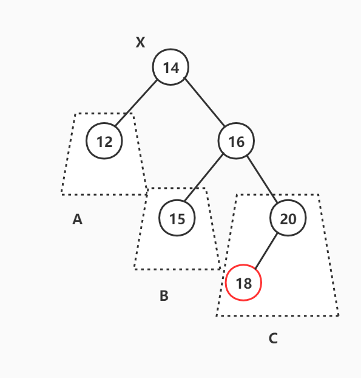
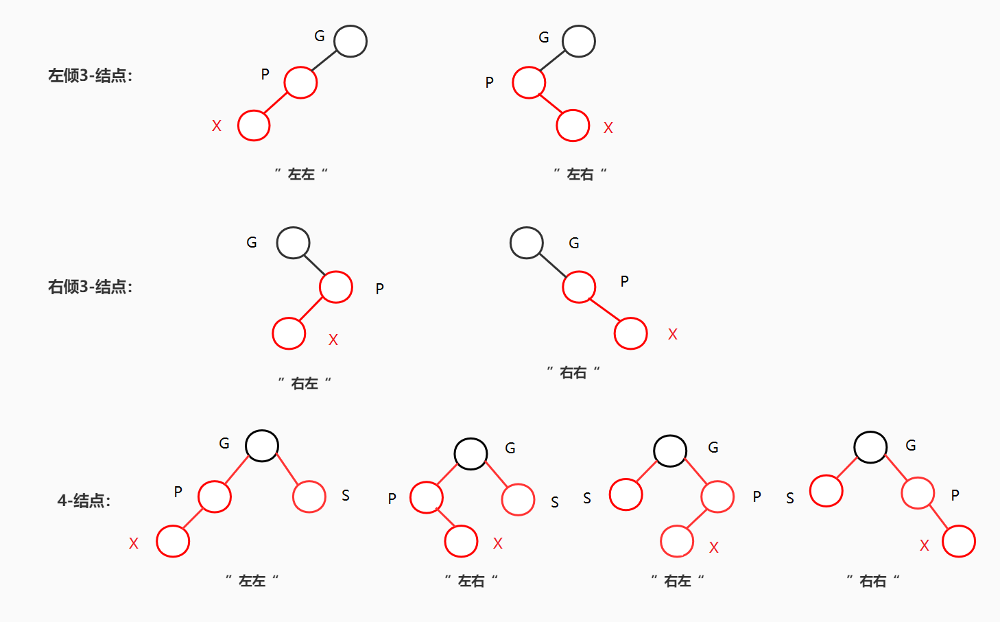

## 5. 关联容器

相对于顺序容器而言，关联容器设计的侧重点在于快速的查找。而关联容器本身又分成主要两种类型：①一种是以set、map、multiset和multimap为代表的有序关联容器，其键值有序且查找的时间复杂度可达$O(logN)$；而②另一种则是以unordered_set、unordered_map、unordered_multiset和unordered_multimap为代表的无需关联容器，它的键值并不能保持有序的状态，但是它可以将查找的时间复杂度降低到常数阶$O(1)$。

其中有序关联容器内部是借助红黑树来实现的，而无需关联容器内部则是使用哈希表来实现。


### 5.1 平衡二叉树

为了能够深入的理解有序关联容器内部所使用的红黑树，我先从平衡二叉树开始讲解然后过渡到红黑树，分析最底层的原理才能更好的理解各种有序关联容器的实现。


#### 5.1.1 AVL树

AVL树是一种高度平衡的二叉搜索树，它要求二叉树中的任何一个结点的左右子树高度差不超过1，从而保证树的插入、删除、搜索操作的时间复杂度能够维持在对数阶$log(N)$的水平。文件[AVLTree.h](AVLTree.h)展示了一个简陋的AVL树实现。


##### 5.1.1.1 AVL树的插入操作

为了维持AVL树的高度平衡性，AVL树必须保证在任何一种破坏二叉树平衡性的时候对相关的结点进行树形调整。**AVL树平衡性当且仅在向一个左右子树高度差为1的节点中高度较大的子树上插入一个新结点时发生**（必要不充分），具体有如下4种情况（我们假设这个左右子树高度差为1的结点为X），同时我还在表格中列出了对应的树形调整方法：

|          破坏AVL平衡性的插入情况          |                             图示                             |                 树形调整方法                 |
| :---------------------------------------: | :----------------------------------------------------------: | :------------------------------------------: |
| 插入点位于X的左子节点的左子树上（“左左”） |  |                对X进行右单旋                 |
| 插入点位于X的左子节点的右子树上（“左右”） |  | 先对X的左子节点进行左单旋，然后对X进行右单旋 |
| 插入点位于X的右子节点的左子树上（“右左”） |  |  对X的右子节点进行右单旋，然后对X进行左单旋  |
| 插入点位于X的右子节点的右子树上（“右右”） |  |                对X进行左单旋                 |

注意上面的图示仅仅是展示了破坏平衡性情况时的大致样貌，它的样子是多变的。但是只要我们抓住对应的定义，那么就可以很容易地解决相应的问题。例如下面展示了所有的“左左情况”，它们都符合“插入点位于X的左子节点的左子树上”这一定义：


对于“左左”和“右右”两种情况，我们称之为外侧插入，此时简单的单旋操作就可以完成AVL树的再平衡。而对于“左右”和“右左”两种情况，我们称之为内侧插入，此时单旋操作不能解决这个问题。我们必须将标号为B的子树的根节点上升变成这个局部调整树的根节点，所以我们需要执行使用双旋操作（因为一个单旋仅仅能让指定的子节点上升一个高度，而标号为B的子树距离这个局部树的根节点的距离为2）。

根据上面的描述，我们可以发现其实AVL树的插入调整处理其实很简单，仅仅需要面对4种主要情形即可（相对于后面的红黑树显得简单了很多😋）。我们可以用下面的伪代码来展示插入的大致过程：

```python
def insert(node, val):
    以普通二叉树递归的方式沿路径向下插入新结点
    
    if 当前节点的左右子树高度差 >= 2:
        if 当前节点左偏
            if 左子节点也左偏:
                则此时需要处理的是“左左”情况
            else 左子节点右偏:
                则此时处理的是“左右情况”
        else 当前节点右偏
        	if 右子节点左偏:
                则此时需要处理的是“右左”情况
            else 右子节点右偏:
                则此时需要处理的是“右右”情况
    return 当前节点的指针
```

文件[AVLTree.h](AVLTree.h)的第188行展示了`insert()`成员函数的实现，在这份实现中使用了一个名为flag的平衡因子来记录AVL树上节点的左/右偏情况（所谓的左/右偏是用来描述一个节点的左右子树谁比较深），从而判断出“左左”、“右右”、“左右”和“右左”4种情况。


##### 5.1.1.2 AVL树的删除操作


#### 5.1.2 红黑树

AVL树虽然是一棵高度平衡的二叉搜索树，其查找操作的事件复杂度可以达到对数阶$log(N)$，但我们不得不为大多的插入操作以及删除操作付出大量的树形调整动作。例如向AVL树中插入一串本身就有序的数据，会导致几乎每一次插入后都需要对相关节点执行至少一次的旋转操作。因此我们需要另一种二叉树能够替代AVL，它能够保证$log(N)$的时间复杂度，还提供相对较小树形维护成本，而红黑树正是如此。

**红黑树的本质就是通过二叉树的方式来模拟构建2-3-4树**。在《*算法4*》中我们其实已经了解一种比较特殊的红黑树形式——左倾红黑树，它为了实现的方便，模拟构建的是2-3树而不是2-3-4树，但从本质上讲两者都是相同的。我们在这里并不会讲述过多的红黑树细节，仅仅关注于它的插入和删除操作。


##### 5.1.2.1 红黑树的插入操作

假设一个二叉树符合红黑树的规定，那么以如下几种情况插入会破坏红黑树的平衡性（如下图所示）：

1. 向一个左倾3-结点“左左”、“左右”插入
2. 向一个右倾3-结点“右左”、“右右”插入
3. 向一个4-结点以任何方式插入




从上面的描述我们知道，向一个4-结点插入新的红结点会造成复杂的插入处理动作，因此SGI STL采用如下的方式来避免红黑树出现向一个4-结点插入的情况：在插入操作向下递归游走的时候及时将路径上的4-结点分解成3-结点或者2-结点，并将提取出的红结点插入到上一层，从而尽可能在新红节点插入的位置发生向4-结点插入的情况！


为了强调SGI STL关于对红黑树的实现，我并不将RB-tree的代码解读放在红黑树原理小节中，而是单独放在下一节中。


##### 5.1.2.2 红黑树的删除操作

