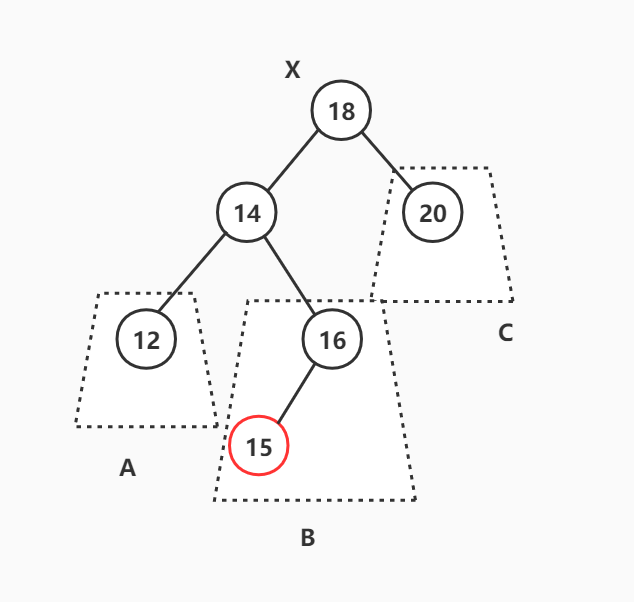
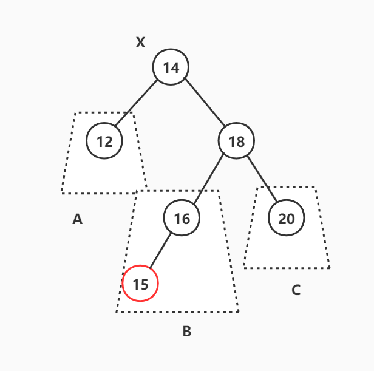

## 5. 关联容器

相对于顺序容器而言，关联容器设计的侧重点在于快速的查找。而关联容器本身又分成主要两种类型：

- 以set、map、multiset和multimap为代表的有序关联容器，内部使用红黑树实现，其键值有序且查找的时间复杂度可达$O(logN)$；
- 以unordered_set、unordered_map、unordered_multiset和unordered_multimap为代表的无序关联容器，内部使用哈希表实现，它的键值并不能保持有序状态，但是它可以将查找的时间复杂度降低到常数阶$O(1)$。


### 5.1 平衡二叉树

为了能够深入的理解有序关联容器内部所使用的红黑树，我们先从平衡二叉树开始讲解然后过渡到红黑树。


#### 5.1.1 AVL树

AVL树是一种高度平衡的二叉搜索树，它要求二叉树中的任何一个结点的左右子树高度差不超过1，从而保证树的插入、删除、搜索操作的时间复杂度能够维持在对数阶$log(N)$的水平。文件[AVLTree.h](AVLTree.h)展示了一个简陋的AVL树实现。


##### 5.1.1.1 AVL树的插入操作

为了维持AVL树的高度平衡性，AVL树必须保证在任何一种破坏二叉树平衡性发生的时候对相关的结点进行树形调整。**AVL树平衡性被破坏当且仅在向一个左右子树高度差为1的节点中高度较大的子树上插入一个新结点时发生**（必要不充分），具体有如下4种情况（我们假设这个左右子树高度差为1的结点为X），同时我还在表格中列出了对应的树形调整方法：

|          破坏AVL平衡性的插入情况          |                             图示                             |               树形调整方法               |
| :---------------------------------------: | :----------------------------------------------------------: | :--------------------------------------: |
| 插入点位于X的左子节点的左子树上（“左左”） |  |               对X进行右旋                |
| 插入点位于X的左子节点的右子树上（“左右”） |  | 先对X的左子节点进行左旋，然后对X进行右旋 |
| 插入点位于X的右子节点的左子树上（“右左”） |  |  对X的右子节点进行右旋，然后对X进行左旋  |
| 插入点位于X的右子节点的右子树上（“右右”） |  |               对X进行左旋                |

注意上面的图示仅仅是展示了破坏平衡性情况时的大致样貌，具体细分可能有多种。例如下面展示了所有的“左左情况”，它们都符合“插入点位于X的左子节点的左子树上”这一定义：


对于“左左”和“右右”两种情况，我们称之为外侧插入，此时简单的单旋操作就可以完成AVL树的再平衡。而对于“左右”和“右左”两种情况，我们称之为内侧插入，此时单旋操作不能解决这个问题。我们必须将标号为B的子树的根节点上升变成这个局部调整树的根节点，所以我们需要执行使用双旋操作（因为一个单旋仅仅能让指定的子节点上升一个高度，而标号为B的子树距离这个局部树的根节点的距离为2）。

根据上面的描述，我们可以发现AVL树的插入调整处理其实很简单，仅仅需要处理上面4种情况即可（相对后面的红黑树简单了很多😋），因此我们可以用下面的伪代码来展示插入的大致过程：

```python
def insert(node, val):
    以普通二叉树递归的方式沿路径向下插入新结点，
    	同时自动修改节点的平衡因子
    
    if 当前节点的左右子树高度差 >= 2:
        if 当前节点左偏
            if 左子节点也左偏:
                则此时需要处理的是“左左”情况
            else 左子节点右偏:
                则此时处理的是“左右情况”
        else 当前节点右偏
        	if 右子节点左偏:
                则此时需要处理的是“右左”情况
            else 右子节点右偏:
                则此时需要处理的是“右右”情况
    return 当前节点的指针
```

文件[AVLTree.h](AVLTree.h)第188行正是使用了这种思路实现了`insert()`操作，其中使用了一个名为balance_factor的平衡因子来记录AVL树上节点的左/右偏情况，从而判断出“左左”、“右右”、“左右”和“右左”4种情况。


##### 5.1.1.2 AVL树的删除操作


#### 5.1.2 红黑树

AVL树虽然是一棵高度平衡的二叉搜索树，查找操作的时间复杂度可以达到对数阶$log(N)$，但它的每一个插入、删除操作付出一定数量的树形调整动作。例如向AVL树中插入一串本身就有序的数据，会导致几乎每一次插入后都需要对相关节点执行至少一次的旋转操作。因而我们需要另一种二叉树能够替代AVL，它既能保证$log(N)$的时间复杂度，还提供相对较小树形维护成本，而红黑树正是如此。

**红黑树的本质就是通过二叉树的方式来模拟构建2-3-4树**。在《*算法4*》中我们其实已经了解一种比较特殊的红黑树形式——左倾红黑树，它模拟构建的是2-3树而不是2-3-4树，因为左倾红黑树处理的问题情况相对较少，所以实现较为简单，但SGI STL中的红黑树并没有采用这种形式。我们在这里并不会讲述过多的红黑树细节，仅仅关注于它的插入和删除操作。


##### 5.1.2.1 红黑树的插入操作

**红黑树的平衡性被破坏，当且仅当我们向一个3-节点中的红节点或者4-节点上插入一个新的结点时发生**。具体有如下3种主要情况：

1. 向一个左倾3-结点“左左”、“左右”插入
2. 向一个右倾3-结点“右左”、“右右”插入
3. 向一个4-结点以任何方式插入


对于插入的处理，红黑树最大的不同之处在于必须处理各个节点的颜色变化，但对于“左左”、“右右”、“左右”和“右左”4种不同类型的情况，我们仍然可以使用相同与AVL树的单旋、双旋操作进行树形调整。下面的表格指出了对于上述各种情况的处理方法：

|    不平衡情况    |                           处理方法                           |
| :--------------: | :----------------------------------------------------------: |
| 左倾3-节点“左左” |                对G**右旋**，并交换P、G的颜色                 |
| 左倾3-节点“左右” |        对P先**左旋**，然后对G**右旋**，并交换G、X颜色        |
| 右倾3-节点“右左” |        对P先**右旋**，然后对G**左旋**，并交换G、X颜色        |
| 右倾3-节点“右右” |                对G**左旋**，并交换P、G的颜色                 |
|   4-节点“左左”   |       将X设为黑，然后对G**右旋**，再沿路径向上迭代处理       |
|   4-节点“左右”   | 将P设为黑，先对P**左旋**，然后对G**右旋**，再沿路径向上迭代处理 |
|   4-节点“右左”   | 将P设为黑，先对P**右旋**，然后对G**左旋**，再沿路径向上迭代处理 |
|   4-节点“右右”   |       将X设为黑，然后对G**左旋**，再沿路径向上迭代处理       |

事实上，对4-节点的处理并不需要如此复杂，我们可以通过更为简单的方法来解决：**将G节点设为红色，4-节点中的左右部分子节点（即P和S）设置为黑，然后沿路径向上迭代处理**。这样我们就根本不需要使用旋转，而仅使用颜色变化就可以完成。

其中4-节点处理过程中的沿路径向上处理指的是：由于这部分子树的根节点变成红，相当于向该子树的父节点插入新节点，因此需要将根节点G重新设置为X，然后再重新迭代处理（也就意味着这部分是在一个while中完成）。经过改进，我们对红黑树新的处理方法变成如下表格所示的，而SGI STL对红黑树的插入再平衡处理也正是采用了这种方法：

|    不平衡情况    |                处理方法                 |
| :--------------: | :-------------------------------------: |
| 左倾3-节点“左左” |        对G右旋，并交换P、G的颜色        |
| 左倾3-节点“左右” | 对P先左旋，然后对G右旋，并交换G、X颜色  |
| 右倾3-节点“右左” | 对P先右旋，然后对G左旋，并交换G、X颜色  |
| 右倾3-节点“右左” |        对G左旋，并交换P、G的颜色        |
|      4-节点      | 将G设为红，P、S设为黑，然后向上迭代处理 |


##### 5.1.2.2 红黑树的删除操作

红黑树的删除操作相比于它的插入操作更为复杂，其复杂程度主要体现在问题的类型非常众多，仅删除一个“无子”的黑节点所面临的再平衡情况就具有18种。对于红黑树节点删除，由3个步骤组成：①找到待删除节点，并取得其节点指针或者迭代器；②将节点从红黑树中脱离，并重新平衡去除该节点后的红黑树；③最后销毁这个指定的红黑树节点。上述过程中最大的难点在于将节点从红黑树中脱离和再平衡操作。

从删除节点的角度来看，红黑树的待删节点有“无子”、“独子”、“双子”3种情况：

1. 若期望删除的节点是一个无子且为红的节点，则说明该节点和其父节点以及兄弟节点构成了一个3-节点或者4-节点，故删除它并不需要再做什么再平衡处理。但若删除的无子节点是一个黑节点，那么我们必须进行非常复杂的再平衡处理。
2. 若期望删除的节点具有一个子节点，那么该节点必然是一个黑节点，子节点必为红节点，此时我们只需让子节点变黑，然后重新挂接到待删节点的父节点上即可。
3. 若期望删除的节点的左右子节点都存在，则我们需要从待删节点的右子树上取得最小节点来对待删节点进行替代（一种方式是将替代节点的值赋给待删节点，另一种方式是重新调整指针，而SGI STL选择后者，不过处理起来略复杂）。这样就可以将对待删节点造成的树形调整问题转变成对替代节点造成的树形问题，而由于替代节点是右子树中的最小节点，它必然是“无子”或“独子”的，此时又回到了前两种情况中。

下面的表格总结了上述的3种情况及其删除方式：

| 待删节点情况 |                           删除方式                           |
| :----------: | :----------------------------------------------------------: |
|     无子     | 若待删节点红（3或4-节点），则无需处理；若黑（2-节点），则需要特殊的树形调整处理 |
|     独子     | 待删节点只能为黑，且子节点必为红，此时只需将子节点变黑然后重新挂接 |
|     双子     | 在待删节点的右子树找一个替代节点，间接转换为对替代节点的树形调整问题 |

因为“双子”问题可以转化成“无子”或“独子”问题，而后两者除”无子且黑“的情况非常复杂，其他的情况都非常容易处理，所以对“待删节点无子且黑”的情况着重讨论。通过穷举的方式我们可以找出如下的18种“无子且黑”的情况（假设它们都有父节点，若无父节点，那么该节点必然是红黑树的根节点，此时直接删除它即可）。


虽然这些18种情况乍一看没有太多的关联，也不知道从哪里开始着手比较好，但实际上它们之间关系非常紧密，且可以又可以分成如下3种（仅讨论待删节点为其父节点的左子节点的情况）：

1. **待删节点的兄弟节点是无子黑节点**。也即上图中的1、2，它们仅通过变色处理然后可能进入下一轮迭代继续处理即可；
2. **待删节点的兄弟节点是红节点**（必有子）。也即上图中的3，它可以通过旋转+变色处理转换成情况②；
3. **待删节点的兄弟节点是有子黑节点**。也即上图中的4、5、6、7、8、9，它可以通过双旋+变色或者单旋+变色的处理完成树形调整。

下面的伪代码展示了对这9种情况的处理（右边的9种情况的处理方式与之类似）：

```python
def 处理待删节点为其父节点的左子节点:
    while 待删节点x != root && x == 黑节点:
        if x的兄弟节点为红（即情况3）:
            对x的父节点做左旋+变色处理
        if x的兄弟节点的左右子节点为空（即情况1、2）:
            做相应变色处理
        if x的兄弟节点的左右子节点有红节点（情况4、5、6、7、8、9）:
            if x的兄弟节点的右子节点为黑（情况4、5）:
				对x的兄弟节点做右旋+变色处理
            对x的父节点做左旋+变色处理
            break
```

而SGI STL的红黑树删除的树形再调整操作也正是使用上述的伪代码展示的思想来实现的。

