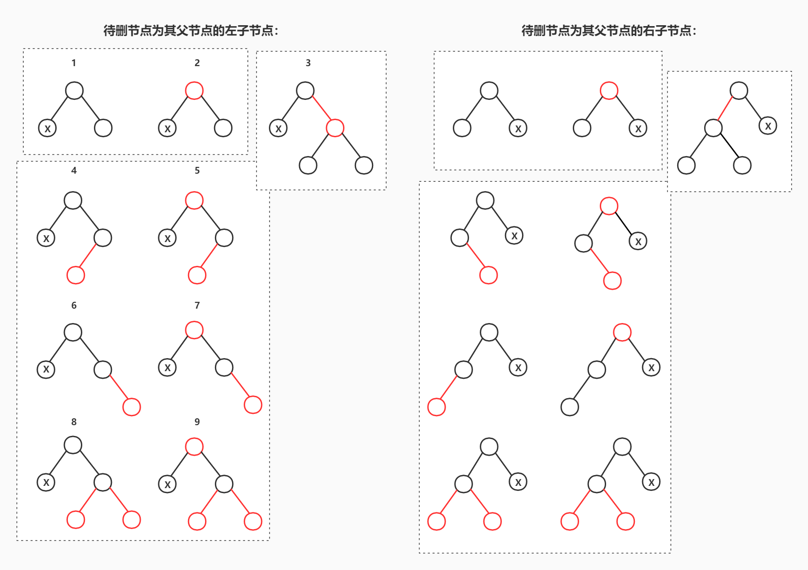
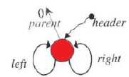

## 5. 关联容器

相对于顺序容器而言，关联容器设计的侧重点在于快速的查找。而关联容器本身又分成主要两种类型：

- 以set、map、multiset和multimap为代表的有序关联容器，内部使用红黑树实现，其键值有序且查找的时间复杂度可达$O(logN)$；
- 以unordered_set、unordered_map、unordered_multiset和unordered_multimap为代表的无序关联容器，内部使用哈希表实现，它的键值并不能保持有序状态，但是它可以将查找的时间复杂度降低到常数阶$O(1)$。


### 5.1 平衡二叉树

为了能够深入的理解有序关联容器内部所使用的红黑树，我们先从平衡二叉树开始讲解然后过渡到红黑树。

#### 5.1.1 AVL树

AVL树是一种高度平衡的二叉搜索树，它要求二叉树中的任何一个结点的左右子树高度差不超过1，从而保证树的插入、删除、搜索操作的时间复杂度能够维持在对数阶$log(N)$的水平。文件[AVLTree.h](AVLTree.h)展示了一个简陋的AVL树实现。


##### 5.1.1.1 AVL树的插入操作

为了维持AVL树的高度平衡性，AVL树必须保证在任何一种破坏二叉树平衡性发生的时候对相关的结点进行树形调整。**AVL树平衡性被破坏当且仅在向一个左右子树高度差为1的节点中高度较大的子树上插入一个新结点时发生**（必要不充分），具体有如下4种情况（我们假设这个左右子树高度差为1的结点为X），同时我还在表格中列出了对应的树形调整方法：

|          破坏AVL平衡性的插入情况          |                             图示                             |               树形调整方法               |
| :---------------------------------------: | :----------------------------------------------------------: | :--------------------------------------: |
| 插入点位于X的左子节点的左子树上（“左左”） |  |               对X进行右旋                |
| 插入点位于X的左子节点的右子树上（“左右”） |  | 先对X的左子节点进行左旋，然后对X进行右旋 |
| 插入点位于X的右子节点的左子树上（“右左”） |  |  对X的右子节点进行右旋，然后对X进行左旋  |
| 插入点位于X的右子节点的右子树上（“右右”） |  |               对X进行左旋                |

注意上面的图示仅仅是展示了破坏平衡性情况时的大致样貌，具体细分可能有多种。例如下面展示了所有的“左左情况”，它们都符合“插入点位于X的左子节点的左子树上”这一定义：


对于“左左”和“右右”两种情况，我们称之为外侧插入，此时简单的单旋操作就可以完成AVL树的再平衡。而对于“左右”和“右左”两种情况，我们称之为内侧插入，此时单旋操作不能解决这个问题。我们必须将标号为B的子树的根节点上升变成这个局部调整树的根节点，所以我们需要执行使用双旋操作（因为一个单旋仅仅能让指定的子节点上升一个高度，而标号为B的子树距离这个局部树的根节点的距离为2）。

根据上面的描述，我们可以发现AVL树的插入调整处理其实很简单，仅仅需要处理上面4种情况即可（相对后面的红黑树简单了很多😋），因此我们可以用下面的伪代码来展示插入的大致过程：

```python
def insert(node, val):
    以普通二叉树递归的方式沿路径向下插入新结点，
    	同时自动修改节点的平衡因子
    
    if 当前节点的左右子树高度差 >= 2:
        if 当前节点左偏
            if 左子节点也左偏:
                则此时需要处理的是“左左”情况
            else 左子节点右偏:
                则此时处理的是“左右情况”
        else 当前节点右偏
        	if 右子节点左偏:
                则此时需要处理的是“右左”情况
            else 右子节点右偏:
                则此时需要处理的是“右右”情况
    return 当前节点的指针
```

文件[AVLTree.h](AVLTree.h)第188行正是使用了这种思路实现了`insert()`操作，其中使用了一个名为balance_factor的平衡因子来记录AVL树上节点的左/右偏情况，从而判断出“左左”、“右右”、“左右”和“右左”4种情况。


##### 5.1.1.2 AVL树的删除操作

AVL树的删除操作与普通二叉搜索树类似，只不过会在删除的过程中对沿路下来的每一个节点的平衡因子进行修改（平衡因子的方法不一定好用，因为如果删除的过程中就直接修改平衡因子，但直到树的叶节点都没有发现想要找的任何节点，那么之前的修改不就是错误的了吗？所以一种比较稳妥的方法就是回溯的时候重新计算平衡因子，或者是加一个判断语句，每一次递归返回之后检查下子树中是否真的删了指定的节点，若真的删除了那么就修改平衡因子，否则不修改），并在删除指定节点之后回溯到根节点，检查对于每一个节点检查它们的平衡因子，若得知发生了破坏平衡的状况，那么就执行相应的属性调整动作。


#### 5.1.2 红黑树

AVL树虽然是一棵高度平衡的二叉搜索树，查找操作的时间复杂度可以达到对数阶$log(N)$，但它的每一个插入、删除操作付出一定数量的树形调整动作。例如向AVL树中插入一串本身就有序的数据，会导致几乎每一次插入后都需要对相关节点执行一次的旋转操作。因而我们需要另一种二叉树能够替代AVL，它既能保证$log(N)$的时间复杂度，还提供相对较小树形维护成本，而红黑树正是如此。

**红黑树的本质就是通过二叉树的方式来模拟构建2-3-4树**。在《*算法4*》中我们其实已经了解一种比较特殊的红黑树形式——左倾红黑树，它模拟构建的是2-3树而不是2-3-4树，因为左倾红黑树处理的问题情况相对较少，所以实现较为简单，但SGI STL中的红黑树并没有采用这种形式。我们在这里并不会讲述过多的红黑树细节，仅仅关注于它的插入和删除操作。

为了方便，这里还是罗列下红黑树的几个基本规则：

1. 每一个节点不是红色就是黑色的； 
2. 根节点为黑色的；
3. 若一个节点为红，则其子节点必须为黑；
4. 任意一个节点到null（树尾端）的任何路径中所含的黑节点数必须为黑；
5. 一个新插入的节点应被视为红节点。


##### 5.1.2.1 红黑树的插入操作

**红黑树的平衡性被破坏，当且仅当我们向一个3-节点中的红节点或者4-节点上插入一个新的结点时发生**。具体有如下3种主要情况：

1. 向一个左倾3-节点“左左”、“左右”插入
2. 向一个右倾3-节点“右左”、“右右”插入
3. 向一个4-节点以任何方式插入


对于插入的处理，红黑树最大的不同之处在于必须处理各个节点的颜色变化，但对于“左左”、“右右”、“左右”和“右左”4种不同类型的情况，我们仍然可以使用相同与AVL树的单旋、双旋操作进行树形调整。下面的表格指出了对于上述各种情况的处理方法：

|    不平衡情况    |                           处理方法                           |
| :--------------: | :----------------------------------------------------------: |
| 左倾3-节点“左左” |                对G**右旋**，并交换P、G的颜色                 |
| 左倾3-节点“左右” |        对P先**左旋**，然后对G**右旋**，并交换G、X颜色        |
| 右倾3-节点“右左” |        对P先**右旋**，然后对G**左旋**，并交换G、X颜色        |
| 右倾3-节点“右右” |                对G**左旋**，并交换P、G的颜色                 |
|   4-节点“左左”   |       将X设为黑，然后对G**右旋**，再沿路径向上迭代处理       |
|   4-节点“左右”   | 将P设为黑，先对P**左旋**，然后对G**右旋**，再沿路径向上迭代处理 |
|   4-节点“右左”   | 将P设为黑，先对P**右旋**，然后对G**左旋**，再沿路径向上迭代处理 |
|   4-节点“右右”   |       将X设为黑，然后对G**左旋**，再沿路径向上迭代处理       |

事实上，对4-节点的处理并不需要如此复杂，我们可以通过更为简单的方法来解决：**将G节点设为红色，4-节点中的左右部分子节点（即P和S）设置为黑，然后沿路径向上迭代处理**。这样我们就根本不需要使用旋转，而仅使用颜色变化就可以完成。

其中4-节点处理过程中的沿路径向上处理（回溯）指的是：由于这部分子树的根节点变成红，相当于向该子树的父节点插入新节点，因此需要将根节点G重新设置为X，然后再重新迭代处理（也就意味着这部分是在一个while中完成）。经过改进，我们对红黑树新的处理方法变成如下表格所示的，而SGI STL对红黑树的插入再平衡处理也正是采用了这种方法：

|    不平衡情况    |                处理方法                 |
| :--------------: | :-------------------------------------: |
| 左倾3-节点“左左” |        对G右旋，并交换P、G的颜色        |
| 左倾3-节点“左右” | 对P先左旋，然后对G右旋，并交换G、X颜色  |
| 右倾3-节点“右左” | 对P先右旋，然后对G左旋，并交换G、X颜色  |
| 右倾3-节点“右左” |        对G左旋，并交换P、G的颜色        |
|      4-节点      | 将G设为红，P、S设为黑，然后向上迭代处理 |


##### 5.1.2.2 红黑树的删除操作

红黑树的删除操作相比于它的插入操作更为复杂，其复杂程度主要体现在问题的类型非常众多，仅删除一个“无子”的黑节点（2-节点）所面临的再平衡情况就具有18种。对于红黑树节点删除，由3个步骤组成：①找到待删除节点，并取得其节点指针或者迭代器；②将节点从红黑树中脱离，并重新平衡去除该节点后的红黑树；③最后销毁这个指定的红黑树节点。上述过程中最大的难点在于将节点从红黑树中脱离和再平衡操作。

从删除节点的角度来看，红黑树的待删节点有“无子”、“独子”、“双子”3种情况：

1. 若期望删除的节点是一个无子且为红的节点，则说明该节点和其父节点以及兄弟节点构成了一个3-节点或者4-节点，故删除它并不需要再做什么再平衡处理。但若删除的无子节点是一个黑节点，那么我们必须进行非常复杂的再平衡处理。
2. 若期望删除的节点具有一个子节点，那么该节点必然是一个黑节点，子节点必为红节点，否则之前的红黑树就不维持平衡的状态。此时我们只需让子节点变黑，然后重新挂接到待删节点的父节点上即可。
3. 若期望删除的节点的左右子节点都存在，则我们需要从待删节点的右子树上取得最小节点来对待删节点进行替代（一种方式是将替代节点的值赋给待删节点，另一种方式是重新调整指针，而SGI STL选择后者，不过处理起来略复杂）。这样就可以将对待删节点造成的树形调整问题转变成对替代节点造成的树形问题，而由于替代节点是右子树中的最小节点，它必然是“无子”或“独子”的，此时又回到了前两种情况中。

下面的表格总结了上述的3种情况及其删除方式：

| 待删节点情况 |                           删除方式                           |
| :----------: | :----------------------------------------------------------: |
|     无子     | 若待删节点红（3或4-节点），则无需处理；<br />若黑（2-节点），则需要特殊的树形调整处理 |
|     独子     | 待删节点只能为黑，且子节点必为红，此时只需将子节点变黑然后重新挂接 |
|     双子     | 在待删节点的右子树找一个替代节点，间接转换为对替代节点的树形调整问题 |

因为“双子”问题可以转化成“无子”或“独子”问题，而后两者除”无子且黑“的情况非常复杂，其他的情况都非常容易处理，所以对“待删节点无子且黑”的情况着重讨论。通过穷举的方式我们可以找出如下的18种“无子且黑”的情况（假设它们都有父节点，若无父节点，那么该节点必然是红黑树的根节点，此时直接删除它即可）。



虽然这些18种情况乍一看没有太多的关联，也不知道从哪里开始着手比较好，但实际上它们之间关系非常紧密，且可以又可以分成如下3种（仅讨论待删节点为其父节点的左子节点的情况）：

1. **待删节点的兄弟节点是无子黑节点（2-节点）**。也即上图中的1、2，它们仅通过变色处理然后可能进入下一轮迭代继续处理即可；
2. **待删节点的兄弟节点是红节点**（必有子）。也即上图中的3，它可以通过旋转+变色处理转换成情况②；
3. **待删节点的兄弟节点是有子黑节点（3-节点或者4-节点）**。也即上图中的4、5、6、7、8、9，它可以通过双旋+变色或者单旋+变色的处理完成树形调整。

这里的处理无子且黑节点的想法其实很简单，就是：**尽可能让待删节点的兄弟节点（3-节点或4-节点）或者父结点（3-节点或者4-节点）捐一个节点出来替代待删节点的位置；如果真的捐不出来，例如父节点和兄弟节点都是2-节点，那么就直接让兄弟节点变色成为3-节点（类似于节点合并，或者说是让2-3-4树的高度-1）。**

下面的伪代码展示了对这9种情况的处理（右边的9种情况的处理方式与之类似）：

```python
def 处理待删节点为其父节点的左子节点:
    while 待删节点x != root && x == 黑节点:
        if x的兄弟节点为红（即情况3）:
            对x的父节点做左旋+变色处理
        if x的兄弟节点的左右子节点为空（即情况1、2）:
            做相应变色处理
        if x的兄弟节点的左右子节点有红节点（情况4、5、6、7、8、9）:
            if x的兄弟节点的右子节点为黑（情况4、5）:
				对x的兄弟节点做右旋+变色处理
            对x的父节点做左旋+变色处理
            break
```

而SGI STL的红黑树删除的树形再调整操作也正是使用上述的伪代码展示的思想来实现的。我们可以看到元素删除的最主要的思想就是：**尽可能从当前待删节点的兄弟节点（如果是3-节点或者4-节点的话）中借一个节点从而来弥补当前节点被删除而造成的平衡破坏**；如果这个要求满足不了，那么才会考虑其他情况，例如和兄弟节点、父节点共同组成一个新节点（可以认为是一种退化的过程）。


### 5.2 _Rb_tree

SGI STL红黑树容器\_Rb_tree并非是C++标准库中的成员，我们并不能直接使用到它，但它确实是STL4种有序关联容器的底层基础容器。它的实现位于源文件[stl_tree.h](stl_tree.h)中，其中比较需要我们关注的部分如下所示：

1. **_Rb_tree的数据结构、节点和迭代器实现**
2. _Rb_tree的构造和析构过程
3. **元素插入和插入之后所需的红黑树再平衡操作**
4. **元素删除和删除之后所需的红黑树再平衡操作**
5. 其他操作，看看就行


#### 5.2.1 ==\_Rb\_tree节点和迭代器==

##### 5.2.1.1 _Rb_tree节点

和很多SGI STL容器实现的风格一样，红黑树容器_Rb_tree的节点、迭代器都是采用了两级继承的结构。其中节点基类为\_Rb_tree_node_base，派生类为\_Rb_tree_node，整体上看其实它的内容非常简单，不过它有一个特别的指针成员是用来指向其父节点的。源代码就位于源文件的起首处：

```c++
typedef bool _Rb_tree_Color_type;
const _Rb_tree_Color_type _S_rb_tree_red = false;
const _Rb_tree_Color_type _S_rb_tree_black = true;

struct _Rb_tree_node_base
{
  typedef _Rb_tree_Color_type _Color_type;
  typedef _Rb_tree_node_base* _Base_ptr;

  _Color_type _M_color; 
  _Base_ptr _M_parent;// 用来指向父节点
  _Base_ptr _M_left;
  _Base_ptr _M_right;

  static _Base_ptr _S_minimum(_Base_ptr __x)
  {
    while (__x->_M_left != 0) __x = __x->_M_left;
    return __x;
  }

  static _Base_ptr _S_maximum(_Base_ptr __x)
  {
    while (__x->_M_right != 0) __x = __x->_M_right;
    return __x;
  }
};

template <class _Value>
struct _Rb_tree_node : public _Rb_tree_node_base
{
  typedef _Rb_tree_node<_Value>* _Link_type;
  _Value _M_value_field;
};
```


##### 5.2.1.2 _Rb_tree迭代器

红黑树迭代器的基类为\_Rb\_tree\_base\_iterator，其派生类为_Rb_tree_iterator（红黑树真正使用的）。红黑树迭代器最大的责任是实现在红黑树这种特殊的非顺序容器上向前或向后步进的操作，以符合红黑树迭代器为双向迭代器forward_iterator的要求。这两个步进操作的实际工作基本上都是在迭代器基类中完成，分别由`_M_increment()`和`_M_decrement()`成员函数实现。

当一个红黑树迭代器需要向前步进时，①它会先查看当前节点的右子树是否存在，若存在，它会步入当前节点的右子树中，找到右子树中的最小节点，然后使迭代器指向它；②若右子节点不存在，那么它会以while循环的姿态去判断当前指向的节点是否是父节点的右子节点，若是则将迭代器自己暂时指向父节点，然后重新不断迭代向上，直到检测到当前节点不再是父节点的右子节点为止。当从while循环退出后再将迭代器指向这个节点的父节点即可完成向上方式的步进。

> 《剑指offer》面试题8与这一知识点相同。

而当一个红黑树迭代器需要向后步进的时候会有一些不同之处，①它首先会判断当前节点是否是\_Rb_tree的header节点（我们会在下面的红黑树数据结构中了解到SGI STL红黑树的根节点其实有一个特殊的父节点，它同时也是红节点，充当哨兵的作用）。②若是，则直接将迭代器指向红黑树中的最大节点；否则会按照向前步进类似的逻辑实现对应操作。这些部分的实现大致位于源代码的第102行：

```c++
struct _Rb_tree_base_iterator
{
  typedef _Rb_tree_node_base::_Base_ptr _Base_ptr;
  typedef bidirectional_iterator_tag iterator_category;
  typedef ptrdiff_t difference_type;
  _Base_ptr _M_node;

  void _M_increment()
  {
    // 若存在右子节点，则指向右子树中的最小节点
    if (_M_node->_M_right != 0) {
      _M_node = _M_node->_M_right;
      while (_M_node->_M_left != 0)
        _M_node = _M_node->_M_left;
    }
    // 若不存在右子节点，则沿路向上
    else {
      _Base_ptr __y = _M_node->_M_parent;
      while (_M_node == __y->_M_right) {
        _M_node = __y;
        __y = __y->_M_parent;
      }
      if (_M_node->_M_right != __y)
        _M_node = __y;
    }
  }

  void _M_decrement()
  {
    // 判断当前迭代器指向的是否是header节点，若是则直接步进到红黑树的最大节点位置
    if (_M_node->_M_color == _S_rb_tree_red &&
        _M_node->_M_parent->_M_parent == _M_node)
      _M_node = _M_node->_M_right;
    // 若存在左子节点，则指向左子树的最大节点
    else if (_M_node->_M_left != 0) {
      _Base_ptr __y = _M_node->_M_left;
      while (__y->_M_right != 0)
        __y = __y->_M_right;
      _M_node = __y;
    }
    // 若不存在左子节点，则沿路径向上
    else {
      _Base_ptr __y = _M_node->_M_parent;
      while (_M_node == __y->_M_left) {
        _M_node = __y;
        __y = __y->_M_parent;
      }
      _M_node = __y;
    }
  }
};

template <class _Value, class _Ref, class _Ptr>
struct _Rb_tree_iterator : public _Rb_tree_base_iterator
{
  /* ... */
  _Self& operator++() { _M_increment(); return *this; }
  _Self operator++(int) {
    _Self __tmp = *this;
    _M_increment();
    return __tmp;
  }
    
  _Self& operator--() { _M_decrement(); return *this; }
  _Self operator--(int) {
    _Self __tmp = *this;
    _M_decrement();
    return __tmp;
  }
};
```

按照`increment()`和`decrement()`这两个函数的规则，我们可以发现一个有趣的点：①当红黑树迭代器从最小节点处开始不断地执行向前步进操作（不施以`!=_Rb_tree.end()`停止条件）时，一旦它遍历过header节点（也即尾后/哨兵节点）之后，它会跳到红黑树最大节点的左子树中的最小节点处，重新向前步进，形成一个固定的局部循环（如下面绿色箭头所示）。②而当红黑树迭代器从树中任一点开始不断向后步进（不加以停止）时，它却会从尾到前又从前跳到尾不断循环（如下面红黑箭头所示）。虽然这两个点在实际中并不会用到，但它们对于我们了解红黑树迭代器的工作原理有所帮助。


下面的示例程序正反映了上述两点：

```c++
#include <iostream>
#include <functional>
#include <bits/stl_tree.h>
using namespace std;

int main() {
	_Rb_tree<int, int, _Identity<int>, less<>> itree;
	itree._M_insert_unique(23);
	itree._M_insert_unique(32);
	itree._M_insert_unique(12);
	itree._M_insert_unique(56);

	auto iter = itree.begin();
	for (int i = 0; i < 10; i++) {
		if (iter == itree.end())
			cout << "endptr" << ' ';
		else cout << *iter << ' ';
		++iter;
	}
	cout << endl;

	iter = itree.begin();
	for (int i = 0; i < 10; i++) {
		if (iter == itree.end())
			cout << "endptr" << ' ';
		else cout << *iter << ' ';
		--iter;
	}
	return 0;
}

/*结果：
12 23 32 56 endptr 56 endptr 56 endptr 56
12 endptr 56 32 23 12 endptr 56 32 23
*/
```


#### 5.2.2 _Rb_tree的数据结构

实际上，若是从源文件的角度讲，真正的红黑树类应该叫做rb_tree，但它实际上就是对_Rb_tree的简单继承，而\_Rb_tree实际上又是对\_Rb_tree_base的继承，它是我们学习的重点。下面的类定义代码大约在源文件的第529行：

```c++
template <class _Tp, class _Alloc>
struct _Rb_tree_base
{
  typedef _Alloc allocator_type;
  allocator_type get_allocator() const { return allocator_type(); }

  _Rb_tree_base(const allocator_type&) 
    : _M_header(0) { _M_header = _M_get_node(); }
  ~_Rb_tree_base() { _M_put_node(_M_header); }

protected:
  _Rb_tree_node<_Tp>* _M_header;// 指向哨兵节点

  typedef simple_alloc<_Rb_tree_node<_Tp>, _Alloc> _Alloc_type;

  _Rb_tree_node<_Tp>* _M_get_node()
    { return _Alloc_type::allocate(1); }
  void _M_put_node(_Rb_tree_node<_Tp>* __p)
    { _Alloc_type::deallocate(__p, 1); }
};

/* _KeyofValue这一函数对象的目的是用来方便从值域_Value中提取出键_Key
	，毕竟在节点中键和值是一同存储的 */
template <class _Key, class _Value, class _KeyOfValue, class _Compare,
          class _Alloc = __STL_DEFAULT_ALLOCATOR(_Value) >
class _Rb_tree : protected _Rb_tree_base<_Value, _Alloc> {
  typedef _Rb_tree_base<_Value, _Alloc> _Base;
  /* ... */
protected:
  size_type _M_node_count; // keeps track of size of tree
  _Compare _M_key_compare;
  /* ... */
};
```

SGI STL实现的红黑树和单链表、双链表一样，会设置一个哨兵结点，在这里指的就是header节点(指针的正式名称为\_M\_header)，可以方便红黑树根节点的创建和删除，以及红黑树边界判断。其中header节点的父节点指针\_M\_parent指向红黑树的根节点root，header节点的左子节点指针\_M\_left指向红黑树中的最小节点，header节点的右子节点\_M\_right指向红黑树中的最大节点。下图展示了当红黑树中有一个节点的情况：


除了记录header节点外，派生类中还有一个用来记录红黑树节点数的数据成员和一个比较器。


#### 5.2.3 _Rb_tree的构造/析构过程

下面的代码展示了红黑树\_Rb_tree的构造和析构过程：

```c++
template <class _Tp, class _Alloc>
struct _Rb_tree_base
{
  _Rb_tree_base(const allocator_type&) 
    : _M_header(0) { _M_header = _M_get_node(); }
  ~_Rb_tree_base() { _M_put_node(_M_header); }

protected:
  _Rb_tree_node<_Tp>* _M_header;

  typedef simple_alloc<_Rb_tree_node<_Tp>, _Alloc> _Alloc_type;

  _Rb_tree_node<_Tp>* _M_get_node()
    { return _Alloc_type::allocate(1); }
  void _M_put_node(_Rb_tree_node<_Tp>* __p)
    { _Alloc_type::deallocate(__p, 1); }
};

template <class _Key, class _Value, class _KeyOfValue, class _Compare,
          class _Alloc = __STL_DEFAULT_ALLOCATOR(_Value) >
class _Rb_tree : protected _Rb_tree_base<_Value, _Alloc> {
  typedef _Rb_tree_base<_Value, _Alloc> _Base;
  /* ... */
protected:
  size_type _M_node_count; // keeps track of size of tree
  _Compare _M_key_compare;
  /* ... */
    
public:
                                // allocation/deallocation
  _Rb_tree()
    : _Base(allocator_type()), _M_node_count(0), _M_key_compare()
    { _M_empty_initialize(); }

  _Rb_tree(const _Compare& __comp)
    : _Base(allocator_type()), _M_node_count(0), _M_key_compare(__comp) 
    { _M_empty_initialize(); }

  _Rb_tree(const _Compare& __comp, const allocator_type& __a)
    : _Base(__a), _M_node_count(0), _M_key_compare(__comp) 
    { _M_empty_initialize(); }

  // 拷贝构造函数
  _Rb_tree(const _Rb_tree<_Key,_Value,_KeyOfValue,_Compare,_Alloc>& __x) 
    : _Base(__x.get_allocator()),
      _M_node_count(0), _M_key_compare(__x._M_key_compare)
  { 
    if (__x._M_root() == 0)
      _M_empty_initialize();
    else {
      _S_color(_M_header) = _S_rb_tree_red;
      _M_root() = _M_copy(__x._M_root(), _M_header);
      _M_leftmost() = _S_minimum(_M_root());
      _M_rightmost() = _S_maximum(_M_root());
    }
    _M_node_count = __x._M_node_count;
  }
  // 析构函数
  ~_Rb_tree() { clear(); }

private:
  void _M_empty_initialize() {
    _S_color(_M_header) = _S_rb_tree_red; // used to distinguish header from 
                                          // __root, in iterator.operator++
    _M_root() = 0;
    _M_leftmost() = _M_header;
    _M_rightmost() = _M_header;
  }
  /* ... */
};
```

对于**默认构造函数**它首先通过基类的构造函数创建出一个header节点，然后在派生类的构造函数调用名为`_M_empty_initialize()`函数对header节点进行初始化。初始化的后header节点的左子节点、右子节点指针指向自己，而父节点指针为null，同时header的颜色被设为红色，方便后续作为黑色的root节点安全的挂接。



而对于红黑树的**拷贝构造函数**，\_Rb_tree会调用一个名为`_M_copy()`的函数来复制传入红黑树中的所有节点，然后再复制其他的数量数据成员、比较器。这个函数的实现也比较有意思，它会沿着待复制红黑树一直向左创建节点，对于每一个向左路径上的节点只要右子树存在，就会以递归的方式调用`_M_copy()`来拷贝右子树，如下图所示：


这段代码大致位于源文件的第1111行：

```c++
template <class _Key, class _Val, class _KoV, class _Compare, class _Alloc>
typename _Rb_tree<_Key, _Val, _KoV, _Compare, _Alloc>::_Link_type 
_Rb_tree<_Key,_Val,_KoV,_Compare,_Alloc>
  ::_M_copy(_Link_type __x, _Link_type __p)
{
                        // structural copy.  __x and __p must be non-null.
  _Link_type __top = _M_clone_node(__x);
  __top->_M_parent = __p;
 
  __STL_TRY {
    // 递归构建右子树
    if (__x->_M_right)
      __top->_M_right = _M_copy(_S_right(__x), __top);
    __p = __top;
    __x = _S_left(__x);

    // 若左子树存在
    while (__x != 0) {
      _Link_type __y = _M_clone_node(__x);
      __p->_M_left = __y;
      __y->_M_parent = __p;
      // 递归构建当前结点的右子树
      if (__x->_M_right)
        __y->_M_right = _M_copy(_S_right(__x), __y);
      // 然后继续向左走
      __p = __y;
      __x = _S_left(__x);
    }
  }
  __STL_UNWIND(_M_erase(__top));

  return __top;
}
```

最后则是红黑树的析构函数，它的实现非常简单，派生类析构时负责调用`clear()`操作对红黑树中除header的节点进行删除，然后基类析构函数调用`_M_put_node()`销毁header节点。


#### 5.2.4 ==\_Rb\_tree元素插入操作==

红黑树\_Rb\_tree的元素插入操作有两种。第一种插入操作即`insert_unique()`，它可以确保插入节点的键在整棵树中是独一无二的；而第二种插入操作为`insert_equal()`，它允许红黑树中存在多个相同键的节点。虽然两者功能不同，但它们内部都是借由一个名为`_M_insert()`的辅助函数来完成实际的插入操作，而后者又会在插入完成之后调用一个名为`_Rb_tree_rebalance()`的函数来完成红黑树的树形调整。

##### 5.2.4.1 左右旋操作

左右旋操作是红黑树插入/删除操作中最常用的树形调整工具：

```c++
inline void 
_Rb_tree_rotate_left(_Rb_tree_node_base* __x, _Rb_tree_node_base*& __root)
{
  _Rb_tree_node_base* __y = __x->_M_right;
  __x->_M_right = __y->_M_left;
  if (__y->_M_left !=0)
    __y->_M_left->_M_parent = __x;
  __y->_M_parent = __x->_M_parent;

  if (__x == __root)
    __root = __y;
  else if (__x == __x->_M_parent->_M_left)
    __x->_M_parent->_M_left = __y;
  else
    __x->_M_parent->_M_right = __y;
  __y->_M_left = __x;
  __x->_M_parent = __y;
}

inline void 
_Rb_tree_rotate_right(_Rb_tree_node_base* __x, _Rb_tree_node_base*& __root)
{
  _Rb_tree_node_base* __y = __x->_M_left;
  __x->_M_left = __y->_M_right;
  if (__y->_M_right != 0)
    __y->_M_right->_M_parent = __x;
  __y->_M_parent = __x->_M_parent;

  if (__x == __root)
    __root = __y;
  else if (__x == __x->_M_parent->_M_right)
    __x->_M_parent->_M_right = __y;
  else
    __x->_M_parent->_M_left = __y;
  __y->_M_right = __x;
  __x->_M_parent = __y;
}
```


##### 5.2.4.2 可重复插入操作

单元素版本的可重复插入操作就是我们常见的二叉树插入操作实现，它通过迭代从根节点向下定位到指定的插入点为止，然后调用`_M_insert()`完成实际的插入+树形调整任务。

由于`_M_key_compare()`比较函数运用的是严格弱序（即<）来比较向下路径中的节点键key和欲插入节点的键，所以当两者相等（==）时会被自动分配到相同键节点的右子树中，这样就可以保证每一次的插入都是在相同键值节点的尾后位置插入。例如将3插入到一个存储有1、2、3、3、4键值的红黑树时，`insert_equal()`可以保证新节点插入在原最后一个3的尾后、4的前面。

> 为了避免误解，有必要说下我这里的插入点和欲插入点的不同。插入点就是欲插入节点的父结点，如下：
>
> 

```c++
template <class _Key, class _Value, class _KeyOfValue, 
          class _Compare, class _Alloc>
typename _Rb_tree<_Key,_Value,_KeyOfValue,_Compare,_Alloc>::iterator
_Rb_tree<_Key,_Value,_KeyOfValue,_Compare,_Alloc>
  ::insert_equal(const _Value& __v)
{
  _Link_type __y = _M_header;
  _Link_type __x = _M_root();
  while (__x != 0) {
    __y = __x;
    // _KeyofValue()会提取出__v的键值，而_S_key()也会默认提取出__x的键值
    __x = _M_key_compare(_KeyOfValue()(__v), _S_key(__x)) ? 
            _S_left(__x) : _S_right(__x);
  }
  return _M_insert(__x, __y, __v);
}
```


##### 5.2.4.3 独一插入操作

由于可重复插入操作放松了对插入过程中向下路径中节点键值与欲插入节点键值相等性的检查，正是如此也才能够保证可以重复插入相同键值的节点。

而独一插入与之不同，它会在第一个`while`跳出后步入到插入点之后将插入点位置的指针转化为红黑树迭代器，然后向后步进（即--，因为插入点的位置必然在相同键值节点的尾后），利用”***a<b和b<a都不成立即是==***“的原理检查比较点前一个节点的键值key是否与欲插入节点的键值相同。只有在不相同，即不存在重复键值结点的情况下才能插入新的节点。例如我们试图插入3，而红黑树上存有1、2、3、4，由于插入点在于4的节点上而且4的前面与欲插入的3键值相同，所以插入失败。

```c++
template <class _Key, class _Value, class _KeyOfValue, 
          class _Compare, class _Alloc>
pair<typename _Rb_tree<_Key,_Value,_KeyOfValue,_Compare,_Alloc>::iterator, 
     bool>
_Rb_tree<_Key,_Value,_KeyOfValue,_Compare,_Alloc>
  ::insert_unique(const _Value& __v)
{
  _Link_type __y = _M_header;
  _Link_type __x = _M_root();
  bool __comp = true;
  while (__x != 0) {
    __y = __x;
    __comp = _M_key_compare(_KeyOfValue()(__v), _S_key(__x));
    __x = __comp ? _S_left(__x) : _S_right(__x);
  }
  /* 下面开始比较插入点的前一个结点是否与欲插入结点的键值key相同，
    只有在不相同的情况下才能保证插入的节点键值key独一无二 */
  iterator __j = iterator(__y);   
  if (__comp)
    if (__j == begin())     
      return pair<iterator,bool>(_M_insert(__x, __y, __v), true);
    else
      --__j;
  if (_M_key_compare(_S_key(__j._M_node), _KeyOfValue()(__v)))
    return pair<iterator,bool>(_M_insert(__x, __y, __v), true);
  return pair<iterator,bool>(__j, false);
}
```


##### 5.2.4.4 实际插入操作

实际的插入操作`_M_insert()`其实非常简单，它主要会先检查当前欲插入节点是插入点（插入点是欲插入点的父结点）的左子节点还是右子节点，然后进入对应的分支完成插入工作并更新相应的指针，最后调用树形再平衡函数。

```c++
template <class _Key, class _Value, class _KeyOfValue, 
          class _Compare, class _Alloc>
typename _Rb_tree<_Key,_Value,_KeyOfValue,_Compare,_Alloc>::iterator
_Rb_tree<_Key,_Value,_KeyOfValue,_Compare,_Alloc>
  ::_M_insert(_Base_ptr __x_, _Base_ptr __y_, const _Value& __v)
{
  _Link_type __x = (_Link_type) __x_;
  _Link_type __y = (_Link_type) __y_;
  _Link_type __z;

  // 左边插入（从__v < __y可以看出来），或红黑树中没有任何节点
  if (__y == _M_header || __x != 0 || 
      _M_key_compare(_KeyOfValue()(__v), _S_key(__y))) {
    __z = _M_create_node(__v);
    _S_left(__y) = __z;               // also makes _M_leftmost() = __z 
                                      //    when __y == _M_header
    if (__y == _M_header) {
      _M_root() = __z;
      _M_rightmost() = __z;
    }
    else if (__y == _M_leftmost())
      _M_leftmost() = __z;   // maintain _M_leftmost() pointing to min node
  }
  // 右边插入
  else {
    __z = _M_create_node(__v);
    _S_right(__y) = __z;
    if (__y == _M_rightmost())
      _M_rightmost() = __z;  // maintain _M_rightmost() pointing to max node
  }
  _S_parent(__z) = __y;
  _S_left(__z) = 0;
  _S_right(__z) = 0;
  // 维持红黑树平衡，进行树形调整
  _Rb_tree_rebalance(__z, _M_header->_M_parent);
  ++_M_node_count;
  return iterator(__z);
}
```


##### 5.2.4.5 插入节点树形再平衡

当一个新结点插入到红黑树之后可能并没有满足红黑树的平衡规范，因此它必须在插入完成之后调用下面名为`_Rb_tree_rebalance()`的函数以实现红黑树的再平衡。如我们所见该函数主要将我们在上面红黑树理论小节中描述的8种情况分成如下两大类进行处理：

1. 向一个左倾3-结点或者向一个4-结点左侧插入新结点；
2. 向一个右倾3-结点或者向一个4-结点右侧插入新结点。


区分这两种手段的依据是看新插入结点的父结点是否是祖父节点的左孩子还是右孩子，然后再去区分伯父结点是否是红节点，若是红节点，这说明新结点插入到了一个4-结点身上。对于4-节点的处理手段我们在红黑树理论小节已经描述过了，就是仅仅使用变色处理然后向上重新迭代；对于左倾3-节点或者右倾3-节点的处理也简单，仅仅依靠单旋或者双旋操作就可以一次性完成。

```c++
inline void 
_Rb_tree_rebalance(_Rb_tree_node_base* __x, _Rb_tree_node_base*& __root)
{
  __x->_M_color = _S_rb_tree_red;
  // 只有在插入到3-节点或者4-节点的情况下才会进入到这个循环当中
  while (__x != __root && __x->_M_parent->_M_color == _S_rb_tree_red) {
    /* 新插入结点的父结点是祖父结点的左孩子，则此时处理如下4种情况：
    	1、左倾3-结点“左左”插入
    	2、左倾3-结点“左右”插入
    	3、4-结点“左左”插入
    	4、4-结点“左右”插入      */
    if (__x->_M_parent == __x->_M_parent->_M_parent->_M_left) {
      // _y是插入节点x的伯父
      _Rb_tree_node_base* __y = __x->_M_parent->_M_parent->_M_right;
      // 处理4-结点左侧插入这种破坏平衡的情况
      if (__y && __y->_M_color == _S_rb_tree_red) {
        __x->_M_parent->_M_color = _S_rb_tree_black;
        __y->_M_color = _S_rb_tree_black;
        __x->_M_parent->_M_parent->_M_color = _S_rb_tree_red;
        __x = __x->_M_parent->_M_parent;
      }
      // 处理左倾3-结点插入这种破坏平衡的情况
      else {
        if (__x == __x->_M_parent->_M_right) {
          __x = __x->_M_parent;
          _Rb_tree_rotate_left(__x, __root);
        }
        __x->_M_parent->_M_color = _S_rb_tree_black;
        __x->_M_parent->_M_parent->_M_color = _S_rb_tree_red;
        _Rb_tree_rotate_right(__x->_M_parent->_M_parent, __root);
      }
    }
    /* 插入结点的父结点时祖父结点的右孩子，则此时处理如下4种情况：
    	5、右倾3-结点“右左”插入
    	6、右倾3-结点“右右”插入
    	7、4-结点“右左”插入
    	8、4-结点“右右”插入    */
    else {
      _Rb_tree_node_base* __y = __x->_M_parent->_M_parent->_M_left;
      // 处理4-结点右侧插入这种破坏平衡的情况
      if (__y && __y->_M_color == _S_rb_tree_red) {
        __x->_M_parent->_M_color = _S_rb_tree_black;
        __y->_M_color = _S_rb_tree_black;
        __x->_M_parent->_M_parent->_M_color = _S_rb_tree_red;
        __x = __x->_M_parent->_M_parent;
      }
      // 处理右倾3-结点插入这种破坏平衡的情况
      else {
        if (__x == __x->_M_parent->_M_left) {
          __x = __x->_M_parent;
          _Rb_tree_rotate_right(__x, __root);
        }
        __x->_M_parent->_M_color = _S_rb_tree_black;
        __x->_M_parent->_M_parent->_M_color = _S_rb_tree_red;
        _Rb_tree_rotate_left(__x->_M_parent->_M_parent, __root);
      }
    }
  }
  __root->_M_color = _S_rb_tree_black;
}
```


#### 5.2.5 ==_Rb_tree元素删除操作==

##### 5.2.5.1 元素删除操作的外包装

红黑树\_Rb\_tree的元素删除操作无论是迭代器范围删除还是按键值删除的版本实际上都主要是由一个接受单迭代器的版本完成。而后者都是则会在一开始调用`_Rb_tree_rebalance_for_erase`这令人恐惧的红黑树待删节点再平衡操作将待删节点从红黑树中脱离，最后调用`destroy_node()`销毁这一节点所占用的空间。

```c++
template <class _Key, class _Value, class _KeyOfValue, 
          class _Compare, class _Alloc>
typename _Rb_tree<_Key,_Value,_KeyOfValue,_Compare,_Alloc>::size_type 
_Rb_tree<_Key,_Value,_KeyOfValue,_Compare,_Alloc>::erase(const _Key& __x)
{
  // 获得指定键值结点在红黑树中的上边沿和下边沿
  pair<iterator,iterator> __p = equal_range(__x);
  size_type __n = 0;
  // 获得待删除结点的个数
  distance(__p.first, __p.second, __n);
  erase(__p.first, __p.second);
  return __n;
}

template <class _Key, class _Value, class _KeyOfValue, 
          class _Compare, class _Alloc>
void _Rb_tree<_Key,_Value,_KeyOfValue,_Compare,_Alloc>
  ::erase(iterator __first, iterator __last)
{
  if (__first == begin() && __last == end())
    clear();
  else
    while (__first != __last) erase(__first++);
}

template <class _Key, class _Value, class _KeyOfValue, 
          class _Compare, class _Alloc>
inline void _Rb_tree<_Key,_Value,_KeyOfValue,_Compare,_Alloc>
  ::erase(iterator __position)
{
  // 先将待删节点从红黑树中脱离出来，然后再交给destroy_node()销毁
  _Link_type __y = 
    (_Link_type) _Rb_tree_rebalance_for_erase(__position._M_node,
                                              _M_header->_M_parent,
                                              _M_header->_M_left,
                                              _M_header->_M_right);
  destroy_node(__y);
  --_M_node_count;
}
```


##### 5.2.5.2 待删节点树形再平衡

红黑树在删除一个指定的结点前会首先调用一个名为`_Rb_tree_rebalance_for_erase()`的树形调整函数。它会从红黑树中脱离出待删节点并在结束时返回，然后针对节点脱离造成的空缺进行树形调整操作，使得删除该节点后的红黑树仍然符合平衡规范。

| 待删节点情况 |                           删除方式                           |
| :----------: | :----------------------------------------------------------: |
|     无子     | 若待删节点红（3或4-节点），则无需处理；<br />若黑（2-节点），则需要特殊的树形调整处理 |
|     独子     | 待删节点只能为黑，且子节点必为红，此时只需将子节点变黑然后重新挂接 |
|     双子     | 在待删节点的右子树找一个替代节点，间接转换为对替代节点的树形调整问题 |

由于我们在上面的理论篇章讲述过对红黑树删除操作的处理，主要就是对待删结点①”无子“、②“独子”和③“双子”的不同处理。而”无子且红“、”独子“这两种情况非常好处理，”双子“问题又可以转换成”无子且红“或”无子且黑”或“独子”这几种情况，如下图所示：


所以SGI STL的红黑树删除再平衡树形调整函数的执行策略是：

1. 先判断出待删节点的类型，若是“双子”情况，则用待删节点右子树中的最小节点替代待删节点的位置，然后脱离待删节点，使转换为“无子”或者“独子”的树形调整问题。若本来就是“无子”或者“独子”的问题，那么直接做脱离待删节点的动作。
2. 到这一步“无子且红”和“独子”的树形调整问题其实就已经完成了。
3. 但对于“无子且黑”的情况则还需要进入到一个特别的循环，处理令人变态的18种情况。而这18种情况又根据待删节点是其父节点的左子节点还是右子节点分成了两类，对这两类的处理策略一致！每一类有9种情况，这9种又可以分成3种类型，分别是**①待删节点兄弟节点为红、②待删节点兄弟节点为黑且兄弟节点无子、③待删节点兄弟节点为黑且兄弟节点有子**，按照这样的分类处理大大的简化了我们对问题的解决。这18种情形如下所示：

> 其实还有一种更简单的分法，将这9种情况分成如下几种情况：①兄弟节点是红节点；②兄弟节点是黑节点（且这个黑节点所在为2-节点、或者所在为3-节点、或者所在为4-节点）。


上述演示图不仅展示了删除结点时造成红黑树平衡破坏的18种情况，还展示了SGI STL中树形再平衡函数针对待删节点为其父节点的左子节点的大致处理流程，也即源代码[stl_tree.h](stl_tree.h)385~415行的代码部分。

```c++
inline _Rb_tree_node_base*
_Rb_tree_rebalance_for_erase(_Rb_tree_node_base* __z,
                             _Rb_tree_node_base*& __root,
                             _Rb_tree_node_base*& __leftmost,
                             _Rb_tree_node_base*& __rightmost)
{
  _Rb_tree_node_base* __y = __z;
  _Rb_tree_node_base* __x = 0;
  _Rb_tree_node_base* __x_parent = 0;
  /* ● 当待删节点无子或独子时，__y记录待删节点，__x记录它的左子节点（有可能为null）或右子节点；
     ● 当待删节点存在双子时，__y记录右子树中的最小节点，__x记录右子树最小节点的右子节点。
     具体可以见下面的图示     */
  if (__y->_M_left == 0)     // __z has at most one non-null child. y == z.
    __x = __y->_M_right;     // __x might be null.
  else
    if (__y->_M_right == 0)  // __z has exactly one non-null child. y == z.
      __x = __y->_M_left;    // __x is not null.
    else {                   // __z has two non-null children.  Set __y to
      __y = __y->_M_right;   //   __z's successor.  __x might be null.
      while (__y->_M_left != 0)
        __y = __y->_M_left;
      __x = __y->_M_right;
    }
  
  /* 1、待删节点存在双子，用右子树的最小节点替代待删结点，然后将待删结点从中脱离出来，从而
    使得__y指向待删结点。这样原先对待删结点的树形调整问题变成了对替代节点的树形调整问题 */
  if (__y != __z) {          // relink y in place of z.  y is z's successor
    __z->_M_left->_M_parent = __y; 
    __y->_M_left = __z->_M_left;
    if (__y != __z->_M_right) {
      __x_parent = __y->_M_parent;
      if (__x) __x->_M_parent = __y->_M_parent;
      __y->_M_parent->_M_left = __x;      // __y must be a child of _M_left
      __y->_M_right = __z->_M_right;
      __z->_M_right->_M_parent = __y;
    }
    else
      __x_parent = __y;  
    if (__root == __z)
      __root = __y;
    else if (__z->_M_parent->_M_left == __z)
      __z->_M_parent->_M_left = __y;
    else 
      __z->_M_parent->_M_right = __y;
    __y->_M_parent = __z->_M_parent;
    
    __STD::swap(__y->_M_color, __z->_M_color);
    __y = __z;
    // __y now points to node to be actually deleted
  }
  /* 2、待删节点独子或者无子，删除后__y指向待删节点 */
  else {                        // __y == __z
    //重新认亲
    __x_parent = __y->_M_parent;
    if (__x) __x->_M_parent = __y->_M_parent;   
    if (__root == __z)
      __root = __x;
    else 
      if (__z->_M_parent->_M_left == __z)
        __z->_M_parent->_M_left = __x;
      else
        __z->_M_parent->_M_right = __x;

    // 若删除的是最小键值结点或者最大键值结点
    if (__leftmost == __z) 
      if (__z->_M_right == 0)        // __z->_M_left must be null also
        __leftmost = __z->_M_parent;
    // makes __leftmost == _M_header if __z == __root
      else
        __leftmost = _Rb_tree_node_base::_S_minimum(__x);
    if (__rightmost == __z)  
      if (__z->_M_left == 0)         // __z->_M_right must be null also
        __rightmost = __z->_M_parent;  
    // makes __rightmost == _M_header if __z == __root
      else                      // __x == __z->_M_left
        __rightmost = _Rb_tree_node_base::_S_maximum(__x);
  }
  
  if (__y->_M_color != _S_rb_tree_red) { 
    /* 3、虽然只要待删节点是黑节点就可以进入这个if（也就是说“无子且红”进入不了这个if）
      ，但只有“无子且黑”（包括双子转化而来的那种情况）才能进入这个while循环之中，而
      “独子”情况进入不了这种情况*/
    while (__x != __root && (__x == 0 || __x->_M_color == _S_rb_tree_black))
      // 待删节点是其父节点的左节点
      if (__x == __x_parent->_M_left) {
        _Rb_tree_node_base* __w = __x_parent->_M_right;
        // 判断兄弟节点是否为红色，这种情况只有一种
        if (__w->_M_color == _S_rb_tree_red) {
          __w->_M_color = _S_rb_tree_black;
          __x_parent->_M_color = _S_rb_tree_red;
          _Rb_tree_rotate_left(__x_parent, __root);
          __w = __x_parent->_M_right;
        }
        // 判断兄弟节点的子节点是否全黑
        if ((__w->_M_left == 0 || 
             __w->_M_left->_M_color == _S_rb_tree_black) &&
            (__w->_M_right == 0 || 
             __w->_M_right->_M_color == _S_rb_tree_black)) {
          __w->_M_color = _S_rb_tree_red;
          __x = __x_parent;
          __x_parent = __x_parent->_M_parent;
        } else {
          if (__w->_M_right == 0 || 
              __w->_M_right->_M_color == _S_rb_tree_black) {
            if (__w->_M_left) __w->_M_left->_M_color = _S_rb_tree_black;
            __w->_M_color = _S_rb_tree_red;
            _Rb_tree_rotate_right(__w, __root);
            __w = __x_parent->_M_right;
          }
          __w->_M_color = __x_parent->_M_color;
          __x_parent->_M_color = _S_rb_tree_black;
          if (__w->_M_right) __w->_M_right->_M_color = _S_rb_tree_black;
          _Rb_tree_rotate_left(__x_parent, __root);
          break;
        }
      } else {                  // same as above, with _M_right <-> _M_left.
        _Rb_tree_node_base* __w = __x_parent->_M_left;
        if (__w->_M_color == _S_rb_tree_red) {
          __w->_M_color = _S_rb_tree_black;
          __x_parent->_M_color = _S_rb_tree_red;
          _Rb_tree_rotate_right(__x_parent, __root);
          __w = __x_parent->_M_left;
        }
        if ((__w->_M_right == 0 || 
             __w->_M_right->_M_color == _S_rb_tree_black) &&
            (__w->_M_left == 0 || 
             __w->_M_left->_M_color == _S_rb_tree_black)) {
          __w->_M_color = _S_rb_tree_red;
          __x = __x_parent;
          __x_parent = __x_parent->_M_parent;
        } else {
          if (__w->_M_left == 0 || 
              __w->_M_left->_M_color == _S_rb_tree_black) {
            if (__w->_M_right) __w->_M_right->_M_color = _S_rb_tree_black;
            __w->_M_color = _S_rb_tree_red;
            _Rb_tree_rotate_left(__w, __root);
            __w = __x_parent->_M_left;
          }
          __w->_M_color = __x_parent->_M_color;
          __x_parent->_M_color = _S_rb_tree_black;
          if (__w->_M_left) __w->_M_left->_M_color = _S_rb_tree_black;
          _Rb_tree_rotate_right(__x_parent, __root);
          break;
        }
      }
    if (__x) __x->_M_color = _S_rb_tree_black;
  }
  return __y;
}
```

对于函数种第一个部分中各个指针的指向我用如下图展示了下（方便理解）：


> 参考文档：[彻底理解红黑树（三）之删除](https://www.jianshu.com/p/84416644c080)


#### 5.2.6 \_Rb_tree元素搜索操作

```c++
template <class _Key, class _Value, class _KeyOfValue, 
          class _Compare, class _Alloc>
typename _Rb_tree<_Key,_Value,_KeyOfValue,_Compare,_Alloc>::iterator 
_Rb_tree<_Key,_Value,_KeyOfValue,_Compare,_Alloc>::find(const _Key& __k)
{
  _Link_type __y = _M_header;      // Last node which is not less than __k. 
  _Link_type __x = _M_root();      // Current node. 

  while (__x != 0) 
    if (!_M_key_compare(_S_key(__x), __k))
      __y = __x, __x = _S_left(__x);
    else
    /* 这里不更新y是为了判定出__y左孩子的右子树任意节点<__k<__y的出界情况 */
      __x = _S_right(__x);

  iterator __j = iterator(__y);   
  return (__j == end() || _M_key_compare(__k, _S_key(__j._M_node))) ? 
     end() : __j;
}
```


### 5.3 _Rb_tree衍生的有序关联容器

#### 5.3.1 set

set仅仅是红黑树_Rb_tree的简单套壳，并由`insert_unique()`保证容器中不会出现重复的键值。其之所以能够使得set只记录键值而不记录实值，是以将红黑树结点value_filed值域整个解析成键值，而不保存实值的方式来实现的。其实现文件位于[stl_set.h](stl_set.h)。


#### 5.3.2 map

map也仅仅是红黑树_Rb_tree的简单套壳，并由`insert_unique()`保证容器中不会出现重复的键值。它通过让红黑树结点value_field值域存储一个pair的数据类型，既保存键值又保存实值，并在使用时借用一个函数对象从value_field中取出键值，从而实现键-值对搜索表的功能。其实现文件位于[stl_map.h](stl_map.h)。

```c++
template <class _Key, class _Tp, class _Compare, class _Alloc>
class map {
public:
  typedef _Key                  key_type;
  typedef _Tp                   data_type;
  typedef _Tp                   mapped_type;
  typedef pair<const _Key, _Tp> value_type;
  typedef _Compare              key_compare;

  // 嵌套类
  class value_compare
    : public binary_function<value_type, value_type, bool> {
  friend class map<_Key,_Tp,_Compare,_Alloc>;
  protected :
    _Compare comp;
    value_compare(_Compare __c) : comp(__c) {}
  public:
    bool operator()(const value_type& __x, const value_type& __y) const {
      return comp(__x.first, __y.first);
    }
  };
  /* ... */
private:
  typedef _Rb_tree<key_type, value_type, 
                   _Select1st<value_type>, key_compare, _Alloc> _Rep_type;
  _Rep_type _M_t;  // red-black tree representing map
  /* ... */
  _Tp& operator[](const key_type& __k) {
    iterator __i = lower_bound(__k);
    // __i->first is greater than or equivalent to __k.
    /* 不再像书中的STL实现版本那样直接插入，而是先查找下是否存在
    	，只有不存在的时候才执行插入操作 */
    if (__i == end() || key_comp()(__k, (*__i).first))
      __i = insert(__i, value_type(__k, _Tp()));
    return (*__i).second;
  }
};
```


#### 5.3.3 multimap

multimap也是红黑树_Rb_tree的简单套壳，并使用`insert_equal()`允许容器中多个重复的键值。其实现文件位于[stl_multimap.h](stl_multimap.h)。


#### 5.3.4 multiset

multiset也是红黑树_Rb_tree的简单套壳，同样使用`insert_equal()`允许容器中存储多个重复的键值，其实现文件位于[stl_multiset.h](stl_multiset.h)。

