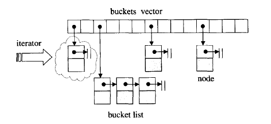
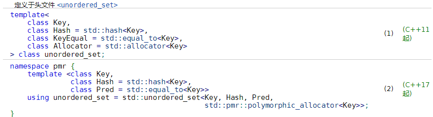

### 5.4 哈希表基础

哈希表能够实现快速插入、删除和查找操作的诀窍在于：插入时会根据哈希函数直接计算操作元素的哈希值，然后将该哈希值作为数组中的下标并将其存放在对应的槽中。这样，下次进行查找、删除时仅仅需要再次计算哈希值就可以得到快速的响应，不过缺点就是存储后的元素之间并不会像红黑树那样呈现有序的状态，故哈希表是一个典型的无序容器。

哈希表还有一个重大问题在于多个所操作元素计算出来的哈希值可能相同，显然我们不能将它们都存放在数组相同的槽中，这便是元素的碰撞问题。解决这种问题主要有探测法和拉链法两种解决途径。


#### 5.4.1.1 探测法

常见的探测法就是：当操作元素哈希值所对应的下标已经有不同的元素存在时，自动将下标（所得哈希值）线性递增，直到找到一个可用的位置。这种方法的缺点就是它很容易造成主集团的问题，即具有相同哈希值的元素因为线性探测导致成片连续存放，并进一步导致相近哈希值的元素也不得不跟在后面连续存放。

而二次探测法则是用来解决上述主集团问题而出现的，它的原理十分简单，即在发生碰撞的时候以函数$F(i)=i^2$的结果挨个尝试所得哈希值H+1、H+4、H+9...这样的新下标来看看哈希表中对应的位置是否可以存放新的元素。不过这种方法也有很多缺点，比如计算复杂、又容易产生次集团等一系列问题。


#### 5.4.1.2 拉链法

在实际中，Hash表的实现更愿意采纳拉链法，即在Hash表中的每一个表格中维护一个链表，每一个具有相同哈希值的元素都会挂接到相同的链表中，这样也就解决了碰撞问题。至于性能，只要链表足够短查找、插入、删除的性能也并不会收到太大的影响。

Java中采用了一种更进一步的拉链法，即在Hash表的表格中在尾随元素较少的情况下维护一个链表，当链表中的数量超过了一个阈值后就转换为树的形式。这样也是一种很好的思路，不过更一般处理Hash表中元素过多容易引发长链表的途径是扩大Hash表+重新插入原Hash表中元素。当然这并不是说Java中的Hash表不扩建，因为我也没看过Java具体怎么做😂。

SGI STL Hash表的实现便是采用了第一种方法，并且按照如下规范命名Hash表中的组件：1）将Hash表表格维护的链表称为桶bucket，每一个桶中存储着具有相同Hash值的元素；2）将桶中的每一个记录元素的节点称为桶节点，这是我们实现Hash表的最小单元，Hash表表格实际记录的就是一个指向桶节点的指针。具体见下图所示：




#### 5.4.1.3 hash函数



顺便提下，若一个用户需要为一个自定义的类提供一个哈希函数，则用户自己必须为标准库中的哈希函数做一个全特化处理，并加入到std的命名空间中。如下所示：

```c++
class Test {
 public:
  Test(std::string str) : string_(std::move(str)) {}
  [[nodiscard]] const std::string &get() const { return string_; }
  void set(const std::string &str) { string_ = str; }
  
  // 从标准库中关于无序关联容器的类声明可以看出自定义类类型必须重载operator==
  // 运算符或者传递进去一个比较函数！
  friend inline bool operator==(const Test &lhs, const Test &rhs) {
	return lhs.string_ == rhs.string_;
  }
 private:
  std::string string_;
};

namespace std {
template<>
struct hash<Test> {
  using result_type = size_t;
  using argument_type = Test;
  result_type operator()(const argument_type &arg) const {
	return hash<string>()(arg.get());
  }
};
} // namespace std
```


### 5.5 hashtable

Hash表是C++ STL中实现无序关联容器的底层基础，其源文件位于[stl_hashtable.h](stl_hashtable.h)中，整体相对于前面几个容器而言并不是很难。对于它的实现，我们主要关注于这几个部分：

1. **hashtable桶节点、迭代器、数据结构的实现**
2. hashtable的构造和析构过程
3. **hashtable的元素插入与删除操作**
4. 其他操作，看看就行


#### 5.5.1 hashtable桶节点和迭代器

##### 5.5.1.1 hashtable桶节点

```c++
//hash桶中的结点
template <class _Val>
struct _Hashtable_node
{
  _Hashtable_node* _M_next;
  _Val _M_val;
};  
```


##### 5.5.1.2 hashtable迭代器

根据源代码可以看出，hashtable迭代器是一种前向迭代器，这便意味着对于hashtable的迭代器而言，它最为主要的工作就是重载`operator++()`。为了实现这一目的，迭代器在内部记录了①一个指向具体hashtable桶节点的指针和②一个指向hashtable的指针。前者的目的是为了方便迭代器在桶中节点间进行步进，而后者的目的是为了能够使得迭代器能够取得下一个紧挨且有效表格(桶)的下标，然后取出表格中指针更新指向桶节点的指针。

为了能够方便hashtable迭代器对哈希表的访问，哈希表这个类会将哈希表迭代器类设置为自己的友元类！

```c++
template <class _Val, class _Key, class _HashFcn,
          class _ExtractKey, class _EqualKey, class _Alloc>
struct _Hashtable_iterator {
  /* ... */
  typedef forward_iterator_tag iterator_category;
  /* ... */

  _Node* _M_cur;// 指向当前的hash桶中的结点
  _Hashtable* _M_ht;// 指向hash表

  _Hashtable_iterator(_Node* __n, _Hashtable* __tab) 
    : _M_cur(__n), _M_ht(__tab) {}
  _Hashtable_iterator() {}
  reference operator*() const { return _M_cur->_M_val; }
  iterator& operator++();
  iterator operator++(int);
  bool operator==(const iterator& __it) const
    { return _M_cur == __it._M_cur; }
  bool operator!=(const iterator& __it) const
    { return _M_cur != __it._M_cur; }
};

template <class _Val, class _Key, class _HF, class _ExK, class _EqK, 
          class _All>
_Hashtable_iterator<_Val,_Key,_HF,_ExK,_EqK,_All>&
_Hashtable_iterator<_Val,_Key,_HF,_ExK,_EqK,_All>::operator++()
{
  const _Node* __old = _M_cur;
  _M_cur = _M_cur->_M_next;
  if (!_M_cur) {
    // 取出原来hashtable桶所在的下标
    size_type __bucket = _M_ht->_M_bkt_num(__old->_M_val);
    // 依次在hashtable紧挨着的表格中找到一个有效的表格（桶），取出其中的桶节点指针给_M_cur
    while (!_M_cur && ++__bucket < _M_ht->_M_buckets.size())
      _M_cur = _M_ht->_M_buckets[__bucket];
  }
  return *this;
}
```


#### 5.5.2 hashtable的数据结构

hashtable的数据结构非常简单，在内部最为主要的组件就是由vector造就的记录hashtable桶节点指针的数组，具体名为\_M\_buckets。而其他的组件就很普通，主要包括一个计算哈希值的哈希函数对象\_M_hash、一个判断hashtable桶节点上元素键值key是否相等的比较器\_M_equals、一个从值域中提取键值key的提取器\_M\_get\_key和一个记录hashtable中桶节点数的计数器\_M\_num_elements。

```c++
template <class _Val, class _Key, class _HashFcn,
          class _ExtractKey, class _EqualKey, class _Alloc>
class hashtable {
public:
    /* ... */
private:
  typedef _Hashtable_node<_Val> _Node;
    
  // 哈希表迭代器是哈希表的友元类
  friend struct
  _Hashtable_iterator<_Val,_Key,_HashFcn,_ExtractKey,_EqualKey,_Alloc>;

public:
  typedef _Alloc allocator_type;
  allocator_type get_allocator() const { return allocator_type(); }
private:
  typedef simple_alloc<_Node, _Alloc> _M_node_allocator_type;
  _Node* _M_get_node() { return _M_node_allocator_type::allocate(1); }
  void _M_put_node(_Node* __p) { _M_node_allocator_type::deallocate(__p, 1); }

private:
  hasher                _M_hash;
  key_equal             _M_equals;
  _ExtractKey           _M_get_key;
  vector<_Node*,_Alloc> _M_buckets;
  size_type             _M_num_elements;

  /* ... */
};
```


#### 5.5.3 hashtable构造/析构过程

##### 5.5.3.1 默认构造函数

hashtable的默认构造过程其实非常简单，它首先会根据指定的实参初始化各个数据成员，然后根据用户指定的桶节点数n调用`__stl_next_prime()`函数计算出最为接近（但大于n）的质数，并以此为hashtable的bucket vector预分配空间，完成之初每一个表格中记录的都是空指针。

```c++
template <class _Val, class _Key, class _HashFcn,
          class _ExtractKey, class _EqualKey, class _Alloc>
class hashtable {
  /* ... */
public:
  hashtable(size_type __n,
            const _HashFcn&    __hf,
            const _EqualKey&   __eql,
            const _ExtractKey& __ext,
            const allocator_type& __a = allocator_type())
    : __HASH_ALLOC_INIT(__a)
      _M_hash(__hf),
      _M_equals(__eql),
      _M_get_key(__ext),
      _M_buckets(__a),
      _M_num_elements(0)
  {
    _M_initialize_buckets(__n);
  }

  hashtable(const hashtable& __ht)
    : __HASH_ALLOC_INIT(__ht.get_allocator())
      _M_hash(__ht._M_hash),
      _M_equals(__ht._M_equals),
      _M_get_key(__ht._M_get_key),
      _M_buckets(__ht.get_allocator()),
      _M_num_elements(0)
  {
    _M_copy_from(__ht);
  }
    
  ~hashtable() { clear(); }
    
private:
  size_type _M_next_size(size_type __n) const
    { return __stl_next_prime(__n); }

  void _M_initialize_buckets(size_type __n)
  {
    const size_type __n_buckets = _M_next_size(__n);
    _M_buckets.reserve(__n_buckets);
    _M_buckets.insert(_M_buckets.end(), __n_buckets, (_Node*) 0);
    _M_num_elements = 0;
  }
  /* ... */
};
```

`__stl_next_prime()`函数的实现如下：

```c++
enum { __stl_num_primes = 28 };

static const unsigned long __stl_prime_list[__stl_num_primes] =
{
  53ul,         97ul,         193ul,       389ul,       769ul,
  1543ul,       3079ul,       6151ul,      12289ul,     24593ul,
  49157ul,      98317ul,      196613ul,    393241ul,    786433ul,
  1572869ul,    3145739ul,    6291469ul,   12582917ul,  25165843ul,
  50331653ul,   100663319ul,  201326611ul, 402653189ul, 805306457ul, 
  1610612741ul, 3221225473ul, 4294967291ul
};

inline unsigned long __stl_next_prime(unsigned long __n)
{
  const unsigned long* __first = __stl_prime_list;
  const unsigned long* __last = __stl_prime_list + (int)__stl_num_primes;
  const unsigned long* pos = lower_bound(__first, __last, __n);
  return pos == __last ? *(__last - 1) : *pos;
}
```


##### 5.5.3.2 拷贝构造函数

拷贝构造函数的实现也并不是很难，它的大部分工作都是由一个名为`_M_copy_from()`的函数完成的。该函数在执行之初，会清理bucket vector并预分配好右侧待拷贝hashtable的bucket vector相同大小的空间。然后挨个遍历右侧哈希表bucket vector中的表格，若是表格中存在有效的桶，则从中完整地拷贝桶中的链表到当前的hashtable对应表格之中；否则直接跳到下一个位置，直到走到bucket vector的尽头。

```c++
template <class _Val, class _Key, class _HashFcn,
          class _ExtractKey, class _EqualKey, class _Alloc>
class hashtable {
  /* ... */
public:
  hashtable(const hashtable& __ht)
    : __HASH_ALLOC_INIT(__ht.get_allocator())
      _M_hash(__ht._M_hash),
      _M_equals(__ht._M_equals),
      _M_get_key(__ht._M_get_key),
      _M_buckets(__ht.get_allocator()),
      _M_num_elements(0)
  {
    _M_copy_from(__ht);
  }
    /* ... */
};

template <class _Val, class _Key, class _HF, class _Ex, class _Eq, class _All>
void hashtable<_Val,_Key,_HF,_Ex,_Eq,_All>
  ::_M_copy_from(const hashtable& __ht)
{
  _M_buckets.clear();
  _M_buckets.reserve(__ht._M_buckets.size());
  _M_buckets.insert(_M_buckets.end(), __ht._M_buckets.size(), (_Node*) 0);
  __STL_TRY {
    for (size_type __i = 0; __i < __ht._M_buckets.size(); ++__i) {
      const _Node* __cur = __ht._M_buckets[__i];
      if (__cur) {
        // 拷贝ht中的一个有效桶
        _Node* __copy = _M_new_node(__cur->_M_val);
        _M_buckets[__i] = __copy;

        // 迭代拷贝桶中的串链
        for (_Node* __next = __cur->_M_next; 
             __next; 
             __cur = __next, __next = __cur->_M_next) {
          __copy->_M_next = _M_new_node(__next->_M_val);
          __copy = __copy->_M_next;
        }
      }
    }
    _M_num_elements = __ht._M_num_elements;
  }
  __STL_UNWIND(clear());
}
```


#### 5.5.4 ==hashtable元素插入操作==

##### 5.5.4.1 hashtable扩建重整

我们可以预见随着新的元素不断地插入，hashtable中的元素数量会不断地增加并超过bucket vector本身的大小。按照哈希表的理论知识，此时如果继续使得容器继续维护这样的表格会大大降低容器的性能，导致之后元素的插入、查找很有可能不得不在长度大于1的链表上进行。因此我们必须有一种操作使得插入的元素到达某一个阈值（SGI STL中设定的阈值就是bucket vector本身的大小，这样可以使得负载因子总是小于1）之后重新扩大分配新的bucket vector，并将原来表格中维护的各个桶及其桶节点重新加入到其中。这便是SGI STL hashtable操作`resize()`的由来。

`resize()`成员函数在执行之初会比较当前hashtable中的bucket vector大小和指定期望的大小，只有在期望大小大于原桶数量的情况下才会扩建bucket vector。若确实需要，则最开始会先创建一个符合预期质数大小的临时bucket vector，然后挨个从原先的bucket vector中将桶节点迁移到临时bucekt vector新桶之中（注意：每一个桶节点的哈希值都得重新计算，以确定它在bucket vector中的新位置）。最后交换临时bucket vector和原来的bucket vector。

```c++
template <class _Val, class _Key, class _HF, class _Ex, class _Eq, class _All>
void hashtable<_Val,_Key,_HF,_Ex,_Eq,_All>
  ::resize(size_type __num_elements_hint)
{
  const size_type __old_n = _M_buckets.size();
  if (__num_elements_hint > __old_n) {
    const size_type __n = _M_next_size(__num_elements_hint);
    if (__n > __old_n) {
      vector<_Node*, _All> __tmp(__n, (_Node*)(0),
                                 _M_buckets.get_allocator());
      __STL_TRY {
        for (size_type __bucket = 0; __bucket < __old_n; ++__bucket) {
          _Node* __first = _M_buckets[__bucket];
          while (__first) {
            //将旧哈希表桶中的桶节点迁移到新哈希表桶中
            size_type __new_bucket = _M_bkt_num(__first->_M_val, __n);
            _M_buckets[__bucket] = __first->_M_next;
            __first->_M_next = __tmp[__new_bucket];
            __tmp[__new_bucket] = __first;
            __first = _M_buckets[__bucket];          
          }
        }
        //交换临时与原先的bucket vector
        _M_buckets.swap(__tmp);
      }
#         ifdef __STL_USE_EXCEPTIONS
      catch(...) {
        for (size_type __bucket = 0; __bucket < __tmp.size(); ++__bucket) {
          while (__tmp[__bucket]) {
            _Node* __next = __tmp[__bucket]->_M_next;
            _M_delete_node(__tmp[__bucket]);
            __tmp[__bucket] = __next;
          }
        }
        throw;
      }
#         endif /* __STL_USE_EXCEPTIONS */
    }
  }
}
```


##### 5.5.4.1 独一插入操作

既然已经了解了hashtable中的扩建重整操作`resize()`，那么下面的独一插入操作和可重复插入操作就并没有什么问题，它们的不同就在于当已经有相同键值key的元素存在于对应桶链表中时的处理。前者只有在遍历完整个桶中链表后发现没有重复键值元素的情况下插入新的桶节点，而后者若是发现则会在相同键值节点的前面插入新的重复键值新节点。

```c++
template <class _Val, class _Key, class _HashFcn,
          class _ExtractKey, class _EqualKey, class _Alloc>
class hashtable {
public:
  /* ... */
  pair<iterator, bool> insert_unique(const value_type& __obj)
  {
    resize(_M_num_elements + 1);
    return insert_unique_noresize(__obj);
  }
  /* ... */
};

template <class _Val, class _Key, class _HF, class _Ex, class _Eq, class _All>
pair<typename hashtable<_Val,_Key,_HF,_Ex,_Eq,_All>::iterator, bool> 
hashtable<_Val,_Key,_HF,_Ex,_Eq,_All>
  ::insert_unique_noresize(const value_type& __obj)
{
  const size_type __n = _M_bkt_num(__obj);
  _Node* __first = _M_buckets[__n];

  // 先检查是否已经在桶中，若已存在则返回false
  for (_Node* __cur = __first; __cur; __cur = __cur->_M_next) 
    if (_M_equals(_M_get_key(__cur->_M_val), _M_get_key(__obj)))
      return pair<iterator, bool>(iterator(__cur, this), false);

  //若不存在桶中，则插入并返回true
  _Node* __tmp = _M_new_node(__obj);
  __tmp->_M_next = __first;
  _M_buckets[__n] = __tmp;
  ++_M_num_elements;
  return pair<iterator, bool>(iterator(__tmp, this), true);
}
```


##### 5.5.4.2 可重复插入操作

```c++
template <class _Val, class _Key, class _HashFcn,
          class _ExtractKey, class _EqualKey, class _Alloc>
class hashtable {
public:
  /* ... */
  iterator insert_equal(const value_type& __obj)
  {
    resize(_M_num_elements + 1);
    return insert_equal_noresize(__obj);
  }
  /* ... */
};

template <class _Val, class _Key, class _HF, class _Ex, class _Eq, class _All>
typename hashtable<_Val,_Key,_HF,_Ex,_Eq,_All>::iterator 
hashtable<_Val,_Key,_HF,_Ex,_Eq,_All>
  ::insert_equal_noresize(const value_type& __obj)
{
  const size_type __n = _M_bkt_num(__obj);
  _Node* __first = _M_buckets[__n];

  for (_Node* __cur = __first; __cur; __cur = __cur->_M_next) 
    if (_M_equals(_M_get_key(__cur->_M_val), _M_get_key(__obj))) {
      //若元素之前就存在，则在其后插入
      _Node* __tmp = _M_new_node(__obj);
      __tmp->_M_next = __cur->_M_next;
      __cur->_M_next = __tmp;
      ++_M_num_elements;
      return iterator(__tmp, this);
    }

  //否则在桶的前头插入
  _Node* __tmp = _M_new_node(__obj);
  __tmp->_M_next = __first;
  _M_buckets[__n] = __tmp;
  ++_M_num_elements;
  return iterator(__tmp, this);
}
```


#### 5.5.5 hashtable其他操作

##### 5.5.5.1 元素删除操作

hashtable的元素删除操作比较简单，不过对于`erase()`的实现还是有点新鲜感的，它竟然是先处理第一个元素后面的节点，然后再处理第一个节点，这样处理像1-1-2-4-5-6的链表就不需要在最前面施以while删除首结点即是删除元素的情况了😋。

```c++
template <class _Val, class _Key, class _HF, class _Ex, class _Eq, class _All>
void hashtable<_Val,_Key,_HF,_Ex,_Eq,_All>::clear()
{
  for (size_type __i = 0; __i < _M_buckets.size(); ++__i) {
    _Node* __cur = _M_buckets[__i];
    while (__cur != 0) {
      _Node* __next = __cur->_M_next;
      _M_delete_node(__cur);
      __cur = __next;
    }
    _M_buckets[__i] = 0;
  }
  _M_num_elements = 0;
}

template <class _Val, class _Key, class _HF, class _Ex, class _Eq, class _All>
typename hashtable<_Val,_Key,_HF,_Ex,_Eq,_All>::size_type 
hashtable<_Val,_Key,_HF,_Ex,_Eq,_All>::erase(const key_type& __key)
{
  const size_type __n = _M_bkt_num_key(__key);
  _Node* __first = _M_buckets[__n];
  size_type __erased = 0;

  if (__first) {
    _Node* __cur = __first;
    _Node* __next = __cur->_M_next;
    // 尽可能先删除桶链表中第一个节点后的节点
    while (__next) {
      if (_M_equals(_M_get_key(__next->_M_val), __key)) {
        __cur->_M_next = __next->_M_next;
        _M_delete_node(__next);
        __next = __cur->_M_next;
        ++__erased;
        --_M_num_elements;
      }
      else {
        __cur = __next;
        __next = __cur->_M_next;
      }
    }
    // 直到while跳出后，才判断要不要删除第一个桶节点
    if (_M_equals(_M_get_key(__first->_M_val), __key)) {
      _M_buckets[__n] = __first->_M_next;
      _M_delete_node(__first);
      ++__erased;
      --_M_num_elements;
    }
  }
  return __erased;
}
```


##### 5.5.5.2 查找操作

```c++
template <class _Val, class _Key, class _HashFcn,
          class _ExtractKey, class _EqualKey, class _Alloc>
class hashtable {
public:
  /* ... */
  iterator find(const key_type& __key) 
  {
    size_type __n = _M_bkt_num_key(__key);
    _Node* __first;
    for ( __first = _M_buckets[__n];
          __first && !_M_equals(_M_get_key(__first->_M_val), __key);
          __first = __first->_M_next)
      {}
    return iterator(__first, this);
  } 
  /* ... */
};
```


### 5.6 hashtable衍生的无序关联容器

在SGI STL中由于hashtable衍生出来的无序关联容器在那个年代还未加入到C++的标准中，它们并没有规范、完整的hash仿函数、判等equalKey仿函数可以供使用，因此用户必须为这些容器提供针对健key的特例化hash仿函数和判断equalKey仿函数。当然在当前时代下，无序关联容器unordered_map、unordered_set、unordered_multimap、unordered_mutliset并没有这种担忧。

由于下面的无序关联容器基本上都是hashtable这一容器的简单封装，并没有太多的学习价值，因此仅简单的列出关键的代码部分。

#### 5.6.1 hash_set

```c++
template <class _Value, class _HashFcn, class _EqualKey, class _Alloc>
class hash_set
{
  /* ... */
private:
  typedef hashtable<_Value, _Value, _HashFcn, _Identity<_Value>, 
                    _EqualKey, _Alloc> _Ht;
  _Ht _M_ht;
  /* ... */
};
```


#### 5.6.2 hash_map

```c++
template <class _Key, class _Tp, class _HashFcn, class _EqualKey,
          class _Alloc>
class hash_map
{
  /* ... */
private:
  typedef hashtable<pair<const _Key,_Tp>,_Key,_HashFcn,
                    _Select1st<pair<const _Key,_Tp> >,_EqualKey,_Alloc> _Ht;
  _Ht _M_ht;

  /* ... */
  _Tp& operator[](const key_type& __key) {
    return _M_ht.find_or_insert(value_type(__key, _Tp())).second;
  }
  /* ... */
};
```


#### 5.6.3 hash_multiset

```c++
template <class _Value, class _HashFcn, class _EqualKey, class _Alloc>
class hash_multiset
{
  /* ... */
private:
  typedef hashtable<_Value, _Value, _HashFcn, _Identity<_Value>, 
                    _EqualKey, _Alloc> _Ht;
  _Ht _M_ht;
  /* ... */
};
```


#### 5.6.4 hash_multimap

```c++
template <class _Key, class _Tp, class _HashFcn, class _EqualKey, 
          class _Alloc>
class hash_multimap
{
  /* ... */
private:
  typedef hashtable<pair<const _Key, _Tp>, _Key, _HashFcn,
                    _Select1st<pair<const _Key, _Tp> >, _EqualKey, _Alloc> 
          _Ht;
  _Ht _M_ht;
  /* ... */
};
```


