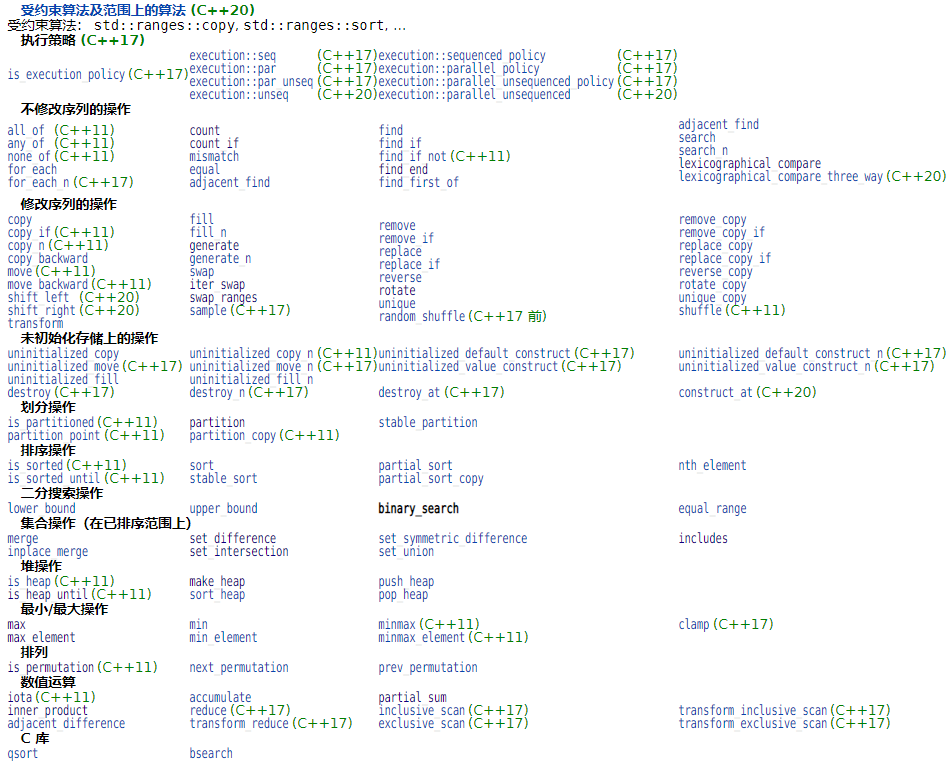

## 6. 算法

### 6.1 算法库纵览



在本章中，除了上述较新标准和C库下的算法实现没有在书中提到之外，基本上都可以在书中找到。不过并不是每一个算法都值得我们特别注意，事实上，我们阅读源代码的目的更多为了学习一些比较重要算法的思想和SGI STL为实现之而使用的编程技法，因此在这里我仅仅列出如下一些个人觉得值得学习的算法：

|       算法类型       |                            算法名                            |
| :------------------: | :----------------------------------------------------------: |
|       数值算法       |                       `power`(SGI专属)                       |
|      非质变算法      |                     `search`、`find_end`                     |
|       质变算法       |                       `copy`、`rotate`                       |
|       集合操作       | `set_union`、`set_intersection`、`set_difference`、  `set_symmetric_difference`、`includes`、`merge`、`inplace_merge` |
|       划分操作       |                         `partition`                          |
|       排序操作       |    `partial_sort`、`sort`、`nth_element`、`stable_sort()`    |
|       排列操作       |            `next_permutation`、`pre_permutation`             |
|     二分搜索操作     | `lower_bound`、`upper_bound`、`equal_range`、`binary_search` |
|        堆操作        |                              略                              |
|    最小/大值操作     |                              略                              |
| 未初始化存储上的操作 |                              略                              |


### 6.2 算法的一般形式


### 6.3 各算法实现

C++算法库中的大部分算法实现都主要集中在[stl_algo.h](stl_algo.h)、[stl_algobase.h](stl_algobase.h)、[stl_numeric.h](stl_numeric.h)、[stl_heap.h](stl_heap.h)这几个头文件中，从源文件的角度上讲这些算法可以分成普通算法、基础算法、数值算法等类型，但是这里在展开解释的时候还是主要按照上述cppreference的一般分类来进行。


#### 6.3.1 数值算法

##### 6.3.1.1 power

该乘幂算法只支持对正次幂的计算，不过稍微改造下就可以支持对负次幂的计算。

```c++
template<class T, class Integer, class MonoidOperatoion>
T power(T x, Integer n, MonoidOperatoion op) {
	if (n == 0) return 1;
	else {
		while ((n & 1) == 0) {
			n >>= 1;
			x = op(x, x);
		}

		T result = x;
		n >>= 1;
		while (n != 0) {
			x = op(x, x);
			if ((n & 1) != 0)
				result = op(result, x);
			n >>= 1;
		}
		return result;
	}
}

template<class T, class Integer>
inline T power(T x, Integer n) {
	return power(x, n, multiplies<T>());
}
```

> 这个算法与《剑指offer》面试题16的查考知识点相同。


#### 6.3.2 非质变算法

##### 6.3.2.1 search

```c++
template <class _ForwardIter1, class _ForwardIter2>
_ForwardIter1 search(_ForwardIter1 __first1, _ForwardIter1 __last1,
                     _ForwardIter2 __first2, _ForwardIter2 __last2) 
{
  // Test for empty ranges
  if (__first1 == __last1 || __first2 == __last2)
    return __first1;

  // Test for a pattern of length 1.
  _ForwardIter2 __tmp(__first2);
  ++__tmp;
  if (__tmp == __last2)
    return find(__first1, __last1, *__first2);

  // General case.

  _ForwardIter2 __p1, __p;
  __p1 = __first2; ++__p1;
  _ForwardIter1 __current = __first1;
  //这里采用的就是暴力搜索法
  while (__first1 != __last1) {
    __first1 = find(__first1, __last1, *__first2);
    if (__first1 == __last1)
      return __last1;

    __p = __p1;
    __current = __first1; 
    if (++__current == __last1)
      return __last1;

    while (*__current == *__p) {
      //若所有元素都对上了，则返回该模式序列在欲查找序列上的首元素迭代器
      if (++__p == __last2)
        return __first1;
      if (++__current == __last1)
        return __last1;
    }

    ++__first1;
  }
  return __first1;
}
```


##### 6.3.2.2 find_end

```c++
template <class _ForwardIter1, class _ForwardIter2>
_ForwardIter1 __find_end(_ForwardIter1 __first1, _ForwardIter1 __last1,
                         _ForwardIter2 __first2, _ForwardIter2 __last2,
                         forward_iterator_tag, forward_iterator_tag)
{
  if (__first2 == __last2)
    return __last1;
  else {
    _ForwardIter1 __result = __last1;
    while (1) {
      _ForwardIter1 __new_result
        = search(__first1, __last1, __first2, __last2);
      if (__new_result == __last1)
        return __result;
      else {
        __result = __new_result;
        __first1 = __new_result;
        ++__first1;
      }
    }
  }
}
```


#### 6.3.3 质变算法

##### 6.3.3.1 copy

SGI STL V3.3版本中的`copy()`实现感觉有一点怪异之处，所以我更推荐看《STL 源码剖析》中的实现。

```c++
template <class _InputIter, class _OutputIter, class _Distance>
inline _OutputIter __copy(_InputIter __first, _InputIter __last,
                          _OutputIter __result,
                          input_iterator_tag, _Distance*)
{
  for ( ; __first != __last; ++__result, ++__first)
    *__result = *__first;
  return __result;
}

template <class _RandomAccessIter, class _OutputIter, class _Distance>
inline _OutputIter
__copy(_RandomAccessIter __first, _RandomAccessIter __last,
       _OutputIter __result, random_access_iterator_tag, _Distance*)
{
  for (_Distance __n = __last - __first; __n > 0; --__n) {
    *__result = *__first;
    ++__first;
    ++__result;
  }
  return __result;
}

template <class _Tp>
inline _Tp*
__copy_trivial(const _Tp* __first, const _Tp* __last, _Tp* __result) {
  memmove(__result, __first, sizeof(_Tp) * (__last - __first));
  return __result + (__last - __first);
}

template <class _InputIter, class _OutputIter, class _BoolType>
struct __copy_dispatch {
  static _OutputIter copy(_InputIter __first, _InputIter __last,
                          _OutputIter __result) {
    typedef typename iterator_traits<_InputIter>::iterator_category _Category;
    typedef typename iterator_traits<_InputIter>::difference_type _Distance;
    return __copy(__first, __last, __result, _Category(), (_Distance*) 0);
  }
};

template <class _Tp>
struct __copy_dispatch<_Tp*, _Tp*, __true_type>
{
  static _Tp* copy(const _Tp* __first, const _Tp* __last, _Tp* __result) {
    return __copy_trivial(__first, __last, __result);
  }
};

template <class _Tp>
struct __copy_dispatch<const _Tp*, _Tp*, __true_type>
{
  static _Tp* copy(const _Tp* __first, const _Tp* __last, _Tp* __result) {
    return __copy_trivial(__first, __last, __result);
    /* 这里的代码还是感觉有问题，尤其是在处理一个元素类型支持
      non-trivial赋值运算符的数组（假设type_traits能够识别）！ */
  }
};

template <class _InputIter, class _OutputIter>
inline _OutputIter copy(_InputIter __first, _InputIter __last,
                        _OutputIter __result) {
  __STL_REQUIRES(_InputIter, _InputIterator);
  __STL_REQUIRES(_OutputIter, _OutputIterator);
  typedef typename iterator_traits<_InputIter>::value_type _Tp;
  typedef typename __type_traits<_Tp>::has_trivial_assignment_operator
          _Trivial;
  return __copy_dispatch<_InputIter, _OutputIter, _Trivial>
    ::copy(__first, __last, __result);
}
```


##### 6.3.3.2 rotate

```c++
template <class _EuclideanRingElement>
_EuclideanRingElement __gcd(_EuclideanRingElement __m,
                            _EuclideanRingElement __n)
{
  while (__n != 0) {
    _EuclideanRingElement __t = __m % __n;
    __m = __n;
    __n = __t;
  }
  return __m;
}

template <class _ForwardIter, class _Distance>
_ForwardIter __rotate(_ForwardIter __first,
                      _ForwardIter __middle,
                      _ForwardIter __last,
                      _Distance*,
                      forward_iterator_tag) {
  if (__first == __middle)
    return __last;
  if (__last  == __middle)
    return __first;

  _ForwardIter __first2 = __middle;
  do {
    swap(*__first++, *__first2++);
    if (__first == __middle)
      __middle = __first2;
  } while (__first2 != __last);

  _ForwardIter __new_middle = __first;

  __first2 = __middle;

  while (__first2 != __last) {
    swap (*__first++, *__first2++);
    if (__first == __middle)
      __middle = __first2;
    else if (__first2 == __last)
      __first2 = __middle;
  }

  return __new_middle;
}


template <class _BidirectionalIter, class _Distance>
_BidirectionalIter __rotate(_BidirectionalIter __first,
                            _BidirectionalIter __middle,
                            _BidirectionalIter __last,
                            _Distance*,
                            bidirectional_iterator_tag) {
  if (__first == __middle)
    return __last;
  if (__last  == __middle)
    return __first;

  __reverse(__first,  __middle, bidirectional_iterator_tag());
  __reverse(__middle, __last,   bidirectional_iterator_tag());
  
  /* 下面的实现就是等于：reverse(_first,__middle,bidirectional_iterator_tag());
    只不过这里需要返回旋转数组第二部分首元素的迭代器罢了 */
  while (__first != __middle && __middle != __last)
    swap (*__first++, *--__last);

  if (__first == __middle) {
    __reverse(__middle, __last,   bidirectional_iterator_tag());
    return __last;
  }
  else {
    __reverse(__first,  __middle, bidirectional_iterator_tag());
    return __first;
  }
}

template <class _RandomAccessIter, class _Distance, class _Tp>
_RandomAccessIter __rotate(_RandomAccessIter __first,
                           _RandomAccessIter __middle,
                           _RandomAccessIter __last,
                           _Distance *, _Tp *) {
  /* 下面这个比较难理解 */
  _Distance __n = __last   - __first;
  _Distance __k = __middle - __first;
  _Distance __l = __n - __k;
  _RandomAccessIter __result = __first + (__last - __middle);

  if (__k == 0)
    return __last;

  else if (__k == __l) {
    swap_ranges(__first, __middle, __middle);
    return __result;
  }

  _Distance __d = __gcd(__n, __k);

  for (_Distance __i = 0; __i < __d; __i++) {
    _Tp __tmp = *__first;
    _RandomAccessIter __p = __first;

    if (__k < __l) {
      for (_Distance __j = 0; __j < __l/__d; __j++) {
        if (__p > __first + __l) {
          *__p = *(__p - __l);
          __p -= __l;
        }

        *__p = *(__p + __k);
        __p += __k;
      }
    }

    else {
      for (_Distance __j = 0; __j < __k/__d - 1; __j ++) {
        if (__p < __last - __k) {
          *__p = *(__p + __k);
          __p += __k;
        }

        *__p = * (__p - __l);
        __p -= __l;
      }
    }

    *__p = __tmp;
    ++__first;
  }

  return __result;
}

template <class _ForwardIter>
inline _ForwardIter rotate(_ForwardIter __first, _ForwardIter __middle,
                           _ForwardIter __last) {
  return __rotate(__first, __middle, __last,
                  __DISTANCE_TYPE(__first),
                  __ITERATOR_CATEGORY(__first));
}
```


#### 6.3.4 ==集合操作==

##### 6.3.4.1 set_union

```c++
template <class _InputIter1, class _InputIter2, class _OutputIter>
_OutputIter set_union(_InputIter1 __first1, _InputIter1 __last1,
                      _InputIter2 __first2, _InputIter2 __last2,
                      _OutputIter __result) {
  while (__first1 != __last1 && __first2 != __last2) {
    if (*__first1 < *__first2) {
      *__result = *__first1;
      ++__first1;
    }
    else if (*__first2 < *__first1) {
      *__result = *__first2;
      ++__first2;
    }
    else {
      *__result = *__first1;
      ++__first1;
      ++__first2;
    }
    ++__result;
  }
  return copy(__first2, __last2, copy(__first1, __last1, __result));
}
```


##### 6.3.4.2 includes

```c++
template <class _InputIter1, class _InputIter2>
bool includes(_InputIter1 __first1, _InputIter1 __last1,
              _InputIter2 __first2, _InputIter2 __last2) {
  while (__first1 != __last1 && __first2 != __last2)
    if (*__first2 < *__first1)
      return false;
    else if(*__first1 < *__first2) 
      ++__first1;
    else
      ++__first1, ++__first2;

  return __first2 == __last2;
}
```


##### 6.3.4.3 merge

```c++
template <class _InputIter1, class _InputIter2, class _OutputIter>
_OutputIter merge(_InputIter1 __first1, _InputIter1 __last1,
                  _InputIter2 __first2, _InputIter2 __last2,
                  _OutputIter __result) {
  while (__first1 != __last1 && __first2 != __last2) {
    if (*__first2 < *__first1) {
      *__result = *__first2;
      ++__first2;
    }
    else {
      *__result = *__first1;
      ++__first1;
    }
    ++__result;
  }
  return copy(__first2, __last2, copy(__first1, __last1, __result));
}
```


##### 6.3.4.4 inplace_merge

```c++
template <class _BidirectionalIter, class _Distance>
void __merge_without_buffer(_BidirectionalIter __first,
                            _BidirectionalIter __middle,
                            _BidirectionalIter __last,
                            _Distance __len1, _Distance __len2) {
  if (__len1 == 0 || __len2 == 0)
    return;
  if (__len1 + __len2 == 2) {
    if (*__middle < *__first)
      iter_swap(__first, __middle);
    return;
  }
  /* 下面的实现类似于__merge_adative中针对缓冲区不足时的处理方式 */
  _BidirectionalIter __first_cut = __first;
  _BidirectionalIter __second_cut = __middle;
  _Distance __len11 = 0;
  _Distance __len22 = 0;
  if (__len1 > __len2) {
    __len11 = __len1 / 2;
    advance(__first_cut, __len11);
    __second_cut = lower_bound(__middle, __last, *__first_cut);
    distance(__middle, __second_cut, __len22);
  }
  else {
    __len22 = __len2 / 2;
    advance(__second_cut, __len22);
    __first_cut = upper_bound(__first, __middle, *__second_cut);
    distance(__first, __first_cut, __len11);
  }
  _BidirectionalIter __new_middle
    = rotate(__first_cut, __middle, __second_cut);
  __merge_without_buffer(__first, __first_cut, __new_middle,
                         __len11, __len22);
  __merge_without_buffer(__new_middle, __second_cut, __last, __len1 - __len11,
                         __len2 - __len22);
}

template <class _BidirectionalIter1, class _BidirectionalIter2,
          class _Distance>
_BidirectionalIter1 __rotate_adaptive(_BidirectionalIter1 __first,
                                      _BidirectionalIter1 __middle,
                                      _BidirectionalIter1 __last,
                                      _Distance __len1, _Distance __len2,
                                      _BidirectionalIter2 __buffer,
                                      _Distance __buffer_size) {
  _BidirectionalIter2 __buffer_end;
  if (__len1 > __len2 && __len2 <= __buffer_size) {
    __buffer_end = copy(__middle, __last, __buffer);
    copy_backward(__first, __middle, __last);
    return copy(__buffer, __buffer_end, __first);
  }
  else if (__len1 <= __buffer_size) {
    __buffer_end = copy(__first, __middle, __buffer);
    copy(__middle, __last, __first);
    return copy_backward(__buffer, __buffer_end, __last);
  }
  else
    return rotate(__first, __middle, __last);
}

template <class _BidirectionalIter1, class _BidirectionalIter2,
          class _BidirectionalIter3>
_BidirectionalIter3 __merge_backward(_BidirectionalIter1 __first1,
                                     _BidirectionalIter1 __last1,
                                     _BidirectionalIter2 __first2,
                                     _BidirectionalIter2 __last2,
                                     _BidirectionalIter3 __result) {
  if (__first1 == __last1)
    return copy_backward(__first2, __last2, __result);
  if (__first2 == __last2)
    return copy_backward(__first1, __last1, __result);
  --__last1;
  --__last2;
  while (true) {
    if (*__last2 < *__last1) {
      *--__result = *__last1;
      if (__first1 == __last1)
        return copy_backward(__first2, ++__last2, __result);
      --__last1;
    }
    else {
      *--__result = *__last2;
      if (__first2 == __last2)
        return copy_backward(__first1, ++__last1, __result);
      --__last2;
    }
  }
}

template <class _BidirectionalIter, class _Distance, class _Pointer>
void __merge_adaptive(_BidirectionalIter __first,
                      _BidirectionalIter __middle, 
                      _BidirectionalIter __last,
                      _Distance __len1, _Distance __len2,
                      _Pointer __buffer, _Distance __buffer_size) {
  //临时缓冲区足够存放前半部分序列
  if (__len1 <= __len2 && __len1 <= __buffer_size) {
    _Pointer __buffer_end = copy(__first, __middle, __buffer);
    merge(__buffer, __buffer_end, __middle, __last, __first);
  }
  //临时缓冲区足够存放后半部分序列
  else if (__len2 <= __buffer_size) {
    _Pointer __buffer_end = copy(__middle, __last, __buffer);
    __merge_backward(__first, __middle, __buffer, __buffer_end, __last);
  }
  //临时缓冲区空间不足，但空间不为0
  else {
    _BidirectionalIter __first_cut = __first;
    _BidirectionalIter __second_cut = __middle;
    _Distance __len11 = 0;
    _Distance __len22 = 0;
    if (__len1 > __len2) {
      __len11 = __len1 / 2;
      advance(__first_cut, __len11);
      __second_cut = lower_bound(__middle, __last, *__first_cut);
      distance(__middle, __second_cut, __len22); 
    }
    else {
      __len22 = __len2 / 2;
      advance(__second_cut, __len22);
      __first_cut = upper_bound(__first, __middle, *__second_cut);
      distance(__first, __first_cut, __len11);
    }
    /* 将[first_cut,second_cut)的元素以middle为中心进行旋转，
      旋转后[first_cut,second_cut)必然有序 */
    _BidirectionalIter __new_middle =
      __rotate_adaptive(__first_cut, __middle, __second_cut, __len1 - __len11,
                        __len22, __buffer, __buffer_size);
    //以递归调用方式处理左半段
    __merge_adaptive(__first, __first_cut, __new_middle, __len11,
                     __len22, __buffer, __buffer_size);
    //以递归调用方式处理右半段
    __merge_adaptive(__new_middle, __second_cut, __last, __len1 - __len11,
                     __len2 - __len22, __buffer, __buffer_size);
  }
}

template <class _BidirectionalIter, class _Tp, class _Distance>
inline void __inplace_merge_aux(_BidirectionalIter __first,
                                _BidirectionalIter __middle,
                                _BidirectionalIter __last, _Tp*, _Distance*) {
  _Distance __len1 = 0;
  distance(__first, __middle, __len1);
  _Distance __len2 = 0;
  distance(__middle, __last, __len2);

  _Temporary_buffer<_BidirectionalIter, _Tp> __buf(__first, __last);
  if (__buf.begin() == 0)
    __merge_without_buffer(__first, __middle, __last, __len1, __len2);
  else
    __merge_adaptive(__first, __middle, __last, __len1, __len2,
                     __buf.begin(), _Distance(__buf.size()));
}

template <class _BidirectionalIter>
inline void inplace_merge(_BidirectionalIter __first,
                          _BidirectionalIter __middle,
                          _BidirectionalIter __last) {
  if (__first == __middle || __middle == __last)
    return;
  __inplace_merge_aux(__first, __middle, __last,
                      __VALUE_TYPE(__first), __DISTANCE_TYPE(__first));
}
```


#### 6.3.5 划分操作

##### 6.3.5.1 partition

```c++
template <class _ForwardIter, class _Predicate>
_ForwardIter __partition(_ForwardIter __first,
		         _ForwardIter __last,
			 _Predicate   __pred,
			 forward_iterator_tag) {
  if (__first == __last) return __first;

  /* 跳过第一块符合pred谓词要求的元素部分 */
  while (__pred(*__first))
    if (++__first == __last) return __first;

  _ForwardIter __next = __first;

  /* 一旦next遇到符合pred谓词要求的就与first交换指向的元素
    ，直到末尾 */
  while (++__next != __last)
    if (__pred(*__next)) {
      swap(*__first, *__next);
      ++__first;
    }

  return __first;
}

template <class _BidirectionalIter, class _Predicate>
_BidirectionalIter __partition(_BidirectionalIter __first,
                               _BidirectionalIter __last,
			       _Predicate __pred,
			       bidirectional_iterator_tag) {
  /* 这种实现思想类似于《算法4》中的partition */
  while (true) {
    /* first迭代器向前进，直到遇到一个不满足pred谓词要求的元素停下 */
    while (true)
      if (__first == __last)
        return __first;
      else if (__pred(*__first))
        ++__first;
      else
        break;
    /* last迭代器向后进，直到遇到一个符合pred谓词要求的元素停下 */
    --__last;
    while (true)
      if (__first == __last)
        return __first;
      else if (!__pred(*__last))
        --__last;
      else
        break;
    //最后交换first和last指向的元素
    iter_swap(__first, __last);
    ++__first;
  }
}

template <class _ForwardIter, class _Predicate>
inline _ForwardIter partition(_ForwardIter __first,
   			      _ForwardIter __last,
			      _Predicate   __pred) {
  return __partition(__first, __last, __pred, __ITERATOR_CATEGORY(__first));
}
```

> 剑指offer 面试题21就是在考察这个算法，其所用的思想方法正好对应上面SGI STL的源代码，即快慢指针和双指针。


#### 6.3.6 ==二分搜索操作==

##### 6.3.6.1 lower_bound

```c++
template <class _ForwardIter, class _Tp, class _Distance>
_ForwardIter __lower_bound(_ForwardIter __first, _ForwardIter __last,
                           const _Tp& __val, _Distance*) 
{
  _Distance __len = 0;
  distance(__first, __last, __len);
  _Distance __half;
  _ForwardIter __middle;

  while (__len > 0) {
    __half = __len >> 1;
    __middle = __first;
    advance(__middle, __half);
    if (*__middle < __val) {
      __first = __middle;
      ++__first;
      __len = __len - __half - 1;
    }
    else
      __len = __half;
  }
  return __first;
}

template <class _ForwardIter, class _Tp>
inline _ForwardIter lower_bound(_ForwardIter __first, _ForwardIter __last,
				const _Tp& __val) {
  return __lower_bound(__first, __last, __val,
                       __DISTANCE_TYPE(__first));
}
```


##### 6.3.6.2 upper_bound

```c++
template <class _ForwardIter, class _Tp, class _Distance>
_ForwardIter __upper_bound(_ForwardIter __first, _ForwardIter __last,
                           const _Tp& __val, _Distance*)
{
  _Distance __len = 0;
  distance(__first, __last, __len);
  _Distance __half;
  _ForwardIter __middle;

  while (__len > 0) {
    __half = __len >> 1;
    __middle = __first;
    advance(__middle, __half);
    if (__val < *__middle)
      __len = __half;
    else {
      __first = __middle;
      ++__first;
      __len = __len - __half - 1;
    }
  }
  return __first;
}

template <class _ForwardIter, class _Tp>
inline _ForwardIter upper_bound(_ForwardIter __first, _ForwardIter __last,
                                const _Tp& __val) {
  return __upper_bound(__first, __last, __val,
                       __DISTANCE_TYPE(__first));
}
```


##### 6.3.6.3 equal_range

```c++
template <class _ForwardIter, class _Tp, class _Distance>
pair<_ForwardIter, _ForwardIter>
__equal_range(_ForwardIter __first, _ForwardIter __last, const _Tp& __val,
              _Distance*)
{
  _Distance __len = 0;
  distance(__first, __last, __len);
  _Distance __half;
  _ForwardIter __middle, __left, __right;

  while (__len > 0) {
    __half = __len >> 1;
    __middle = __first;
    advance(__middle, __half);
    if (*__middle < __val) {
      __first = __middle;
      ++__first;
      __len = __len - __half - 1;
    }
    else if (__val < *__middle)
      __len = __half;
    else {
      //在[first,middle)中找等于val区间的首元素迭代器
      __left = lower_bound(__first, __middle, __val);
      advance(__first, __len);
      //在[middle+1,last)中找等于val区间的尾后元素迭代器
      __right = upper_bound(++__middle, __first, __val);
      return pair<_ForwardIter, _ForwardIter>(__left, __right);
    }
  }
  return pair<_ForwardIter, _ForwardIter>(__first, __first);
}

template <class _ForwardIter, class _Tp>
inline pair<_ForwardIter, _ForwardIter>
equal_range(_ForwardIter __first, _ForwardIter __last, const _Tp& __val) {
  return __equal_range(__first, __last, __val,
                       __DISTANCE_TYPE(__first));
}
```


##### 6.3.6.4 binary_search

```c++
template <class _ForwardIter, class _Tp>
bool binary_search(_ForwardIter __first, _ForwardIter __last,
                   const _Tp& __val) {
  _ForwardIter __i = lower_bound(__first, __last, __val);
  return __i != __last && !(__val < *__i);
}
```


#### 6.3.7 排列操作

##### 6.3.7.1 next_permutation

```C++
template <class _BidirectionalIter>
bool next_permutation(_BidirectionalIter __first, _BidirectionalIter __last) {
  if (__first == __last)
    return false;
  _BidirectionalIter __i = __first;
  ++__i;
  if (__i == __last)
    return false;
  __i = __last;
  --__i;

  for(;;) {
    //让i、ii向后步进
    _BidirectionalIter __ii = __i;
    --__i;
    if (*__i < *__ii) {
      _BidirectionalIter __j = __last;
      while (!(*__i < *--__j))
        {}
      iter_swap(__i, __j);
      reverse(__ii, __last);
      return true;
    }
    if (__i == __first) {
      reverse(__first, __last);
      return false;
    }
  }
}
```


##### 6.3.7.2 pre_permutation

```c++
template <class _BidirectionalIter>
bool prev_permutation(_BidirectionalIter __first, _BidirectionalIter __last) {
  if (__first == __last)
    return false;
  _BidirectionalIter __i = __first;
  ++__i;
  if (__i == __last)
    return false;
  __i = __last;
  --__i;

  for(;;) {
    /* 向后步进i、ii */
    _BidirectionalIter __ii = __i;
    --__i;
    if (*__ii < *__i) {
      _BidirectionalIter __j = __last;
      while (!(*--__j < *__i))
        {}
      iter_swap(__i, __j);
      reverse(__ii, __last);
      return true;
    }
    if (__i == __first) {
      reverse(__first, __last);
      return false;
    }
  }
}
```


#### 6.3.8 ==排序操作==

##### 6.3.8.1 partial_sort

```c++
template <class _RandomAccessIter, class _Tp>
void __partial_sort(_RandomAccessIter __first, _RandomAccessIter __middle,
                    _RandomAccessIter __last, _Tp*) {
  make_heap(__first, __middle);
  for (_RandomAccessIter __i = __middle; __i < __last; ++__i)
    if (*__i < *__first) 
      __pop_heap(__first, __middle, __i, _Tp(*__i),
                 __DISTANCE_TYPE(__first));
  sort_heap(__first, __middle);
}

template <class _RandomAccessIter>
inline void partial_sort(_RandomAccessIter __first,
                         _RandomAccessIter __middle,
                         _RandomAccessIter __last) {
  __partial_sort(__first, __middle, __last, __VALUE_TYPE(__first));
}
```


##### 6.3.8.2 sort

```c++
/* 在没有边界防护的情况下进行一次插入操作 */
template <class _RandomAccessIter, class _Tp>
void __unguarded_linear_insert(_RandomAccessIter __last, _Tp __val) {
  _RandomAccessIter __next = __last;
  --__next;
  while (__val < *__next) {
    *__last = *__next;
    __last = __next;
    --__next;
  }
  *__last = __val;
}

template <class _RandomAccessIter, class _Tp>
inline void __linear_insert(_RandomAccessIter __first, 
                            _RandomAccessIter __last, _Tp*) {
  _Tp __val = *__last;
  /* 若last尾元素小于前面已有序数据的最小值，那么直接调用copy_backward()
    会比调用__unguarded_linear_insert()更为高效；否则调用后者从尾到前逐一
    比较再插入 */
  if (__val < *__first) {
    copy_backward(__first, __last, __last + 1);
    *__first = __val;
  }
  else
    __unguarded_linear_insert(__last, __val);
}

//插入排序
template <class _RandomAccessIter>
void __insertion_sort(_RandomAccessIter __first, _RandomAccessIter __last) {
  if (__first == __last) return; 
  for (_RandomAccessIter __i = __first + 1; __i != __last; ++__i)
    __linear_insert(__first, __i, __VALUE_TYPE(__first));
}

template <class _RandomAccessIter, class _Tp>
void __unguarded_insertion_sort_aux(_RandomAccessIter __first, 
                                    _RandomAccessIter __last, _Tp*) {
  for (_RandomAccessIter __i = __first; __i != __last; ++__i)
    __unguarded_linear_insert(__i, _Tp(*__i));
}

template <class _RandomAccessIter>
inline void __unguarded_insertion_sort(_RandomAccessIter __first, 
                                _RandomAccessIter __last) {
  __unguarded_insertion_sort_aux(__first, __last, __VALUE_TYPE(__first));
}

template <class _RandomAccessIter, class _Tp, class _Compare>
void __unguarded_insertion_sort_aux(_RandomAccessIter __first, 
                                    _RandomAccessIter __last,
                                    _Tp*, _Compare __comp) {
  for (_RandomAccessIter __i = __first; __i != __last; ++__i)
    __unguarded_linear_insert(__i, _Tp(*__i), __comp);
}

template <class _RandomAccessIter>
void __final_insertion_sort(_RandomAccessIter __first, 
                            _RandomAccessIter __last) {
  if (__last - __first > __stl_threshold) {
    //先将前16个元素直接使用插入排序
    __insertion_sort(__first, __first + __stl_threshold);
    //然后逐个对剩下的元素以插入的方式插入到前面合适的地方，从而完成整体的插入排序
    __unguarded_insertion_sort(__first + __stl_threshold, __last);
  }
  else
    __insertion_sort(__first, __last);
}

template <class _RandomAccessIter, class _Tp, class _Size>
void __introsort_loop(_RandomAccessIter __first,
                      _RandomAccessIter __last, _Tp*,
                      _Size __depth_limit)
{
  while (__last - __first > __stl_threshold) {  //__stl_threshold==16
    if (__depth_limit == 0) {
      //当分割次数超限后它就会自动调用堆排序来完成子序列的排序任务
      partial_sort(__first, __last, __last);
      return;
    }
    --__depth_limit;

    //使用三取样切分方式
    _RandomAccessIter __cut =
      __unguarded_partition(__first, __last,
                            _Tp(__median(*__first,
                                         *(__first + (__last - __first)/2),
                                         *(__last - 1))));
    //对于右半部分子序列进行递归调用，对于左半部分子序列重新进入迭代处理
    __introsort_loop(__cut, __last, (_Tp*) 0, __depth_limit);
    __last = __cut;
  }
}

template <class _RandomAccessIter>
inline void sort(_RandomAccessIter __first, _RandomAccessIter __last) {
  if (__first != __last) {
    __introsort_loop(__first, __last,
                     __VALUE_TYPE(__first),
                     __lg(__last - __first) * 2);
                     /* __lg()函数返回的值val用来告知调用的底层__introsort_loop()最多只能
                      对序列分割val次，防止出现分割恶化的现象 */
    //当由快速排序差不多将序列几近有序状态后，就调用插入排序来完成最后的收尾排序工作
    __final_insertion_sort(__first, __last);
  }
}
```


##### 6.3.8.3 nth_element

```c++
template <class _RandomAccessIter, class _Tp>
void __nth_element(_RandomAccessIter __first, _RandomAccessIter __nth,
                   _RandomAccessIter __last, _Tp*) {
  while (__last - __first > 3) {
    _RandomAccessIter __cut =
      __unguarded_partition(__first, __last,
                            _Tp(__median(*__first,
                                         *(__first + (__last - __first)/2),
                                         *(__last - 1))));
    if (__cut <= __nth)
      __first = __cut;
    else 
      __last = __cut;
  }
  __insertion_sort(__first, __last);
}

template <class _RandomAccessIter>
inline void nth_element(_RandomAccessIter __first, _RandomAccessIter __nth,
                        _RandomAccessIter __last) {
  __nth_element(__first, __nth, __last, __VALUE_TYPE(__first));
}
```


##### 6.3.8.4 stable_sort

```c++
template <class _RandomAccessIter>
void __inplace_stable_sort(_RandomAccessIter __first,
                           _RandomAccessIter __last) {
  //原地插入排序+归并排序
  if (__last - __first < 15) {
    __insertion_sort(__first, __last);
    return;
  }
  _RandomAccessIter __middle = __first + (__last - __first) / 2;
  __inplace_stable_sort(__first, __middle);
  __inplace_stable_sort(__middle, __last);
  __merge_without_buffer(__first, __middle, __last,
                         __middle - __first,
                         __last - __middle);
}

template <class _RandomAccessIter1, class _RandomAccessIter2,
          class _Distance>
void __merge_sort_loop(_RandomAccessIter1 __first,
                       _RandomAccessIter1 __last, 
                       _RandomAccessIter2 __result, _Distance __step_size) {
  _Distance __two_step = 2 * __step_size;

  while (__last - __first >= __two_step) {
    __result = merge(__first, __first + __step_size,
                     __first + __step_size, __first + __two_step,
                     __result);
    __first += __two_step;
  }

  __step_size = min(_Distance(__last - __first), __step_size);
  merge(__first, __first + __step_size, __first + __step_size, __last,
        __result);
}

const int __stl_chunk_size = 7;
        
template <class _RandomAccessIter, class _Distance>
void __chunk_insertion_sort(_RandomAccessIter __first, 
                            _RandomAccessIter __last, _Distance __chunk_size)
{
  while (__last - __first >= __chunk_size) {
    __insertion_sort(__first, __first + __chunk_size);
    __first += __chunk_size;
  }
  __insertion_sort(__first, __last);
}

template <class _RandomAccessIter, class _Pointer, class _Distance>
void __merge_sort_with_buffer(_RandomAccessIter __first, 
                              _RandomAccessIter __last,
                              _Pointer __buffer, _Distance*) {
  _Distance __len = __last - __first;
  _Pointer __buffer_last = __buffer + __len;

  _Distance __step_size = __stl_chunk_size;
  /* 在[first,last)每隔一个chunk_size大小的区间做一次插入排序，是每一个区间内部有序 */
  __chunk_insertion_sort(__first, __last, __step_size);

  /* 逐一对大小为step_size的子序列自下而上进行两两归并 */
  while (__step_size < __len) {
    __merge_sort_loop(__first, __last, __buffer, __step_size);
    __step_size *= 2;
    __merge_sort_loop(__buffer, __buffer_last, __first, __step_size);
    __step_size *= 2;
  }
}

template <class _RandomAccessIter, class _Pointer, class _Distance>
void __stable_sort_adaptive(_RandomAccessIter __first, 
                            _RandomAccessIter __last, _Pointer __buffer,
                            _Distance __buffer_size) {
  _Distance __len = (__last - __first + 1) / 2;
  _RandomAccessIter __middle = __first + __len;
  if (__len > __buffer_size) {
    /* 若临时缓冲区不足，则分割前后部分进行递归，直到分割出来的子序列足够放到缓冲区中 */
    __stable_sort_adaptive(__first, __middle, __buffer, __buffer_size);
    __stable_sort_adaptive(__middle, __last, __buffer, __buffer_size);
  }
  else {
    /* 对前（后）部分进行归并排序，这里做的归并排序是自下而上的 */
    __merge_sort_with_buffer(__first, __middle, __buffer, (_Distance*)0);
    __merge_sort_with_buffer(__middle, __last, __buffer, (_Distance*)0);
  }
  //自适应归并前后部分
  __merge_adaptive(__first, __middle, __last, _Distance(__middle - __first), 
                   _Distance(__last - __middle), __buffer, __buffer_size);
}

template <class _RandomAccessIter, class _Tp, class _Distance>
inline void __stable_sort_aux(_RandomAccessIter __first,
                              _RandomAccessIter __last, _Tp*, _Distance*) {
  _Temporary_buffer<_RandomAccessIter, _Tp> buf(__first, __last);
  if (buf.begin() == 0)
    //若空间不足，则使用原地归并排序，这里用的是自上而下的归并排序
    __inplace_stable_sort(__first, __last);
  else 
    //否则使用带缓存的归并排序，这里用的是自下而上的归并排序
    __stable_sort_adaptive(__first, __last, buf.begin(),
                           _Distance(buf.size()));
}

template <class _RandomAccessIter>
inline void stable_sort(_RandomAccessIter __first,
                        _RandomAccessIter __last) {
  __stable_sort_aux(__first, __last,
                    __VALUE_TYPE(__first),
                    __DISTANCE_TYPE(__first));
}
```

