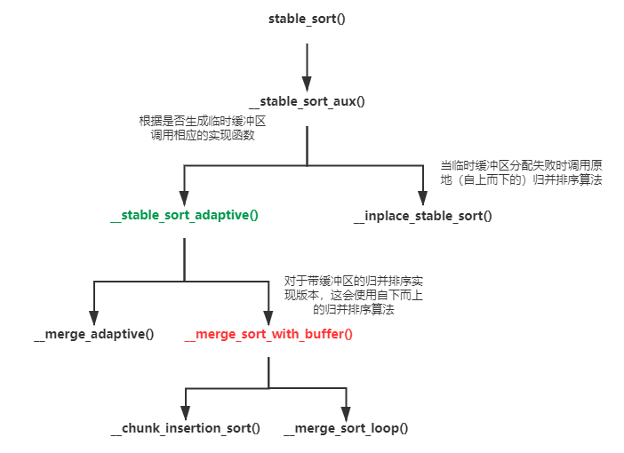

## 6. 算法

### 6.1 算法库纵览


在本章中，除了上述较新标准和C库下的算法实现没有在书中提到之外，基本上都可以在书中找到。不过并不是每一个算法都值得我们特别注意，事实上，我们阅读源代码的目的更多为了学习一些比较重要算法的思想和SGI STL为实现之而使用的编程技法，因此在这里我仅仅列出如下一些个人觉得值得学习的算法：

|       算法类型       |                            算法名                            |
| :------------------: | :----------------------------------------------------------: |
|       数值算法       |                       `power`(SGI专属)                       |
|      非质变算法      |                     `search`、`find_end`                     |
|       质变算法       |                       `copy`、`rotate`                       |
|       集合操作       | `set_union`、`set_intersection`、`set_difference`、  `set_symmetric_difference`、`includes`、`merge`、`inplace_merge` |
|       划分操作       |                         `partition`                          |
|       排序操作       |    `partial_sort`、`sort`、`nth_element`、`stable_sort()`    |
|       排列操作       |            `next_permutation`、`pre_permutation`             |
|     二分搜索操作     | `lower_bound`、`upper_bound`、`equal_range`、`binary_search` |
|        堆操作        |                              略                              |
|    最小/大值操作     |                              略                              |
| 未初始化存储上的操作 |                              略                              |


### 6.2 算法的一般形式

一般而言，STL的算法几乎都有着如下的形式和规范：

- 大多数的算法的前两个参数都是一对迭代器，采用前闭后开的表示方法，用来以指出算法的操作区间；
- 许多STL算法都会进行重载，提供至少两个版本，一个版本采用默认的运算，另一个版本可以允许用户提供一个可调用对象，以作为自定义策略使用。而且有些算法还会在算法名的尾部加后缀`_if`进行标识；
- 质变算法通常提供两个版本：①一个in-place（原地进行）版本，例如`sort()`算法就是典型的原地质变算法；②一个copy版本，这种版本的算法进行会在名字的尾部加以`_copy`标识，允许将执行的结果拷贝到一个指定的容器之中。


### 6.3 各算法实现

C++算法库中的大部分算法实现都主要集中在[stl_algo.h](stl_algo.h)、[stl_algobase.h](stl_algobase.h)、[stl_numeric.h](stl_numeric.h)、[stl_heap.h](stl_heap.h)这几个头文件中，从源文件的角度上讲这些算法可以分成普通算法、基础算法、数值算法等类型，但是这里在展开解释的时候还是主要按照上述cppreference的一般分类来进行。

#### 6.3.1 数值算法

##### 6.3.1.1 power

该乘幂算法只支持对正次幂的计算，不过稍微改造下就可以支持对负次幂的计算。这个算法其实利用到了幂次运算的分解原理（仅举了一个特例）：
$$
x^{13}=x^{1101_2}=x^{1000_2}\times{x^{0100_2}}\times{x^{0001_2}}
$$
根据这个递推关系，对于x的13（二进制1101）次方，我们其实可以先计算，这个值既需要保留以用做计算最后结果，而且还可以用来计算下一个分解式，即存在一值多用。这也便是下面有两个while的缘故，其中第一个while就是用来计算最小的分解式，而第二个while是用来计算后续的更大的分解式，并将每一个分解式乘到result之中。

```c++
 template<class T, class Integer, class MonoidOperatoion>
 T power(T x, Integer n, MonoidOperatoion op) {
     if (n == 0) return 1;
     else {
         while ((n & 1) == 0) {
             n >>= 1;
             x = op(x, x);
         }
 
         T result = x;
         n >>= 1;
         while (n != 0) {
             x = op(x, x);
             if ((n & 1) != 0)
                 result = op(result, x);
             n >>= 1;
         }
         return result;
     }
 }
 
 template<class T, class Integer>
 inline T power(T x, Integer n) {
     return power(x, n, multiplies<T>());
 }
```

这个算法与《剑指offer》面试题16的查考知识点相同。其实这种算法可以用更简单的代码进行编写，如下：

```c++
double myPow(double x, int n) {
  if (x == 0.0) return x;

  double result = 1.0;
  long m = abs(n);
  if (n < 0) x = 1 / x;
  while (m > 0) {
	if (m & 0x1) result *= x;
	m >>= 1;
	x *= x;
  }
  return result;
}
```


#### 6.3.2 非质变算法

##### 6.3.2.1 search

SGI STL中的`search()`算法采用的是典型的暴力搜索方法。对于一个大序列X和小序列x而言，它首先会在大序列X中查找与小序列x第一个元素相同的元素，然后在这个元素之后挨个匹配大序列与小序列的元素，直到完全匹配；否则重新在剩下的序列中执行上面的操作。

```c++
 template <class _ForwardIter1, class _ForwardIter2>
 _ForwardIter1 search(_ForwardIter1 __first1, _ForwardIter1 __last1,
                      _ForwardIter2 __first2, _ForwardIter2 __last2) 
 {
   // Test for empty ranges
   if (__first1 == __last1 || __first2 == __last2)
     return __first1;
 
   // Test for a pattern of length 1.
   _ForwardIter2 __tmp(__first2);
   ++__tmp;
   if (__tmp == __last2)
     return find(__first1, __last1, *__first2);
 
   // General case.
 
   _ForwardIter2 __p1, __p;
   __p1 = __first2; ++__p1;
   _ForwardIter1 __current = __first1;
   // 这里采用的就是暴力搜索法
   while (__first1 != __last1) {
     __first1 = find(__first1, __last1, *__first2);
     if (__first1 == __last1)
       return __last1;
 
     __p = __p1;
     __current = __first1; 
     if (++__current == __last1)
       return __last1;
 
     while (*__current == *__p) {
       // 若所有元素都对上了，则返回该模式序列在欲查找序列上的首元素迭代器
       if (++__p == __last2)
         return __first1;
       if (++__current == __last1)
         return __last1;
     }
 
     ++__first1;
   }
   return __first1;
 }
```


##### 6.3.2.2 find_end

`find_end()`算法会在大序列中找出小序列在其中最后一次出现的首迭代器。它的原理也非常简单，就是不断地使用`search()`算法，若在大序列中找到一个与小序列对应的子序列，那么就继续调用`search()`直到再也找不到。那么最后一次所找到的对应子序列的首迭代器就是我们所期望的结果。

```c++
 template <class _ForwardIter1, class _ForwardIter2>
 _ForwardIter1 __find_end(_ForwardIter1 __first1, _ForwardIter1 __last1,
                          _ForwardIter2 __first2, _ForwardIter2 __last2,
                          forward_iterator_tag, forward_iterator_tag)
 {
   if (__first2 == __last2)
     return __last1;
   else {
     _ForwardIter1 __result = __last1;
     while (1) {
       _ForwardIter1 __new_result
         = search(__first1, __last1, __first2, __last2);
       if (__new_result == __last1)
         return __result;
       else {
         __result = __new_result;
         __first1 = __new_result;
         ++__first1;
       }
     }
   }
 }
```


#### 6.3.3 质变算法

##### 6.3.3.1 copy

SGI STL V3.3上的`copy()`算法实现乍看之下和《STL源码剖析》中的代码不一样，但实际上两者并没有什么特殊的区别，反而觉得SGI STL V3.3显得更稍显得巧妙。它是典型的学习C++模板技法、静态多态/函数匹配（解析）机制的好例子。


在原先的（也即《STL源码剖析》）实现中，`copy()`会按照如上图所示的顺序（假设`copy()`的特化版本不使用）进行调用：

1. 首先根据模板实参推断的结果调用拷贝分派器`__copy_dispatch`中的静态成员函数`__copy()`，若是原始指针类型，则会调用它的偏特化版本；否则调用泛化版本。
2. 对于泛化版本，它会根据迭代器的类型由编译器选择InputIterator版本的`__copy()`实现函数，或者选择RandomAccessIterator版本的`__copy()`实现函数，而后者又会调用一个叫做`__copy_d()`的函数完成真正的操作。对于泛化版本的拷贝实现，我们有一点是可以确认的：那就是它们都会调用拷贝元素的非平凡（有实际意义）拷贝赋值运算符来完成拷贝工作。
3. 而对于指针特化版本而言，它会根据指针所指向的元素类型支持非平凡trivial拷贝赋值运算符的与否来选择相应的`__copy_t()`（t代表trivial）版本。若指针指向元素类型不支持non-trivial拷贝运算符，那么编译器就会选择实际以`memmove()`完成拷贝工作的`__copy_t()`版本；而若指针指向的元素类型支持non-trivial拷贝赋值运算符，那么编译器就会为其选择实际以调用`__copy_d()`完成拷贝工作的`__copy_t()`版本。

由于实际上这个版本的SGI STL `copy()`实现略显复杂。当算法的前两个传入参数为指向支持non-trivial拷贝赋值运算符元素类型的指针时，其所调用的偏特化`__copy_dispatch::__copy_t()`绕了一大圈竟然还是最后调用了模板参数为`template<class _RandomAccessIterator ....>`的`__copy_d()`函数😂！何必呢？！

所以SGI STL V3.3中的`copy()`实现直接改了，它直接将迭代器指向元素是否支持non-trivial拷贝赋值运算符的特性提取工作放到了一开始的`copy()`入口函数中！**1）**若一个迭代器或者指针指向的元素支持non-trivial拷贝赋值运算符，那么编译器就只会为其选择泛化版本的`__copy_dispatch::copy()`静态成员函数；**2）**若不支持non-trivial拷贝赋值运算符但迭代器也不是原始指针，那么也会选择泛化版本；**3）**但若输入的不仅是一个指针而且指针指向的元素类型也不支持non-trivial的拷贝赋值运算符，那么编译器会为其选择指针偏特化的版本。这种逻辑相比于《STL源码剖析》上所述的`copy()`实现简洁了很多，而且安全可靠些，具体如下图所示：


```c++
 template <class _InputIter, class _OutputIter, class _Distance>
 inline _OutputIter __copy(_InputIter __first, _InputIter __last,
                           _OutputIter __result,
                           input_iterator_tag, _Distance*)
 {
   for ( ; __first != __last; ++__result, ++__first)
     *__result = *__first;
   return __result;
 }
 
 template <class _RandomAccessIter, class _OutputIter, class _Distance>
 inline _OutputIter
 __copy(_RandomAccessIter __first, _RandomAccessIter __last,
        _OutputIter __result, random_access_iterator_tag, _Distance*)
 {
   for (_Distance __n = __last - __first; __n > 0; --__n) {
     *__result = *__first;
     ++__first;
     ++__result;
   }
   return __result;
 }
 
 template <class _Tp>
 inline _Tp*
 __copy_trivial(const _Tp* __first, const _Tp* __last, _Tp* __result) {
   memmove(__result, __first, sizeof(_Tp) * (__last - __first));
   return __result + (__last - __first);
 }
 
 template <class _InputIter, class _OutputIter, class _BoolType>
 struct __copy_dispatch {
   static _OutputIter copy(_InputIter __first, _InputIter __last,
                           _OutputIter __result) {
     typedef typename iterator_traits<_InputIter>::iterator_category _Category;
     typedef typename iterator_traits<_InputIter>::difference_type _Distance;
     return __copy(__first, __last, __result, _Category(), (_Distance*) 0);
   }
 };
 
 template <class _Tp>
 struct __copy_dispatch<_Tp*, _Tp*, __true_type>
 {
   static _Tp* copy(const _Tp* __first, const _Tp* __last, _Tp* __result) {
     return __copy_trivial(__first, __last, __result);
   }
 };
 
 template <class _Tp>
 struct __copy_dispatch<const _Tp*, _Tp*, __true_type>
 {
   static _Tp* copy(const _Tp* __first, const _Tp* __last, _Tp* __result) {
     return __copy_trivial(__first, __last, __result);
   }
 };
 
 template <class _InputIter, class _OutputIter>
 inline _OutputIter copy(_InputIter __first, _InputIter __last,
                         _OutputIter __result) {
   typedef typename iterator_traits<_InputIter>::value_type _Tp;
   typedef typename __type_traits<_Tp>::has_trivial_assignment_operator
           _Trivial;
   return __copy_dispatch<_InputIter, _OutputIter, _Trivial>
     ::copy(__first, __last, __result);
 }
```


##### 6.3.3.2 rotate

`rotate()`算法适用于随机访问迭代器的版本理解起来比较复杂，我暂时没看懂。不过适用于前向和双向迭代器的版本还是比较好理解的。个人这部分的总结还是看书吧，侯捷老师已经写的不错了。

> 《剑指offer》中有一道题和这个序列的旋转有关，主要是求旋转数组中的最小值，即面试题11。后来发现还有面试题58。

```c++
 template <class _EuclideanRingElement>
 _EuclideanRingElement __gcd(_EuclideanRingElement __m,
                             _EuclideanRingElement __n)
 {
   while (__n != 0) {
     _EuclideanRingElement __t = __m % __n;
     __m = __n;
     __n = __t;
   }
   return __m;
 }
 
 template <class _ForwardIter, class _Distance>
 _ForwardIter __rotate(_ForwardIter __first,
                       _ForwardIter __middle,
                       _ForwardIter __last,
                       _Distance*,
                       forward_iterator_tag) {
   if (__first == __middle)
     return __last;
   if (__last  == __middle)
     return __first;
 
   _ForwardIter __first2 = __middle;
   do {
     swap(*__first++, *__first2++);
     if (__first == __middle)
       __middle = __first2;
   } while (__first2 != __last);
 
   _ForwardIter __new_middle = __first;
 
   __first2 = __middle;
 
   while (__first2 != __last) {
     swap (*__first++, *__first2++);
     if (__first == __middle)
       __middle = __first2;
     else if (__first2 == __last)
       __first2 = __middle;
   }
 
   return __new_middle;
 }
 
 
 template <class _BidirectionalIter, class _Distance>
 _BidirectionalIter __rotate(_BidirectionalIter __first,
                             _BidirectionalIter __middle,
                             _BidirectionalIter __last,
                             _Distance*,
                             bidirectional_iterator_tag) {
   if (__first == __middle)
     return __last;
   if (__last  == __middle)
     return __first;
 
   __reverse(__first,  __middle, bidirectional_iterator_tag());
   __reverse(__middle, __last,   bidirectional_iterator_tag());
   
   /* 下面的实现就是等于：reverse(_first,__middle,bidirectional_iterator_tag());
     只不过这里需要返回旋转数组第二部分首元素的迭代器罢了 */
   while (__first != __middle && __middle != __last)
     swap (*__first++, *--__last);
 
   if (__first == __middle) {
     __reverse(__middle, __last,   bidirectional_iterator_tag());
     return __last;
   }
   else {
     __reverse(__first,  __middle, bidirectional_iterator_tag());
     return __first;
   }
 }
 
 template <class _RandomAccessIter, class _Distance, class _Tp>
 _RandomAccessIter __rotate(_RandomAccessIter __first,
                            _RandomAccessIter __middle,
                            _RandomAccessIter __last,
                            _Distance *, _Tp *) {
   /* 下面这个我暂时不理解 */
   _Distance __n = __last   - __first;
   _Distance __k = __middle - __first;
   _Distance __l = __n - __k;
   _RandomAccessIter __result = __first + (__last - __middle);
 
   if (__k == 0)
     return __last;
 
   else if (__k == __l) {
     swap_ranges(__first, __middle, __middle);
     return __result;
   }
 
   _Distance __d = __gcd(__n, __k);
 
   for (_Distance __i = 0; __i < __d; __i++) {
     _Tp __tmp = *__first;
     _RandomAccessIter __p = __first;
 
     if (__k < __l) {
       for (_Distance __j = 0; __j < __l/__d; __j++) {
         if (__p > __first + __l) {
           *__p = *(__p - __l);
           __p -= __l;
         }
 
         *__p = *(__p + __k);
         __p += __k;
       }
     }
 
     else {
       for (_Distance __j = 0; __j < __k/__d - 1; __j ++) {
         if (__p < __last - __k) {
           *__p = *(__p + __k);
           __p += __k;
         }
 
         *__p = * (__p - __l);
         __p -= __l;
       }
     }
 
     *__p = __tmp;
     ++__first;
   }
 
   return __result;
 }
 
 template <class _ForwardIter>
 inline _ForwardIter rotate(_ForwardIter __first, _ForwardIter __middle,
                            _ForwardIter __last) {
   return __rotate(__first, __middle, __last,
                   __DISTANCE_TYPE(__first),
                   __ITERATOR_CATEGORY(__first));
 }
```


#### 6.3.4 ==集合操作==

##### 6.3.4.1 set_union

取并集的实现比较好理解，即序列中若两个指针指向的元素相同，那么同时步进，否则只步进值小的那个。

```c++
template <class _InputIter1, class _InputIter2, class _OutputIter>
_OutputIter set_union(_InputIter1 __first1, _InputIter1 __last1,
                      _InputIter2 __first2, _InputIter2 __last2,
                      _OutputIter __result) {
  while (__first1 != __last1 && __first2 != __last2) {
    if (*__first1 < *__first2) {
      *__result = *__first1;
      ++__first1;
    }
    else if (*__first2 < *__first1) {
      *__result = *__first2;
      ++__first2;
    }
    else {
      *__result = *__first1;
      ++__first1;
      ++__first2;
    }
    ++__result;
  }
  // 这个技巧蛮有意思的
  return copy(__first2, __last2, copy(__first1, __last1, __result));
}
```


##### 6.3.4.2 includes

算法`include()`用来检查序列二[first2，last2)是否包含在序列一[first1，last1)中，它的实现理解可能很简单，但我觉得实际动手写可能思绪就有点错乱了。

```c++
template <class _InputIter1, class _InputIter2>
bool includes(_InputIter1 __first1, _InputIter1 __last1,
              _InputIter2 __first2, _InputIter2 __last2) {
  while (__first1 != __last1 && __first2 != __last2)
    if (*__first2 < *__first1)
      /* 即第二个序列还未在序列一中碰到与自己相同的元素就遇到了一个比自己大的元素，
      	那么说明第二个序列中并没有这个元素的存在，也即序列一并没有include序列二 */
      return false;
    else if(*__first1 < *__first2) 
      ++__first1;
    else
      ++__first1, ++__first2;

  // 跳出循环后检查序列二是否到尾端了，若没有到说明序列二中有序列一没有的元素
  return __first2 == __last2;
}
```


##### 6.3.4.3 merge

```c++
template <class _InputIter1, class _InputIter2, class _OutputIter>
_OutputIter merge(_InputIter1 __first1, _InputIter1 __last1,
                  _InputIter2 __first2, _InputIter2 __last2,
                  _OutputIter __result) {
  while (__first1 != __last1 && __first2 != __last2) {
    if (*__first2 < *__first1) {
      *__result = *__first2;
      ++__first2;
    }
    else {
      *__result = *__first1;
      ++__first1;
    }
    ++__result;
  }
  return copy(__first2, __last2, copy(__first1, __last1, __result));
}
```


##### 6.3.4.4 inplace_merge

算法`inplace_merge()`的目的是使两个连接在同一个序列的有序子序列[first，middle)和[middle，last)进行原地归并，完成后所有元素整体有序。该算法的实现略显复杂，主要分成两种实现方案，一种是需要借助临时缓冲区的原地归并方案，但是当临时缓冲区不能成功分配时就会被迫使用另一种无缓冲区帮助的原地归并方案。需要注意的是，即使临时缓冲区生成成功，也并不意味着原地归并算法就可以那么顺利的进行，因为生成的临时缓冲区空间很有可能不足！


在整个算法中，临时缓冲区的生成由`inplace_merge_aux()`辅助函数执行，若临时缓冲区生成成功，它就会自动调用`__merge_adaptive()`函数，对序列中的元素进行带临时缓冲区的原地归并：

1. 若临时缓冲区的空间>=前半部分子序列长度，那么就将前半部分的数据暂时拷贝到临时缓冲区中，然后调用`merge()`归并回；

2. 若临时缓冲区的空间<前半部分子序列长度但>=后半部分子序列的长度，那么就将后半部分的数据暂时拷贝到临时缓冲区中，然后调用`__merge_backward()`后向归并回；

3. 若临时缓冲区的空间不仅小于前部分子序列长度还小于后半部分的长度，那么就会进入最后一个else分支中，这个分支逻辑有一点复杂：

   ​		它首先会借助二分搜索等操作，将前半部分的子序列和后半部分的子序列进行划分，前面划分成[first，first_cut)和[first_cut，middle)两部分；后面划分成[middle，second_cut)和[second_cut，last)两部分，并能够保证[first_cut，middle)中的所有元素都是大于[middle，second_cut)子序列中的元素。

   ​		然后我们对[first_cut，second_cut)部分以middle为中心进行有缓冲区的旋转，即调用`__rotate_adaptive()`。完成后，这部分中的元素必然都是有序的，且对整体而言返回的new_middle前的元素必然都是小于new_middle后的元素！这样我们此时只需要对new_middle前半部分和后半部分递归调用`__merge_adaptive()`函数就可以完成相应的原地归并操作。具体如下图所示：


而当临时缓冲区生成失败时，`inplace_merge_aux()`辅助函数就会调用一个无需临时缓冲区就能够执行原地归并的实现函数`__merge_without_buffer()`。这个函数由于不使用临时缓冲区，所以效率相对于有缓冲区的归并实现函数差一些，不过它实现所借用的思想基本上和`__merge_adaptive()`如出一辙，所以不再赘述之。

```c++
template <class _BidirectionalIter, class _Distance>
void __merge_without_buffer(_BidirectionalIter __first,
                            _BidirectionalIter __middle,
                            _BidirectionalIter __last,
                            _Distance __len1, _Distance __len2) {
  if (__len1 == 0 || __len2 == 0)
    return;
  if (__len1 + __len2 == 2) {
    if (*__middle < *__first)
      iter_swap(__first, __middle);
    return;
  }
  /* 下面的实现类似于__merge_adative中针对缓冲区不足时的处理方式 */
  _BidirectionalIter __first_cut = __first;
  _BidirectionalIter __second_cut = __middle;
  _Distance __len11 = 0;
  _Distance __len22 = 0;
  if (__len1 > __len2) {
    __len11 = __len1 / 2;
    advance(__first_cut, __len11);
    __second_cut = lower_bound(__middle, __last, *__first_cut);
    distance(__middle, __second_cut, __len22);
  }
  else {
    __len22 = __len2 / 2;
    advance(__second_cut, __len22);
    __first_cut = upper_bound(__first, __middle, *__second_cut);
    distance(__first, __first_cut, __len11);
  }
  _BidirectionalIter __new_middle
    = rotate(__first_cut, __middle, __second_cut);
  __merge_without_buffer(__first, __first_cut, __new_middle,
                         __len11, __len22);
  __merge_without_buffer(__new_middle, __second_cut, __last, __len1 - __len11,
                         __len2 - __len22);
}

template <class _BidirectionalIter1, class _BidirectionalIter2,
          class _Distance>
_BidirectionalIter1 __rotate_adaptive(_BidirectionalIter1 __first,
                                      _BidirectionalIter1 __middle,
                                      _BidirectionalIter1 __last,
                                      _Distance __len1, _Distance __len2,
                                      _BidirectionalIter2 __buffer,
                                      _Distance __buffer_size) {
  _BidirectionalIter2 __buffer_end;
  if (__len1 > __len2 && __len2 <= __buffer_size) {
    __buffer_end = copy(__middle, __last, __buffer);
    copy_backward(__first, __middle, __last);
    return copy(__buffer, __buffer_end, __first);
  }
  else if (__len1 <= __buffer_size) {
    __buffer_end = copy(__first, __middle, __buffer);
    copy(__middle, __last, __first);
    return copy_backward(__buffer, __buffer_end, __last);
  }
  else
    return rotate(__first, __middle, __last);
}

template <class _BidirectionalIter1, class _BidirectionalIter2,
          class _BidirectionalIter3>
_BidirectionalIter3 __merge_backward(_BidirectionalIter1 __first1,
                                     _BidirectionalIter1 __last1,
                                     _BidirectionalIter2 __first2,
                                     _BidirectionalIter2 __last2,
                                     _BidirectionalIter3 __result) {
  if (__first1 == __last1)
    return copy_backward(__first2, __last2, __result);
  if (__first2 == __last2)
    return copy_backward(__first1, __last1, __result);
  --__last1;
  --__last2;
  while (true) {
    if (*__last2 < *__last1) {
      *--__result = *__last1;
      if (__first1 == __last1)
        return copy_backward(__first2, ++__last2, __result);
      --__last1;
    }
    else {
      *--__result = *__last2;
      if (__first2 == __last2)
        return copy_backward(__first1, ++__last1, __result);
      --__last2;
    }
  }
}

template <class _BidirectionalIter, class _Distance, class _Pointer>
void __merge_adaptive(_BidirectionalIter __first,
                      _BidirectionalIter __middle, 
                      _BidirectionalIter __last,
                      _Distance __len1, _Distance __len2,
                      _Pointer __buffer, _Distance __buffer_size) {
  //临时缓冲区足够存放前半部分序列
  if (__len1 <= __len2 && __len1 <= __buffer_size) {
    _Pointer __buffer_end = copy(__first, __middle, __buffer);
    merge(__buffer, __buffer_end, __middle, __last, __first);
  }
  //临时缓冲区足够存放后半部分序列
  else if (__len2 <= __buffer_size) {
    _Pointer __buffer_end = copy(__middle, __last, __buffer);
    __merge_backward(__first, __middle, __buffer, __buffer_end, __last);
  }
  //临时缓冲区空间不足，且空间同时小于len1和len2
  else {
    _BidirectionalIter __first_cut = __first;
    _BidirectionalIter __second_cut = __middle;
    _Distance __len11 = 0;
    _Distance __len22 = 0;
    if (__len1 > __len2) {
      __len11 = __len1 / 2;
      advance(__first_cut, __len11);
      __second_cut = lower_bound(__middle, __last, *__first_cut);
      distance(__middle, __second_cut, __len22); 
    }
    else {
      __len22 = __len2 / 2;
      advance(__second_cut, __len22);
      __first_cut = upper_bound(__first, __middle, *__second_cut);
      distance(__first, __first_cut, __len11);
    }
    /* 将[first_cut,second_cut)的元素以middle为中心进行旋转，
      旋转后[first_cut,second_cut)必然有序 */
    _BidirectionalIter __new_middle =
      __rotate_adaptive(__first_cut, __middle, __second_cut, __len1 - __len11,
                        __len22, __buffer, __buffer_size);
    //以递归调用方式处理左半段
    __merge_adaptive(__first, __first_cut, __new_middle, __len11,
                     __len22, __buffer, __buffer_size);
    //以递归调用方式处理右半段
    __merge_adaptive(__new_middle, __second_cut, __last, __len1 - __len11,
                     __len2 - __len22, __buffer, __buffer_size);
  }
}

template <class _BidirectionalIter1, class _BidirectionalIter2,
          class _BidirectionalIter3, class _Compare>
_BidirectionalIter3 __merge_backward(_BidirectionalIter1 __first1,
                                     _BidirectionalIter1 __last1,
                                     _BidirectionalIter2 __first2,
                                     _BidirectionalIter2 __last2,
                                     _BidirectionalIter3 __result,
                                     _Compare __comp) {
  if (__first1 == __last1)
    return copy_backward(__first2, __last2, __result);
  if (__first2 == __last2)
    return copy_backward(__first1, __last1, __result);
  --__last1;
  --__last2;
  while (true) {
    if (__comp(*__last2, *__last1)) {
      *--__result = *__last1;
      if (__first1 == __last1)
        return copy_backward(__first2, ++__last2, __result);
      --__last1;
    }
    else {
      *--__result = *__last2;
      if (__first2 == __last2)
        return copy_backward(__first1, ++__last1, __result);
      --__last2;
    }
  }
}

template <class _BidirectionalIter, class _Distance, class _Pointer>
void __merge_adaptive(_BidirectionalIter __first,
                      _BidirectionalIter __middle, 
                      _BidirectionalIter __last,
                      _Distance __len1, _Distance __len2,
                      _Pointer __buffer, _Distance __buffer_size) {
  //临时缓冲区足够存放前半部分序列
  if (__len1 <= __len2 && __len1 <= __buffer_size) {
    _Pointer __buffer_end = copy(__first, __middle, __buffer);
    merge(__buffer, __buffer_end, __middle, __last, __first);
  }
  //临时缓冲区足够存放后半部分序列
  else if (__len2 <= __buffer_size) {
    _Pointer __buffer_end = copy(__middle, __last, __buffer);
    __merge_backward(__first, __middle, __buffer, __buffer_end, __last);
  }
  //临时缓冲区空间不足，且空间同时小于len1和len2
  else {
    _BidirectionalIter __first_cut = __first;
    _BidirectionalIter __second_cut = __middle;
    _Distance __len11 = 0;
    _Distance __len22 = 0;
    if (__len1 > __len2) {
      __len11 = __len1 / 2;
      advance(__first_cut, __len11);
      __second_cut = lower_bound(__middle, __last, *__first_cut);
      distance(__middle, __second_cut, __len22); 
    }
    else {
      __len22 = __len2 / 2;
      advance(__second_cut, __len22);
      __first_cut = upper_bound(__first, __middle, *__second_cut);
      distance(__first, __first_cut, __len11);
    }
    /* 将[first_cut, second_cut)的元素以middle为中心进行旋转，这部分的元素必然有序，
      且new_middle前的元素必然都是小于new_middle后的元素！ */
    _BidirectionalIter __new_middle =
      __rotate_adaptive(__first_cut, __middle, __second_cut, __len1 - __len11,
                        __len22, __buffer, __buffer_size);
    //递归处理new_middle左侧半部分
    __merge_adaptive(__first, __first_cut, __new_middle, __len11,
                     __len22, __buffer, __buffer_size);
    //递归处理new_middle右侧半部分
    __merge_adaptive(__new_middle, __second_cut, __last, __len1 - __len11,
                     __len2 - __len22, __buffer, __buffer_size);
  }
}

template <class _BidirectionalIter, class _Tp, class _Distance>
inline void __inplace_merge_aux(_BidirectionalIter __first,
                                _BidirectionalIter __middle,
                                _BidirectionalIter __last, _Tp*, _Distance*) {
  _Distance __len1 = 0;
  distance(__first, __middle, __len1);
  _Distance __len2 = 0;
  distance(__middle, __last, __len2);

  //试图生成临时缓冲区，但有可能不成功！
  _Temporary_buffer<_BidirectionalIter, _Tp> __buf(__first, __last);
  if (__buf.begin() == 0)
    __merge_without_buffer(__first, __middle, __last, __len1, __len2);
  else
    __merge_adaptive(__first, __middle, __last, __len1, __len2,
                     __buf.begin(), _Distance(__buf.size()));
}

template <class _BidirectionalIter>
inline void inplace_merge(_BidirectionalIter __first,
                          _BidirectionalIter __middle,
                          _BidirectionalIter __last) {
  if (__first == __middle || __middle == __last)
    return;
  __inplace_merge_aux(__first, __middle, __last,
                      __VALUE_TYPE(__first), __DISTANCE_TYPE(__first));
}
```


#### 6.3.5 ==划分操作==

##### 6.3.5.1 partition

对于`partition()`风格算法的实现有两个版本，其中一个版本是适用于前向迭代器的，它所采用的方法为**快慢指针**，即快指针一旦遇到个符合要求的元素就与慢指针指向的元素交换，其中慢指针一定指向符合要求的元素，但它的前面一定都是符合要求的元素。而另一个版本是适用于随机访问迭代器的，它所采用的方法为**双指针**，一个当遇到符合要求的元素时往前进（++），一个遇到不符合要求的元素时往后进（--），都停下时就交换元素。

> 《剑指offer》面试题21就是在考察这两个知识点。

```c++
template <class _ForwardIter, class _Predicate>
_ForwardIter __partition(_ForwardIter __first,
		         _ForwardIter __last,
			 _Predicate   __pred,
			 forward_iterator_tag) {
  if (__first == __last) return __first;

  /* 跳过第一块符合pred谓词要求的元素部分 */
  while (__pred(*__first))
    if (++__first == __last) return __first;

  _ForwardIter __next = __first;

  /* 一旦next遇到符合pred谓词要求的就与first交换指向的元素
    ，直到末尾 */
  while (++__next != __last)
    if (__pred(*__next)) {
      swap(*__first, *__next);
      ++__first;
    }

  return __first;
}

template <class _BidirectionalIter, class _Predicate>
_BidirectionalIter __partition(_BidirectionalIter __first,
                               _BidirectionalIter __last,
			       _Predicate __pred,
			       bidirectional_iterator_tag) {
  /* 这种实现思想类似于《算法4》中的partition */
  while (true) {
    /* first迭代器向前进，直到遇到一个不满足pred谓词要求的元素停下 */
    while (true)
      if (__first == __last)
        return __first;
      else if (__pred(*__first))
        ++__first;
      else
        break;
    /* last迭代器向后进，直到遇到一个符合pred谓词要求的元素停下 */
    --__last;
    while (true)
      if (__first == __last)
        return __first;
      else if (!__pred(*__last))
        --__last;
      else
        break;
    //最后交换first和last指向的元素
    iter_swap(__first, __last);
    ++__first;
  }
}

template <class _ForwardIter, class _Predicate>
inline _ForwardIter partition(_ForwardIter __first,
   			      _ForwardIter __last,
			      _Predicate   __pred) {
  return __partition(__first, __last, __pred, __ITERATOR_CATEGORY(__first));
}
```


#### 6.3.6 ==二分搜索操作==

显然，施以二分搜索操作的前提是迭代器给定的范围元素必须要求是有序的。

##### 6.3.6.1 lower_bound

`lower_bound()`算法使用的就是典型的二分查找，但它的特点就是即使遇到一个中间元素值与给定值的元素相等也要到前半部分找，直到遇到给定值前一个元素（不等于给定值）时通过++first得到序列的首迭代器或者应该插入位置的迭代器。关键代码的处理就在于`*__middle < __val`，而后面的`upper_bound()`算法的关键在于`__val < *__middle`！

```c++
template <class _ForwardIter, class _Tp, class _Distance>
_ForwardIter __lower_bound(_ForwardIter __first, _ForwardIter __last,
                           const _Tp& __val, _Distance*) 
{
  _Distance __len = 0;
  distance(__first, __last, __len);
  _Distance __half;
  _ForwardIter __middle;

  while (__len > 0) {
    __half = __len >> 1;
    __middle = __first;
    advance(__middle, __half);
    // 若中间元素值小于val，则到后半部分找
    if (*__middle < __val) {
      __first = __middle;
      ++__first;
      __len = __len - __half - 1;
    }
    // 否则中间元素大于等于val就到前半部分找。它的想法是尽可能往前找
    else
      __len = __half;
  }
  return __first;
}

template <class _ForwardIter, class _Tp>
inline _ForwardIter lower_bound(_ForwardIter __first, _ForwardIter __last,
				const _Tp& __val) {
  return __lower_bound(__first, __last, __val,
                       __DISTANCE_TYPE(__first));
}
```


##### 6.3.6.2 upper_bound

```c++
template <class _ForwardIter, class _Tp, class _Distance>
_ForwardIter __upper_bound(_ForwardIter __first, _ForwardIter __last,
                           const _Tp& __val, _Distance*)
{
  _Distance __len = 0;
  distance(__first, __last, __len);
  _Distance __half;
  _ForwardIter __middle;

  while (__len > 0) {
    __half = __len >> 1;
    __middle = __first;
    advance(__middle, __half);
    if (__val < *__middle)
      __len = __half;
    else {
      __first = __middle;
      ++__first;
      __len = __len - __half - 1;
    }
  }
  return __first;
}

template <class _ForwardIter, class _Tp>
inline _ForwardIter upper_bound(_ForwardIter __first, _ForwardIter __last,
                                const _Tp& __val) {
  return __upper_bound(__first, __last, __val,
                       __DISTANCE_TYPE(__first));
}
```


##### 6.3.6.3 equal_range

`equal_range()`算法的实现主要是借助上面的`lower_bound()`算法和`upper_bound()`算法间接实现的（当二分查找找到任意一个与给定值相等的元素时才调用这两者）。

```c++
template <class _ForwardIter, class _Tp, class _Distance>
pair<_ForwardIter, _ForwardIter>
__equal_range(_ForwardIter __first, _ForwardIter __last, const _Tp& __val,
              _Distance*)
{
  _Distance __len = 0;
  distance(__first, __last, __len);
  _Distance __half;
  _ForwardIter __middle, __left, __right;

  while (__len > 0) {
    __half = __len >> 1;
    __middle = __first;
    advance(__middle, __half);
    if (*__middle < __val) {
      __first = __middle;
      ++__first;
      __len = __len - __half - 1;
    }
    else if (__val < *__middle)
      __len = __half;
    else {
      // 在[first,middle)中找等于val区间的首元素迭代器
      __left = lower_bound(__first, __middle, __val);
      advance(__first, __len);
      // 在[middle+1,last)中找等于val区间的尾后元素迭代器
      __right = upper_bound(++__middle, __first, __val);
      return pair<_ForwardIter, _ForwardIter>(__left, __right);
    }
  }
  return pair<_ForwardIter, _ForwardIter>(__first, __first);
}

template <class _ForwardIter, class _Tp>
inline pair<_ForwardIter, _ForwardIter>
equal_range(_ForwardIter __first, _ForwardIter __last, const _Tp& __val) {
  return __equal_range(__first, __last, __val,
                       __DISTANCE_TYPE(__first));
}
```


##### 6.3.6.4 binary_search

二分查找操作`binary_search()`查找某个给定值是否存在于迭代器指定的范围内，实际上是由`lower_bound()`算法完成的，因为`lower_bound()`算法找到的元素必然是>=给定值的，而只要我们用!<方式证明找到的元素<=给定值，那么也就说明`lower_bound()`找到的值和给定的值相同。

```c++
template <class _ForwardIter, class _Tp>
bool binary_search(_ForwardIter __first, _ForwardIter __last,
                   const _Tp& __val) {
  _ForwardIter __i = lower_bound(__first, __last, __val);
  return __i != __last && !(__val < *__i);
}
```


#### 6.3.7 排列操作

##### 6.3.7.1 next_permutation

`next_permutation()`和下面的`pre_permutation()`实际都是排列组合问题，例如求给定序列{1，2，3，4，5}的下一序列，结果为{1，2，3，5，4}。`next_permutation()`求下一个排序序列的核心思想应该就是尽可能将序列中从尾部找起的逆序子序列的前一个元素变大，例如{1，2，3，5，4}的下一个排列就是{1，2，4，5，3}，它就是在想让原先{5，4}前面的3尽可能变大。

至于具体的解释我不做赘述，因为书中侯捷老师讲的比我好，排列相关的算法也不常用，所以跳过。

```C++
template <class _BidirectionalIter>
bool next_permutation(_BidirectionalIter __first, _BidirectionalIter __last) {
  if (__first == __last)
    return false;
  _BidirectionalIter __i = __first;
  ++__i;
  if (__i == __last)
    return false;
  __i = __last;
  --__i;

  for(;;) {
    _BidirectionalIter __ii = __i;
    --__i;
    //从序列末尾开始找一个i，ii，使得*i < *ii
    if (*__i < *__ii) {
      //从序列末尾开始找一个j，使得*j >= *i
      _BidirectionalIter __j = __last;
      while (!(*__i < *--__j))
        {}
      iter_swap(__i, __j);
      reverse(__ii, __last);
      return true;
    }
    if (__i == __first) {
      reverse(__first, __last);
      return false;
    }
  }
}
```

> 《剑指offer》的第38题就是在考察该算法知识点。


##### 6.3.7.2 pre_permutation

```c++
template <class _BidirectionalIter>
bool prev_permutation(_BidirectionalIter __first, _BidirectionalIter __last) {
  if (__first == __last)
    return false;
  _BidirectionalIter __i = __first;
  ++__i;
  if (__i == __last)
    return false;
  __i = __last;
  --__i;

  for(;;) {
    /* 向后步进i、ii */
    _BidirectionalIter __ii = __i;
    --__i;
    if (*__ii < *__i) {
      _BidirectionalIter __j = __last;
      while (!(*--__j < *__i))
        {}
      iter_swap(__i, __j);
      reverse(__ii, __last);
      return true;
    }
    if (__i == __first) {
      reverse(__first, __last);
      return false;
    }
  }
}
```


#### 6.3.8 ==排序操作==

##### 6.3.8.1 partial_sort

`partital_sort()`算法最常见的使用目的就是将给定序列[first,last)中的middle-first个最小元素以递增顺序排列在原始序列的[first,middle)位置内。换句话说，就是使用它来提取出序列中的最小几个元素，并将它们重新放置在最前面的位置，而剩余位置上的元素顺序不做保证。这个算法主要借助堆算法而实现，比较简单，过程如下：

1. 首先它使得[first，middle)转换成最大堆，然后开始在middle后面的元素中找寻比最大堆堆顶元素要小的元素，我们使用i来标识这个需要到其中遍历的迭代器；
2. 若迭代器在游走的过程中找到了比堆顶元素更小的元素，那么它就会调用`__pop_heap()`操作将堆顶元素放到迭代器i指向的位置中，而原先i指向的元素会被加入到最大堆中；
3. 当i遍历到last时结束循环，此时调用`sort_heap()`将前面[first，middle)最大堆转换为从小到大的排列。

> 注意这个`__pop_heap()`算法和`pop_heap()`算法是两码事，它并不会将最大堆的长度缩小，更可以认为是一个剔除堆顶元素并加入新的元素到堆顶中的算法。而它内部调用的`__adjust_heap()`算法也正说明这个算法的实现重在“调整”而非删除，如果看过相关源代码就会发现所谓的删除更应该是`__pop_heap_aux()`的任务。

```c++
template <class _RandomAccessIter, class _Tp>
void __partial_sort(_RandomAccessIter __first, _RandomAccessIter __middle,
                    _RandomAccessIter __last, _Tp*) {
  make_heap(__first, __middle);
  for (_RandomAccessIter __i = __middle; __i < __last; ++__i)
    if (*__i < *__first) 
      __pop_heap(__first, __middle, __i, _Tp(*__i),
                 __DISTANCE_TYPE(__first));
  sort_heap(__first, __middle);
}

template <class _RandomAccessIter>
inline void partial_sort(_RandomAccessIter __first,
                         _RandomAccessIter __middle,
                         _RandomAccessIter __last) {
  __partial_sort(__first, __middle, __last, __VALUE_TYPE(__first));
}
```

具体有如下实例所示：


##### 6.3.8.2 sort

在SGI STL中，默认的`sort()`排序操作启用的并不是快速排序，而是[传统三取样+插入排序辅助的快速排序](https://github.com/Ye-zixiao/My-Algorithms/blob/master/Algs4/chaps/2.Sort.md)的一种改进版本，名为*IntroSort*。之所以这样做，主要的考量还在于期望尽可能减少执行快速排序划分partition操作过程中的递归层次，虽然三取样+设置阈值转插入排序的快速排序方法足够有效，但是阈值的选择带来执行效率的上升本身就是就是视不同的机器而不同的，固定的人为选定的阈值很难保证足够好的性能。因此开发人员选择了更为优秀的内省式排序*IntroSort*。


由于IntroSort仅仅是对传统三取样+插入排序辅助的快速排序的改进而已，所以算法的大部分原理并不需要重新解释。它最大的不同就是引入了一个名为`__lg()`函数，如其名可以知道它其实就是在计算$log_2{数据规模}$，其结果用来限制划分操作`__unguarded_partition()`的递归层数。如果划分的层数超过了这一上限就会转而调用堆排序`partial_sort()`来完成剩下元素的排序，前提是这个子序列的长度大于一个固定阈值`__stl_threshold`。如果子序列长度小于这个阈值，那么就跳出`__introsort_loop()`，把剩下整体几近有序的序列都交给最后的插入排序完成剩下的排序作业。这样说来，IntroSort其实就是快速排序+堆排序+插入排序的整合（终极无敌粘合怪😋）！执行过程如下图示：


```c++
/* 在没有边界防护的情况下进行一次插入操作 */
template <class _RandomAccessIter, class _Tp>
void __unguarded_linear_insert(_RandomAccessIter __last, _Tp __val) {
  _RandomAccessIter __next = __last;
  --__next;
  while (__val < *__next) {
    *__last = *__next;
    __last = __next;
    --__next;
  }
  *__last = __val;
}

template <class _RandomAccessIter, class _Tp>
inline void __linear_insert(_RandomAccessIter __first, 
                            _RandomAccessIter __last, _Tp*) {
  _Tp __val = *__last;
  /* 若last尾元素小于前面已有序数据的最小值，那么直接调用copy_backward()
    会比调用__unguarded_linear_insert()更为高效；否则调用后者从尾到前逐一
    比较再插入 */
  if (__val < *__first) {
    copy_backward(__first, __last, __last + 1);
    *__first = __val;
  }
  else
    __unguarded_linear_insert(__last, __val);
}

// 插入排序
template <class _RandomAccessIter>
void __insertion_sort(_RandomAccessIter __first, _RandomAccessIter __last) {
  if (__first == __last) return; 
  for (_RandomAccessIter __i = __first + 1; __i != __last; ++__i)
    __linear_insert(__first, __i, __VALUE_TYPE(__first));
}

template <class _RandomAccessIter, class _Tp>
void __unguarded_insertion_sort_aux(_RandomAccessIter __first, 
                                    _RandomAccessIter __last, _Tp*) {
  for (_RandomAccessIter __i = __first; __i != __last; ++__i)
    __unguarded_linear_insert(__i, _Tp(*__i));
}

template <class _RandomAccessIter>
inline void __unguarded_insertion_sort(_RandomAccessIter __first, 
                                _RandomAccessIter __last) {
  __unguarded_insertion_sort_aux(__first, __last, __VALUE_TYPE(__first));
}


template <class _RandomAccessIter>
void __final_insertion_sort(_RandomAccessIter __first, 
                            _RandomAccessIter __last) {
  if (__last - __first > __stl_threshold) {
    //先将前16个元素直接使用插入排序
    __insertion_sort(__first, __first + __stl_threshold);
    //然后逐个对剩下的元素以插入的方式插入到前面合适的地方，从而完成整体的插入排序
    __unguarded_insertion_sort(__first + __stl_threshold, __last);
  }
  else
    __insertion_sort(__first, __last);
}

template <class _RandomAccessIter, class _Tp, class _Size>
void __introsort_loop(_RandomAccessIter __first,
                      _RandomAccessIter __last, _Tp*,
                      _Size __depth_limit)
{
  while (__last - __first > __stl_threshold) {  //__stl_threshold==16
    if (__depth_limit == 0) {
      // 当分割次数超限后它就会自动调用堆排序来完成子序列的排序任务
      partial_sort(__first, __last, __last);
      return;
    }
    --__depth_limit;

    // 使用三取样切分方式
    _RandomAccessIter __cut =
      __unguarded_partition(__first, __last,
                            _Tp(__median(*__first,
                                         *(__first + (__last - __first)/2),
                                         *(__last - 1))));
    // 对于右半部分子序列进行递归调用，对于左半部分子序列重新进入迭代处理
    __introsort_loop(__cut, __last, (_Tp*) 0, __depth_limit);
    __last = __cut;
  }
}

template <class _RandomAccessIter>
inline void sort(_RandomAccessIter __first, _RandomAccessIter __last) {
  if (__first != __last) {
    __introsort_loop(__first, __last,
                     __VALUE_TYPE(__first),
                     __lg(__last - __first) * 2);
                   /* __lg()函数返回的值val用来告知调用的底层__introsort_loop()最多只能
                     对序列分割val次，防止出现分割恶化的现象 */
    // 当由快速排序差不多将序列几近有序状态后，就调用插入排序来完成最后的收尾排序工作
    __final_insertion_sort(__first, __last);
  }
}
```


##### 6.3.8.3 nth_element

`nth_element()`的目的主要是重新排列[first，last)，使得迭代器nth所指向的元素即是序列中的第n小元素。这是 一个很有趣的算法，甚至可以稍加改变成为一个算法题，例如“快速找到序列中的第k小的数”。

它的实现原理基于`parition()`划分操作思想。因为任意一个无序序列经过划分操作之后，在枢轴位置前的子序列元素必然都是小于枢轴元素的，而在枢轴位置后的子序列元素必然都是大于或等于枢轴元素的。如果一次划分后返回的枢轴元素迭代器<=迭代器nth，那么它就说明序列中的第n小元素不在前半部分而是在后半部分，这意味着下一次划分操作需要到后半部分序列中进行，否则就是在前半部分进行。

当最后划分操作进行的差不多（使得左区间迭代器first和右区间迭代器last相差<=3）时，就直接跳出while循环使用插入排序完成这小部分的排序，这样第n小的元素必然已经在nth迭代器指向的位置中。上述的过程如下面的实例所示：


```c++
template <class _RandomAccessIter, class _Tp>
void __nth_element(_RandomAccessIter __first, _RandomAccessIter __nth,
                   _RandomAccessIter __last, _Tp*) {
  while (__last - __first > 3) {
    _RandomAccessIter __cut =
      __unguarded_partition(__first, __last,
                            _Tp(__median(*__first,
                                         *(__first + (__last - __first)/2),
                                         *(__last - 1))));
    if (__cut <= __nth)
      __first = __cut;
    else 
      __last = __cut;
  }
  __insertion_sort(__first, __last);
}

template <class _RandomAccessIter>
inline void nth_element(_RandomAccessIter __first, _RandomAccessIter __nth,
                        _RandomAccessIter __last) {
  __nth_element(__first, __nth, __last, __VALUE_TYPE(__first));
}
```


##### 6.3.8.4 stable_sort

SGI STL中的稳定排序算法`stable_sort()`实际上主要是由归并排序和插入排序完成的。下面展示了该算法的入口函数与实现函数之间的调用关联：



从上面的图示结合下面的源代码，我们可以很容易的了解到稳定排序算法`stable_sort()`可以根据临时缓冲区的生成情况调用不同的实现函数（采用不同的实现策略）。其中临时缓冲区的分配是由辅助函数`__stable_sort_aux()`执行，若生成失败，它就会调用`__inplace_stable_sort()`使用自顶向下的归并排序策略（由于这部分的代码很好看懂，所以我不解释）；若生成成功，则它就会调用`__stable_sort_adaptive()`采用自底向上的归并排序策略，具体如下：

1. `__stable_sort_adaptive()`函数首先会判断序列一半的长度是否小于临时缓冲区的长度，若发现缓冲区空间不足，那么它就会递归调用自己处理序列的左半部分和右半部分。
2. 若缓冲区空间足够，则它会调用`__merge_sort_with_buffer()`处理序列的左半部分和右半部分，使它们两者有序。
3. 进入`__merge_sort_with_buffer()`后，该首先会调用一个名为`__chunk_insertion_sort()`对序列按照固定的间隔`__chunk_size`（这是一个全局常量）一块一块调用插入排序，使得每个格子范围内的元素变换成有序状态（即自底向上归并排序中的底部先有序）。
4. 接着`__merge_sort_with_buffer()`会以while循环的方式调用一个名为`__merge_sort_loop()`的函数，该函数会对上面底部已有序的数据执行两两归并的操作，这个归并结果会暂时存放在临时缓冲区；不过之后又会对这个临时结果再次执行两两归并的操作（在此之前会将间隔步长step_size增倍），并将这个结果存回原来序列所在的空间中。上述循环直到间隔步长超过了序列总长度才停止，结束后该范围内的元素变得整体有序。
5. 最后程序流又回到了`__stable_sort_adaptive()`的位置，此时左半部分和右半部分都已经变得有序，因为它就会调用`__merge_adaptive()`自适应归并算法将左半部分和右半部分归并，这样整个稳定排序算法也就结束了。具体自底向上归并排序的过程可以见下图所示：


```c++
template <class _RandomAccessIter>
void __inplace_stable_sort(_RandomAccessIter __first,
                           _RandomAccessIter __last) {
  //原地插入排序+归并排序
  if (__last - __first < 15) {
    __insertion_sort(__first, __last);
    return;
  }
  _RandomAccessIter __middle = __first + (__last - __first) / 2;
  __inplace_stable_sort(__first, __middle);
  __inplace_stable_sort(__middle, __last);
  //__merge_without_buffer()实现在inplace_merge()那里
  __merge_without_buffer(__first, __middle, __last,
                         __middle - __first,
                         __last - __middle);
}

template <class _RandomAccessIter1, class _RandomAccessIter2,
          class _Distance>
void __merge_sort_loop(_RandomAccessIter1 __first,
                       _RandomAccessIter1 __last, 
                       _RandomAccessIter2 __result, _Distance __step_size) {
  _Distance __two_step = 2 * __step_size;

  while (__last - __first >= __two_step) {
    __result = merge(__first, __first + __step_size,
                     __first + __step_size, __first + __two_step,
                     __result);
    __first += __two_step;
  }

  __step_size = min(_Distance(__last - __first), __step_size);
  merge(__first, __first + __step_size, __first + __step_size, __last,
        __result);
}

const int __stl_chunk_size = 7;
        
template <class _RandomAccessIter, class _Distance>
void __chunk_insertion_sort(_RandomAccessIter __first, 
                            _RandomAccessIter __last, _Distance __chunk_size)
{
  while (__last - __first >= __chunk_size) {
    __insertion_sort(__first, __first + __chunk_size);
    __first += __chunk_size;
  }
  __insertion_sort(__first, __last);
}

template <class _RandomAccessIter, class _Pointer, class _Distance>
void __merge_sort_with_buffer(_RandomAccessIter __first, 
                              _RandomAccessIter __last,
                              _Pointer __buffer, _Distance*) {
  _Distance __len = __last - __first;
  _Pointer __buffer_last = __buffer + __len;

  _Distance __step_size = __stl_chunk_size;
  /* 在[first,last)每隔一个chunk_size大小的区间做一次插入排序，是每一个区间内部有序 */
  __chunk_insertion_sort(__first, __last, __step_size);

  /* 逐一对大小为step_size的子序列自下而上进行两两归并 */
  while (__step_size < __len) {
    __merge_sort_loop(__first, __last, __buffer, __step_size);
    __step_size *= 2;
    __merge_sort_loop(__buffer, __buffer_last, __first, __step_size);
    __step_size *= 2;
  }
}

template <class _RandomAccessIter, class _Pointer, class _Distance>
void __stable_sort_adaptive(_RandomAccessIter __first, 
                            _RandomAccessIter __last, _Pointer __buffer,
                            _Distance __buffer_size) {
  _Distance __len = (__last - __first + 1) / 2;
  _RandomAccessIter __middle = __first + __len;
  if (__len > __buffer_size) {
    /* 若临时缓冲区不足，则分割前后部分进行递归，直到分割出来的子序列足够放到缓冲区中 */
    __stable_sort_adaptive(__first, __middle, __buffer, __buffer_size);
    __stable_sort_adaptive(__middle, __last, __buffer, __buffer_size);
  }
  else {
    /* 对前（后）部分进行归并排序，这里做的归并排序是自下而上的 */
    __merge_sort_with_buffer(__first, __middle, __buffer, (_Distance*)0);
    __merge_sort_with_buffer(__middle, __last, __buffer, (_Distance*)0);
  }
  //自适应归并前后部分，实现函数在merge()部分中，这里不展示
  __merge_adaptive(__first, __middle, __last, _Distance(__middle - __first), 
                   _Distance(__last - __middle), __buffer, __buffer_size);
}

template <class _RandomAccessIter, class _Tp, class _Distance>
inline void __stable_sort_aux(_RandomAccessIter __first,
                              _RandomAccessIter __last, _Tp*, _Distance*) {
  _Temporary_buffer<_RandomAccessIter, _Tp> buf(__first, __last);
  if (buf.begin() == 0)
    //若空间不足，则使用原地归并排序，这里用的是自上而下的归并排序
    __inplace_stable_sort(__first, __last);
  else 
    //否则使用带缓存的归并排序，这里用的是自下而上的归并排序
    __stable_sort_adaptive(__first, __last, buf.begin(),
                           _Distance(buf.size()));
}

template <class _RandomAccessIter>
inline void stable_sort(_RandomAccessIter __first,
                        _RandomAccessIter __last) {
  __stable_sort_aux(__first, __last,
                    __VALUE_TYPE(__first),
                    __DISTANCE_TYPE(__first));
}
```

