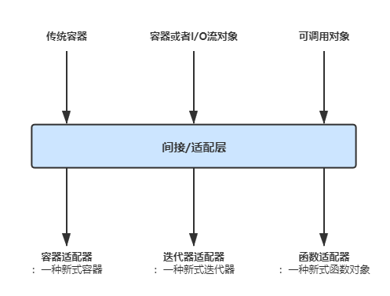
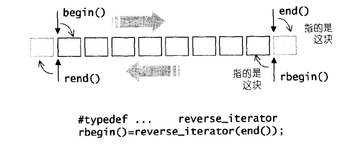

## 8. 适配器

适配器这一章节的内容符合《*Design Pattern*》中关于适配器模式的内容，就是在一个类到另一个目的需要适配出的类之间引入一个中间层，将它们进行封装改造。①对容器适配器而言就是将一个普通STL容器改造成另一种容器，②对于迭代器适配器而言就是将另一种类（实际中可能很宽泛）改造成功能类似于迭代器的类，③而对于函数适配器而言指的就是将一个可调用对象（以C++11的说法）稍加改造变换成另一种具有新功能的函数对象。如下图所示：



### 8.1 容器适配器

其实现思想就是在内部包含一个普通容器成员，然后进一步的封装。具体见前面[顺序容器](../3.Sequence-Container/Sequence-Container.md)章节。


### 8.2 ==迭代器适配器==

迭代器适配器的思想其实非常简单，我们可以认为它就是将某种C++中的实体通过封装改造的方式形成类似迭代器的事物。这种迭代器适配器并不一定要求其所关联的实体是一个容器，它更多的是指思想观念上的改变，例如将原先实体中的某一个操作改造成迭代器上++、--、=的动作。这样原先不支持传入到STL算法中的C++实体，就可以稍微改造下变成迭代器适配器后传入到STL算法中，从而安全正式的使用之。

在C++11中，迭代器适配器主要有如下四种类型：

|          迭代器类型           |                      功能                      |
| :---------------------------: | :--------------------------------------------: |
| 插入迭代器`insert_interator`  |    实现向插入迭代器赋值即是向容器插入的操作    |
| 反向迭代器`reverser_iterator` |          实现容器中元素反向遍历的途径          |
|   流迭代器`stream_iterator`   | 实现从输入流/向输出流中逐个输入/输出元素的操作 |
|   移动迭代器`move_iterator`   |    由C++11引入，返回容器中个元素的右值引用     |


#### 8.2.1 插入迭代器

插入迭代器细分之下又有三种类型：①后向插入迭代器；②前向插入迭代器；③普通插入迭代器。其实现思想就是在内部包含一个容器指针，从而通过重载赋值运算符来完成对容器的插入操作。

##### 8.2.1.1 后向插入迭代器

它们的主要实现方式就是通过一个指针指向容器，然后重载赋值运算符使算法在向其赋值时解引用该迭代器（但却返回自身）并赋值，而后者内部通过容器指针调用了相应的插入操作从而完成插入动作。我仅展示后向插入迭代器（其他不展示，因为它们的原理都是相同的）：

```c++
template <class _Container>
class back_insert_iterator {
protected:
  _Container* container;
public:
  typedef _Container          container_type;
  typedef output_iterator_tag iterator_category;
  typedef void                value_type;
  typedef void                difference_type;
  typedef void                pointer;
  typedef void                reference;

  explicit back_insert_iterator(_Container& __x) : container(&__x) {}
  back_insert_iterator<_Container>&
  operator=(const typename _Container::value_type& __value) { 
    container->push_back(__value);
    return *this;
  }
  /* 必须让解引用运算符返回自身引用，这样*riter=new_value;
    这样operator=操作才可以正常执行 */
  back_insert_iterator<_Container>& operator*() { return *this; }
  back_insert_iterator<_Container>& operator++() { return *this; }
  back_insert_iterator<_Container>& operator++(int) { return *this; }
};

template <class _Container>
inline output_iterator_tag
iterator_category(const back_insert_iterator<_Container>&)
{
  return output_iterator_tag();
}

template <class _Container>
inline back_insert_iterator<_Container> back_inserter(_Container& __x) {
  return back_insert_iterator<_Container>(__x);
}
```

该迭代器可以由后向迭代器适配器函数`back_inserter()`方便的创建出。


##### 8.2.1.2 前向插入迭代器

该迭代器可以由前向插入迭代器适配器函数`front_inserter()`方便的创建出。


##### 8.2.1.3 常规插入迭代器

该迭代器可以由常规插入迭代器适配器函数`inserter()`方便的创建出。


#### 8.2.2 反向迭代器

其实现思想就是在内部包含一个容器常规的迭代器，然后重载相关的迭代器操作（使得相关的迭代器操作与常规的迭代器相反）。不过需要注意的是，虽然反向迭代器在内部记录着一个容易常规意义上的正向迭代器，但它们两者逻辑上指向的元素并不相同。例如若reverse_iterator中存储一个指向容器尾后位置的正向迭代器，那么对于反向迭代器自身而言，它应该在逻辑上指向的是序列的最后一个元素，而不是尾后元素，如下图所示：



如果了解到这个细节的话，那么反向迭代器就没什么好说的了。

```c++
template <class _Iterator>
class reverse_iterator 
{
protected:
  _Iterator current;
public:
  typedef typename iterator_traits<_Iterator>::iterator_category
          iterator_category;
  typedef typename iterator_traits<_Iterator>::value_type
          value_type;
  typedef typename iterator_traits<_Iterator>::difference_type
          difference_type;
  typedef typename iterator_traits<_Iterator>::pointer
          pointer;
  typedef typename iterator_traits<_Iterator>::reference
          reference;

  typedef _Iterator iterator_type;
  typedef reverse_iterator<_Iterator> _Self;

public:
  reverse_iterator() {}
  explicit reverse_iterator(iterator_type __x) : current(__x) {}

  reverse_iterator(const _Self& __x) : current(__x.current) {}
#ifdef __STL_MEMBER_TEMPLATES
  template <class _Iter>
  reverse_iterator(const reverse_iterator<_Iter>& __x)
    : current(__x.base()) {}
#endif /* __STL_MEMBER_TEMPLATES */
    
  iterator_type base() const { return current; }
  reference operator*() const {
    _Iterator __tmp = current;
    return *--__tmp;
  }
#ifndef __SGI_STL_NO_ARROW_OPERATOR
  pointer operator->() const { return &(operator*()); }
#endif /* __SGI_STL_NO_ARROW_OPERATOR */

  _Self& operator++() {
    --current;
    return *this;
  }
  _Self operator++(int) {
    _Self __tmp = *this;
    --current;
    return __tmp;
  }
  _Self& operator--() {
    ++current;
    return *this;
  }
  _Self operator--(int) {
    _Self __tmp = *this;
    ++current;
    return __tmp;
  }

  _Self operator+(difference_type __n) const {
    return _Self(current - __n);
  }
  _Self& operator+=(difference_type __n) {
    current -= __n;
    return *this;
  }
  _Self operator-(difference_type __n) const {
    return _Self(current + __n);
  }
  _Self& operator-=(difference_type __n) {
    current += __n;
    return *this;
  }
  reference operator[](difference_type __n) const { return *(*this + __n); }  
}; 
```


#### 8.2.3 流迭代器

流迭代器部分的内容只介绍从`std::basic_istream`（`std::iosteram`）读取的输入迭代器和写入到`std::basic_ostream`（`std::ostream`）的输出流迭代器，至于从其他类型的流对象读入或者写入到其他流对象的流迭代器不再介绍。流迭代器从原理上讲其实现思想非常简单，就是在内部包含一个流对象指针，然后重载相关迭代器操作完成指定的目的。但是在一些具体的实现上讲，它们的内部可能存在一些经常让人忽略的细节。


##### 8.2.3.1 输入流迭代器

对于输入流迭代器而言，它会在内部记录着一个指向输入流对象的指针，并且还会定义出一个用来临时保存输入值的数据成员`_M_value`。

当用户对这个迭代器执行`operator++`操作时，输入流迭代器就会对指定的流对象执行`operator>>`输入操作，并将输入值暂时保存在`_M_value`中（这些输入的过程会在内部单独封装成`_M_read()`这一函数）。而当用户需要对输入流迭代器执行解引用操作的时候，它就会返回上一次输入暂时保存的值。

特别需要注意的时候，在输入流迭代器初始化的时候，构造函数会悄悄地调用`_M_read()`操作，这一点经常被忽视。

```c++
template <class _Tp, 
          class _CharT = char, class _Traits = char_traits<_CharT>,
          class _Dist = ptrdiff_t> 
class istream_iterator {
public:
  typedef _CharT                         char_type;
  typedef _Traits                        traits_type;
  typedef basic_istream<_CharT, _Traits> istream_type;

  typedef input_iterator_tag             iterator_category;
  typedef _Tp                            value_type;
  typedef _Dist                          difference_type;
  typedef const _Tp*                     pointer;
  typedef const _Tp&                     reference;

  istream_iterator() : _M_stream(0), _M_ok(false) {}
  istream_iterator(istream_type& __s) : _M_stream(&__s) { _M_read(); }
  //用输入流对象初始化istream_iterator会默默地调用一个潜在的_M_read()操作，这需要注意点

  reference operator*() const { return _M_value; }
  pointer operator->() const { return &(operator*()); }

  istream_iterator& operator++() { 
    //前进操作会引发数据输入操作
    _M_read(); 
    return *this;
  }
  istream_iterator operator++(int)  {
    istream_iterator __tmp = *this;
    _M_read();
    return __tmp;
  }

  bool _M_equal(const istream_iterator& __x) const
    { return (_M_ok == __x._M_ok) && (!_M_ok || _M_stream == __x._M_stream); }

private:
  istream_type* _M_stream;
  _Tp _M_value;
  bool _M_ok;

  void _M_read() {
    //检测流对象是否有效
    _M_ok = (_M_stream && *_M_stream) ? true : false;
    //若流对象有效，则输入一个指定的内容并暂时存放在_M_value中
    if (_M_ok) {
      *_M_stream >> _M_value;
      //更新流对象的状态是否有效的信息到_M_ok中
      _M_ok = *_M_stream ? true : false;
    }
  }
};
```


##### 8.2.3.2 输出流迭代器

```c++
template <class _Tp,
          class _CharT = char, class _Traits = char_traits<_CharT> >
class ostream_iterator {
public:
  typedef _CharT                         char_type;
  typedef _Traits                        traits_type;
  typedef basic_ostream<_CharT, _Traits> ostream_type;

  typedef output_iterator_tag            iterator_category;
  typedef void                           value_type;
  typedef void                           difference_type;
  typedef void                           pointer;
  typedef void                           reference;

  ostream_iterator(ostream_type& __s) : _M_stream(&__s), _M_string(0) {}
  ostream_iterator(ostream_type& __s, const _CharT* __c) 
    : _M_stream(&__s), _M_string(__c)  {}
  ostream_iterator<_Tp>& operator=(const _Tp& __value) { 
    *_M_stream << __value;
    if (_M_string) *_M_stream << _M_string;
    return *this;
  }
  /* 必须让解引用运算符返回流迭代器自身引用，这样*oiter=new_value中
    的operator=运算符才可以正常使用 */
  ostream_iterator<_Tp>& operator*() { return *this; }
  ostream_iterator<_Tp>& operator++() { return *this; } 
  ostream_iterator<_Tp>& operator++(int) { return *this; } 
private:
  ostream_type* _M_stream;
  const _CharT* _M_string;
};
```


#### 8.2.4 移动迭代器

C++11中引入，这里不介绍。


### 8.3 函数适配器

根据上面的描述，我们知道容器适配器实现的技巧在于内部包含了一个普通STL容器成员，插入迭代器的实现在于其内部包含了一个指向容器的指针，反向迭代器的实现在于其内部包含了一个容器迭代器（至少双向迭代器），而流迭代器实现的秘诀在于它有一个指向流对象的指针，然后各自悄悄对这些包含的实体上的动作做手脚！

因此我们不难推出**函数适配器的实现必然也会在内部记录一个函数对象或函数指针、成员函数指针等可调用对象**（C++11之前其实没有这个概念）**这样的事物，使得函数适配器可以在原先函数对象的基础上进行修饰，指定（绑定）内部存储的函数对象调用时的参数，修改原先函数对象执行后的返回值。**

按照一般的规则，函数适配器适配的对象应该是函数对象。但实际上函数对象本身就是函数的衍生，我们不能仅仅让函数适配器适配于那些符合规则的函数对象（继承了unary_function或binary_function），也应该需要一种途径让函数适配器能够支持普通的函数、成员函数。因此STL引入了`ptr_fun()`、`mem_fun()`这样的工具来使得普通的函数适配器能够支持函数、成员函数，其原理就是先产生专门针对于函数指针、成员函数指针的符合规定的函数对象，然后再将结果交给其他函数适配器。

下面总结了C++11标准之前旧式函数适配器和辅助函数（辅助函数的作用就是用来方便地创建函数适配器类对象，是的🧐，函数适配器都是符合可适配原则的函数对象）：

|              辅助函数               |                 功能说明                 |                所创建的函数适配器对象                |
| :---------------------------------: | :--------------------------------------: | :--------------------------------------------------: |
| `bind1st(const Op& op, const T& x)` |              绑定第一个参数              |           `binder1st<Op>(op,arg1_type(x))`           |
| `bind2nd(const Op& op, const T& x)` |              绑定第二个参数              |           `binder2nd<Op>(op,arg2_type(x))`           |
|      `not1(const Pred& pred)`       |                 一元否定                 |              `unary_negate<Pred>(pred)`              |
|      `not2(const Pred& pred)`       |                 二元否定                 |             `binary_negate<Pred>(pred)`              |
|     `ptr_fun(Result(*pf)(Arg))`     |             封装一元函数指针             |     `pointer_to_unary_function<Arg, Result>(pf)`     |
| `ptr_fun(Result(*pf)(Arg1, Arg2))`  |             封装二元函数指针             | `pointer_to_binary_function<Arg1, Arg2, Result>(pf)` |
|       `mem_fun(S (T::*pf)())`       | 封装无参成员函数指针(以对象指针方式调用) |                `mem_fun_t<S, T>(pf)`                 |
|    `mem_fun(S (T::*pf)() const)`    | 封装无参成员函数指针(以对象指针方式调用) |             `const_mem_fun_t<S, T>(pf)`              |
|     `mem_fun_ref(S (T::*pf)())`     |   封装无参成员函数(以对象引用方式调用)   |              `mem_fun_ref_t<S, T>(pf)`               |
|  `mem_fun_ref(S (T::*pf)() const)`  |   封装无参成员函数(以对象引用方式调用)   |             `const_mem_fun_t<S, T>(pf)`              |
|      `mem_fun(S (T::*pf)(A))`       | 封装一元成员函数指针(以对象指针方式调用) |                `mem_fun1_t<S, T>(pf)`                |
|   `mem_fun(S (T::*pf)(A) const)`    | 封装一元成员函数指针(以对象指针方式调用) |           `const_mem_fun1_t<S, T, A>(pf)`            |
|    `mem_fun_ref(S (T::*pf)(A))`     | 封装一元成员函数指针(以对象引用方式调用) |            `mem_fun1_ref_t<S, T, A>(pf)`             |
| `mem_fun_ref(S (T::*pf)(A) const)`  | 封装一元成员函数指针(以对象引用方式调用) |         `const_mem_fun1_ref_t<S, T, A>(pf)`          |

>  不过上述的讨论其实都是旧式函数适配器的东西，在C++11之后这些工具实际上都已经被弃用了，C++17中则直接移除，所以这部分的东西看看就好。取而代之的是引入了注入`bind()`、`function`等这些新的、更好用的东西。


#### 8.3.1 对返回值进行逻辑否定

一元否定：

```c++
template <class _Predicate>
class unary_negate
  : public unary_function<typename _Predicate::argument_type, bool> {
protected:
  _Predicate _M_pred;
public:
  explicit unary_negate(const _Predicate& __x) : _M_pred(__x) {}
  bool operator()(const typename _Predicate::argument_type& __x) const {
    return !_M_pred(__x);
  }
};

//辅助函数
template <class _Predicate>
inline unary_negate<_Predicate> 
not1(const _Predicate& __pred)
{
  return unary_negate<_Predicate>(__pred);
}
```

二元否定：

```c++
template <class _Predicate> 
class binary_negate 
  : public binary_function<typename _Predicate::first_argument_type,
                           typename _Predicate::second_argument_type,
                           bool> {
protected:
  _Predicate _M_pred;
public:
  explicit binary_negate(const _Predicate& __x) : _M_pred(__x) {}
  bool operator()(const typename _Predicate::first_argument_type& __x, 
                  const typename _Predicate::second_argument_type& __y) const
  {
    return !_M_pred(__x, __y); 
  }
};

//辅助函数
template <class _Predicate>
inline binary_negate<_Predicate> 
not2(const _Predicate& __pred)
{
  return binary_negate<_Predicate>(__pred);
}
```


#### 8.3.2 对参数进行绑定

第一参数绑定：

```c++
template <class _Operation> 
class binder1st
  : public unary_function<typename _Operation::second_argument_type,
                          typename _Operation::result_type> {
protected:
  _Operation op;
  typename _Operation::first_argument_type value;
public:
  binder1st(const _Operation& __x,
            const typename _Operation::first_argument_type& __y)
      : op(__x), value(__y) {}
  typename _Operation::result_type
  operator()(const typename _Operation::second_argument_type& __x) const {
    return op(value, __x); 
  }
};

//辅助函数
template <class _Operation, class _Tp>
inline binder1st<_Operation> 
bind1st(const _Operation& __fn, const _Tp& __x) 
{
  typedef typename _Operation::first_argument_type _Arg1_type;
  return binder1st<_Operation>(__fn, _Arg1_type(__x));
}
```

第二参数绑定：

```c++
template <class _Operation> 
class binder2nd
  : public unary_function<typename _Operation::first_argument_type,
                          typename _Operation::result_type> {
protected:
  _Operation op;
  typename _Operation::second_argument_type value;
public:
  binder2nd(const _Operation& __x,
            const typename _Operation::second_argument_type& __y) 
      : op(__x), value(__y) {}
  typename _Operation::result_type
  operator()(const typename _Operation::first_argument_type& __x) const {
    return op(__x, value); 
  }
};

//辅助函数
template <class _Operation, class _Tp>
inline binder2nd<_Operation> 
bind2nd(const _Operation& __fn, const _Tp& __x) 
{
  typedef typename _Operation::second_argument_type _Arg2_type;
  return binder2nd<_Operation>(__fn, _Arg2_type(__x));
}

```


#### 8.3.3 用于函数指针

封装一元函数指针的函数适配器：

```c++
template <class _Arg, class _Result>
class pointer_to_unary_function : public unary_function<_Arg, _Result> {
protected:
  _Result (*_M_ptr)(_Arg);
public:
  pointer_to_unary_function() {}
  explicit pointer_to_unary_function(_Result (*__x)(_Arg)) : _M_ptr(__x) {}
  _Result operator()(_Arg __x) const { return _M_ptr(__x); }
};

//辅助函数
template <class _Arg, class _Result>
inline pointer_to_unary_function<_Arg, _Result> ptr_fun(_Result (*__x)(_Arg))
{
  return pointer_to_unary_function<_Arg, _Result>(__x);
}
```

封装二元函数指针的函数适配器：

```c++
template <class _Arg1, class _Arg2, class _Result>
class pointer_to_binary_function : 
  public binary_function<_Arg1,_Arg2,_Result> {
protected:
    _Result (*_M_ptr)(_Arg1, _Arg2);
public:
    pointer_to_binary_function() {}
    explicit pointer_to_binary_function(_Result (*__x)(_Arg1, _Arg2)) 
      : _M_ptr(__x) {}
    _Result operator()(_Arg1 __x, _Arg2 __y) const {
      return _M_ptr(__x, __y);
    }
};

//辅助函数
template <class _Arg1, class _Arg2, class _Result>
inline pointer_to_binary_function<_Arg1,_Arg2,_Result> 
ptr_fun(_Result (*__x)(_Arg1, _Arg2)) {
  return pointer_to_binary_function<_Arg1,_Arg2,_Result>(__x);
}
```


#### 8.3.4 用于成员函数指针

将成员函数制作成函数对象的一个好处在于：当容器中元素的类型为X&或X*，且又将虚成员函数指针制作成函数对象时，那么我们就可以通过泛型算法完成所谓的多态调用，从而在泛型与多态之间架起一座特别的桥梁。

> 不过STL容器只支持实值语义，不支持引用语义，所以容器中的元素不能是引用


##### 8.3.4.1 通过对象指针调用成员函数

相关函数适配器定义：

```c++
//一元，即只有this
template <class _Ret, class _Tp>
class mem_fun_t : public unary_function<_Tp*,_Ret> {
public:
  explicit mem_fun_t(_Ret (_Tp::*__pf)()) : _M_f(__pf) {}
  _Ret operator()(_Tp* __p) const { return (__p->*_M_f)(); }
private:
  _Ret (_Tp::*_M_f)();
};

template <class _Ret, class _Tp>
class const_mem_fun_t : public unary_function<const _Tp*,_Ret> {
public:
  explicit const_mem_fun_t(_Ret (_Tp::*__pf)() const) : _M_f(__pf) {}
  _Ret operator()(const _Tp* __p) const { return (__p->*_M_f)(); }
private:
  _Ret (_Tp::*_M_f)() const;
};

//二元，即this+成员函数另需给定一个的参数
template <class _Ret, class _Tp, class _Arg>
class mem_fun1_t : public binary_function<_Tp*,_Arg,_Ret> {
public:
  explicit mem_fun1_t(_Ret (_Tp::*__pf)(_Arg)) : _M_f(__pf) {}
  _Ret operator()(_Tp* __p, _Arg __x) const { return (__p->*_M_f)(__x); }
private:
  _Ret (_Tp::*_M_f)(_Arg);
};

template <class _Ret, class _Tp, class _Arg>
class const_mem_fun1_t : public binary_function<const _Tp*,_Arg,_Ret> {
public:
  explicit const_mem_fun1_t(_Ret (_Tp::*__pf)(_Arg) const) : _M_f(__pf) {}
  _Ret operator()(const _Tp* __p, _Arg __x) const
    { return (__p->*_M_f)(__x); }
private:
  _Ret (_Tp::*_M_f)(_Arg) const;
};
```

产生上述函数适配器对象的辅助函数：

```c++
template <class _Ret, class _Tp>
inline mem_fun_t<_Ret,_Tp> mem_fun(_Ret (_Tp::*__f)())
  { return mem_fun_t<_Ret,_Tp>(__f); }

template <class _Ret, class _Tp>
inline const_mem_fun_t<_Ret,_Tp> mem_fun(_Ret (_Tp::*__f)() const)
  { return const_mem_fun_t<_Ret,_Tp>(__f); }

template <class _Ret, class _Tp, class _Arg>
inline mem_fun1_t<_Ret,_Tp,_Arg> mem_fun(_Ret (_Tp::*__f)(_Arg))
  { return mem_fun1_t<_Ret,_Tp,_Arg>(__f); }

template <class _Ret, class _Tp, class _Arg>
inline const_mem_fun1_t<_Ret,_Tp,_Arg> mem_fun(_Ret (_Tp::*__f)(_Arg) const)
  { return const_mem_fun1_t<_Ret,_Tp,_Arg>(__f); }
```


##### 8.3.4.2 通过对象引用调用成员函数

相关函数适配器定义：

```c++
//一元，即只有this
template <class _Ret, class _Tp>
class mem_fun_ref_t : public unary_function<_Tp,_Ret> {
public:
  explicit mem_fun_ref_t(_Ret (_Tp::*__pf)()) : _M_f(__pf) {}
  _Ret operator()(_Tp& __r) const { return (__r.*_M_f)(); }
private:
  _Ret (_Tp::*_M_f)();
};

template <class _Ret, class _Tp>
class const_mem_fun_ref_t : public unary_function<_Tp,_Ret> {
public:
  explicit const_mem_fun_ref_t(_Ret (_Tp::*__pf)() const) : _M_f(__pf) {}
  _Ret operator()(const _Tp& __r) const { return (__r.*_M_f)(); }
private:
  _Ret (_Tp::*_M_f)() const;
};

//二元，即this+成员函数另需给定一个参数
template <class _Ret, class _Tp, class _Arg>
class mem_fun1_ref_t : public binary_function<_Tp,_Arg,_Ret> {
public:
  explicit mem_fun1_ref_t(_Ret (_Tp::*__pf)(_Arg)) : _M_f(__pf) {}
  _Ret operator()(_Tp& __r, _Arg __x) const { return (__r.*_M_f)(__x); }
private:
  _Ret (_Tp::*_M_f)(_Arg);
};

template <class _Ret, class _Tp, class _Arg>
class const_mem_fun1_ref_t : public binary_function<_Tp,_Arg,_Ret> {
public:
  explicit const_mem_fun1_ref_t(_Ret (_Tp::*__pf)(_Arg) const) : _M_f(__pf) {}
  _Ret operator()(const _Tp& __r, _Arg __x) const { return (__r.*_M_f)(__x); }
private:
  _Ret (_Tp::*_M_f)(_Arg) const;
};
```

产生上述函数适配器对象的辅助函数：

```c++
template <class _Ret, class _Tp>
inline mem_fun_ref_t<_Ret,_Tp> mem_fun_ref(_Ret (_Tp::*__f)()) 
  { return mem_fun_ref_t<_Ret,_Tp>(__f); }

template <class _Ret, class _Tp>
inline const_mem_fun_ref_t<_Ret,_Tp> mem_fun_ref(_Ret (_Tp::*__f)() const)
  { return const_mem_fun_ref_t<_Ret,_Tp>(__f); }

template <class _Ret, class _Tp, class _Arg>
inline mem_fun1_ref_t<_Ret,_Tp,_Arg> mem_fun_ref(_Ret (_Tp::*__f)(_Arg))
  { return mem_fun1_ref_t<_Ret,_Tp,_Arg>(__f); }

template <class _Ret, class _Tp, class _Arg>
inline const_mem_fun1_ref_t<_Ret,_Tp,_Arg>
mem_fun_ref(_Ret (_Tp::*__f)(_Arg) const)
  { return const_mem_fun1_ref_t<_Ret,_Tp,_Arg>(__f); }
```

