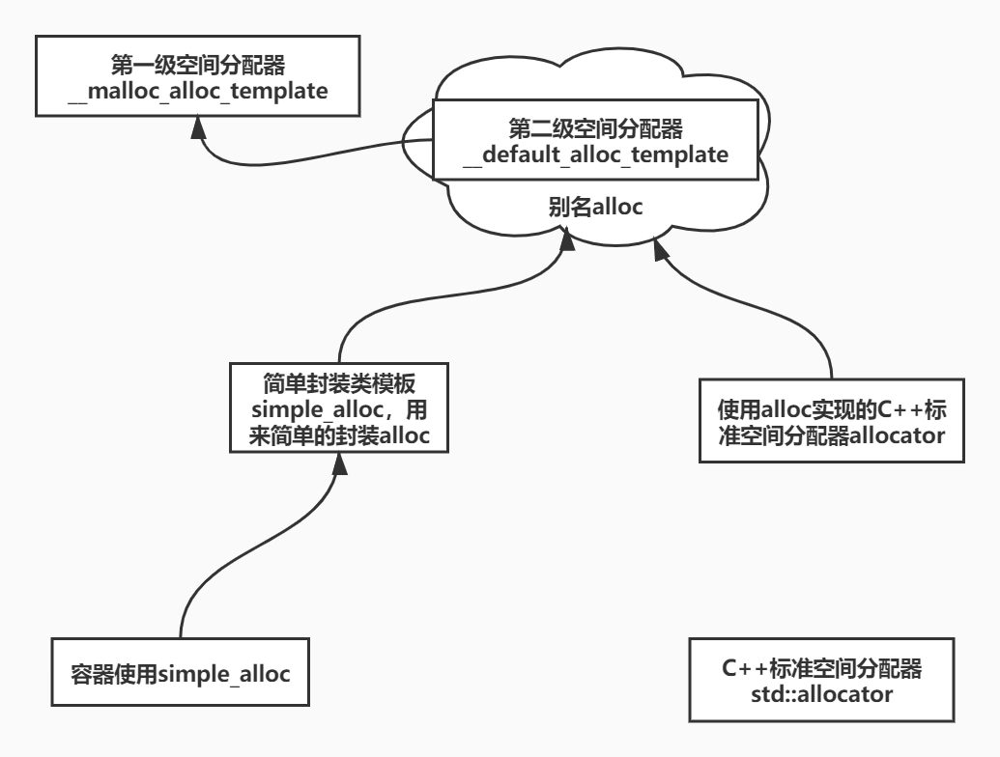
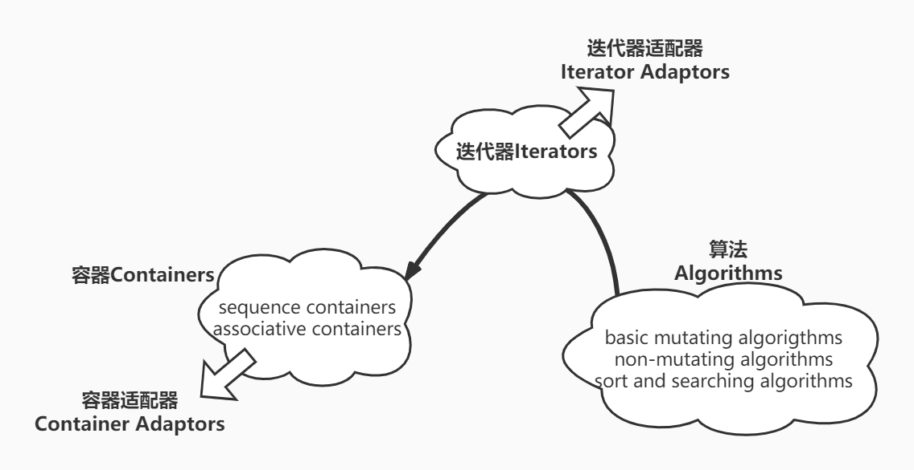
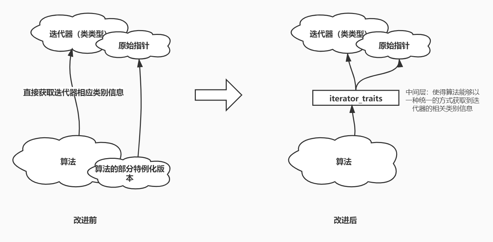
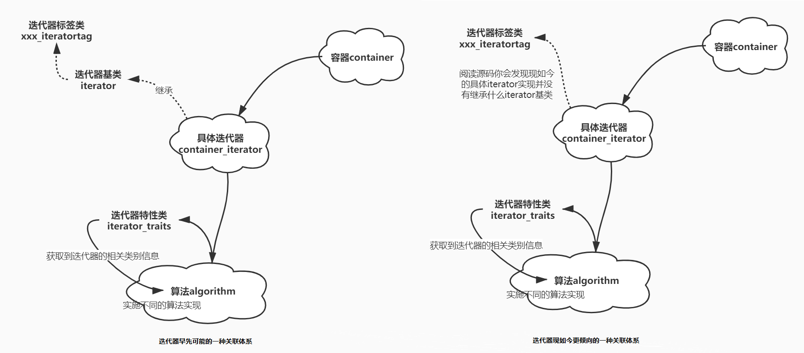

# SGI-STL

## 1. 了解STL

### 1.1 STL的组成

STL有如下6大组件组成：

1. **容器containers**
2. **算法algorithms**
3. **迭代器iterators**
4. **函数对象functors**
5. **适配器adapters**：又分成迭代器适配器、容器适配器、函数适配器
6. **分配器(配置器)allocators**

它们之间有着非常紧密的关系，其中①**容器Containers通过空间分配器Allocators来获得数据存储空间**；②**算法Algorithms通过迭代器Iterators来存取容器中的内容**；③**函数对象/仿函数Functors可以协助算法采用不同的策略实现不同的操作**；④**适配器Adaptors可以修饰或者套接函数对象、容器（形成容器适配器、迭代器适配器和）**。


### 1.2 SGI STL文件分布

gcc采用的STL实现版本正是SGI STL，其相关的实现文件大致分布在/usr/include/c++/(版本号)这个文件之中。这些文件大致可以分成如下5组：

1. C++标准规范下的C头文件。例如cstdio、cstdlib等；
2. C++标准程序库中不属于STL范畴的文件。例如string、stream等；
3. STL标准头文件。例如vector、deque等；
4. C++标准定案前的一些STL头文件。例如vector.h、dque.h等；
5. SGI STL真正的内部实现文件。例如std_vector.h、stl_deque.h等。

其中我们比较关注的两个文件目录为/usr/include/c++/10.2.0和/usr/include/c++/10.2.0/bits，前者存放了C++标准下的C头文件、非STL范畴的C++'头文件、标准STL头文件以及一些老版本的STL标准头文件，而后者存放了真正的SGI STL内部实现文件。类似的在Win10下安装的mingw软件的安装目录中也会发现类似的目录和文件。


### 1.3 stl_config.h头文件

在上述的bits目录下有一个比较重要的配置文件stl_config.h。文件本身分成两个部分：前半部分检测编译器对C++标准的支持程度并定义类似于功能测试宏的宏，后半部分根据前半部分定义的宏定义出一些方便程序编写的宏或者对不支持的语言特定做出一些弥补性的定义。例如编译器若不支持bool类型，则该头文件会定义`#typedef bool int`、`#define true 1`这样的语句。以及例如会将空模板参数列表`template<>`定义成`__STL_TEMPLATE_NULL`方便后续使用。


## 2. 空间分配器

### 2.1 SGI STL空间分配器概览

#### 2.1.1 分配器纵览

在SGI STL的实现中主要有如下几个空间分配器（我们值得关注的）：

|                          分配器名称                          |                实现文件                |
| :----------------------------------------------------------: | :------------------------------------: |
|              标准C++空间分配器`std::allocator`               |  [defalloc.h](1.Allocator\defalloc.h)  |
|         SGI第一级空间分配器`__malloc_alloc_template`         | [stl_alloc.h](1.Allocator\stl_alloc.h) |
|        SGI第二级空间分配器`__default_alloc_template`         | [stl_alloc.h](1.Allocator\stl_alloc.h) |
| SGI一/二级空间分配器的别名`alloc`以及简单封装类`simple_alloc` | [stl_alloc.h](1.Allocator\stl_alloc.h) |
| 由`alloc`实现的C++标准空间分配器`allocator`（前提是用户指定） | [stl_alloc.h](1.Allocator\stl_alloc.h) |

其中标准C++空间分配器`std::allocator`并不是默认的空间分配器，`alloc`才是真正默认空间分配器，然而`alloc`只不过是SGI第二级空间分配器`__default_alloc_template`的别名。在容器空间的分配中，则会使用到简单封装类模板`simple_alloc`，它又仅仅是`alloc`的简单封装，因此空间分配的真正操作者是`__default_alloc_template`这个分配器而不是其他，除非特别用户指定。

SGI STL对空间分配器的实现主要是出于性能、效率和其他多种因素的考虑，它引入了一个双层级的空间分配器设计，**一级空间分配器指的是`__malloc_alloc_template`，二级空间分配器指的是`__default_alloc_template`。其中前者直接调用`malloc()`、`free()`和`realloc()`等函数来分配/销毁空间；而后者对于大于128字节空间的分配直接调用`__malloc_alloc_template`，而对于小于128字节空间的分配采用内存池策略，需要用时从内存池中取出，不需要时退回给内存池，从而避免内存碎片等多个问题**。正是这种设计的各种优点使得SGI STL将`__default_alloc_template`设置为默认的空间分配器。

下面是所有空间分配器所起作用的大致结构：




#### 2.1.2 空间分配/销毁与对象构造/析构分离

为了实现紧密分工，*STL allocator还将对象的空间分配/销毁以及对象的构造/析构两种操作分离开来实现*。这使得`alloc`只负责对象空间的分配/销毁：`alloc::allocate()`、`alloc::deallocate()`，而对象构造和析构由进一步封装的类，比如上述由`alloc`实现的标准空间分配器`allocator`实现或者由STL算法`std::construct()`、`std::destroy()`来完成。

其中`alloc`、一/二级空间分配器实现在[stl_alloc.h](1.Allocator\stl_alloc.h)，STL算法`std::construct()`、`std::destroy()`实现在[stl_construct.h](1.Allocator\stl_construct.h)，除此之外，STL还具有一些在已分配但未初始化的空间上进行拷贝构造、填充的算法`unintialized_xxx()`，它们实现在[stl_uninitialized.h](1.Allocator\stl_uninitialized.h)，然后这些源文件全部include在标准C++头文件[memory](1.Allocator\memory)中。文件分布如下：


### 2.2 对象的构造/析构算法

在[stl_construct.h](1.Allocator\stl_construct.h)中我们可以看到STL算法`construct()`就是直接通过定位new的方式实现，而`destroy()`通过`__type_traits`技术，识别出调用元素/迭代器指定范围内的元素的类型，判断出它们是否是POD类型（析构、构造函数trivial可有可无，没什么用），若是则什么也不做，否则逐个调用析构函数。

```c++
//单元素构造
template <class _T1, class _T2>
inline void _Construct(_T1* __p, const _T2& __value) {
  new ((void*) __p) _T1(__value);
}

//单元素析构
template <class _Tp>
inline void _Destroy(_Tp* __pointer) {
  __pointer->~_Tp();
}

//迭代器指定的范围元素集合中元素类型支持可用non-trivial析构函数
template <class _ForwardIterator>
void
__destroy_aux(_ForwardIterator __first, _ForwardIterator __last, __false_type)
{
  for ( ; __first != __last; ++__first)
    destroy(&*__first);
}

//迭代器指定的范围元素集合中的元素类型不支持无用trivial析构函数，则什么也不做
template <class _ForwardIterator> 
inline void __destroy_aux(_ForwardIterator, _ForwardIterator, __true_type) {}

/* 根据元素类型的析构函数是non-trivail还是trivial
	来决定调用上述__destroy_aux的某一个版本 */
template <class _ForwardIterator, class _Tp>
inline void 
__destroy(_ForwardIterator __first, _ForwardIterator __last, _Tp*)
{
  typedef typename __type_traits<_Tp>::has_trivial_destructor
          _Trivial_destructor;
  __destroy_aux(__first, __last, _Trivial_destructor());
}

template <class _ForwardIterator>
inline void _Destroy(_ForwardIterator __first, _ForwardIterator __last) {
  __destroy(__first, __last, __VALUE_TYPE(__first));
}
```


### 2.3 SGI STL第一级空间分配器

在上面我们已经指出一级空间分配器的实现是由`malloc`、`free`、`realloc`等函数完成，并不是用`::operator new`、`::operator delete`等函数完成，虽然不支持`set_new_handler()`，但引入了一个`set_malloc_handler()`以处理空间分配意外情况。

这个第一级空间分配器大约在源代码文件[stl_lloc.h](1.Allocator\stl_alloc.h)的109行。


### 2.4 ==SGI STL第二级空间分配器==


上面提到，二级空间分配器针对索要不同空间采取了不同的策略，对于大于128字节的空间分配直接调用`__malloc_alloc_template`来完成；而对于小于128字节空间的索取使用了内存池来实现。这里内存池的本质就是一个使用指针串起来的内存块链表free-list，每一个链表节点既是一个完整的空间也是指针（即下面通过union定义出的嵌套类`_Obj`），每一个节点空间大小为8的倍数（8、16、24...120、128），即使用户需要的不是8的倍数也会上取整，然后分配器会为每一个不同大小的内存池链表维护一个链表指针数组，分别指向不同链表的起点。

当用户需要时二级空间分配器会从其中取出一个节点删除，将这节点的空间作为自己的所需返回；当不需要时，将这个空间（重解释成链表节点）插回到内存池链表的头部。如果内存池空间不足，二级分配器还会通过`malloc`分配出更多的空间（这个空间为$2\times所需单元空间（被上取整过）$余，这一点也是有深意的）添加到链表中。

对于这部分的实现我们需要关注如下几个静态成员函数的实现：

|       成员函数名       |                       静态成员函数作用                       |
| :--------------------: | :----------------------------------------------------------: |
|    **`allocate()`**    | 负责分配空间，要么从`__malloc_alloc_template`哪里分配大空间，要么从free-list中取出小空间 |
|   **`deallocate()`**   |                负责销毁空间，策略与上正好相反                |
|   **`_S_refill()`**    | 负责分配内存池空间，并从内存池空间取出部分空间给`_S_refill()`用来重新组建free-list |
| **`_S_chunk_alloc()`** |  负责当free-list链表空时从内存池中取出一些空间组建新的串链   |

```c++
#if defined(__SUNPRO_CC) || defined(__GNUC__)
// breaks if we make these template class members:
  enum {_ALIGN = 8};
  enum {_MAX_BYTES = 128};
  enum {_NFREELISTS = 16}; // _MAX_BYTES/_ALIGN
#endif

template <bool threads, int inst>
class __default_alloc_template {

private:
  static size_t
  _S_round_up(size_t __bytes) 
    { return (((__bytes) + (size_t) _ALIGN-1) & ~((size_t) _ALIGN - 1)); }

__PRIVATE:
  //定义free-list空闲动态内存链表节点
  union _Obj {
        union _Obj* _M_free_list_link;
        char _M_client_data[1];
  };
private:
# if defined(__SUNPRO_CC) || defined(__GNUC__) || defined(__HP_aCC)
    static _Obj* __STL_VOLATILE _S_free_list[]; 
        // Specifying a size results in duplicate def for 4.1
# else
    //free-list链表首结点指针数组
    static _Obj* __STL_VOLATILE _S_free_list[_NFREELISTS]; 
# endif
  //根据所需内存大小，决定使用上述free-list数组中的哪一个元素（链表）
  static  size_t _S_freelist_index(size_t __bytes) {
        return (((__bytes) + (size_t)_ALIGN-1)/(size_t)_ALIGN - 1);
  }

  //内存池重新填充
  static void* _S_refill(size_t __n);
  //内存池实现的核心成员函数
  static char* _S_chunk_alloc(size_t __size, int& __nobjs);

  //定义内存池起始地址、结束地址、大小
  static char* _S_start_free;
  static char* _S_end_free;
  static size_t _S_heap_size;

public:

  /* __n must be > 0      */
  static void* allocate(size_t __n)
  {
    void* __ret = 0;

    if (__n > (size_t) _MAX_BYTES) {
      __ret = malloc_alloc::allocate(__n);
    }
    else {
      _Obj* __STL_VOLATILE* __my_free_list
          = _S_free_list + _S_freelist_index(__n);
      // Acquire the lock here with a constructor call.
      // This ensures that it is released in exit or during stack
      // unwinding.
#     ifndef _NOTHREADS
      /*REFERENCED*/
      _Lock __lock_instance;
#     endif
      _Obj* __RESTRICT __result = *__my_free_list;
      if (__result == 0)
        __ret = _S_refill(_S_round_up(__n));
      else {
        *__my_free_list = __result -> _M_free_list_link;
        __ret = __result;
      }
    }

    return __ret;
  };

  /* __p may not be 0 */
  static void deallocate(void* __p, size_t __n)
  {
    if (__n > (size_t) _MAX_BYTES)
      malloc_alloc::deallocate(__p, __n);
    else {
      _Obj* __STL_VOLATILE*  __my_free_list
          = _S_free_list + _S_freelist_index(__n);
      _Obj* __q = (_Obj*)__p;

      // acquire lock
#       ifndef _NOTHREADS
      /*REFERENCED*/
      _Lock __lock_instance;
#       endif /* _NOTHREADS */
      __q -> _M_free_list_link = *__my_free_list;
      *__my_free_list = __q;
      // lock is released here
    }
  }

  static void* reallocate(void* __p, size_t __old_sz, size_t __new_sz);

} ;

typedef __default_alloc_template<__NODE_ALLOCATOR_THREADS, 0> alloc;
typedef __default_alloc_template<false, 0> single_client_alloc;

template <bool __threads, int __inst>
inline bool operator==(const __default_alloc_template<__threads, __inst>&,
                       const __default_alloc_template<__threads, __inst>&)
{
  return true;
}

# ifdef __STL_FUNCTION_TMPL_PARTIAL_ORDER
template <bool __threads, int __inst>
inline bool operator!=(const __default_alloc_template<__threads, __inst>&,
                       const __default_alloc_template<__threads, __inst>&)
{
  return false;
}
# endif /* __STL_FUNCTION_TMPL_PARTIAL_ORDER */


/* We allocate memory in large chunks in order to avoid fragmenting     */
/* the malloc heap too much.                                            */
/* We assume that size is properly aligned.                             */
/* We hold the allocation lock.                                         */
template <bool __threads, int __inst>
char*
__default_alloc_template<__threads, __inst>::_S_chunk_alloc(size_t __size, 
                                                            int& __nobjs)
{
    char* __result;
    size_t __total_bytes = __size * __nobjs;
    size_t __bytes_left = _S_end_free - _S_start_free;

    if (__bytes_left >= __total_bytes) {
        __result = _S_start_free;
        _S_start_free += __total_bytes;
        return(__result);
    } else if (__bytes_left >= __size) {
        __nobjs = (int)(__bytes_left/__size);
        __total_bytes = __size * __nobjs;
        __result = _S_start_free;
        _S_start_free += __total_bytes;
        return(__result);
    } else {
        size_t __bytes_to_get = 
	  2 * __total_bytes + _S_round_up(_S_heap_size >> 4);
        // Try to make use of the left-over piece.
        if (__bytes_left > 0) {
            _Obj* __STL_VOLATILE* __my_free_list =
                        _S_free_list + _S_freelist_index(__bytes_left);

            ((_Obj*)_S_start_free) -> _M_free_list_link = *__my_free_list;
            *__my_free_list = (_Obj*)_S_start_free;
        }
        _S_start_free = (char*)malloc(__bytes_to_get);
        if (0 == _S_start_free) {
            size_t __i;
            _Obj* __STL_VOLATILE* __my_free_list;
	    _Obj* __p;
            // Try to make do with what we have.  That can't
            // hurt.  We do not try smaller requests, since that tends
            // to result in disaster on multi-process machines.
            for (__i = __size;
                 __i <= (size_t) _MAX_BYTES;
                 __i += (size_t) _ALIGN) {
                __my_free_list = _S_free_list + _S_freelist_index(__i);
                __p = *__my_free_list;
                if (0 != __p) {
                    *__my_free_list = __p -> _M_free_list_link;
                    _S_start_free = (char*)__p;
                    _S_end_free = _S_start_free + __i;
                    return(_S_chunk_alloc(__size, __nobjs));
                    // Any leftover piece will eventually make it to the
                    // right free list.
                }
            }
	    _S_end_free = 0;	// In case of exception.
            _S_start_free = (char*)malloc_alloc::allocate(__bytes_to_get);
            // This should either throw an
            // exception or remedy the situation.  Thus we assume it
            // succeeded.
        }
        _S_heap_size += __bytes_to_get;
        _S_end_free = _S_start_free + __bytes_to_get;
        return(_S_chunk_alloc(__size, __nobjs));
    }
}


/* Returns an object of size __n, and optionally adds to size __n free list.*/
/* We assume that __n is properly aligned.                                */
/* We hold the allocation lock.                                         */
template <bool __threads, int __inst>
void*
__default_alloc_template<__threads, __inst>::_S_refill(size_t __n)
{
    int __nobjs = 20;
    char* __chunk = _S_chunk_alloc(__n, __nobjs);
    _Obj* __STL_VOLATILE* __my_free_list;
    _Obj* __result;
    _Obj* __current_obj;
    _Obj* __next_obj;
    int __i;

    if (1 == __nobjs) return(__chunk);
    __my_free_list = _S_free_list + _S_freelist_index(__n);

    /* Build free list in chunk */
      __result = (_Obj*)__chunk;
      *__my_free_list = __next_obj = (_Obj*)(__chunk + __n);
      for (__i = 1; ; __i++) {
        __current_obj = __next_obj;
        __next_obj = (_Obj*)((char*)__next_obj + __n);
        if (__nobjs - 1 == __i) {
            __current_obj -> _M_free_list_link = 0;
            break;
        } else {
            __current_obj -> _M_free_list_link = __next_obj;
        }
      }
    return(__result);
}

template <bool threads, int inst>
void*
__default_alloc_template<threads, inst>::reallocate(void* __p,
                                                    size_t __old_sz,
                                                    size_t __new_sz)
{
    void* __result;
    size_t __copy_sz;

    if (__old_sz > (size_t) _MAX_BYTES && __new_sz > (size_t) _MAX_BYTES) {
        return(realloc(__p, __new_sz));
    }
    if (_S_round_up(__old_sz) == _S_round_up(__new_sz)) return(__p);
    __result = allocate(__new_sz);
    __copy_sz = __new_sz > __old_sz? __old_sz : __new_sz;
    memcpy(__result, __p, __copy_sz);
    deallocate(__p, __old_sz);
    return(__result);
}

#ifdef __STL_THREADS
    template <bool __threads, int __inst>
    _STL_mutex_lock
    __default_alloc_template<__threads, __inst>::_S_node_allocator_lock
        __STL_MUTEX_INITIALIZER;
#endif


template <bool __threads, int __inst>
char* __default_alloc_template<__threads, __inst>::_S_start_free = 0;

template <bool __threads, int __inst>
char* __default_alloc_template<__threads, __inst>::_S_end_free = 0;

template <bool __threads, int __inst>
size_t __default_alloc_template<__threads, __inst>::_S_heap_size = 0;

template <bool __threads, int __inst>
typename __default_alloc_template<__threads, __inst>::_Obj* __STL_VOLATILE
__default_alloc_template<__threads, __inst> ::_S_free_list[
# if defined(__SUNPRO_CC) || defined(__GNUC__) || defined(__HP_aCC)
    _NFREELISTS
# else
    __default_alloc_template<__threads, __inst>::_NFREELISTS
# endif
] = {0, 0, 0, 0, 0, 0, 0, 0, 0, 0, 0, 0, 0, 0, 0, 0, };
// The 16 zeros are necessary to make version 4.1 of the SunPro
// compiler happy.  Otherwise it appears to allocate too little
// space for the array.

```


上面实现代码中有几个

#### 2.4.1 内存分配allocate

`__default_alloc_template`对内存的分配很简单，即大于128字节的空间调用`__malloc_alloc_template`来完成，小的空间则从指定大小的链表指针，然后从该内存池链表中取出一个首结点，作为新的空间。该成员函数声明如下：

```c++
static void* allocate(size_t __n);
```


#### 2.4.2 free-list链表重填充refill

当上述`allocate()`成员函数执行的过程中发现指定链表free-list中没有剩余的空间了，那么它就会调用下面的refill函数，其中它会调用`chunk_alloc()`成员函数从内存池中取出空间组成新的free-list串链加入到指定的free-list链表中。该成员函数声明如下：

```c++
template <bool __threads, int __inst>
void*
__default_alloc_template<__threads, __inst>::_S_refill(size_t __n);
```


#### 2.4.3 内存池分配chunk_alloc

`chunk_alloc()`函数的作用就是在alloc类需要用到内存池的时候从内存池中取出一部分空间给调用函数，而调用者函数会将这部分取去的空间逐渐free-list。当内存池空间不足时，它会主动调用`malloc`分配出更多的空间，有意思的地方在于它会将这个新分配空间的一部分构建成free-list，而连续分布在该部分后面的空间作为内存池存储起来，以备后续的需求。其声明如下：

```c++
template <bool __threads, int __inst>
char*
__default_alloc_template<__threads, __inst>::_S_chunk_alloc(size_t __size, 
                                                            int& __nobjs)
```


#### 2.4.4 内存销毁deallocate

与内存分配时`allocate()`成员函数的策略正好相反，`deallocate()`函数对于大于128字节空间的销毁会调用`__malloc_alloc_template`的相关成员来销毁之；但若这部分空间的大小小于128字节，则会将其重新插入到相应free-list首部。其声明如下：

```c++
static void deallocate(void* __p, size_t __n);
```


### 2.5 SGI STL分配器简单封装类

这段代码大致在源代码文件`std_alloc.h`的193行，它只不过是其他分配器的简单封装，默认情况下，容器使用它来封装`alloc`。

```c++
template<class _Tp, class _Alloc>
class simple_alloc {

public:
    static _Tp* allocate(size_t __n)
      { return 0 == __n ? 0 : (_Tp*) _Alloc::allocate(__n * sizeof (_Tp)); }
    static _Tp* allocate(void)
      { return (_Tp*) _Alloc::allocate(sizeof (_Tp)); }
    static void deallocate(_Tp* __p, size_t __n)
      { if (0 != __n) _Alloc::deallocate(__p, __n * sizeof (_Tp)); }
    static void deallocate(_Tp* __p)
      { _Alloc::deallocate(__p, sizeof (_Tp)); }
};
```

`vector`等容器实现代码中就有如下部分，而宏`__STL_DEFAULT_ALLOCATOR`其实指的就是`alloc`：

```c++
template <class _Tp, class _Alloc = __STL_DEFAULT_ALLOCATOR(_Tp) >
class vector : protected _Vector_base<_Tp, _Alloc> {};

typedef simple_alloc<_Tp, _Alloc> _M_data_allocator;  
```


### 2.6 未初始化内存拷贝/填充算法

未初始化内容拷贝函数`uninitialzed_copy()`和未初始化内存填充函数`uninitalized_fill()`和`uninitalized_fill_n()`函数实现的方法类似于上述对象析构函数`destroy()`的实现原理。

它们通过`__type_traits`技术来区分待初始化内存上欲构造的类型是POD类型还是非POD类型，其中POD类型指的是具有trivial没有屌用的构造、析构、拷贝和赋值函数的原始类型、C-结构化类型，例如int、double之类的。①若是POD类型就直接使用copy()、fill()这样的STL算法直接来完成内存数据的拷贝和填充；②若不是，这对每一个迭代器上指向的元素逐个执行拷贝构造函数。

这些代码位于源文件[stl_uninitalized.h](1.Allocator\stl_uninitalized.h)之中。


## 3. 迭代器Iterator

### 3.1 迭代器模式与STL迭代器

众所周知，迭代器iterator在C++中被认为是一种泛型指针，大多数情况下这些类类型都是对容器中元素指针的封装，最特殊的一种情况就是它本身就是指针（针对原始类型容器而言）。一般而言迭代器必然涉及到容器本身的特性，所以容器设计者对迭代器的实现负有责任。


为了能够深入了解一点STL对迭代器的实现，我们就不得不提大名鼎鼎四人帮《*Design Pattern*》一书中对于迭代器模式的描述。按照这种迭代器模式的设想，迭代器的具体实现大致有两部分组成：①抽象基类（接口类）Iterator和②具体迭代器ConcreteIterator。其中所有的容器（上面的Aggregate）都应该向外提供了生成迭代器的成员函数，它的函数声明会使用抽象基类Iterator，而函数具体实现并返回的却是ConcreteIterator，并借由C++的多态机制来实现到基类Iterator的转换，从而达到隐藏迭代器内部实现细节的目的。

但我们需要注意的是C++的多态必须借由指针或者引用才能实现，这意味着我们容器中生成迭代器的接口就必须返回的是迭代器Iterator类的指针或者引用，这显然与我们日常使用的STL容器、迭代器的情况相违背！在这种情况下Vector容器中`begin()`成员函数实现可能就是这个样子了：

```c++
template<typename T>
Iterator<T>* Vector<T>::begin() {
	return new VectorIterator(this->_data_start);
}
//或者以下面方式来实现：
template<typename T>
Iterator<T>& Vector<T>::begin() {
	return *(new VectorIterator(this->_data_start));
}
```

因此我们可以确定**STL的迭代器绝对不是按照设计模式中迭代器模式的描述来实现的**（设计模式中迭代器模式所认为的迭代器我觉得更适合于像Java这样的语言来实现）。实际的情况是，任何容器的迭代器ContainerIterator确实都继承了一个名叫iterator的基类，但这个基类中并没有定义任何纯虚函数/接口。且更重要的是，具体容器中常常使用的`begin()`等成员函数返回的并不是这个iterator基类的引用或者指针，相反它返回的就是具体容器迭代器ContainerIterator！只不过容器在内部通过typedef为具体迭代器取了一个iterator的别名罢了！

也就是说STL中的迭代器使用了继承这个语言特性，但并没有使用什么多态机制！因此我们可以想象容器Vector和其迭代器的实现可能是以如下的样貌呈现：

```cpp
template<typename T>
class Iterator {
	/*  ...  */
};

template<typename T>
class VectorIterator;

//容器的实现
template<typename T>
class Vector {
public:
	/*  ...  */
	typedef VectorIterator<T> Iterator;
	Iterator begin();
	Iterator end();
private:
	T *_data_start;
	T *_data_end;
	T *_storage_end;
};

//容器相关迭代器的实现
template<typename T>
class VectorIterator : public Iterator<T> {
public:
	explicit VectorIterator(T *p) :
		_data_pointer(p) {}
	/*  ...  */
	T *operator->() { return _data_pointer; }
	T &operator*() { return *_data_pointer; }
	T &operator++() {
		++_data_pointer;
		return *this;
	}
	const T operator++(int) {
		VectorIterator tmp(*this);
		++*this;
		return tmp;
	}
	/*  ...  */

private:
	T *_data_pointer;
};

//容器迭代器生成函数的实现
template<typename T>
typename Vector<T>::Iterator Vector<T>::begin() {
	return VectorIterator<T>(this->_data_start);
}

template<typename T>
typename Vector<T>::Iterator Vector<T>::end() {
	return VectorIterator<T>(this->_data_end);
}
```

文件[main.cpp](main.cpp)大致按照上面的想法实现了一个简单的Vector及其迭代器VectorIterator。


下面的表格展示了一些与迭代器有关的源文件及其作用：

|                    源文件                     |                             作用                             |
| :-------------------------------------------: | :----------------------------------------------------------: |
|       [stl_iterator.h](stl_iterator.h)        |                    主要实现了迭代器适配器                    |
|  [stl_iterator_base.h](stl_iterator_base.h)   | 主要实现了迭代器特性类iterator_traits、迭代器类型标签类以及两个迭代器算法 |
|        [type_traits.h](type_traits.h)         |                     主要实现了类型特性类                     |
| [iterator](iterator)/[iterator.h](iterator.h) |                对上述的头文件进行include包装                 |


### ==3.2 迭代器特性类iterator_traits==

#### 3.2.1 引入迭代器特性类的背景



在书本的最开始我们就指出过，迭代器是连接容器和算法的桥梁，算法通过迭代器来实现对容器的操作，这种操作可以是易变性的，也可以仅仅是对容器中元素的游历。所有算法的正常执行都必须基于相应的容器支持这种操作的前提之下才能得到保证，而且算法也必须有能力知道有关容器的相关信息，例如最常见的就是容器中元素的类型信息，如果一个累加算法不知道容器中元素的类型，那么显然这个算法无法正常执行。

但是由于算法只能接触到迭代器，而不能直接接触到容器，这就使得算法无法直接获知到有关容器的任何信息，因此**在STL中迭代器这个沟通容器和算法的中间桥梁必须能够向算法提供一些信息的能力。一般这种信息都是借由迭代器本身的属性信息来提供，我们将这些属性信息称为迭代器的关联类型信息（associated types，书中称为相应类别）**。例如算法需要知道容器元素的类型信息，那它就是在询问迭代器所指向的元素类型是什么。

因此为了使得迭代器提供这些相应类别的信息，每一个容器的迭代器都会提供如下5个类型成员：

```c++
template<typename T>
class VectorIterator : public Iterator<T> {
public:
	typedef T                           value_type;
	typedef T *                         pointer;
	typedef T &                         reference;
	typedef ptrdiff_t                   difference_type;
	typedef random_access_iterator_tag  iterator_category;
    /*  ...  */
};
```

这样借助迭代器提供的关联信息，算法就可以很容易的知道迭代器所指向的元素类型等信息。例如我们可以很容易地实现出上述的累加算法：

```c++
template<typename T>
typename VectorIterator<T>::value_type
accumulate(VectorIterator<T> beg, VectorIterator<T> end) {
	typename VectorIterator<T>::value_type res(0);
	for (; beg != end; ++beg)
		res += *beg;
	return res;
}
```

但我们必须要注意到：若传递给算法的实参是容器的迭代器（类类型就像上述的VectorIterator），那么这个算法显然能够正常运行；但是若提供的原始指针，那该怎么办？一种显而易见的方法就是将这个算法进行部分特例化，提供一个能够兼容原始指针的版本，如下：

```c++
template<typename T>
T accumulate(T *beg, T *end) {
	T res(0);
	for (; beg != end; ++beg)
		res += *beg;
	return res;
}
```

但这种方法必然会带来另外一个虽然简单解决但又显得比较烦人的问题：我们必须为每一个算法提供一个部分特例化的版本以支持原始指针（包括上面没有讲到的const T*）🙃！因此我们必须提出一种新的解决方法，来提取出迭代器中的相应类别信息，则便是迭代器类型特性类iterator_traits。


#### 3.2.2 迭代器特性类概念

迭代器特性类iterator_traits的作用就是从迭代器（不仅包括类类型的迭代器，也包括原始指针）中提取出迭代器的相关类型信息。其本质就是在迭代器相应类别信息与算法之间加入一个间接层，以统一的方式（同时支持了特殊迭代器——原始指针）取出相应类别信息。而我们原先的方法就是让算法直接从迭代器中取出这些信息，但必须让每一个算法为原始指针编写一个部分特例化的版本！下图展示了这个改进的前后对比：



至于迭代器特性类iterator_traits的实现更是简单，如我们所见，在改进前提取迭代器相关类别信息的工作（直接从类类型迭代器提取和对原始指针进行部分特例化）是交由算法自己来完成；而在改进后这些工作都是完全由iterator_traits来负责，相应的直接提取和部分特例化工作都变成了iterator_traits的责任。

这部分的代码实现在源文件[stl_iterator_base.h](stl_iterator_base.h)的第108行：

```c++
template <class _Iterator>
struct iterator_traits {
  typedef typename _Iterator::iterator_category iterator_category;
  typedef typename _Iterator::value_type        value_type;
  typedef typename _Iterator::difference_type   difference_type;
  typedef typename _Iterator::pointer           pointer;
  typedef typename _Iterator::reference         reference;
};

template <class _Tp>
struct iterator_traits<_Tp*> {
  typedef random_access_iterator_tag iterator_category;
  typedef _Tp                         value_type;
  typedef ptrdiff_t                   difference_type;
  typedef _Tp*                        pointer;
  typedef _Tp&                        reference;
};

template <class _Tp>
struct iterator_traits<const _Tp*> {
  typedef random_access_iterator_tag iterator_category;
  typedef _Tp                         value_type;
  typedef ptrdiff_t                   difference_type;
  typedef const _Tp*                  pointer;
  typedef const _Tp&                  reference;
};
```

我们可以从上面的源代码看到iterator_traits类中内部正好记录着迭代器需要给算法提供的5个相应类别成员：`value_type`、`pointer`、`reference`、`difference_type`、`iterator_category`，而这些类型成员都是从迭代器（包括原始指针）中“榨取”出来的！因此这个类也有着一个响当当的外号：特性榨取机！


这样我们上面累加算法就可以通过如下的形式来得到实现了：

```c++
template<typename Iterator>
typename Iterator_traits<Iterator>::value_type
accumulate(Iterator beg, Iterator end) {
	typename Iterator_traits<Iterator>::value_type res(0);
	for (; beg != end; ++beg)
		res += *beg;
	return res;
}
```


### 3.3 ==迭代器分类iterator_category==

#### 3.3.1 迭代器分类

正如我们在上面的所述，为了能够让迭代器特性类iterator_traits从传入的迭代器中提取出迭代器相应类别的信息，每一个容器相关的迭代器都应该在内部定义出上述的5个成员类型：value_type、difference_type、pointer、reference和iterator_category。它们代表的意义非常容易理解，其内部的实现仅仅就是在迭代器内部用一个typedef或者using定义出一个类型成员即可：

```c++
template<typename T>
class VectorIterator : public Iterator<T> {
public:
	typedef T value_type;

    /*  ....  */
};
```

其中迭代器分类iterator_category是迭代器相关类别信息中最为重要的成员类型。对于迭代器而言，它有如下5种分类：

1. **输入迭代器Input Iterator**：该迭代器所指向的容器元素只读
2. **输出迭代器Output Iterator**：该迭代器所指向的容器元素只写
3. **前向迭代器Forward Iterator**：该迭代器仅支持向前步进，且每次步进步伐仅能一步。即只支持iter++或者++iter操作，不支持--iter、iter--甚至iter+=n、iter-=n操作
4. **双向迭代器Bidirectional Iterator**：迭代器可以向前向后步进，但每次步进步伐仍然只能一步
5. **随机访问迭代器Random Access Iterator**：该迭代器步进支持向前向后步进，还支持任意步的步进

它们从上到下存在这一种扩展强化能力的关系，我们可以用如下图展示这种关系，虽然书中指出这并不是一种继承关系但从代码的角度它们确实利用了继承：


迭代器之所以要将迭代器分的如此细致并定义出一个itertor_category成员，其中一个很大的原因正是由迭代器它本身是连接容器和算法的桥梁造成。**由于容器的一些特性导致迭代器只能支持某些操作，却不能支持更多的操作**（例如链表迭代器不支持iter+=n）**，因此直接接触迭代器的算法必须要知道这些信息，对不同的迭代器采取不同的实现，从而达到算法原本的目的**。迭代器步进算法`advance()`就是一个很好的例子，对于随机访问迭代器它可以用`iter+=n`来实现，但对输入、前向、双向迭代器就仅能通过`iter++`来完成。任何一个迭代器都应该让算法执行符合于自己的操作，这样才能达到最高效的性能，这样我们就更应该让算法知道传入迭代器的类型。


#### 3.3.2 迭代器类别标签类

为了能够让算法分辨出出入迭代器的属性进而采用不同的实现，一种最简单的方法就是在算法内部使用`if-elese`的方法在执行期动态裁决。但是这种方法依赖于执行期裁决，非常影响程序效率，因此STL采用了静态多态——重载函数解析机制来让算法在编译的时候就能针对不同的迭代器调用不同的具体实现函数。

为了实现这一目的，①SGI STL会在[stl_iterator_base.h](stl_iterator_base.h)文件中定义如下5个迭代器类别标签类：

```c++
struct input_iterator_tag {};
struct output_iterator_tag {};
struct forward_iterator_tag : public input_iterator_tag {};
struct bidirectional_iterator_tag : public forward_iterator_tag {};
struct random_access_iterator_tag : public bidirectional_iterator_tag {};
```

②然后每一个迭代器都必须根据所关联容器的特性，选择上述的一个标签类使用typedef或者using定义成员类型iterator_category。

```c++
template<typename T>
class VectorIterator : public Iterator<T> {
public:
	/*  ...  */
	typedef random_access_iterator_tag  iterator_category;
	/*  ...  */
};
```

③这样算法就可以利用迭代器特性类iterator_traits提取出迭代器的分类标签类信息，并以这个获知的分类标签类创建出临时对象传入到算法具体的实现函数之中，这样编译器就可以根据这个表示迭代器不同类别的辅助参数通过重载函数解析机制解析出最佳匹配函数，从而避免了执行期动态解析的过程。

```c++
//针对输入、前向、双向迭代器的advance算法具体实现
template<typename InputIterator, typename Dist>
void advance(InputIterator &iter, Dist n, input_iterator_tag) {
	while (n--) iter++;
}

//针对随机访问迭代器的advance算法具体实现
template<typename RandomAccessIterator, typename Dist>
void advance(RandomAccessIterator &iter, Dist n, random_access_iterator_tag) {
	iter += n;
}

template<typename Iterator, typename Dist>
void advance(Iterator &iter, Dist n) {
	using iter_category = typename Iterator_traits<Iterator>::iterator_category;
    /* 创建临时标签类对象，然后依赖函数解析机制判断出应该调用哪一算法实现函数 */
	advance(iter, n, iter_category());
}
```

> 为了展示实现的方式，这里尽可能不展露太多的细节，因此advance这里也仅仅支持向前步进，也不对双向迭代器这种情况做处理。


在实际的SGI STL源代码中临时对象的创建并不是按照我上面所写的那样，因为这种方式需要对每一个算法都再做typedef或者using。重复的东西应该从中剥离处理，独立成函数模块，以避免冗余。所以SGI STL源代码中编写了一些像`iterator_category()`这样的函数来负责创建临时标签类对象，这些源代码大致在源文件[stl_iterator_base.h](stl_iterator_base.h)的141行：

```c++
template <class _Iter>
inline typename iterator_traits<_Iter>::iterator_category
__iterator_category(const _Iter&)
{
  typedef typename iterator_traits<_Iter>::iterator_category _Category;
  return _Category();
}

template <class _Iter>
inline typename iterator_traits<_Iter>::difference_type*
__distance_type(const _Iter&)
{
  return static_cast<typename iterator_traits<_Iter>::difference_type*>(0);
}

template <class _Iter>
inline typename iterator_traits<_Iter>::value_type*
__value_type(const _Iter&)
{
  return static_cast<typename iterator_traits<_Iter>::value_type*>(0);
}

template <class _Iter>
inline typename iterator_traits<_Iter>::iterator_category
iterator_category(const _Iter& __i) { return __iterator_category(__i); }


template <class _Iter>
inline typename iterator_traits<_Iter>::difference_type*
distance_type(const _Iter& __i) { return __distance_type(__i); }

template <class _Iter>
inline typename iterator_traits<_Iter>::value_type*
value_type(const _Iter& __i) { return __value_type(__i); }

#define __ITERATOR_CATEGORY(__i) __iterator_category(__i)
#define __DISTANCE_TYPE(__i)     __distance_type(__i)
#define __VALUE_TYPE(__i)        __value_type(__i)
```

在这个文件文件中还附带实现了我们上述所述的`advance()`步进算法和`distance()`迭代器距离算法。


### 3.4 迭代器基类iterator

为了抽取出所有迭代器中的一些共有重复成员类型，SGI STL定义了一个名为iterator的基类。注意该迭代器基类的作用并不是像《*Design Pattern*》那样做多态来使用，它唯一的作用仅仅就只有继承，方便抽离出所有迭代器共有的属性罢了。该类模板的定义大致在源代码文件[stl_iterator_base.h](stl_iterator_base.h)的94行

```c++
template <class _Category, class _Tp, class _Distance = ptrdiff_t,
          class _Pointer = _Tp*, class _Reference = _Tp&>
struct iterator {
  typedef _Category  iterator_category;
  typedef _Tp        value_type;
  typedef _Distance  difference_type;
  typedef _Pointer   pointer;
  typedef _Reference reference;
};
```

每一个容器相关的迭代器实现都会继承这个迭代器基类，方便继承所有迭代器共有的属性，或者用来避免定义重复的成员类型，类似于如下。但如果这个容器的迭代器就是原始指针，那并不会这样。

```c++
//实际中vector的迭代器采用的是原始指针，而不是封装
template<typename T>
class VectorIterator : public Iterator<random_access_iterator_tag, T> {
public:
    /*  ...  */
}
```

不过通过观察SGI STLv3.3版本你会发现，现有容器的迭代器实现似乎放弃了这种选择，即其中的成员类型都是每一个具体container_iterator自己实现。当然这并没有什么太大的影响。


下面的图重新整理了上述迭代器实现过程中类与类之间的关系：




### 3.5 类型特性类__type_traits

如同iterator_traits迭代器特性类可以提取出迭代器相关的类别信息那样，SGI STL中也存在着一个可以用来提取出任何数据类型相关信息的类型特性类，它的实现技术与iterator_traits相同。算法可以根据这个__type_traits类型特性类提取出待操作元素的类型有哪些特性：它是否具有non-trivial（有意义，反之就是无意义可有可无）的构造函数？是否具有non-trivial的拷贝构造函数？等等。

它的好处在于算法可以根据__type_traits判断出待操作元素的类型特性信息，对作用元素执行最高效的操作。例如`copy()`算法一旦知道自己待操作的某指定范围的元素具有trivial（没屌用的）拷贝构造函数，那么它就可以通过`memcpy()`来实现内存元素的直接拷贝，而不需要对指定范围中的每一个元素调用拷贝构造函数，因为这样效率太低，且这个拷贝构造函数执行了和不执行没有任何区别！

为了表示类型中某一个特性的存在与否，SGI STL会首先定义出两个用来表示真和假的空类型，然后默认为所有的类类型定义一个__type_traits类模板，假设它们的构造、拷贝构造、拷贝赋值、析构函数都是有意义的，并再假设它们都是非POD类型（Plain Old Data，标量类型，即传统的C语言中存在的类型，它们的构造、拷贝构造、析构、拷贝复制都是trivial没屌用的，事实上也并不存在）。

```c++
struct __true_type { };

struct __false_type { };

template <class _Tp>
struct __type_traits { 
   typedef __true_type     this_dummy_member_must_be_first;
                   /* Do not remove this member. It informs a compiler which
                      automatically specializes __type_traits that this
                      __type_traits template is special. It just makes sure that
                      things work if an implementation is using a template
                      called __type_traits for something unrelated. */

   /* The following restrictions should be observed for the sake of
      compilers which automatically produce type specific specializations 
      of this class:
          - You may reorder the members below if you wish
          - You may remove any of the members below if you wish
          - You must not rename members without making the corresponding
            name change in the compiler
          - Members you add will be treated like regular members unless
            you add the appropriate support in the compiler. */
 

   typedef __false_type    has_trivial_default_constructor;
   typedef __false_type    has_trivial_copy_constructor;
   typedef __false_type    has_trivial_assignment_operator;
   typedef __false_type    has_trivial_destructor;
   typedef __false_type    is_POD_type;
};
```

并且还会对每一个POD类型进行特例化：

```c++
#ifndef __STL_NO_BOOL

__STL_TEMPLATE_NULL struct __type_traits<bool> {
   typedef __true_type    has_trivial_default_constructor;
   typedef __true_type    has_trivial_copy_constructor;
   typedef __true_type    has_trivial_assignment_operator;
   typedef __true_type    has_trivial_destructor;
   typedef __true_type    is_POD_type;
};

/* ... */

__STL_TEMPLATE_NULL struct __type_traits<const unsigned char*> {
   typedef __true_type    has_trivial_default_constructor;
   typedef __true_type    has_trivial_copy_constructor;
   typedef __true_type    has_trivial_assignment_operator;
   typedef __true_type    has_trivial_destructor;
   typedef __true_type    is_POD_type;
};
```

这样一些STL算法就可以借助__type_traits类型特性类很容易地提取出待操作元素的特性信息，然后与iterator_traits类型产生一个临时对象传入到具体的辅助函数中，编译器依据重载函数解析机制选择最佳匹配函数，而这个最佳匹配的辅助实现函数必定以最高效的方式实现对应的操作。例如下面的`unintialized_copy()`算法的实现：

```c++
//具有trivial-copy构造函数调用这个函数，而内部的copy又间接调用memcpy()
template <class _InputIter, class _ForwardIter>
inline _ForwardIter 
__uninitialized_copy_aux(_InputIter __first, _InputIter __last,
                         _ForwardIter __result,
                         __true_type)
{
  return copy(__first, __last, __result);
}

//具有non-trivial拷贝构造函数则对范围内的元素逐个调用拷贝构造函数
template <class _InputIter, class _ForwardIter>
_ForwardIter 
__uninitialized_copy_aux(_InputIter __first, _InputIter __last,
                         _ForwardIter __result,
                         __false_type)
{
  _ForwardIter __cur = __result;
  __STL_TRY {
    for ( ; __first != __last; ++__first, ++__cur)
      _Construct(&*__cur, *__first);
    return __cur;
  }
  __STL_UNWIND(_Destroy(__result, __cur));
}


template <class _InputIter, class _ForwardIter, class _Tp>
inline _ForwardIter
__uninitialized_copy(_InputIter __first, _InputIter __last,
                     _ForwardIter __result, _Tp*)
{
  //利用__type_traits提取出元素类型的POD特性，看是否是__true_type还是__false_type
  typedef typename __type_traits<_Tp>::is_POD_type _Is_POD;
  return __uninitialized_copy_aux(__first, __last, __result, _Is_POD());
}
```

